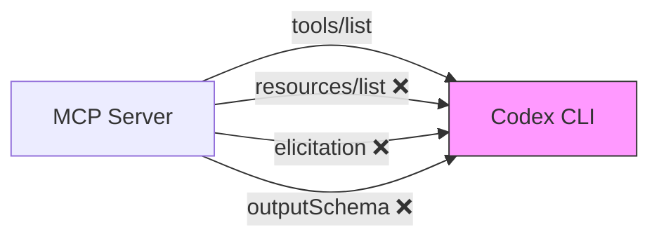
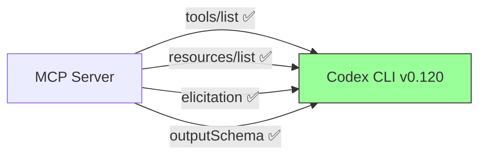
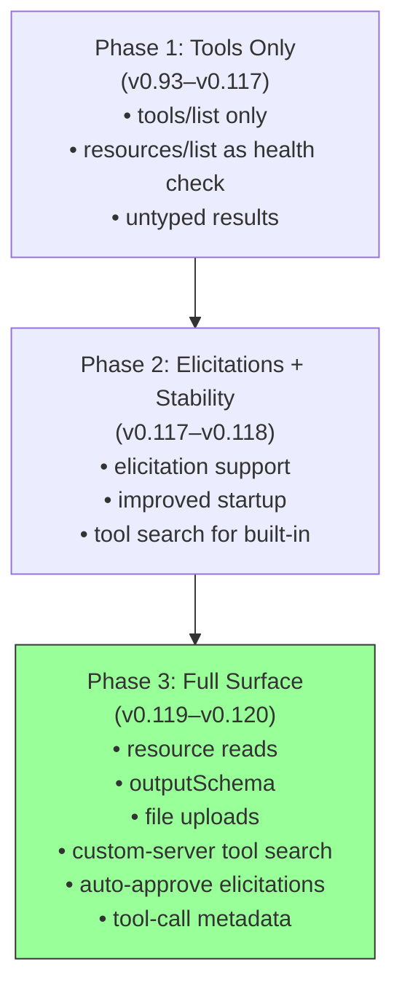

# MCP Maturation in Codex CLI: Resource Reads, OutputSchema, Elicitations, and the Full Tool Surface


---

When Codex CLI first shipped MCP support, it was a tools-only affair — connect a server, call its tools, move on. Resources were ignored or caused outright failures[^1]. Elicitations were unsupported. Tool results came back as untyped blobs. Over the past two releases — v0.119.0 (10 April 2026) and v0.120.0 (11 April 2026) — that changed substantially[^2][^3]. Codex CLI now implements a mature MCP surface spanning resource reads, structured output schemas, server-driven elicitations, file-parameter uploads, custom-server tool search, and tool-call metadata. This article unpacks each capability, shows how to configure it, and examines what it means for practitioners building MCP-powered agentic workflows.

## The Problem with Tools-Only MCP

The Model Context Protocol defines three core primitives: **tools** (model-controlled actions), **resources** (application-driven data), and **prompts** (reusable templates)[^4]. Early Codex CLI versions only consumed the tools primitive. Worse, the CLI's server discovery logic called `resources/list` as a health check — meaning tool-only servers like Context7 that returned an empty resource list were incorrectly flagged as unavailable[^1][^5].

This created two problems. First, developers couldn't use MCP resources to inject contextual data (documentation, configuration, database schemas) into agent sessions. Second, tool results were untyped strings, forcing the model to guess at structure rather than receiving validated JSON.



## What Changed in v0.119.0 and v0.120.0

The two April releases addressed every gap in a single coordinated push[^2][^3]:

| Capability | v0.119.0 | v0.120.0 |
|---|---|---|
| Resource reads | ✅ Full support | — |
| Tool-call metadata | ✅ | — |
| Custom-server tool search | ✅ | — |
| File-parameter uploads | ✅ | — |
| Server-driven elicitations | ✅ | Auto-approve in `danger-full-access` |
| Plugin cache refresh | ✅ Improved reliability | — |
| `outputSchema` in tool declarations | — | ✅ (#17210) |
| MCP status/startup performance | ✅ Less noisy, faster | — |



## Resource Reads: Injecting Contextual Data

MCP resources are application-driven data sources — documentation pages, configuration files, database schemas, API specifications — that your application decides when to fetch[^4]. Unlike tools (which the model invokes), resources are pulled by the host application and injected as context.

With v0.119.0, Codex CLI can now read resources from connected MCP servers. This resolves the long-standing issue where `list_mcp_resources` returning an empty array caused the CLI to treat the entire server as unavailable[^1][^5].

In practice, this means an MCP server can expose both tools *and* resources. A Confluence MCP server, for example, might expose a `search_pages` tool alongside `confluence://spaces/ENG/architecture-decision-records` as a resource that gets automatically injected when the agent starts working on a related codebase.

### Configuration

No special configuration is needed — resource reads are enabled by default for any MCP server that declares them. The standard `config.toml` setup works:

```toml
[mcp_servers.my-knowledge-server]
command = "npx"
args = ["-y", "@myorg/knowledge-mcp"]
startup_timeout_sec = 15
```

Use `/mcp` in the TUI to verify that both tools and resources are detected.

## OutputSchema: Typed Tool Results

The MCP specification (version 2025-06-18) introduced `outputSchema` — a JSON Schema that tools can declare to describe the precise structure of their results[^6][^7]. When present, servers return output in a `structuredContent` field that validates against the declared schema.

Prior to v0.120.0, Codex CLI's code-mode tool declarations ignored `outputSchema` entirely. The model received untyped content arrays and had to infer structure from string output. PR #17210 changed this: code-mode tool declarations now include MCP `outputSchema` details, giving the model precise type information about what each tool returns[^3].

### Why This Matters

Consider a Kubernetes MCP server with a `get_pod_status` tool:

```json
{
  "name": "get_pod_status",
  "description": "Get pod status in a namespace",
  "inputSchema": {
    "type": "object",
    "properties": {
      "namespace": { "type": "string" },
      "pod_name": { "type": "string" }
    },
    "required": ["namespace", "pod_name"]
  },
  "outputSchema": {
    "type": "object",
    "properties": {
      "status": { "type": "string", "enum": ["Running", "Pending", "Failed", "Succeeded"] },
      "restarts": { "type": "integer" },
      "ready": { "type": "boolean" },
      "containers": {
        "type": "array",
        "items": {
          "type": "object",
          "properties": {
            "name": { "type": "string" },
            "state": { "type": "string" }
          }
        }
      }
    },
    "additionalProperties": false
  }
}
```

With `outputSchema` surfaced in the tool declaration, the model knows *before invocation* that it will receive a structured object with `status`, `restarts`, `ready`, and `containers` fields. This eliminates speculative parsing and enables the model to plan multi-step workflows that depend on specific return values.

## Server-Driven Elicitations

Elicitations allow an MCP server to interrupt the agent turn and request structured user input via `mcpServer/elicitation/request`[^8][^9]. Three response actions are available: **accept** (with structured content), **decline**, or **cancel**.

### Configuration

Enable elicitations per-server or globally via the granular approval policy:

```toml
[approval_policy]
[approval_policy.granular]
mcp_elicitations = true
```

This allows MCP elicitation prompts to surface in the TUI rather than being auto-rejected[^10].

### Auto-Approve in Full-Access Mode

v0.120.0 introduced automatic elicitation approval when running in `danger-full-access` sandbox mode[^3]. This is critical for fully autonomous workflows — particularly agentic pod architectures where trusted MCP servers need to collect runtime parameters without human intervention.

⚠️ Be cautious: auto-approving elicitations from untrusted servers could allow prompt injection through server-controlled input forms.

### Practical Patterns

1. **Approval gates for destructive operations** — a deployment MCP server elicits confirmation before applying infrastructure changes
2. **Disambiguation prompts** — a database MCP server elicits which schema to query when multiple match
3. **Credential collection at runtime** — an OAuth MCP server elicits a one-time authorisation code
4. **Graceful degradation** — design servers to fall back to reasonable defaults when elicitation is unavailable (critical for `codex exec` headless mode)[^11]

## Custom-Server Tool Search and File Uploads

Two additional v0.119.0 capabilities round out the MCP surface[^2]:

**Custom-server tool search** means MCP servers with large tool catalogues no longer need to expose every tool upfront. Instead, the CLI can search for tools by name or description, following the same progressive disclosure pattern that Codex uses for built-in skills[^12]. This directly reduces context window overhead — a server with 200 tools no longer injects 200 tool schemas into the model's context.

**File-parameter uploads** enable MCP tools to accept file content as input parameters. This unlocks workflows like uploading a screenshot to a visual analysis server, sending a CSV to a data transformation tool, or passing a binary artefact to a deployment pipeline.

## Tool-Call Metadata

v0.119.0 also introduced tool-call metadata — additional information attached to each MCP tool invocation that flows through the protocol[^2]. While the MCP specification defines metadata as opaque to the protocol layer, Codex CLI uses it for:

- **Tracing**: correlating tool calls with OpenTelemetry spans when `[otel]` is configured
- **Audit logging**: recording which agent in a multi-agent session invoked which tool
- **Cost attribution**: tracking token consumption per MCP tool call

## A Complete MCP Configuration

Here is a production-grade `config.toml` demonstrating the full v0.119/v0.120 MCP surface:

```toml
# ~/.codex/config.toml

[features]
codex_hooks = true

[approval_policy]
[approval_policy.granular]
mcp_elicitations = true

# Documentation knowledge server with resources
[mcp_servers.context7]
command = "npx"
args = ["-y", "@upstash/context7-mcp"]
startup_timeout_sec = 15
tool_timeout_sec = 30

# Figma with OAuth and file uploads
[mcp_servers.figma]
url = "https://mcp.figma.com/mcp"
bearer_token_env_var = "FIGMA_OAUTH_TOKEN"
http_headers = { "X-Figma-Region" = "us-east-1" }
tool_timeout_sec = 120

# Kubernetes server with outputSchema-typed tools
[mcp_servers.k8s]
command = "npx"
args = ["-y", "@k8s/mcp-server"]
enabled_tools = ["get_pod_status", "list_deployments", "describe_service"]
required = true
startup_timeout_sec = 20

# Sentry with scoped tool access
[mcp_servers.sentry]
command = "npx"
args = ["-y", "@sentry/mcp-server"]
disabled_tools = ["delete_project", "purge_events"]

[mcp_servers.sentry.env]
SENTRY_AUTH_TOKEN = "${SENTRY_AUTH_TOKEN}"
```

### Key Configuration Options

| Key | Default | Purpose |
|---|---|---|
| `enabled_tools` | all | Allow-list of tool names |
| `disabled_tools` | none | Deny-list applied after allow-list |
| `startup_timeout_sec` | 10 | Time to wait for server initialisation |
| `tool_timeout_sec` | 60 | Per-invocation timeout |
| `required` | false | Fail startup if server cannot initialise |
| `bearer_token_env_var` | — | Env var for HTTP bearer token |
| `scopes` | — | OAuth scopes to request[^10] |

## The MCP Maturity Model

Codex CLI's MCP support has evolved through three distinct phases:



Phase 3 is where things get interesting for enterprise teams. With resource reads, your MCP servers can inject architectural decision records, compliance rules, and API specifications as context — not as tool calls the model might forget to make, but as resources the application proactively provides. With `outputSchema`, multi-step workflows that chain tool results become reliable rather than fragile. With elicitations, human-in-the-loop approval gates can be implemented at the MCP server level rather than requiring Codex-specific hooks.

## Implications for MCP Server Authors

If you maintain an MCP server used with Codex CLI, the v0.119/v0.120 releases unlock several improvements:

1. **Declare `outputSchema` on every tool** — the model gets type information before invocation, improving first-call accuracy
2. **Expose resources alongside tools** — inject reference documentation as context rather than forcing tool calls
3. **Use elicitations for confirmation flows** — particularly for destructive operations or ambiguous inputs
4. **Support file parameters** — accept binary/text file uploads where appropriate
5. **Implement tool search** — if your server has more than 20 tools, expose a search endpoint to reduce context overhead

The MCP specification's pragmatic approach to schema adherence applies here: servers *should* provide structured results conforming to `outputSchema`, and clients *should* validate them, but unstructured fallback content remains important for graceful degradation[^6].

## What's Still Missing

Despite the progress, gaps remain:

- **No MCP prompts support** — the third MCP primitive (reusable prompt templates) is not yet consumed by Codex CLI ⚠️
- **Tool events limited to Bash** — hooks (`PreToolUse`/`PostToolUse`) still only fire for the Bash tool, not for MCP tool calls[^13]
- **No per-tool `outputSchema` validation on the client** — Codex surfaces the schema to the model but does not enforce validation on returned `structuredContent`
- **Windows hooks disabled** — MCP-related hook workflows are unavailable on Windows[^14]

## Conclusion

The v0.119.0 and v0.120.0 releases transform Codex CLI's MCP integration from a tools-only adapter into a comprehensive protocol surface. Resource reads, `outputSchema`, elicitations, file uploads, and custom-server tool search collectively mean that MCP servers can now serve as full-featured extensions to the agent — providing context, accepting structured input, returning typed output, and gating operations through interactive confirmation. For teams building MCP-powered workflows, the upgrade path is straightforward: update to v0.120.0, enable `mcp_elicitations` in your approval policy, and start declaring `outputSchema` on your tools.

---

## Citations

[^1]: [Codex-CLI seemingly only seeking for "resources/list" — GitHub Issue #8565](https://github.com/openai/codex/issues/8565)
[^2]: [Codex CLI v0.119.0 Release Notes — GitHub](https://github.com/openai/codex/releases/tag/rust-v0.119.0)
[^3]: [Codex CLI Changelog — OpenAI Developers](https://developers.openai.com/codex/changelog)
[^4]: [Model Context Protocol Specification — modelcontextprotocol.io](https://modelcontextprotocol.io/specification/2025-11-25)
[^5]: [Codex stops at list_mcp_resources and fails to discover tool-only MCP servers — GitHub Issue #14242](https://github.com/openai/codex/issues/14242)
[^6]: [MCP Spec Updated to Add Structured Tool Output — Socket.dev](https://socket.dev/blog/mcp-spec-updated-to-add-structured-tool-output-and-improved-oauth-2-1-compliance)
[^7]: [Tools — MCP Specification Draft](https://modelcontextprotocol.io/specification/draft/server/tools)
[^8]: [What's New in MCP: Elicitation, Structured Content and OAuth — Cisco Blogs](https://blogs.cisco.com/developer/whats-new-in-mcp-elicitation-structured-content-and-oauth-enhancements)
[^9]: [Understanding MCP Features: Elicitation — WorkOS](https://workos.com/blog/mcp-features-guide)
[^10]: [Codex Configuration Reference — OpenAI Developers](https://developers.openai.com/codex/config-reference)
[^11]: [Codex mcp-server can hang indefinitely when MCP client cannot answer elicitation — GitHub Issue #11816](https://github.com/openai/codex/issues/11816)
[^12]: [Features — Codex CLI — OpenAI Developers](https://developers.openai.com/codex/cli/features)
[^13]: [ApplyPatchHandler doesn't emit PreToolUse/PostToolUse hook event — GitHub Issue #16732](https://github.com/openai/codex/issues/16732)
[^14]: [Codex CLI Hooks — OpenAI Developers](https://developers.openai.com/codex/hooks)
