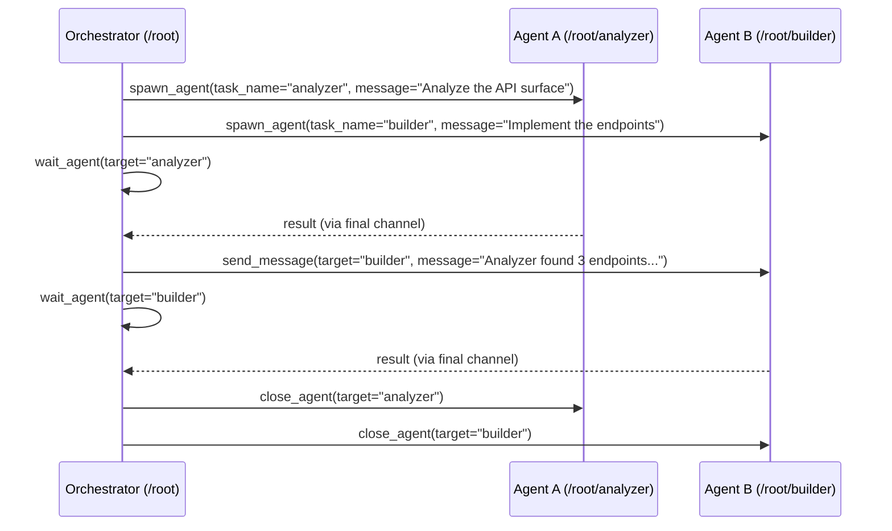
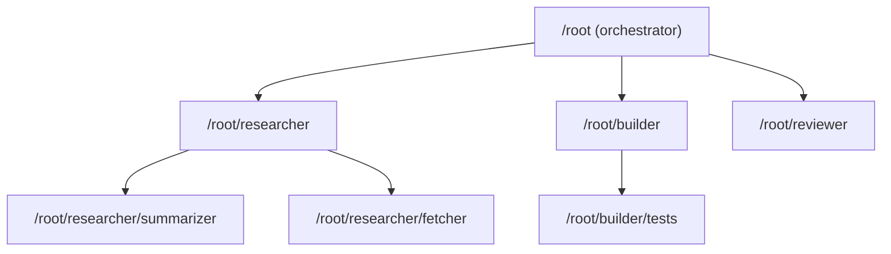
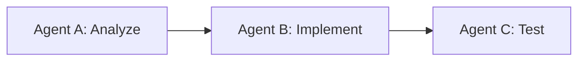
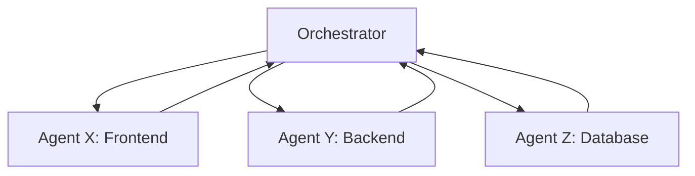
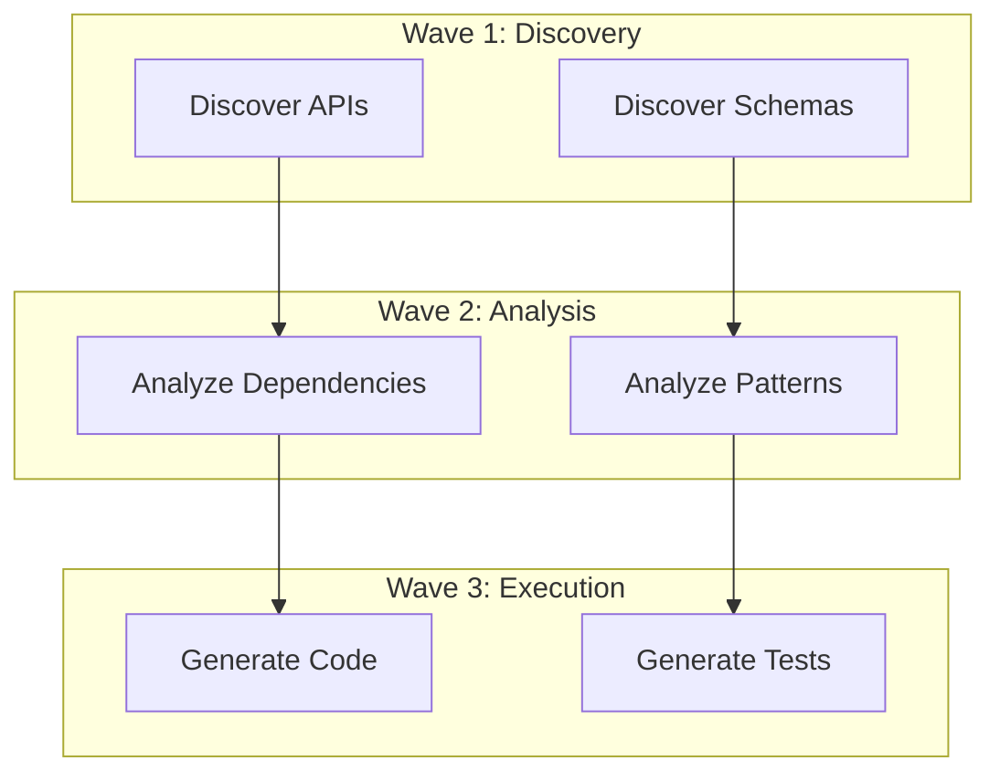
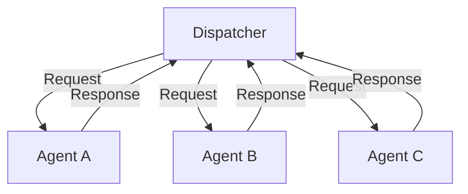

# Codex CLI Multi-Agent Orchestration v2: Complete Guide

Codex CLI's multi-agent system lets an orchestrator agent spawn, coordinate, and collect results from multiple subagents. Multi-agent v2 replaces opaque thread IDs with **path-based addressing** and introduces structured messaging tools that make complex orchestration patterns practical at production scale.

This guide covers the full system: why subagents exist, the v2 architecture, path-based addressing, the tool API, orchestration patterns, production case studies, and configuration reference.

---

## Why Subagents Exist

Single-agent execution hits predictable limits as tasks grow in scope:

| Constraint | Single Agent | Multi-Agent |
|---|---|---|
| Context window | One window for everything | Each agent gets a fresh window |
| Parallelism | Sequential tool calls only | Agents run concurrently |
| Blast radius | A hallucination poisons the whole session | Isolated failure per agent |
| Specialization | One prompt must cover all roles | Role-specific instructions per agent |
| Token cost | Long context = higher per-token cost | Shorter contexts per agent |

Subagents solve these problems by decomposing a large task into isolated, parallelizable units of work. The orchestrator delegates subtasks, each subagent works in its own context window with its own sandbox, and results flow back through structured channels.

---

## Multi-Agent v2 Architecture

### From v1 to v2

Multi-agent v1 used opaque `ThreadId` strings as agent identifiers. This worked for simple parent-child relationships but broke down when agents needed to address siblings, query the topology, or route messages through a hierarchy.

Multi-agent v2 introduces three architectural changes:

1. **Path-based addressing** -- agents are identified by hierarchical paths like `/root/researcher/summarizer`
2. **Named task spawning** -- every `spawn_agent` call requires a `task_name`, making the agent tree human-readable
3. **Structured messaging** -- `send_message` and `followup_task` replace raw inter-thread communication with explicit delivery semantics

### Agent Lifecycle



When a subagent is spawned, it receives developer instructions explaining its role:

> You are a newly spawned agent in a team of agents collaborating to complete a task. You can spawn sub-agents to handle subtasks, and those sub-agents can spawn their own sub-agents. You are responsible for returning the response to your assigned task in the final channel. When you give your response, the contents of your response in the final channel will be immediately delivered back to your parent agent. The prior conversation history was forked from your parent agent. Treat the next user message as your assigned task, and use the forked history only as background context.

---

## Path-Based Addressing

### Path Structure

Every agent in a session has a canonical path rooted at `/root`:

```
/root                          # The primary orchestrator
/root/researcher               # A child agent named "researcher"
/root/researcher/summarizer    # A grandchild agent
/root/builder                  # A sibling of "researcher"
```

Paths are constructed from the `task_name` parameter passed to `spawn_agent`. Agent names must use only lowercase letters, digits, and underscores. The name `root` is reserved for the primary agent.

### Addressing Rules

| Reference Type | Syntax | Example | Resolution |
|---|---|---|---|
| Absolute | Starts with `/root` | `/root/builder` | Resolves globally |
| Relative | No leading `/` | `worker` | Resolves from the current agent's path |
| Root | `/root` | `/root` | Always resolves to the primary agent |

From `/root/researcher`, the reference `summarizer` resolves to `/root/researcher/summarizer`. The reference `/root/builder` resolves to the absolute path regardless of the caller's position.

### Validation

Agent names are validated at creation time:

- Must not be empty
- Must not be `root`, `.`, or `..`
- Must not contain `/`
- Must use only `[a-z0-9_]` characters

Paths must start with `/root` and must not end with a trailing `/`.

### Hierarchical Routing

The path system enables hierarchical discovery. An orchestrator at `/root` can address any descendant by path. Subagents can address siblings through their parent, or use absolute paths to reach any agent in the tree.



---

## Task Assignment Tools

Multi-agent v2 provides six tools for agent lifecycle management and communication.

### spawn_agent

Creates a new subagent with an isolated context window and sandbox.

**Parameters:**

| Parameter | Type | Required | Description |
|---|---|---|---|
| `message` | string | yes | The task prompt for the new agent |
| `task_name` | string | yes | Name segment appended to the parent's path |
| `agent_type` | string | no | Role name (maps to a role config in `.codex/`) |
| `model` | string | no | Model override for this agent |
| `reasoning_effort` | string | no | `"low"`, `"medium"`, or `"high"` |
| `fork_turns` | string | no | `"all"` to fork the parent's full conversation history |

**Returns:** `{ "task_name": "/root/analyzer" }` (or includes `nickname` if metadata is not hidden).

**Example:**

```json
{
  "message": "Analyze all Python files in src/ for security vulnerabilities. Report findings as a JSON array.",
  "task_name": "security_scan",
  "agent_type": "analyzer",
  "model": "o3",
  "reasoning_effort": "high"
}
```

**Depth limit:** Agents can spawn sub-agents recursively up to `agent_max_depth` (default: 3). Exceeding the limit returns an error instructing the agent to solve the task itself.

### send_message

Sends a text message to a running agent and triggers a new turn.

**Parameters:**

| Parameter | Type | Required | Description |
|---|---|---|---|
| `target` | string | yes | Absolute or relative agent path |
| `message` | string | yes | The message content |

Messages cannot be sent to `/root` (the primary agent). Empty messages are rejected.

### followup_task

Queues a message for an agent without immediately triggering a turn. Useful for batching instructions before a `wait_agent` call.

**Parameters:**

| Parameter | Type | Required | Description |
|---|---|---|---|
| `target` | string | yes | Agent path |
| `message` | string | yes | The follow-up task description |
| `interrupt` | boolean | no | If `true`, interrupts the agent's current turn |

### wait_agent

Blocks until the target agent completes its current turn and returns its result.

**Parameters:**

| Parameter | Type | Required | Description |
|---|---|---|---|
| `target` | string | yes | Agent path to wait on |

**Returns:** The agent's final-channel response text, along with status metadata.

### list_agents

Returns the current state of all agents in the session, including their paths, roles, and statuses (active, idle, or closed).

**Parameters:** None.

### close_agent

Terminates an agent and releases its resources.

**Parameters:**

| Parameter | Type | Required | Description |
|---|---|---|---|
| `target` | string | yes | Agent path to close |

---

## Orchestration Patterns

### Sequential Pattern

Agents complete tasks one after another in a fixed order. Each step depends on the output of the previous step.



**When to use:** Pipeline workflows where each stage transforms the output of the previous one. Example: analyze requirements, then generate code, then write tests.

**Implementation:**

```
1. spawn_agent(task_name="analyzer", message="Analyze the requirements...")
2. wait_agent(target="analyzer")
3. spawn_agent(task_name="implementer", message="Based on analysis: {result}...")
4. wait_agent(target="implementer")
5. spawn_agent(task_name="tester", message="Write tests for: {result}...")
6. wait_agent(target="tester")
7. close_agent for all
```

**Trade-off:** Maximizes coherence between stages but offers no parallelism. Total latency is the sum of all stages.

### Parallel Pattern

Multiple agents work simultaneously on independent tasks. An orchestrator fans out work and collects results.



**When to use:** Independent subtasks that share no state. Example: implementing separate microservices, reviewing independent files, or searching multiple codebases.

**Implementation:**

```
1. spawn_agent(task_name="frontend", message="Build the React components...")
2. spawn_agent(task_name="backend", message="Build the API endpoints...")
3. spawn_agent(task_name="database", message="Write the migration scripts...")
4. wait_agent(target="frontend")
5. wait_agent(target="backend")
6. wait_agent(target="database")
7. Merge results
8. close_agent for all
```

**Trade-off:** Maximum throughput for independent tasks, but requires the orchestrator to merge potentially conflicting file changes.

### Wave-Based Pattern

Agents work in synchronized phases ("waves"), where each wave builds on the results of the previous one.



**When to use:** Tasks with internal dependencies that can still benefit from parallelism within each phase. Example: first discover all endpoints in parallel, then analyze them in parallel, then implement them in parallel.

**Implementation:**

```
# Wave 1: Discovery (parallel)
spawn_agent(task_name="discover_apis", ...)
spawn_agent(task_name="discover_schemas", ...)
wait_agent(target="discover_apis")
wait_agent(target="discover_schemas")

# Wave 2: Analysis (parallel, using wave 1 results)
spawn_agent(task_name="analyze_deps", message="Given APIs: {apis} and schemas: {schemas}...")
spawn_agent(task_name="analyze_patterns", message="Given APIs: {apis}...")
wait_agent(target="analyze_deps")
wait_agent(target="analyze_patterns")

# Wave 3: Execution (parallel, using wave 2 results)
spawn_agent(task_name="gen_code", message="Implement based on: {analysis}...")
spawn_agent(task_name="gen_tests", message="Test based on: {analysis}...")
wait_agent(target="gen_code")
wait_agent(target="gen_tests")
```

**Trade-off:** Balances parallelism with coordination. Each wave synchronizes before the next begins, so information flows correctly between phases.

### Dispatcher Pattern

A central dispatcher routes incoming requests to specialized agents based on content type or domain.



**When to use:** Heterogeneous workloads where different request types require different agent configurations (models, roles, reasoning effort).

### Peer-to-Peer Pattern

Agents communicate directly with siblings via `send_message` using absolute paths, without routing through the orchestrator.

**When to use:** Collaborative tasks where agents need to share intermediate findings, such as a researcher sending context to a builder without the orchestrator mediating every exchange.

---

## Defining Custom Agent Roles

Agent roles provide per-type configuration through files in `.codex/agents/`:

```
.codex/
  agents/
    analyzer.md          # Instructions for "analyzer" role
    builder.md           # Instructions for "builder" role
    reviewer.md          # Instructions for "reviewer" role
```

When `spawn_agent` includes `agent_type: "analyzer"`, the agent loads `.codex/agents/analyzer.md` as additional instructions and may apply role-specific configuration (model overrides, sandbox settings, etc.).

Role configuration supports:

- **Specialized instructions** -- domain-specific prompts for each role
- **Model overrides** -- use a more capable model for complex analysis, a faster model for simple tasks
- **Sandbox mode** -- restrict write access for read-only roles
- **Reasoning effort** -- set per-role reasoning effort defaults

---

## Production Case Studies

### Case Study 1: FinTech Compliance Pipeline

A financial services team uses wave-based orchestration to process regulatory compliance checks across 200+ microservices:

- **Wave 1:** 8 discovery agents scan service repositories for API contracts, database schemas, and configuration files
- **Wave 2:** 4 analysis agents cross-reference discovered contracts against compliance rules
- **Wave 3:** 2 remediation agents generate patches for non-compliant services

**Results:** Reduced compliance review from 3 developer-days to 45 minutes. Each agent operates in a `workspace-read` sandbox to prevent accidental modifications during discovery and analysis phases.

### Case Study 2: IoT Fleet Firmware Updates

An IoT platform team orchestrates firmware validation across device families:

- **Orchestrator** spawns one `validator` agent per device family (ARM Cortex-M, RISC-V, ESP32)
- Each validator spawns sub-agents for: binary analysis, dependency checking, and regression test generation
- Results aggregate at the orchestrator, which produces a go/no-go release matrix

**Results:** Parallel validation across 6 device families completes in 12 minutes instead of the previous 4-hour sequential process. Agent depth of 2 (orchestrator -> validator -> sub-task) keeps context windows focused.

### Case Study 3: Monorepo Cross-Service Refactoring

A platform team uses the parallel pattern to refactor a shared library across 15 consuming services:

- **Orchestrator** analyzes the library's API surface and identifies breaking changes
- Spawns 15 parallel `migrator` agents, one per consuming service
- Each migrator updates imports, adapts call sites, and runs the service's test suite
- Orchestrator collects results and creates a unified PR

**Key insight:** Using `fork_turns: "all"` when spawning migrators gives each agent the orchestrator's analysis context without re-analyzing the library, saving tokens and time.

---

## Configuration Reference

### Multi-Agent v2 Settings

In `~/.codex/config.toml` or `.codex/config.toml`:

```toml
# Maximum depth of agent spawning (default: 3)
agent_max_depth = 3

# Multi-agent v2 specific settings
[multi_agent_v2]
# Hide agent metadata (thread IDs, nicknames) in spawn results
hide_spawn_agent_metadata = false
```

### Agent Role Configuration

Place role-specific config in `.codex/agents/<role_name>.md`:

```markdown
You are a security analyzer. Focus exclusively on:
- SQL injection vulnerabilities
- Authentication bypasses
- Secrets in source code

Report findings as structured JSON with severity levels.
```

### Feature Flags

Multi-agent v2 requires the collaboration feature to be enabled:

```toml
[features]
multi_agent_v2 = true
```

### TUI Keyboard Shortcuts

When multiple agents are active, the TUI provides navigation:

| Shortcut | Action |
|---|---|
| `Alt+Left` | Switch to previous agent |
| `Alt+Right` | Switch to next agent |
| `/agent` | Open agent picker |

### Sandbox Inheritance

Subagents inherit their parent's sandbox policy by default. A subagent cannot escalate beyond the parent's sandbox level -- an agent in `workspace-read` cannot spawn a child in `workspace-write`.

### Shell Environment Policy

The `shell_environment_policy` controls which environment variables are available to agent shell commands:

```toml
[shell_environment_policy]
inherit = "core"     # "core" or "all"

[shell_environment_policy.set]
CI = "false"
MY_TEAM = "codex"
```

When `inherit = "core"`, only platform-essential variables (HOME, PATH, SHELL, USER, LOGNAME) pass through. Default exclude patterns filter variables containing `KEY`, `SECRET`, or `TOKEN` to prevent accidental credential leakage to subprocesses.

---

## Summary

Multi-agent v2 transforms Codex CLI from a single-agent tool into a structured orchestration platform. Path-based addressing makes agent hierarchies navigable and debuggable. The six core tools -- `spawn_agent`, `send_message`, `followup_task`, `wait_agent`, `list_agents`, and `close_agent` -- provide the primitives for any orchestration pattern: sequential pipelines, parallel fan-out, wave-based phasing, dispatcher routing, or peer-to-peer collaboration.

The key design decisions -- isolated context windows, sandbox inheritance, depth limits, and structured messaging -- keep multi-agent sessions predictable and safe at production scale.
