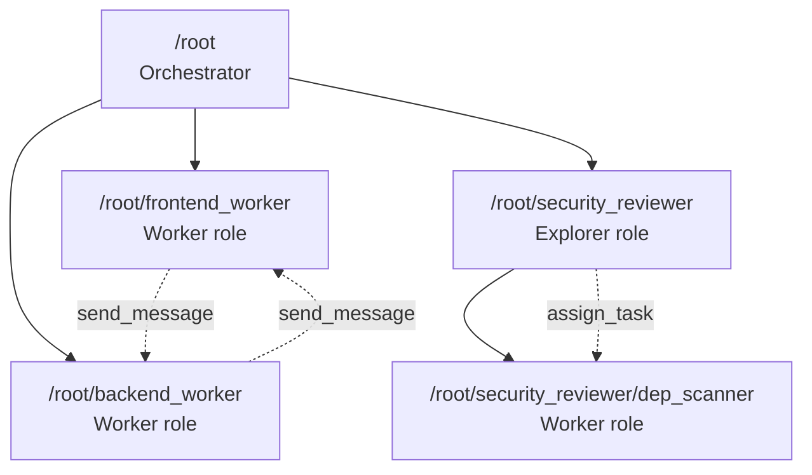
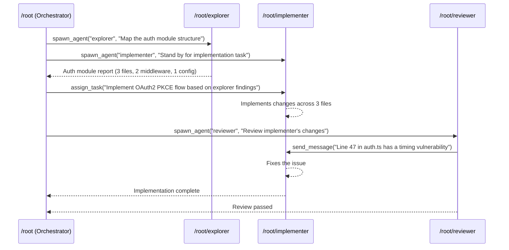

# Multi-Agent v2 in Codex CLI: Path-Based Addressing, Structured Messaging, and the New Tool Surface


---

Codex CLI's multi-agent system has undergone its most significant architectural revision since subagents first landed in v0.102.0. The **multi-agent v2** feature, shipping across v0.118.0–v0.119.0 and refined in v0.120.0, replaces the parent-only communication model with path-based agent addressing, structured inter-agent messaging, and a richer tool surface that includes `assign_task`, `send_message`, and `list_agents`[^1][^2]. This article unpacks the v2 architecture, walks through the new tools, and shows how to migrate existing workflows.

## Why v1 Hit a Ceiling

The original multi-agent model (v0.102.0+, enabled via `multi_agent = true`) gave Codex CLI parallel execution through `spawn_agents_on_csv` and the three built-in roles — `default`, `worker`, and `explorer`[^3]. It worked well for embarrassingly parallel tasks like batch CSV audits, but had a hard structural limitation: **sub-agents could only return results to their parent**[^4]. They could not message each other directly, could not receive steering instructions mid-execution, and had no addressable identity beyond an opaque internal thread ID.

This meant orchestration patterns like fan-out/fan-in with intermediate coordination, pipeline handoffs between specialist agents, or dynamic task reassignment were impossible without dropping out of Codex entirely and using external orchestration (the Agents SDK, Oh-My-Codex, or manual tmux wrangling).

Issue #12047 captured the community's wishlist: named agents, per-agent configuration, async orchestration, @mention messaging, and teams as first-class units[^5]. Multi-agent v2 delivers the foundational layer for most of these.

## Enabling Multi-Agent v2

The v2 system sits behind a separate feature flag from the original `multi_agent`:

```toml
# ~/.codex/config.toml
[features]
multi_agent_v2 = true
```

This activates the **v4 agent API** internally, which introduces path-based addressing and the expanded tool surface[^6]. The original `multi_agent = true` flag continues to work for v1 workflows — both can coexist during the transition period, though v2 tools supersede v1 equivalents when both are enabled.

Restart Codex after changing the flag, or use the features subcommand:

```bash
codex features enable multi_agent_v2
```

## Path-Based Agent Addressing

The headline change in v2 is that every agent in a session receives a **readable, hierarchical path address**[^1]. When you spawn an agent named `security_reviewer` from the root context, it receives the address `/root/security_reviewer`. If that agent in turn spawns a child called `dependency_scanner`, the child's address becomes `/root/security_reviewer/dependency_scanner`.



This addressing scheme provides three immediate benefits:

1. **Debuggability** — TUI output tags every message with the source agent's path, replacing the cryptic UUIDs of v1[^5].
2. **Targeted messaging** — any agent can route a message to any other agent by path, not just to its parent.
3. **Hierarchical scoping** — policies and permissions can be applied at path prefixes (e.g., all agents under `/root/security_reviewer/` inherit read-only sandbox mode).

## The v2 Tool Surface

Multi-agent v2 exposes five tools to the model, replacing v1's more limited `spawn_agent`/`close_agent` pair[^2][^6]:

### `spawn_agent`

Creates a new child agent. In v2, the `message` parameter accepts a structured string (PR #16406)[^7] rather than requiring a separate instruction field:

```
spawn_agent(
  name: "api_reviewer",
  role: "explorer",
  message: "Review all REST endpoints in src/api/ for authentication gaps. Report findings as structured JSON.",
  fork_context: false
)
```

The `fork_context` parameter controls whether the child receives a snapshot of the parent's conversation history[^8]. Setting it to `true` is powerful but expensive — the child starts with full context including all prior tool calls. For most workflows, `false` (the default) is preferred, letting the child start fresh with only the spawning message as context. Enterprise teams can disable fork_context entirely via `[agents] allow_fork_context = false`[^8].

### `assign_task`

Sends a task to an existing agent by path address (PR #16419)[^7]. Unlike `send_message`, an assigned task carries an implicit expectation that the target will complete the work and report back:

```
assign_task(
  target: "/root/backend_worker",
  message: "Implement the caching layer for the /users endpoint based on the API reviewer's findings."
)
```

Tasks cannot be assigned to the root agent (PR #16424)[^7] — this prevents circular delegation where an orchestrator assigns work to itself.

### `send_message`

Delivers a structured message to any agent by path (PR #16409)[^7]. This is the mechanism for mid-execution steering, progress updates, and inter-agent coordination:

```
send_message(
  target: "/root/frontend_worker",
  message: "The backend API contract has changed: the /users response now includes a 'cached_at' timestamp field. Update your components accordingly."
)
```

The target agent receives the message as a high-priority event and processes it when it finishes its current tool call[^6]. This is asynchronous but ordered — messages queue in delivery order.

### `list_agents`

Returns the current agent tree with path addresses, roles, and status (active/idle/completed). Useful for orchestrators that need to make dynamic routing decisions:

```
list_agents()
→ /root (active, default)
  /root/frontend_worker (active, worker)
  /root/backend_worker (idle, worker)
  /root/security_reviewer (active, explorer)
    /root/security_reviewer/dep_scanner (completed, worker)
```

### `fork_context`

Creates an independent execution context from the current conversation state (originally from v0.107.0's `/fork` command)[^9]. In v2, this is available as a programmatic tool, not just a slash command, enabling the model to decide when context forking would be beneficial.

## Configuration: Roles and Constraints

The `[agents]` configuration block gains new relevance in v2. The `max_threads` and `max_depth` settings still apply[^3], but v2 adds spawn context metadata (PR #16746)[^7] that propagates the parent's configuration to children:

```toml
# ~/.codex/config.toml
[agents]
max_threads = 6
max_depth = 2
allow_fork_context = true

[agents.security_reviewer]
description = "Reviews code for security vulnerabilities"
config_file = "~/.codex/agents/security-reviewer.toml"

[agents.fast_worker]
description = "Quick implementation tasks"
config_file = "~/.codex/agents/fast-worker.toml"
```

Custom agent TOML files can override model selection, reasoning effort, sandbox mode, MCP servers, and skills:

```toml
# ~/.codex/agents/security-reviewer.toml
name = "security_reviewer"
description = "Security-focused code reviewer with read-only access"
developer_instructions = """
You are a security reviewer. Analyse code for:
- Authentication and authorisation gaps
- Injection vulnerabilities
- Secrets in source code
- Dependency vulnerabilities
Report findings as structured JSON with severity, location, and recommendation fields.
"""
model = "gpt-5.4"
model_reasoning_effort = "high"
sandbox_mode = "read_only"
```

## v1 → v2 Migration

For teams already using `spawn_agents_on_csv` for batch processing, the migration is straightforward — CSV batch workflows continue to work unchanged under v2[^3]. The key changes affect interactive orchestration:

| Capability | v1 | v2 |
|---|---|---|
| Agent identity | Opaque thread ID | Path address (`/root/name`) |
| Communication | Child → parent only | Any agent → any agent |
| Mid-execution steering | Not supported | `send_message` to running agents |
| Task delegation | `spawn_agent` only | `spawn_agent` + `assign_task` |
| Agent discovery | Not available | `list_agents` |
| Context forking | `/fork` slash command | `fork_context` tool |

## Practical Workflow: Feature Implementation Pipeline

Here's a v2 workflow that demonstrates the new messaging capabilities — something impossible in v1:



The critical interaction is the reviewer sending a message directly to the implementer — in v1, this would have required the reviewer to report back to the orchestrator, which would then relay the message to the implementer, consuming context and adding latency.

## What's Still Missing

Multi-agent v2 is a substantial step forward, but the full vision from Issue #12047 remains partially unfulfilled[^5]:

- **Teams as first-class units** — the `team.toml` manifest and `@teamname/agentname` addressing are not yet implemented. Teams must be composed manually from individual agent spawns.
- **Async orchestration** — the orchestrator still holds a context slot while waiting for children. True suspend-and-resume for idle orchestrators is not yet available.
- **@mention user syntax** — users cannot yet type `@agentname` in the TUI input to route messages to specific agents. This requires TUI changes that are tracked but not shipped.
- **IDE integration** — multi-agent v2 activity is surfaced only in the CLI TUI, not in the Codex App or VS Code extension[^4].
- **Subagent-specific notifications** — the notification system (article #239) does not yet emit events for individual subagent completion, only aggregate session events.

The `monitor` role (long-running polling with up to 1-hour windows)[^4] is available but does not yet integrate with v2's messaging — it cannot send structured progress updates to other agents.

## Performance Considerations

Each spawned agent consumes its own model context and tool execution budget. The v2 messaging tools add token overhead for message routing metadata. For cost-sensitive workflows:

- Use `fork_context: false` (the default) to avoid duplicating conversation history into children[^8]
- Keep `max_depth` at 1 or 2 — deep nesting multiplies context consumption exponentially
- Prefer `assign_task` over `send_message` for discrete work units — it signals completion expectations to the model, reducing unnecessary status polling
- Use the `explorer` role with a lighter model (e.g., `gpt-5.4-mini`) for read-only reconnaissance, reserving `gpt-5.4` for implementation agents[^3]

## The Bigger Picture

Multi-agent v2 positions Codex CLI as a **programmable orchestration runtime** rather than just a single-agent coding assistant. The path-based addressing and structured messaging create a foundation for the team-based architectures the community has been requesting — and for integration with external orchestrators like the OpenAI Agents SDK, which can now address individual Codex agents by path when using Codex as an MCP server[^10].

For practitioners, the immediate win is clear: workflows that previously required external tooling (OMX, tmux scripts, Agents SDK wrappers) can now be expressed natively within Codex CLI's multi-agent system. The `/root/agent_a` addressing makes debugging tractable, and `send_message` makes coordination possible without routing everything through the orchestrator.

---

## Citations

[^1]: OpenAI, "Codex CLI v0.119.0 Release Notes — Sub-agents now use readable path-based addresses", GitHub Releases, 10 April 2026. [https://github.com/openai/codex/releases](https://github.com/openai/codex/releases)

[^2]: OpenAI, "Changelog — Codex CLI", OpenAI Developers, April 2026. [https://developers.openai.com/codex/changelog](https://developers.openai.com/codex/changelog)

[^3]: OpenAI, "Subagents — Codex CLI", OpenAI Developers Documentation. [https://developers.openai.com/codex/subagents](https://developers.openai.com/codex/subagents)

[^4]: Morph, "Codex CLI Multi-Agent: Agent Roles, CSV Batch & Config Guide", 2026. [https://www.morphllm.com/codex-multi-agent](https://www.morphllm.com/codex-multi-agent)

[^5]: OpenAI/codex Issue #12047, "Multi-agent TUI overhaul: named agents, per-agent config, async orchestration & @mention messaging", GitHub, 2026. [https://github.com/openai/codex/issues/12047](https://github.com/openai/codex/issues/12047)

[^6]: Blake Crosley, "Codex CLI: The Definitive Technical Reference", 2026. [https://blakecrosley.com/guides/codex](https://blakecrosley.com/guides/codex)

[^7]: OpenAI, "Codex CLI Releases — PRs #16406, #16409, #16419, #16424, #16746", Releasebot, April 2026. [https://releasebot.io/updates/openai/codex](https://releasebot.io/updates/openai/codex)

[^8]: OpenAI/codex Issue #14981, "Add a hard config kill-switch and warning path for spawn_agent fork_context", GitHub, 2026. [https://github.com/openai/codex/issues/14981](https://github.com/openai/codex/issues/14981)

[^9]: Kaushik Gopal, "Forking subagents in an AI coding session with tmux", kau.sh, 2026. [https://kau.sh/blog/agent-forking/](https://kau.sh/blog/agent-forking/)

[^10]: OpenAI, "Use Codex with the Agents SDK", OpenAI Developers. [https://developers.openai.com/codex/guides/agents-sdk](https://developers.openai.com/codex/guides/agents-sdk)
