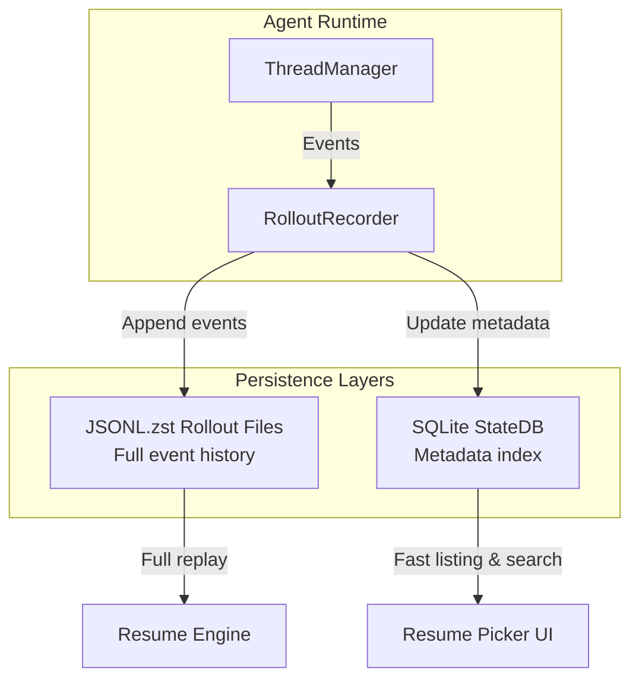
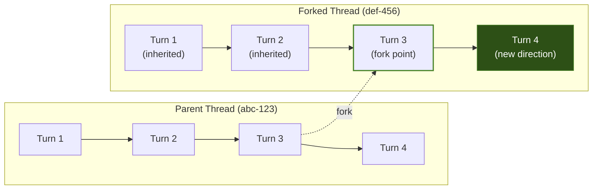

# Codex CLI Session Lifecycle: Resume, Fork, Rollout Persistence, and the JSONL Event Architecture


---

Every interactive Codex CLI session generates a durable event log — a compressed JSONL rollout file that captures every message, tool call, approval decision, and token count. This persistence layer underpins three capabilities that transform how you work with the agent: **resuming** a conversation days later, **forking** to explore alternative approaches, and **replaying** sessions for audit or debugging. With v0.119.0 and v0.120.0 (April 2026) delivering significant improvements to the resume picker and session addressing [^1][^2], now is the right time to understand the full session lifecycle.

## The Rollout File Format

At the core of session persistence is the **rollout file** — a Zstandard-compressed JSONL archive (`.jsonl.zst`) stored under `~/.codex/sessions/` [^3]. Each line is a self-contained JSON object representing a single event in the session timeline.

### Event Types

The `RolloutItem` enum captures three categories of event [^4]:

| Event Type | Purpose |
|---|---|
| `SessionMeta` | Initial session configuration — model, sandbox mode, working directory, Git branch |
| `EventMsg` | Streaming events: `TurnStarted`, `AgentMessageDelta`, `TurnComplete`, `TokenCount` |
| `ResponseItem` | Tool calls, tool results, approval decisions, file changes |

### Storage Layout

```
~/.codex/
├── sessions/
│   └── 2026/
│       └── 04/
│           └── 11/
│               ├── rollout-7f9f9a2e-1b3c-4c7a.jsonl.zst
│               └── rollout-a1b2c3d4-5e6f-7890.jsonl.zst
├── state.db          # SQLite metadata index
├── config.toml
└── auth.json
```

Rollout files are organised by date and named with their `ThreadId` — a UUID v7 that encodes creation time [^4]. The `RolloutRecorder` component appends events sequentially, batching writes in a background task for efficiency [^3].

## The Dual-Layer Persistence Model

Codex CLI maintains two coordinated persistence layers:



The **JSONL layer** is the source of truth — it contains every event needed to reconstruct the full session state [^3]. The **SQLite layer** (`StateRuntime`) indexes lightweight metadata (`ThreadMetadata`) for fast listing: current working directory, Git branch, first message summary, creation and update timestamps [^4]. This split means the resume picker can display hundreds of sessions instantly without decompressing rollout files.

## Resuming Sessions

### From the CLI

The `codex resume` subcommand offers three entry points [^5]:

```bash
# Interactive picker — recent sessions with summaries
codex resume

# Skip picker, reopen most recent session in current directory
codex resume --last

# Target a specific session by ID
codex resume 7f9f9a2e-1b3c-4c7a-9b0e-abc123def456

# Include sessions from all directories
codex resume --last --all
```

You can override the environment on resume with `--cd` to change the working directory or `--add-dir` to grant write access to additional paths [^5].

### From the TUI

Inside an active session, type `/resume` and press Enter to open the session picker [^6]. As of v0.120.0, you can jump directly to a session by ID or name — no picker navigation required [^1].

### What Gets Restored

The resume engine replays the rollout file and restores [^4]:

1. **Conversation history** — all `UserMessage` events replayed in order
2. **Session configuration** — working directory, model provider, reasoning effort, sandbox mode
3. **Token accounting** — cumulative `tokens_used` from `EventMsg::TokenCount` events
4. **Dynamic tools** — any tools registered during the session via `get_dynamic_tools(thread_id)`
5. **Memory mode** — the memory configuration active at the time of the session

The `InitialHistory::Resumed` variant preserves the original `ThreadId`, so the session continues appending to the same rollout file [^4].

### Non-Interactive Resume

`codex exec` supports resume for automation workflows [^5]:

```bash
# Continue the last exec run with a follow-up prompt
codex exec resume --last "Fix the race conditions you found"

# Resume a specific session with an image attachment
codex exec resume 7f9f9a2e... --image screenshot.png "What's wrong here?"
```

This is particularly useful for multi-stage CI pipelines where a later job needs to continue from an earlier agent session.

## Forking Sessions

Forking creates a new thread that branches from a parent's history without mutating the original [^4]. There are two ways to fork:

### TUI Fork

Type `/fork` to clone the current conversation into a new thread [^6]. The new thread gets a fresh UUID v7 but stores a `forked_from_id` reference back to the parent.

### Esc-Based History Walk

Press `Esc` twice with an empty composer to edit your previous message. Continue pressing `Esc` to walk further back in the transcript, then press `Enter` to fork from that point [^7]. This is the more common pattern — you spot a wrong turn three messages ago and want to branch from before it happened.

### Fork Mechanics



The forked thread inherits turns and items from the parent up to the fork point [^4]. The initial turn in the fork is marked as `Interrupted` or `Idle` to accept new input. Critically, the parent's rollout file is never modified — the fork reads from it but writes to its own new file.

## The Resume Picker

The resume picker (`resume_picker.rs`) deserves specific attention because it's where most developers interact with session management [^4].

### Pagination and Sorting

The picker loads sessions in pages of 25, sorted by either `CreatedAt` or `UpdatedAt` [^4]. Loading is asynchronous — the picker displays immediately while `BackgroundEvent::PageLoaded` events populate metadata without blocking the UI.

### Filtering

By default, the picker shows only sessions from the current working directory. This is the right default for monorepo workflows where you might have hundreds of sessions across different projects. Use `--all` (CLI) or toggle within the picker (TUI) to see everything.

### v0.119.0 and v0.120.0 Improvements

The April 2026 releases delivered a batch of resume reliability fixes [^1][^2]:

- **Eliminated false empty states** — the picker no longer shows "no sessions" when sessions exist but metadata is still loading (PR #16591)
- **Stabilised timestamp labels** — consistent date formatting across locales (PR #16601)
- **Preserved resume hints on zero-token exits** — sessions that exited before any agent response are still resumable (PR #16987)
- **Direct session addressing** — `/resume` accepts a session ID or name directly from the TUI, bypassing the picker entirely (PR #17222)
- **Crash prevention** — resuming the currently active thread no longer causes a panic (PR #17086)

## Ephemeral Mode and Persistence Control

Not every session should be persisted. The `--ephemeral` flag in `codex exec` prevents rollout file creation entirely [^3]:

```bash
# One-shot query, no persistence
codex exec --ephemeral "What version of Node is installed?"
```

This is useful for quick queries in CI where you don't want session files accumulating on the runner.

## Session Management Patterns

### Pattern 1: Exploratory Branching

Use fork to test alternative implementations without losing your current approach:

```
Session A: Implement auth with JWT
  ├── Fork B: Try session-based auth instead
  │     └── (abandoned — JWT was better)
  └── Continue A: Refine JWT implementation
```

### Pattern 2: Multi-Day Feature Work

Resume enables long-running features that span multiple coding sessions:

```bash
# Monday: start the feature
codex  # work on auth module, exit at end of day

# Tuesday: continue where you left off
codex resume --last
# Agent remembers the full conversation, plan, and file context
```

The agent retains the original transcript, plan history, and approval decisions, so it can reference prior context while you supply new instructions [^7].

### Pattern 3: CI Pipeline Continuation

Chain `codex exec resume` across pipeline stages:

```yaml
# .github/workflows/multi-stage.yml
jobs:
  analyse:
    steps:
      - run: |
          codex exec "Analyse this codebase for security issues" \
            > session-id.txt 2>&1

  fix:
    needs: analyse
    steps:
      - run: |
          SESSION_ID=$(cat session-id.txt)
          codex exec resume "$SESSION_ID" \
            "Fix the critical issues you identified"
```

### Pattern 4: Audit and Debugging

Rollout files are a complete audit trail. Parse them for debugging or compliance:

```bash
# Decompress and inspect a session's tool calls
zstd -d ~/.codex/sessions/2026/04/11/rollout-7f9f9a2e.jsonl.zst -o - \
  | jq 'select(.type == "ResponseItem" and .item.type == "tool_call")'
```

## Configuration Reference

| Setting | Location | Purpose |
|---|---|---|
| `~/.codex/sessions/` | Default path | Rollout file storage |
| `~/.codex/state.db` | SQLite database | Metadata index for fast session listing |
| `--ephemeral` | CLI flag | Disable persistence for this run |
| `--cd`, `--add-dir` | Resume flags | Override environment on resume |
| `--last`, `--all` | Resume flags | Control picker behaviour |

## What's Still Missing

Session management in Codex CLI is robust but not complete. Notable gaps include:

- **No session naming from the CLI** — you can name sessions in the Codex App, but the CLI relies on auto-generated summaries from the first message ⚠️
- **No cross-device sync** — rollout files are local; there's no built-in mechanism to sync sessions between machines ⚠️
- **No selective purge** — deleting old sessions requires manual file cleanup; there's no `codex sessions prune --older-than 30d` command ⚠️
- **No rollout export format** — the `.jsonl.zst` format is functional but there's no official schema specification for third-party tooling ⚠️

## Citations

[^1]: [Codex CLI v0.120.0 Changelog — OpenAI Developers](https://developers.openai.com/codex/changelog) — April 11, 2026
[^2]: [Codex CLI v0.119.0 Changelog — OpenAI Developers](https://developers.openai.com/codex/changelog) — April 10, 2026
[^3]: [Session Management and Persistence — DeepWiki (openai/codex)](https://deepwiki.com/openai/codex/3.3-session-management-and-persistence) — Codex architecture documentation
[^4]: [Session Resumption and Forking — DeepWiki (openai/codex)](https://deepwiki.com/openai/codex/4.4-session-resumption-and-forking) — Codex architecture documentation
[^5]: [Command Line Options — Codex CLI — OpenAI Developers](https://developers.openai.com/codex/cli/reference) — Official reference
[^6]: [Slash Commands — Codex CLI — OpenAI Developers](https://developers.openai.com/codex/cli/slash-commands) — Official reference
[^7]: [Features — Codex CLI — OpenAI Developers](https://developers.openai.com/codex/cli/features) — Official feature documentation
