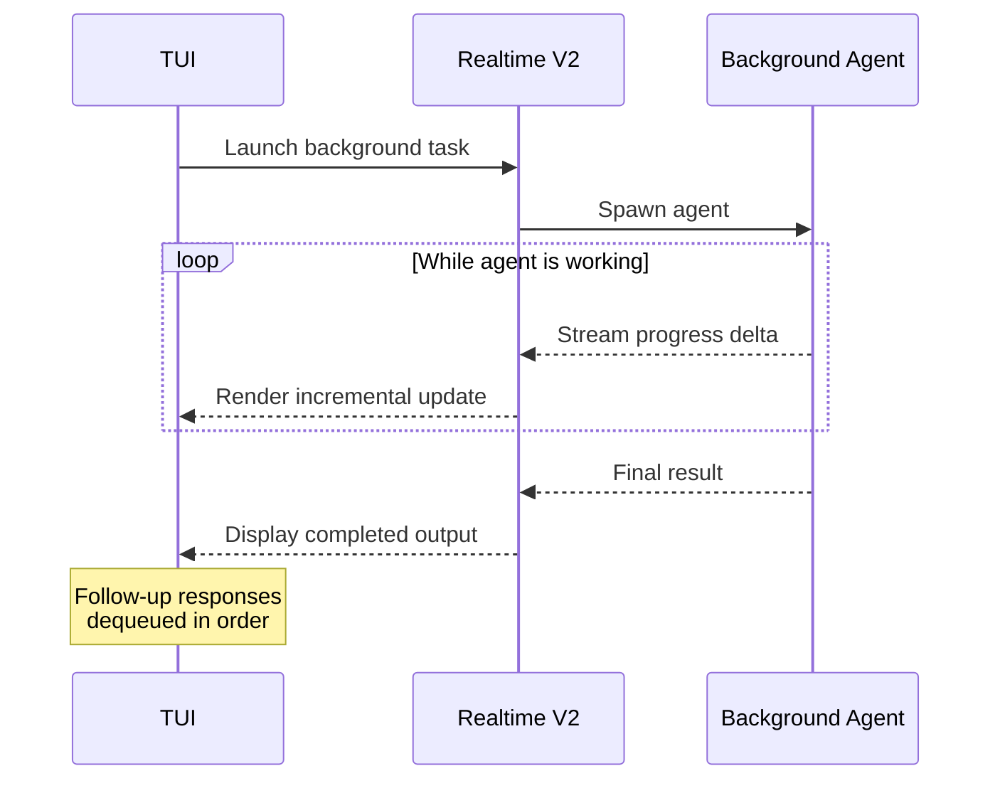
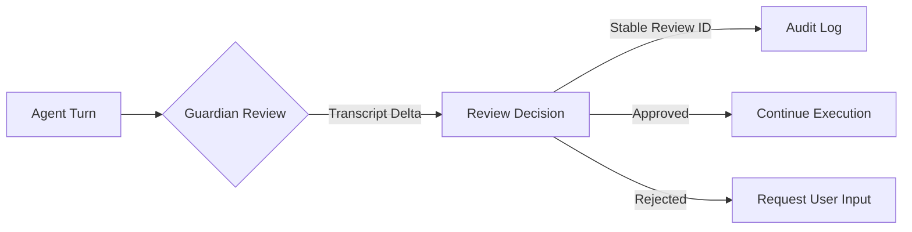

# Codex CLI v0.120 Release Deep Dive


## Introduction

Codex CLI v0.120.0 landed on 11 April 2026, one day after the feature-heavy v0.119.0 release that brought Realtime V2 voice sessions and richer MCP App support[^1]. Where v0.119.0 was a broad platform release, v0.120.0 is a focused quality-of-life update: background agent streaming finally surfaces real-time progress in the TUI, hook activity gets a cleaner display, MCP tool declarations gain `outputSchema` typing, and SessionStart hooks can now distinguish `/clear` resets from fresh startups[^2].

This article walks through every notable change in the release, with configuration examples and practical guidance for adopting each feature.

## Background Agent Streaming via Realtime V2

The headline feature in v0.120.0 is background agent progress streaming. Prior to this release, background agents — spawned via `codex cloud exec` or subagent workflows — ran silently until completion. The TUI provided no intermediate feedback beyond a spinner[^3].

With v0.120.0, the Realtime V2 transport layer now streams incremental progress from background agents while work is still running. Follow-up responses are queued until the active response completes, preventing interleaving artefacts in the terminal output[^2].



### What This Means in Practice

If you are running a long `codex cloud exec` task — say, a multi-file refactor across a monorepo — you will now see each file being processed as it happens rather than waiting minutes for a bulk result. The streaming uses the same WebRTC-based Realtime V2 transport that v0.119.0 introduced for voice sessions[^1], extended here to cover text-based background agent output.

No configuration is required; background streaming activates automatically when the Realtime V2 transport is in use (the default since v0.119.0).

## Improved Hook Activity Display

Codex hooks — shell commands that fire on agent lifecycle events — have been available since early 2026[^4]. However, the TUI display for running hooks was cluttered: completed hook output and in-progress hooks were interleaved, making it hard to distinguish what was still executing.

v0.120.0 separates live running hooks from completed output. Running hooks now appear in a dedicated section of the TUI, and completed hook output is retained only when it produced actionable content[^2]. This is a visual change only; hook execution semantics are unchanged.

### Hook Configuration Refresher

Hooks are configured in a `hooks.json` file discovered at two levels[^5]:

- **User-level:** `~/.codex/hooks.json`
- **Repository-level:** `<repo>/.codex/hooks.json`

Both layers are active simultaneously — repository hooks do not replace user hooks. All matching hooks execute concurrently.

A minimal `hooks.json` illustrating the five lifecycle events:

```json
{
  "hooks": [
    {
      "event": "SessionStart",
      "matcher": { "source": "startup" },
      "handlers": [
        {
          "command": ["./scripts/load-context.sh"],
          "timeout": 10,
          "statusMessage": "Loading project context..."
        }
      ]
    },
    {
      "event": "Stop",
      "handlers": [
        {
          "command": ["./scripts/post-turn-audit.sh"],
          "timeout": 30
        }
      ]
    }
  ]
}
```

Enable hooks globally in `config.toml`:

```toml
[features]
codex_hooks = true
```

## SessionStart Hook: `/clear` vs Fresh Startup

Previously, SessionStart hooks received a `source` field with two possible values: `startup` (new session) or `resume` (continued session)[^5]. This created an ambiguity: when a user typed `/clear` to reset the conversation without leaving the CLI, the resulting SessionStart event looked identical to a fresh startup.

v0.120.0 introduces a third source value — `clear` — so hooks can distinguish between genuinely new sessions and mid-session resets[^2]. The JSON payload delivered to your hook on stdin now includes:

```json
{
  "hook_event_name": "SessionStart",
  "source": "clear",
  "session_id": "sess_abc123",
  "cwd": "/home/user/project",
  "model": "gpt-5.4"
}
```

### Why This Matters

Consider a SessionStart hook that injects project context into the model's system prompt. On a fresh `startup`, you want the full context load. On a `/clear`, the user is likely resetting a stuck conversation but doesn't need the context reloaded — the project hasn't changed. On a `resume`, you might want a lighter context refresh. The three-way distinction lets you handle each case appropriately:

```json
{
  "event": "SessionStart",
  "matcher": { "source": "startup|resume" },
  "handlers": [
    {
      "command": ["./scripts/load-full-context.sh"],
      "timeout": 15
    }
  ]
}
```

Hooks matching `clear` can be omitted entirely if no action is needed, or configured separately for lightweight reset logic.

## MCP `outputSchema` in Tool Declarations

MCP (Model Context Protocol) servers expose tools that Codex can invoke during code-mode execution. Prior to v0.120.0, tool declarations sent to the model included only the tool name, description, and input schema. The model had no structured information about what the tool would *return*[^6].

v0.120.0 adds `outputSchema` to code-mode tool declarations (#17210), so the model receives precise type information for tool results[^2]. This enables better reasoning about return values and reduces hallucinated output structures.

### Configuration

No changes to your MCP server configuration are required. If your MCP server already advertises an `outputSchema` in its tool manifest, Codex will now forward it to the model automatically. A typical MCP server tool definition with output schema:

```json
{
  "name": "search_docs",
  "description": "Search project documentation",
  "inputSchema": {
    "type": "object",
    "properties": {
      "query": { "type": "string" }
    },
    "required": ["query"]
  },
  "outputSchema": {
    "type": "object",
    "properties": {
      "results": {
        "type": "array",
        "items": {
          "type": "object",
          "properties": {
            "title": { "type": "string" },
            "snippet": { "type": "string" },
            "url": { "type": "string" }
          }
        }
      },
      "total": { "type": "integer" }
    }
  }
}
```

The `outputSchema` is forwarded verbatim in the tool declaration sent to the model, enabling it to generate correctly typed code that consumes the tool's response.

## Bug Fixes Worth Knowing

### Windows Elevated Sandbox Handling (#14568)

Windows users running Codex with split filesystem policies — where some paths are writable and others read-only — encountered permission errors when the sandbox escalated privileges. v0.120.0 fixes read-only carveouts under writable roots for elevated sandbox processes[^2].

### Symlinked Writable Roots (#15981)

If your project used symbolic links in writable root paths (common in monorepo setups with `--add-dir`), sandbox permission checks could fail silently in both shell and `apply_patch` workflows. This is now resolved[^2].

### Remote WebSocket TLS Panics (#17288)

Running `codex --remote wss://...` could panic due to missing TLS initialisation. v0.120.0 installs the Rustls crypto provider before establishing WebSocket connections, eliminating the crash[^2].

### Tool Search Ordering (#17263)

Tool search results were being alphabetically reordered, which broke relevance ranking. Results now preserve their original ordering[^2].

## Under the Hood: Guardian and Analytics Improvements

Several changes in v0.120.0 improve the Guardian approval system and internal analytics, though these are largely invisible to end users:

- **Guardian transcript deltas** (#17269): Follow-up Guardian reviews now send only the transcript delta since the last review, rather than resending the full conversation history. This reduces latency and token consumption for long sessions[^2].
- **Stable Guardian review IDs** (#17298): Review events now carry stable identifiers across app-server events and internal approval state, enabling reliable audit trails[^2].
- **Analytics schemas for compaction and Guardian events** (#17155, #17055): Internal telemetry for Guardian reviews and conversation compaction is now schema-validated[^2].



## Upgrade Path

Update via npm:

```bash
npm install -g @openai/codex@0.120.0
```

Or if you use the Homebrew tap:

```bash
brew upgrade openai-codex
```

The release is fully backwards-compatible with existing `config.toml` and `hooks.json` configurations. The only behavioural change is the new `clear` source value for SessionStart hooks, which existing hooks will simply not match unless explicitly configured.

## Summary

v0.120.0 is a targeted release that polishes the rough edges left by v0.119.0's larger feature additions. The background agent streaming alone makes it a worthwhile upgrade for anyone using cloud exec or subagent workflows. The SessionStart `/clear` distinction and MCP `outputSchema` support are smaller changes that compound into a noticeably smoother development experience.

| Feature | Impact | Configuration Required |
|---|---|---|
| Background agent streaming | High — real-time visibility into long tasks | None (automatic with Realtime V2) |
| Hook activity display | Medium — cleaner TUI during hook execution | None |
| SessionStart `/clear` source | Medium — finer-grained hook logic | Optional `hooks.json` update |
| MCP `outputSchema` | Medium — better model reasoning about tool results | None (automatic if server provides schema) |
| Windows sandbox fixes | High for Windows users | None |

## Citations

[^1]: OpenAI, "Codex CLI 0.119.0 Release Notes," GitHub, 10 April 2026. [https://github.com/openai/codex/releases](https://github.com/openai/codex/releases)
[^2]: OpenAI, "Codex CLI 0.120.0 Release Notes," GitHub, 11 April 2026. [https://github.com/openai/codex/releases/tag/rust-v0.120.0](https://github.com/openai/codex/releases/tag/rust-v0.120.0)
[^3]: OpenAI, "Subagents — Codex Developers," OpenAI Developers, 2026. [https://developers.openai.com/codex/subagents](https://developers.openai.com/codex/subagents)
[^4]: E. Atay, "OpenAI Codex CLI Hooks: Finally Here, but Still Early-Stage," Medium, March 2026. [https://ercanataycom.medium.com/openai-codex-cli-hooks-finally-here-but-still-early-stage-40eb0cabdaca](https://ercanataycom.medium.com/openai-codex-cli-hooks-finally-here-but-still-early-stage-40eb0cabdaca)
[^5]: OpenAI, "Hooks — Codex Developers," OpenAI Developers, 2026. [https://developers.openai.com/codex/hooks](https://developers.openai.com/codex/hooks)
[^6]: OpenAI, "Model Context Protocol — Codex Developers," OpenAI Developers, 2026. [https://developers.openai.com/codex/mcp](https://developers.openai.com/codex/mcp)
