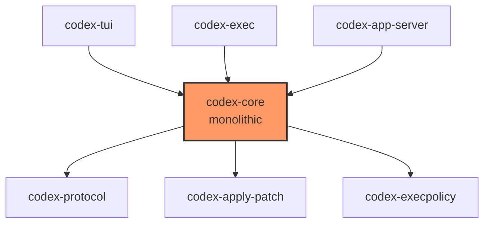
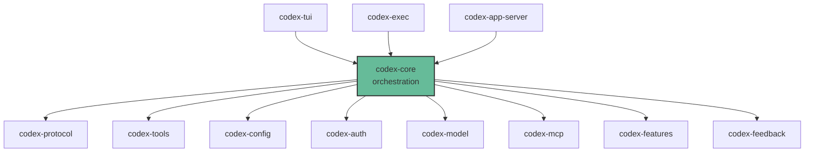

# The codex-core Crate Extraction: How v0.119.0 Modularised the Rust Heart of Codex CLI

## Why This Matters

When OpenAI released Codex CLI v0.119.0 on 10 April 2026, the headline features were WebRTC voice sessions, expanded MCP Apps support, and the experimental `codex exec-server` subcommand[^1]. Buried in the release notes, however, was a line that matters far more to anyone building on Codex CLI's internals:

> codex-core was slimmed down through major crate extractions for MCP, tools, config, model management, auth, feedback, protocol, and related ownership boundaries.[^1]

This single sentence describes the most significant architectural refactoring since the original TypeScript-to-Rust rewrite[^2]. It transforms `codex-core` from a monolithic library containing all business logic into a thin orchestration layer that delegates to purpose-built crates. For contributors, embedding teams, and anyone running custom harnesses, the implications are substantial.

## The Problem: A Growing Monolith

The codex-rs workspace started as roughly 70 crates when the Rust rewrite shipped in late 2025[^2]. The core crate — `codex-core` — handled session management, model interaction, tool execution, configuration parsing, MCP coordination, authentication, feedback collection, and protocol serialisation. It was, by design, the heart of the system: every UI surface (TUI, exec, app-server) depended on it[^3].

This architecture had two consequences:

1. **Compile time bloat.** Any change to `codex-core` triggered a full rebuild of everything downstream. With the crate pulling in MCP client libraries, authentication flows, and model provider logic, incremental builds became painfully slow.

2. **Coupling.** Teams building custom integrations via the Python SDK or TypeScript SDK had to accept all of `codex-core`'s transitive dependencies even when they only needed, say, the tool schema parser or the configuration resolver.

## The Extraction: What Moved Where

The v0.119.0 extraction was executed across five primary pull requests (#15919, #16379, #16508, #16523, #16962)[^1] plus supporting changes like the features split (#15253)[^4] and the MCP schema adapter extraction (#15928)[^5]. The workspace now contains approximately 90 member crates[^3], up from around 69 in early March 2026[^6].

Here is the mapping of extracted domains to their new crates:

| Domain | New Crate | What Moved |
|--------|-----------|------------|
| Feature flags | `codex-features` | Feature system, unstable-feature warnings, config resolution[^4] |
| Tool schemas | `codex-tools` | MCP schema adapters (`ParsedMcpTool`, `parse_mcp_tool()`), shared tool input model[^5] |
| Configuration | `codex-config` | TOML parsing, layer merging, precedence resolution[^3] |
| Authentication | `codex-auth` | OAuth PKCE, device-code flow, API key handling, credential store[^1] |
| Model management | `codex-model` | Provider routing, model selection, reasoning effort config[^1] |
| MCP coordination | `codex-mcp` | MCP client lifecycle, server startup, resource reads, tool-call metadata[^1] |
| Feedback | `codex-feedback` | User feedback collection, `/feedback` command backend[^1] |
| Protocol | `codex-protocol` | Agent instructions, system templates, wire format types[^3] |

After extraction, `codex-core` retains the orchestration spine: `ThreadManager`, `CodexThread`, the submission/event queue protocol (the `Op`/`EventMsg` pattern), and the top-level session lifecycle[^3]. Everything else is imported as a dependency.

## The Compile Time Dividend

The crate extraction was paired with two targeted compile-time optimisations in PRs #16630 and #16631[^1]. These replaced the `async-trait` crate's macro expansion on the `ToolHandler` and `SessionTask` hot paths with native async trait implementations — a pattern now viable since Rust stabilised `async fn` in traits in version 1.75[^7].

The `async-trait` crate works by transforming every async method into a `Pin<Box<dyn Future + Send + 'async_trait>>` return type[^8]. For traits invoked on every tool call and every session task, this generated substantial macro expansion that the compiler had to process on every rebuild.

The combined effect:

| PR | Target | Build Time Reduction |
|----|--------|---------------------|
| #16630 | `ToolHandler` native async | 63%[^1] |
| #16631 | `SessionTask` native async | 48%[^1] |

These numbers apply to `codex-core` specifically. Because the crate extraction simultaneously reduced `codex-core`'s surface area, downstream crates that previously depended on `codex-core` for a single feature now compile against a smaller, faster dependency.

The Rust CI guardrails were also tightened: new crate features are blocked by default, and routine `--all-features` test runs were dropped to prevent feature-flag explosion from reintroducing the combinatorial build overhead[^1].

## What This Means for Embedding Teams

If you are building a custom harness using the Codex Python SDK (`codex_app_server`) or the TypeScript SDK (`@openai/codex-sdk`), the crate extraction does not change your API surface — both SDKs communicate via JSON-RPC and are insulated from internal crate boundaries[^9].

However, if you are embedding Codex at the Rust level — linking `codex-core` directly, or forking the workspace to build a custom agent loop — the modular structure offers new options:

1. **Selective dependency.** Need only the tool schema parser for an MCP bridge? Depend on `codex-tools` without pulling in auth, feedback, or model routing.

2. **Independent versioning.** As the workspace matures, extracted crates can stabilise their APIs independently. A stable `codex-config` API, for example, would let configuration tooling (like Ruler or caliber[^10]) integrate without tracking `codex-core` churn.

3. **Contribution isolation.** A PR touching only `codex-auth` no longer triggers a full `codex-core` rebuild in CI, reducing feedback loop time for contributors.

## The Broader Pattern: Modular Agent Architectures

The codex-rs crate extraction mirrors a broader trend across the 2026 agentic coding landscape. Claude Code's 512K-line TypeScript monolith[^11] stands at the opposite end of the spectrum — a single-package architecture where `query-engine.ts` owns the entire agent loop[^12]. OpenCode (120K+ stars) took the Go approach with a `client/server` split and SQLite session forking[^13]. Goose by Block uses a Rust/TypeScript hybrid (58%/34%)[^14].

Codex CLI's direction is clear: decompose the monolith into domain crates with well-defined boundaries, then expose those boundaries as stable interfaces. This is the Cargo workspace pattern at its most disciplined — and it is how you build a platform that others can extend without forking.

## Practical Implications

For most Codex CLI users, the v0.119.0 crate extraction is invisible. Your `config.toml` does not change. Your AGENTS.md files work exactly as before. Your MCP servers connect the same way.

What you will notice:

- **Faster updates.** Smaller crates mean smaller diffs per release, which means `npm install -g @openai/codex@latest` pulls fewer changed binaries.
- **Better error messages.** Domain-specific crates can provide domain-specific diagnostics. Auth failures come from `codex-auth` with auth-specific context, not from a generic `codex-core` error path.
- **Faster CI.** If you run Codex CLI in GitHub Actions via `openai/codex-action`, the 48–63% compile-time reduction in `codex-core` propagates to faster action startup when building from source.

## Looking Ahead

The extraction is not complete. The v0.119.0 release notes reference "related ownership boundaries" as an ongoing concern[^1]. `ResponsesApiTool` assembly still lives in `codex-core`[^5], and the sandboxing subsystem (`codex-linux-sandbox`, `codex-process-hardening`) remains a separate cluster that could benefit from tighter integration with the extracted `codex-config` crate for sandbox mode resolution.

⚠️ The workspace is not yet publishing individual crates to crates.io — all 90 crates are workspace-internal. Whether OpenAI will publish stable Rust crate APIs remains an open question. For now, the extraction serves internal build performance and contributor experience.

The trajectory is clear, though. A modular `codex-rs` is a prerequisite for a genuinely extensible Codex platform — one where third-party tools can link against `codex-tools` or `codex-config` without adopting the entire agent runtime. Whether that happens in v0.120 or v0.130, the architectural foundation is now in place.

## Citations

[^1]: OpenAI, "Codex CLI v0.119.0 Release Notes," GitHub Releases, 10 April 2026. [https://github.com/openai/codex/releases](https://github.com/openai/codex/releases)

[^2]: OpenAI, "Codex CLI: Lightweight coding agent that runs in your terminal," GitHub Repository. [https://github.com/openai/codex](https://github.com/openai/codex)

[^3]: DeepWiki, "openai/codex Architecture Overview," April 2026. [https://deepwiki.com/openai/codex](https://deepwiki.com/openai/codex)

[^4]: Ahmed Ibrahim, "Split features into codex-features crate," PR #15253, merged 20 March 2026. [https://github.com/openai/codex/pull/15253](https://github.com/openai/codex/pull/15253)

[^5]: Michael Bolin, "codex-tools: extract MCP schema adapters," PR #15928, merged 27 March 2026. [https://github.com/openai/codex/pull/15928](https://github.com/openai/codex/pull/15928)

[^6]: Mintlify, "Rust Workspace Structure — Codex CLI," 2026. [https://mintlify.wiki/openai/codex/architecture/rust-crates](https://mintlify.wiki/openai/codex/architecture/rust-crates)

[^7]: Rust Blog, "Stabilizing async fn in traits," May 2023. [https://blog.rust-lang.org/inside-rust/2023/05/03/stabilizing-async-fn-in-trait.html](https://blog.rust-lang.org/inside-rust/2023/05/03/stabilizing-async-fn-in-trait.html)

[^8]: David Tolnay, "async-trait: Type erasure for async trait methods," GitHub. [https://github.com/dtolnay/async-trait](https://github.com/dtolnay/async-trait)

[^9]: OpenAI, "Codex CLI Features," OpenAI Developers. [https://developers.openai.com/codex/cli/features](https://developers.openai.com/codex/cli/features)

[^10]: OpenAI, "Codex Changelog," OpenAI Developers. [https://developers.openai.com/codex/changelog](https://developers.openai.com/codex/changelog)

[^11]: ForrestKnight, "Claude Code Open Source Analysis," YouTube, 2026. Referenced in community discussion.

[^12]: ForrestKnight, "query-engine.ts walkthrough," YouTube, 2026. Referenced in community discussion.

[^13]: SST/terminal.shop, "OpenCode," GitHub, 2026. Referenced in competitive analysis.

[^14]: Block, "Goose Agent," GitHub, 2026. Referenced in competitive analysis.
