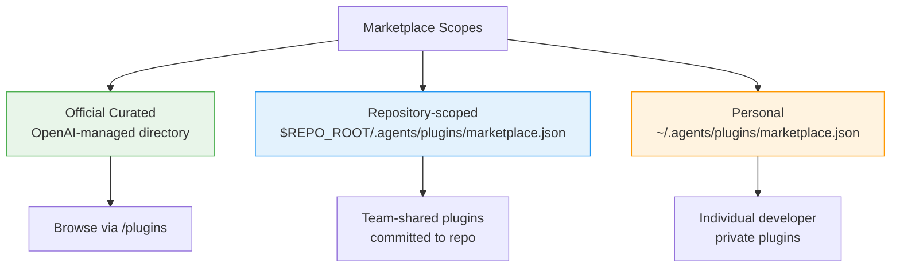
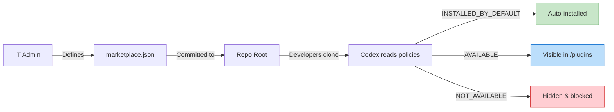

# Codex Marketplace: Plugin Distribution and the Plugin Marketplace Add Command


---

OpenAI's plugin marketplace, launched on 27 March 2026[^1], transforms Codex from a standalone coding agent into an extensible platform. Plugins bundle skills, app integrations, and MCP server configurations into installable packages that work across the desktop app, CLI, and VS Code extension[^2]. With over 20 launch-day integrations from partners including Slack, Figma, Notion, and Sentry[^1], the marketplace introduces a distribution model that borrows from package managers whilst adding enterprise governance controls absent from competing tools.

This article covers the marketplace architecture, the CLI commands for plugin management, the `marketplace.json` configuration format, and enterprise policy controls — everything a senior developer needs to integrate plugins into team workflows.

## Plugin Architecture

A Codex plugin is a directory containing a manifest and optional component bundles. The only required file is `.codex-plugin/plugin.json`; everything else is optional[^3].

```
my-plugin/
├── .codex-plugin/
│   └── plugin.json          # required manifest
├── skills/                   # optional skill definitions
│   └── review-standards/
│       └── SKILL.md
├── .app.json                 # optional app integrations
├── .mcp.json                 # optional MCP server config
└── assets/                   # optional icons/screenshots
    ├── icon.svg
    └── screenshot-01.png
```

Plugins bundle three component types[^2]:

- **Skills** — reusable instruction sets defined in `SKILL.md` files that the agent discovers and executes on demand
- **Apps** — external service connections (GitHub, Slack, Google Drive, Gmail) that authenticate via OAuth or API tokens
- **MCP servers** — Model Context Protocol services providing additional tools and shared context

This tripartite structure means a single plugin can wire up an MCP server, register authentication flows, and provide skills that orchestrate both — without requiring the user to configure anything manually.

## The Plugin Manifest

The `plugin.json` manifest declares metadata and pointers to bundled components[^3]:

```json
{
  "name": "code-review-standards",
  "version": "2.1.0",
  "description": "Enforce team code review standards with configurable rulesets",
  "author": "acme-corp",
  "license": "MIT",
  "skills": "./skills/",
  "mcpServers": "./.mcp.json",
  "apps": "./.app.json",
  "displayName": "Code Review Standards",
  "shortDescription": "Automated code review against team standards",
  "category": "Code Quality",
  "capabilities": ["code-review", "linting", "standards-enforcement"],
  "websiteURL": "https://github.com/acme-corp/codex-review-standards",
  "privacyPolicyURL": "https://acme-corp.dev/privacy"
}
```

Key constraints: the `name` field must be stable kebab-case (Codex uses it as the plugin identifier), and all paths must be relative to the plugin root, starting with `./`[^3].

## CLI Plugin Management

### Browsing and Installing

In the CLI, the `/plugins` slash command opens the plugin browser to search and install curated plugins[^2]. For plugins distributed through Git-hosted marketplaces, the workflow uses two commands:

```bash
# Step 1: Register a marketplace source
/plugin marketplace add openai/codex-plugin-cc

# Step 2: Install a specific plugin from that marketplace
/plugin install codex@openai-codex

# Step 3: Reload to activate
/reload-plugins
```

The marketplace add command accepts GitHub `org/repo` references and supports version pinning with `@branch` or `#tag` suffixes[^4]:

```bash
# Pin to a specific branch
/plugin marketplace add callstackincubator/agent-skills@main

# Pin to a release tag
/plugin marketplace add acme-corp/codex-plugins#v2.1.0
```

### Verification and Status

After installation, plugins may expose setup commands. For example, the `codex-plugin-cc` plugin (which bridges Codex into Claude Code) provides[^4]:

```bash
/codex:setup      # verify installation and configuration
/codex:status     # monitor active and recent jobs
```

### Disabling and Uninstalling

Plugins can be disabled without removal via `~/.codex/config.toml`[^2]:

```toml
[plugins."gmail@openai-curated"]
enabled = false
```

To uninstall entirely, reopen the plugin details in the CLI browser and select "Uninstall plugin".

## Marketplace Configuration

Marketplaces are JSON catalogues that expose plugins to Codex. They can be scoped to three levels[^3]:



### The marketplace.json Format

A marketplace file declares a catalogue of available plugins with their sources and policies[^3]:

```json
{
  "name": "acme-team-plugins",
  "interface": {
    "displayName": "Acme Engineering Plugins"
  },
  "plugins": [
    {
      "name": "code-review-standards",
      "source": {
        "source": "local",
        "path": "./plugins/code-review-standards"
      },
      "policy": {
        "installation": "INSTALLED_BY_DEFAULT",
        "authentication": "ON_INSTALL"
      },
      "category": "Code Quality"
    },
    {
      "name": "slack-notifications",
      "source": {
        "source": "local",
        "path": "./plugins/slack-notifications"
      },
      "policy": {
        "installation": "AVAILABLE",
        "authentication": "ON_FIRST_USE"
      },
      "category": "Communication"
    }
  ]
}
```

Critical path rules: `source.path` must be relative to the marketplace root, must start with `./`, and must remain inside the marketplace root directory[^3]. This prevents path-traversal issues that could reference arbitrary filesystem locations.

### Scaffolding with the Plugin Creator

Rather than hand-crafting manifests, Codex ships a built-in `@plugin-creator` skill that scaffolds the directory structure, generates `plugin.json`, and creates a local marketplace entry for testing[^3]. This eliminates the boilerplate friction of getting a new plugin registered.

## Enterprise Governance

The marketplace's policy system maps directly to enterprise IT governance patterns. Each plugin entry in `marketplace.json` carries an `installation` policy with three states[^5][^6]:

| Policy | Behaviour | Enterprise Use Case |
|--------|-----------|-------------------|
| `INSTALLED_BY_DEFAULT` | Plugin is pre-installed for all users | Standard tooling rollout |
| `AVAILABLE` | Plugin appears in browser but requires manual install | Approved optional tools |
| `NOT_AVAILABLE` | Plugin is hidden and blocked | Unapproved or restricted tools |

A separate `authentication` field controls when credentials are exchanged with third-party services[^5]:

- `ON_INSTALL` — authenticate immediately during installation
- `ON_FIRST_USE` — defer authentication until the plugin is actually invoked



This mirrors the allow-list patterns familiar from mobile device management (MDM) and IDE extension governance[^6]. By committing `marketplace.json` to the repository root, IT teams can version-control plugin policies alongside the code they govern.

### Practical Governance Workflow

For an organisation with 200+ developers, a typical deployment pattern looks like:

```json
{
  "name": "megacorp-approved",
  "interface": {
    "displayName": "MegaCorp Approved Plugins"
  },
  "plugins": [
    {
      "name": "internal-review-bot",
      "source": { "source": "local", "path": "./plugins/review-bot" },
      "policy": { "installation": "INSTALLED_BY_DEFAULT", "authentication": "ON_INSTALL" },
      "category": "Code Quality"
    },
    {
      "name": "slack-integration",
      "source": { "source": "local", "path": "./plugins/slack" },
      "policy": { "installation": "AVAILABLE", "authentication": "ON_FIRST_USE" },
      "category": "Communication"
    },
    {
      "name": "untrusted-community-tool",
      "source": { "source": "local", "path": "./plugins/community-x" },
      "policy": { "installation": "NOT_AVAILABLE" },
      "category": "Experimental"
    }
  ]
}
```

The review bot is mandatory infrastructure; Slack is opt-in for teams that want it; the community tool is explicitly blocked pending security review.

## Comparison with Competing Ecosystems

The Codex plugin marketplace enters a space with established alternatives:

| Feature | Codex Marketplace | Claude Code Skills | Cursor Extensions |
|---------|------------------|-------------------|-------------------|
| Distribution | Git repos + JSON catalogues | Git repos + `/plugin marketplace add` | Built-in extension store |
| Enterprise policy | `INSTALLED_BY_DEFAULT` / `AVAILABLE` / `NOT_AVAILABLE` | No built-in policy tiers | Limited admin controls |
| Component bundling | Skills + Apps + MCP servers | Skills + MCP servers | Extensions |
| Self-serve publishing | Coming soon[^5] | Available | Available |
| Offline/air-gapped | Local marketplace.json | Local plugin repos | Limited |

Codex's JSON-based policy system is its differentiator for enterprise adoption. Claude Code's skill ecosystem (which, notably, can run Codex as a plugin via `codex-plugin-cc`[^4]) offers a more open distribution model but lacks the tiered governance controls that enterprise security teams require.

⚠️ Self-serve publishing to the official Codex Plugin Directory is not yet available as of April 2026. OpenAI's documentation states this is "coming soon"[^3].

## Current Limitations

- **No official directory publishing** — distribution is currently limited to Git-hosted and local marketplaces[^3]
- **Plugin management UI** — still described as "in development" in the official documentation[^3]
- **No dependency resolution** — plugins cannot declare dependencies on other plugins
- **Cache reliability** — v0.119 included fixes for "more reliable plugin cache refreshes", suggesting earlier instability[^7]

## Getting Started

For teams looking to adopt the marketplace today:

1. **Create a repo-scoped marketplace** — add `.agents/plugins/marketplace.json` to your repository
2. **Scaffold a plugin** — use the `@plugin-creator` skill inside Codex to generate the boilerplate
3. **Set policies** — mark essential plugins as `INSTALLED_BY_DEFAULT`, optional ones as `AVAILABLE`
4. **Commit and distribute** — the marketplace file travels with the repo, so every clone gets the same plugin configuration
5. **Iterate** — use `/plugin marketplace add` in the CLI to test external marketplace sources before committing them

## Citations

[^1]: [OpenAI Launches Plugin Marketplace for Codex with Enterprise Controls — WinBuzzer, 31 March 2026](https://winbuzzer.com/2026/03/31/openai-launches-plugin-marketplace-codex-enterprise-controls-xcxwbn/)
[^2]: [Plugins — Codex, OpenAI Developers Documentation](https://developers.openai.com/codex/plugins)
[^3]: [Build Plugins — Codex, OpenAI Developers Documentation](https://developers.openai.com/codex/plugins/build)
[^4]: [openai/codex-plugin-cc — GitHub Repository](https://github.com/openai/codex-plugin-cc)
[^5]: [OpenAI adds plugin system to Codex to help enterprises govern AI coding agents — InfoWorld](https://www.infoworld.com/article/4151214/openai-adds-plugin-system-to-codex-to-help-enterprises-govern-ai-coding-agents.html)
[^6]: [OpenAI Introduces Plugin Feature for Codex for Enterprise AI Coding Governance — MLQ.ai](https://mlq.ai/news/openai-introduces-plugin-feature-for-codex-for-enterprise-ai-coding-governance/)
[^7]: [Codex Changelog — OpenAI Developers Documentation](https://developers.openai.com/codex/changelog)
