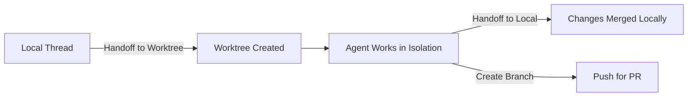
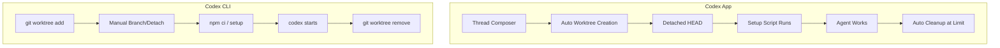

# Codex CLI Worktree Lifecycle: App vs CLI Worktree Management


---

Running multiple Codex agents in parallel is one of the most powerful patterns available to developers today, but it requires each agent to have its own isolated copy of the codebase. Git worktrees provide that isolation without the overhead of full clones[^1]. However, the Codex *App* and the Codex *CLI* handle worktree creation, lifecycle, and cleanup in fundamentally different ways. This article maps both approaches, highlights the gaps, and offers practical patterns for managing worktrees at scale.

## How Git Worktrees Work Under the Hood

A git worktree is a linked checkout that shares the parent repository's `.git` object store. Each worktree gets its own `HEAD`, its own index, and its own working tree, but commits, branches, and remotes are shared[^2]. This makes worktrees far cheaper than full clones — creating one is essentially free on copy-on-write filesystems like APFS.

The critical constraint: Git prevents the same branch from being checked out in more than one worktree simultaneously[^3]. Codex sidesteps this by defaulting to detached `HEAD` state for managed worktrees.

## Codex App: Managed Worktree Lifecycle

The Codex App (desktop application) treats worktrees as a first-class primitive. When you select **Worktree** in the thread composer, the app handles everything automatically[^3].

### Creation

1. Select "Worktree" in the thread composer
2. Choose a base branch (main, feature, or current with uncommitted changes)
3. The app creates a checkout at `$CODEX_HOME/worktrees/` in detached `HEAD` state[^4]
4. Setup scripts run automatically if configured

The detached `HEAD` approach prevents branch namespace pollution — you only create named branches when you're ready to merge[^4].

### Two Worktree Types

The App distinguishes between two categories:

**Codex-managed worktrees** are lightweight and disposable. Each is typically dedicated to a single thread. If you hand a thread back to the same worktree later, Codex routes it there automatically[^3].

**Permanent worktrees** are created manually from the three-dot menu on a project in the sidebar. They persist independently, support multiple threads, and are never automatically deleted[^3].

### Cleanup Policies

The App's automatic cleanup system, introduced on 27 February 2026[^5], works as follows:

| Policy | Behaviour |
|--------|-----------|
| **Default retention** | Keeps the 15 most recent managed worktrees |
| **Configurable limit** | Adjustable in Settings → Worktrees |
| **Pinned protection** | Worktrees linked to pinned conversations are never deleted |
| **In-progress protection** | Active threads block deletion of their worktree |
| **Permanent immunity** | Permanent worktrees are excluded from automatic cleanup |
| **Snapshot on delete** | Before deletion, Codex saves a snapshot allowing later restoration[^3] |

Deletion triggers when a thread is archived or when the configured worktree limit is exceeded.

### Setup Scripts

The App supports automated environment setup via `.codex/setup.sh`, which runs after worktree creation[^4]:

```bash
#!/bin/bash
# .codex/setup.sh — runs in every new worktree
npm ci --prefer-offline
cp ../.env .env
```

This solves a common pain point: files matched by `.gitignore` (node_modules, `.env`, dist) don't exist in fresh worktrees and must be recreated[^4].

### The Handoff Mechanism

The App's **Handoff** feature moves threads between Local and Worktree environments, handling the necessary Git operations automatically. Note that files matching `.gitignore` patterns won't transfer during handoff[^3].



## Codex CLI: Manual Worktree Management

The CLI does not yet have built-in worktree orchestration. There is an open feature request (issue #12862) proposing `--worktree` and `--tmux` flags[^6], but as of April 2026 it remains unmerged. CLI users must manage worktrees manually using standard Git commands.

### Manual Workflow

```bash
# Create a worktree for a specific task
git worktree add ../feature-auth feature/authentication

# Navigate and start Codex
cd ../feature-auth
npm ci
codex

# When done, clean up
cd ..
git worktree remove ../feature-auth
git worktree prune
```

### Per-Worktree Codex Configuration

Each worktree can maintain its own `CODEX_HOME` for isolated session state[^7]:

```bash
export CODEX_HOME=~/worktrees/myproject/feature-auth/.codex
mkdir -p "$CODEX_HOME"
codex
```

A shell alias makes this automatic:

```bash
# Add to ~/.zshrc or ~/.bashrc
codex-wt() {
  local git_root
  git_root=$(git rev-parse --show-toplevel 2>/dev/null)
  if [ -n "$git_root" ]; then
    export CODEX_HOME="$git_root/.codex"
    mkdir -p "$CODEX_HOME"
  fi
  codex "$@"
}
```

### AGENTS.md Discovery Across Worktrees

Codex CLI searches for `AGENTS.md` files starting from `~/.codex/AGENTS.md` (global), then walks from the project root to the current directory[^7]. Each worktree can carry branch-specific instructions in its own `AGENTS.md`, which is particularly useful when different tasks require different coding standards or model hints.

## App vs CLI: Side-by-Side Comparison



| Capability | App | CLI |
|-----------|-----|-----|
| Automatic creation | ✅ Thread composer | ❌ Manual `git worktree add` |
| Detached HEAD default | ✅ | ❌ Must specify manually |
| Setup scripts | ✅ `.codex/setup.sh` | ❌ Run manually or via alias |
| Automatic cleanup | ✅ Configurable retention | ❌ Manual `git worktree remove` |
| Snapshot before delete | ✅ | ❌ |
| Per-worktree config | ✅ Automatic | ⚠️ Via `CODEX_HOME` env var |
| Parallel agents | ✅ Native | ⚠️ Manual orchestration |
| Branch lock handling | ✅ Detached HEAD | ⚠️ Must manage manually |

## Known Issues and Gotchas

### Orphaned Worktrees

The most commonly reported issue is stale worktrees blocking branch operations. When the App fails to clean up a temporary worktree, Git still recognises it, producing errors like:

```
fatal: 'main' is already used by worktree at '/private/tmp/codex-limit-mainfix'
```

The fix is manual cleanup[^8]:

```bash
git worktree list          # identify orphans
git worktree remove /path  # remove specific worktree
git worktree prune         # clean stale metadata
```

### Branch Assumption Bug

Codex App assumes a `main` branch exists when initialising worktrees. Repositories using `master` or other default branch names may see `fatal: invalid reference: main` errors[^9]. ⚠️ This issue was reported but there is no confirmed fix as of April 2026.

### Non-Linear Token Consumption

Running five parallel worktree agents does not consume exactly 5× the tokens of a single agent. Context overlap and repeated file reads mean consumption scales non-linearly[^4]. Monitor usage closely when parallelising.

### Untracked Files in Fresh Worktrees

Files in `.gitignore` don't transfer to new worktrees. The recommended solutions, in order of practicality[^4]:

1. **Setup scripts** — automate `npm ci`, `pip install`, and file copying
2. **Copy-on-write clones** — macOS APFS supports instant duplication
3. **Symlinks** — share `node_modules` only if all worktrees use identical dependency versions

## Bridging the Gap: CLI Worktree Wrapper

Until the `--worktree` flag lands in the CLI, a wrapper script provides App-like convenience:

```bash
#!/bin/bash
# codex-worktree.sh — App-like worktree management for CLI
set -euo pipefail

WORKTREE_DIR="${CODEX_WORKTREE_ROOT:-.codex/worktrees}"
TASK_NAME="${1:?Usage: codex-worktree.sh <task-name> [prompt]}"
PROMPT="${2:-}"
WORKTREE_PATH="$WORKTREE_DIR/$TASK_NAME"

mkdir -p "$WORKTREE_DIR"

if [ ! -d "$WORKTREE_PATH" ]; then
  git worktree add --detach "$WORKTREE_PATH" HEAD
  # Run setup if it exists
  [ -f .codex/setup.sh ] && (cd "$WORKTREE_PATH" && bash "$(git rev-parse --show-toplevel)/.codex/setup.sh")
fi

export CODEX_HOME="$WORKTREE_PATH/.codex"
mkdir -p "$CODEX_HOME"

cd "$WORKTREE_PATH"
if [ -n "$PROMPT" ]; then
  codex "$PROMPT"
else
  codex
fi
```

Usage mirrors the proposed `--worktree` flag:

```bash
./codex-worktree.sh fix-login "investigate failing CI in auth module"
```

## Conclusion

The Codex App provides a polished, managed worktree lifecycle with automatic creation, cleanup, and snapshot preservation. The CLI requires manual orchestration but offers more control. For teams running parallel agents at scale, investing in a wrapper script or waiting for the native `--worktree` flag (issue #12862[^6]) is worthwhile. Whichever approach you use, the fundamentals remain the same: isolate agents, automate setup, and prune aggressively.

## Citations

[^1]: [Git Worktrees for AI Coding Agents: A Complete Guide — Nimbalyst](https://nimbalyst.com/blog/git-worktrees-for-ai-coding-agents-complete-guide/)
[^2]: [Codex App Worktrees Explained: How Parallel Agents Avoid Git Conflicts — Verdent Guides](https://www.verdent.ai/guides/codex-app-worktrees-explained)
[^3]: [Worktrees — Codex App — OpenAI Developers](https://developers.openai.com/codex/app/worktrees)
[^4]: [Codex App Worktrees Explained — Verdent Guides](https://www.verdent.ai/guides/codex-app-worktrees-explained)
[^5]: [Changelog — Codex — OpenAI Developers](https://developers.openai.com/codex/changelog)
[^6]: [CLI: add --worktree and --tmux flags for one-command isolated sessions — Issue #12862 — openai/codex](https://github.com/openai/codex/issues/12862)
[^7]: [How to Use Git Worktrees with OpenAI Codex CLI — Inventive HQ](https://inventivehq.com/knowledge-base/openai/how-to-use-git-worktrees)
[^8]: [Desktop app leaves stale temp worktree and blocks switching back to main — Issue #14575 — openai/codex](https://github.com/openai/codex/issues/14575)
[^9]: [Worktree setup fails when repo has no main branch — Issue #12346 — openai/codex](https://github.com/openai/codex/issues/12346)
