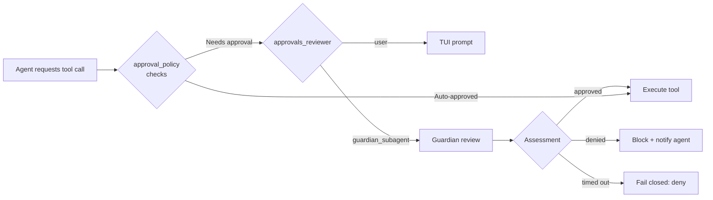
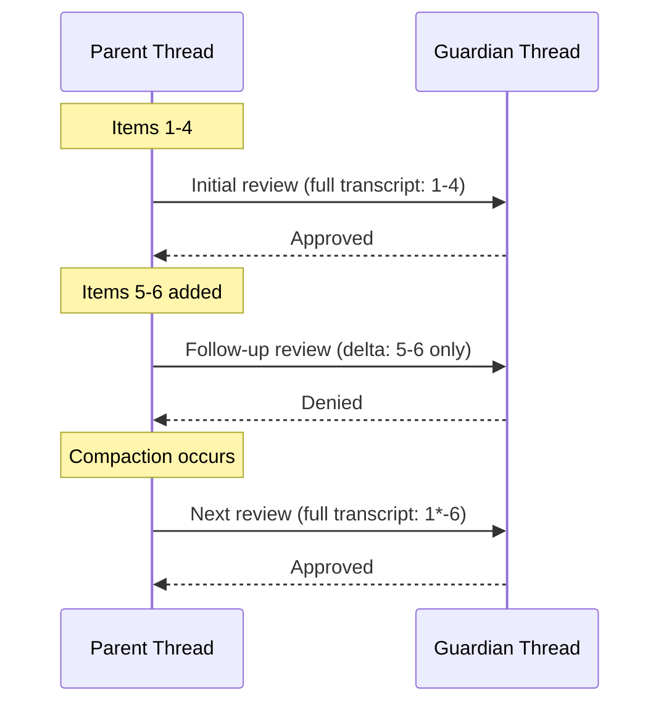
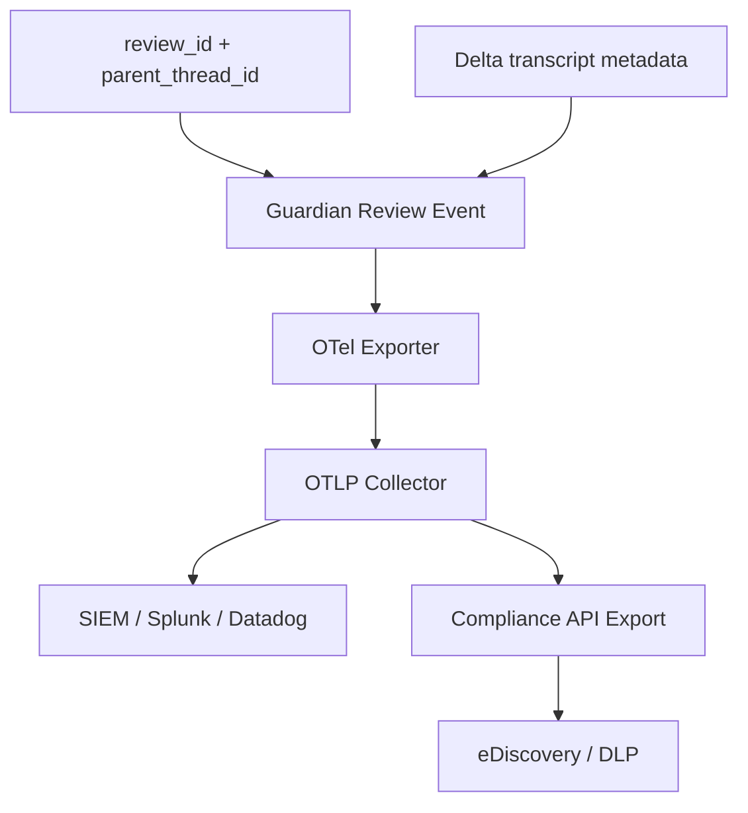

# Guardian Review IDs, Timeouts and Delta Transcripts: Enterprise Audit-Ready Governance


Codex CLI v0.119 and v0.120 shipped a trio of guardian improvements that transform the experimental Smart Approvals feature from a developer convenience into an enterprise-grade audit surface. Stable review IDs[^1], delta transcript transmission[^2], and parent thread tracking[^3] — together with the new guardian analytics schema[^4] — give compliance teams the identifiers, efficiency, and hierarchical context they need to wire guardian decisions into production governance pipelines.

This article breaks down each change, shows how to configure them, and maps the resulting telemetry onto OpenTelemetry audit workflows.

## What Is the Guardian?

The guardian is a carefully prompted reviewer subagent that routes eligible approval requests through a risk-based decision framework before approving or denying them[^5]. Introduced in PR #13860 and merged on 13 March 2026, it sits between the agent's tool-call intent and the sandbox execution layer[^5].

When `features.smart_approvals` is enabled, every command execution, file change, network call, and MCP tool invocation is intercepted. Instead of prompting the user, Codex delegates the approval decision to the guardian subagent, which assesses risk and returns a structured verdict containing a risk score, risk level, and rationale[^5].



### Enabling the Guardian

The guardian is gated behind two independent controls[^6]:

```toml
# ~/.codex/config.toml

[features]
smart_approvals = true          # UI gate — surfaces /experimental toggle

# Runtime control — who reviews approval requests
approvals_reviewer = "guardian_subagent"   # or "user" (default)

# The guardian works best with on-request policy
approval_policy = "on-request"
sandbox_mode = "workspace-write"
```

The `approval_policy` determines *when* approval is required; `approvals_reviewer` determines *who* reviews the request[^5]. These are intentionally orthogonal — teams can enforce strict approval policies while still routing reviews through the guardian for speed.

## Stable Review IDs (PR #17298)

### The Problem

Before v0.120, guardian rejection state keyed off `target_item_id` — the identifier of the tool call being reviewed[^1]. This proved insufficient for two reasons:

1. **Multiple execve calls within a single shell command** can trigger separate guardian reviews, all sharing the same target item ID[^1].
2. **Network policy reviews** lack any target item ID entirely, since the review concerns a network call rather than a command execution[^1].

### The Solution

PR #17298, merged on 10 April 2026, introduces `review_id` as a stable, unique identifier per guardian review[^1]. The key architectural change:

- Guardian rejection state now keys off `review_id` rather than `target_item_id`
- `target_item_id` remains available when a review maps to a concrete thread item, but is no longer overloaded as the lifecycle identifier
- An `AutoReviewDecisionSource` enum distinguishes `Agent`-initiated decisions from planned `User` overrides[^1]

### App-Server Events

The review ID surfaces through two app-server lifecycle events[^1]:

```
item/autoApprovalReview/started   → { threadId, turnId, review_id, targetItemId? }
item/autoApprovalReview/completed → { threadId, turnId, review_id, action }
```

These events enable external systems to track individual reviews from initiation to resolution — a prerequisite for SOC 2 and ISO 27001 audit trails where every approval decision must be individually addressable.

## Delta Transcripts (PR #17269)

### The Problem

Each guardian follow-up previously resent the entire parent conversation history[^2]. In lengthy sessions — common in enterprise monorepo refactoring — this meant repeatedly transmitting thousands of transcript items, wasting tokens and increasing latency.

### The Solution

PR #17269, merged on 10 April 2026, implements incremental delta transmission for guardian follow-ups[^2]. On each subsequent review within the same guardian thread:

1. The system tracks committed fork snapshots of the parent transcript
2. If the transcript is unmodified since the last review, only new items are sent as a `TRANSCRIPT DELTA`
3. If the thread has been compacted or rolled back, the system falls back to sending the complete transcript[^2]



The practical impact is significant for long-running sessions. A 200-item transcript with frequent guardian reviews previously retransmitted thousands of tokens per review; delta transmission reduces follow-up payloads to only the incremental items — typically fewer than ten.

## Parent Thread ID Tracking (PR #17249)

Guardian subagents run as child sessions with their own thread identifiers. Before PR #17249, the `codex_thread_initialized` analytics event for these child sessions emitted `parent_thread_id: null`[^3].

This was merged on 10 April 2026 and ensures guardian child sessions now properly capture the parent user conversation identifier[^3]. The change is critical for two enterprise scenarios:

1. **Hierarchical audit trails** — compliance teams can reconstruct the full chain from user prompt → agent action → guardian review → approval/denial
2. **Cost attribution** — guardian token spend can be attributed back to the originating user session for chargeback models

## Guardian Analytics Schema (PR #17055)

PR #17055, merged on 11 April 2026, adds a dedicated analytics event schema for guardian evaluations[^4]. The schema captures:

| Field | Type | Description |
|-------|------|-------------|
| `thread_id` | string | Guardian session thread |
| `turn_id` | string | Conversation turn within the guardian thread |
| `review_id` | string | Stable identifier linking to the review lifecycle |
| `target_item_id` | string? | Reviewed tool call item; `None` for network policy reviews |

This schema is foundational — the PR description notes "Just the analytics schema definition for guardian evaluations. No wiring done yet"[^4], signalling that full analytics pipeline integration is forthcoming. The `review_id` field directly references the stable identifiers from PR #17298, ensuring consistency across the event surface.

## Fail-Closed Semantics

When a guardian review fails — whether due to an API error, malformed reasoning items, or a timeout — the system denies the approval request[^7]. This fail-closed design is deliberate: in a security-critical approval gate, an ambiguous outcome must default to denial.

Issue #15341 documented an early example where an Azure Responses API error produced a guardian review "completed without an assessment payload"[^7]. The resolution (PR #15542) addressed the root cause — orphaned reasoning items in the response payload — but the fail-closed behaviour remained the correct safety default[^7].

For enterprise deployments, this means:

- **No silent pass-throughs** — if the guardian cannot reach a verdict, the tool call is blocked
- **Explicit error surfacing** — denied reviews include the failure rationale in the TUI
- **Audit completeness** — every review, including failures, generates trackable events

## Wiring Guardian to OpenTelemetry

Codex ships with built-in OpenTelemetry support[^8]. When configured, it emits structured events covering tool approval decisions (`codex.approval.requested`), tool results (`codex.tool.call`), and session traces[^9].

To pipe guardian events into an enterprise audit pipeline:

```toml
[otel]
environment = "production"
exporter = "otlp-http"
trace_exporter = "otlp-http"
log_user_prompt = false       # keep PII out of traces

[analytics]
enabled = true
```

With the guardian analytics schema in place, the telemetry flow becomes:



The Compliance API provides up to 30 days of exportable activity logs including prompt text, responses, timestamps, model identifiers, and token usage[^10]. Combined with guardian review events, this gives compliance teams a complete chain of custody for every agentic action.

## Enterprise Deployment Checklist

For teams rolling out guardian-based governance:

1. **Enable smart approvals** in managed configuration (`requirements.toml`) to enforce guardian review across the organisation[^6]
2. **Set `approvals_reviewer = "guardian_subagent"`** at the project level via `.codex/config.toml`
3. **Configure OpenTelemetry export** to your SIEM platform — SigNoz, Coralogix, and Datadog all have documented Codex integrations[^8][^11]
4. **Connect the Compliance API** to your existing eDiscovery and DLP workflows[^10]
5. **Monitor for fail-closed denials** — filter OTel events where guardian assessments lack a payload to catch API reliability issues early
6. **Use granular approval policies** to keep interactive prompts for high-risk categories while letting the guardian handle routine approvals:

```toml
approval_policy = { granular = {
  sandbox_approval = true,
  rules = true,
  mcp_elicitations = true,
  request_permissions = false,
  skill_approval = false
} }
```

## What's Next

The guardian analytics schema (PR #17055) was explicitly shipped without wiring[^4], indicating that full analytics pipeline integration — likely including dashboard widgets and Compliance API guardian event exports — is imminent. The `AutoReviewDecisionSource` enum's planned `User` variant[^1] will enable human override tracking, completing the audit picture for mixed human-agent approval workflows.

⚠️ The guardian remains experimental and is off by default. The `features.smart_approvals` flag is a UI gate only and does not auto-enable guardian review at the runtime level[^5]. Enterprise teams should test thoroughly in staging before enforcing via managed configuration.

## Citations

[^1]: [PR #17298 — fix(guardian, app-server): introduce guardian review ids](https://github.com/openai/codex/pull/17298), merged 10 April 2026.
[^2]: [PR #17269 — feat(guardian): send only transcript deltas on guardian followups](https://github.com/openai/codex/pull/17269), merged 10 April 2026.
[^3]: [PR #17249 — adding parent_thread_id in guardian](https://github.com/openai/codex/pull/17249), merged 10 April 2026.
[^4]: [PR #17055 — feat(analytics): add guardian review event schema](https://github.com/openai/codex/pull/17055), merged 11 April 2026.
[^5]: [PR #13860 — Add Smart Approvals guardian review across core, app-server, and TUI](https://github.com/openai/codex/pull/13860), merged 13 March 2026.
[^6]: [Codex Configuration Reference — features.smart_approvals](https://developers.openai.com/codex/config-reference), accessed 11 April 2026.
[^7]: [Issue #15341 — Automatic approval review failed: guardian review completed without an assessment payload](https://github.com/openai/codex/issues/15341), closed 23 March 2026.
[^8]: [SigNoz — OpenAI Codex Observability & Monitoring with OpenTelemetry](https://signoz.io/docs/codex-monitoring/), accessed 11 April 2026.
[^9]: [Codex Advanced Configuration — OpenTelemetry](https://developers.openai.com/codex/config-advanced), accessed 11 April 2026.
[^10]: [Codex Enterprise Governance — Compliance API](https://developers.openai.com/codex/enterprise/governance), accessed 11 April 2026.
[^11]: [Coralogix — Codex CLI Integration](https://coralogix.com/docs/integrations/ai-observability/codex-cli/), accessed 11 April 2026.
