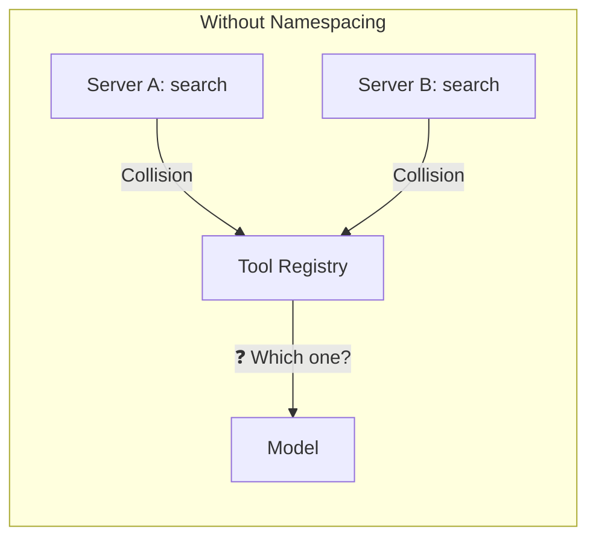
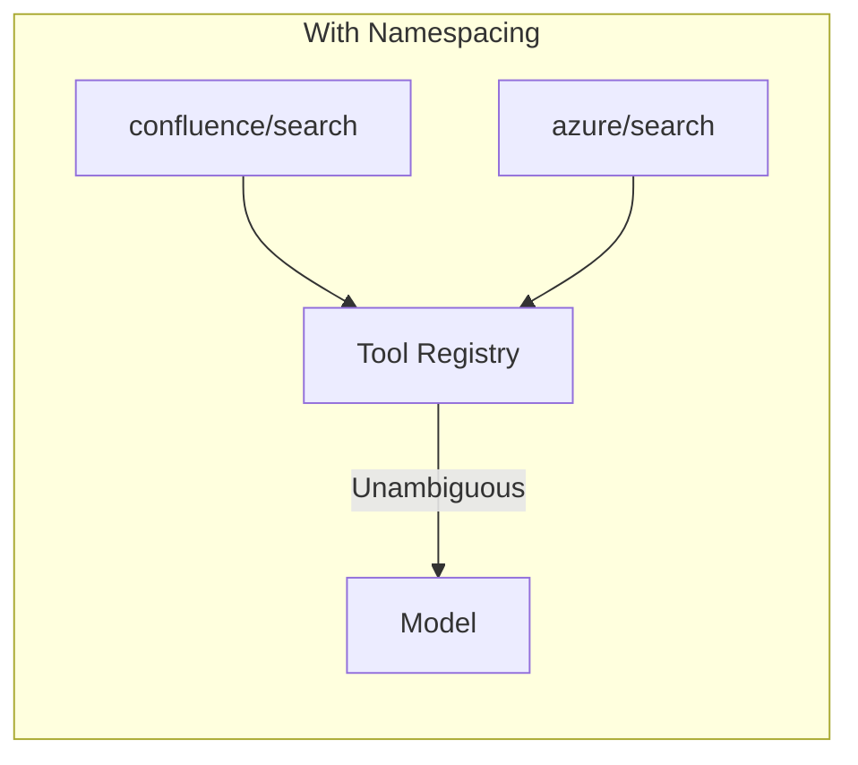
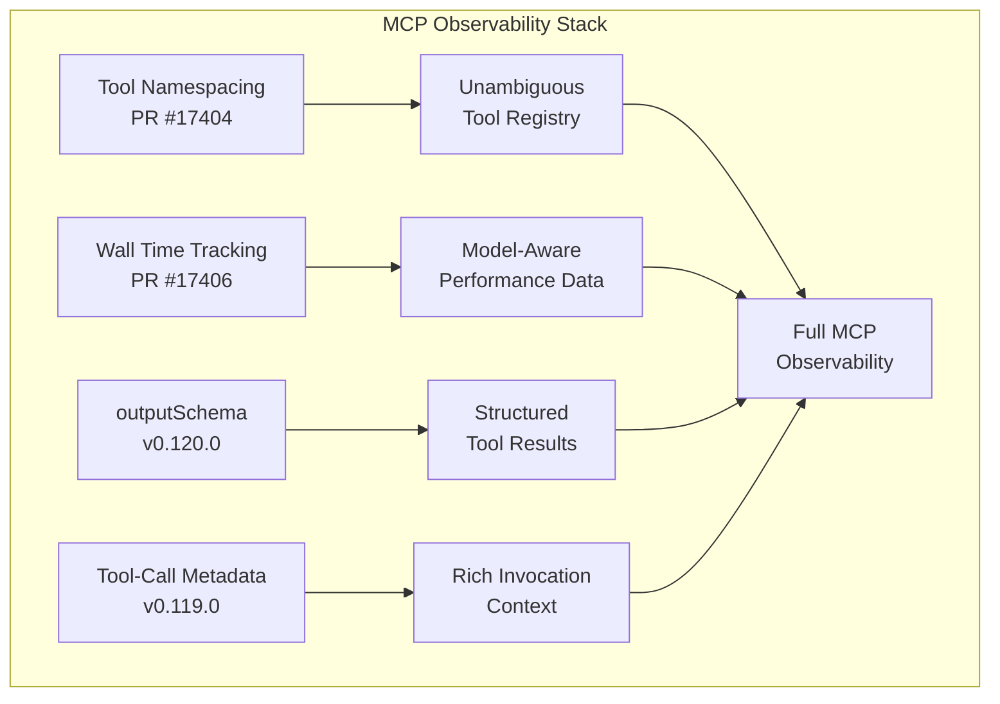

# MCP Tool Namespacing and Wall Time Tracking in Codex CLI


As Codex CLI users connect more MCP servers to their workflows — from Figma and Chrome DevTools to custom internal tooling — the risk of tool name collisions grows proportionally. Two open pull requests against the Codex CLI repository, [#17404](https://github.com/openai/codex/pull/17404) (tool namespacing) and [#17406](https://github.com/openai/codex/pull/17406) (wall time tracking), address this head-on. This article examines the collision problem, how Codex CLI is solving it, and what wall time visibility means for MCP performance tuning.

## The Tool Name Collision Problem

MCP operates with a flat, global namespace for tool registration [^1]. When a client connects to multiple servers, each server advertises its tools by name — and those names must be unique across the entire tool registry. If two servers both expose a tool called `search`, the client has a conflict it cannot safely resolve.

This is not a theoretical concern. The MCP community GitHub discussion on tool name resolution confirms there is currently no official mechanism for handling duplicate tool names across servers [^2]. Cursor works around it by prefixing tools as `mcp_<server>_<tool_name>` [^3]. The OpenAI Agents SDK raises a `DuplicateToolError` when it encounters collisions [^4]. Other frameworks simply pick whichever server connected first — creating a "confused deputy" scenario where the LLM's tool call silently routes to the wrong implementation [^5].



The security implications are non-trivial. The Vulnerable MCP Project rates tool name collision as a medium-severity vulnerability (6/10), noting that an attacker registering a tool with an identical name to a legitimate one can intercept sensitive parameters and manipulate results [^5].

## How Codex CLI Solves It: PR #17404

PR #17404, opened by sayan-oai, is titled "register all MCP tools with namespace" [^6]. The core issue it fixes: MCP tools returned by `tool_search` (deferred tools) were registered in Codex CLI's internal `ToolRegistry` with a different format than directly available tools. This inconsistency meant a tool might be accessible via one code path but not another.

The fix standardises all MCP tool registration to use a `namespace/name` format, where the namespace corresponds to the MCP server identifier from `config.toml`. Key changes include:

- A new `ToolRegistryPlanMcpTool` struct for handling MCP tool metadata consistently
- Updates to `mcp_connection_manager.rs` to enhance the `resolve_tool_info` method
- Updated tool router logic to properly handle namespaced lookups

### What This Means in Practice

Consider a `config.toml` connecting two servers that both expose a `search` tool:

```toml
[mcp_servers.confluence]
command = "npx"
args = ["-y", "@anthropic/confluence-mcp"]

[mcp_servers.azure]
url = "https://mcp.azure.internal/mcp"
bearer_token_env_var = "AZURE_MCP_TOKEN"
```

Without namespacing, the second `search` tool registration collides with the first. With the namespacing change, the tools register as `confluence/search` and `azure/search` internally. The model sees both tools distinctly and can invoke the correct one.



### Security Consideration

One reviewer raised a pertinent concern: the `js_repl`-only guard — a security boundary that restricts certain operations to the built-in JavaScript REPL tool — could potentially be bypassed by namespaced MCP tools [^6]. This is an active discussion point on the PR, and worth monitoring if you maintain custom MCP servers with elevated permissions.

## Wall Time Tracking: PR #17406

PR #17406, authored by pakrym-oai, adds MCP tool wall time to the model's output [^7]. "Wall time" here means the elapsed real-world time for a tool call — from the moment Codex CLI dispatches the request to the MCP server until it receives the response.

The PR has been approved by reviewers and includes several related changes:

- Inlined MCP code-mode serialisation for cleaner output formatting
- Simplified MCP truncation logic
- Made tests key-order independent for robustness
- Added app-server MCP wall time test coverage

### Why Wall Time Matters

Currently, when the model calls an MCP tool, it has no visibility into how long that call took. A `search` tool that returns in 200ms and one that takes 15 seconds look identical in the conversation history. This creates problems:

1. **The model cannot adapt its strategy** — it might repeatedly call a slow tool when a faster alternative exists
2. **Timeout debugging is opaque** — when a tool hits the `tool_timeout_sec` limit (default 60 seconds [^8]), the model lacks context about why
3. **Performance regression detection** — without timing data, gradual degradation of an MCP server goes unnoticed

By surfacing wall time in the model output, the model can reason about tool performance. If `confluence/search` consistently takes 8 seconds while `azure/search` returns in 500ms, the model has the information to prefer the faster option when both could satisfy a query.

### Configuring Timeouts Alongside Wall Time

Wall time tracking pairs naturally with the existing timeout configuration. You can tune per-server timeouts in `config.toml`:

```toml
[mcp_servers.slow_api]
url = "https://internal.example.com/mcp"
startup_timeout_sec = 30
tool_timeout_sec = 120

[mcp_servers.fast_cache]
command = "npx"
args = ["-y", "@example/cache-mcp"]
tool_timeout_sec = 10
```

With wall time visible in the output, you can make informed decisions about these thresholds rather than guessing.

## The Broader MCP Performance Picture

These two PRs land alongside significant MCP improvements already shipped in Codex CLI 0.119.0 and 0.120.0:

- **Tool-call metadata** — richer context attached to each MCP invocation [^9]
- **`outputSchema` support** — code-mode tool declarations now include MCP output schema details for more precise typing of structured results [^10]
- **Startup improvements** — hyphenated server names list tools correctly, `/mcp` avoids slow full inventory probes, and disabled servers skip auth probing [^9]

Together, these features transform MCP from a "plug it in and hope" integration into something you can properly observe, debug, and optimise.



## What to Do Now

Both PRs are open as of 11 April 2026. PR #17406 (wall time) is approved and awaiting merge [^7]; PR #17404 (namespacing) is under active review with security considerations being discussed [^6]. ⚠️ The exact API surface and internal format may change before merge.

In the meantime:

- **Audit your tool names** — run `/mcp` in Codex CLI to list all connected tools and check for duplicates
- **Use `enabled_tools` and `disabled_tools`** — if two servers expose identically named tools, use the existing allowlist/denylist mechanism as a stopgap [^8]:

```toml
[mcp_servers.confluence]
enabled_tools = ["search", "get_page"]

[mcp_servers.azure]
disabled_tools = ["search"]
```

- **Set explicit timeouts** — don't rely on the 60-second default if you know a server is slow or fast
- **Watch the PRs** — once merged, these features will likely ship in the next minor Codex CLI release

## Citations

[^1]: [MCP Tool Name Collisions — The Vulnerable MCP Project](https://vulnerablemcp.info/vuln/tool-name-collisions.html)
[^2]: [Tool name resolution when multiple MCP servers have same tool name — GitHub Discussion #291](https://github.com/orgs/modelcontextprotocol/discussions/291)
[^3]: [MCP Tool Routing Ignores Server Name — Cursor Community Forum](https://forum.cursor.com/t/mcp-tool-routing-ignores-server-name-when-multiple-servers-expose-same-tool-name/148059)
[^4]: [Duplicate tool names across MCP servers cause errors — openai/openai-agents-python #464](https://github.com/openai/openai-agents-python/issues/464)
[^5]: [Tool Name Collisions — The Vulnerable MCP Project](https://vulnerablemcp.info/vuln/tool-name-collisions.html)
[^6]: [PR #17404: Register all MCP tools with namespace — openai/codex](https://github.com/openai/codex/pull/17404)
[^7]: [PR #17406: Add MCP tool wall time to model output — openai/codex](https://github.com/openai/codex/pull/17406)
[^8]: [Model Context Protocol — Codex CLI Documentation](https://developers.openai.com/codex/mcp)
[^9]: [Codex Changelog — CLI 0.119.0](https://developers.openai.com/codex/changelog)
[^10]: [Codex Changelog — CLI 0.120.0, PR #17210](https://developers.openai.com/codex/changelog)
