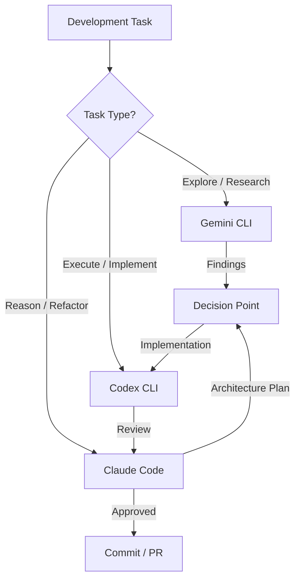

# The Three-CLI Toolkit: Running Codex CLI, Claude Code, and Gemini CLI as a Unified Development Stack


## Why Three CLIs?

The terminal AI coding agent market has consolidated around three big-lab native tools: OpenAI's Codex CLI, Anthropic's Claude Code, and Google's Gemini CLI[^1]. Each is optimised for a different part of the development cycle. Running all three is not extravagance — it is the emerging pattern among practitioners who have discovered that no single tool dominates every task.

TokenCalculator's April 2026 rankings place Claude Code and Codex CLI as Tier 1 leaders, with Gemini CLI in Tier 3 but improving[^2]. The interesting insight is not which tool "wins" — it is that experienced developers are increasingly routing tasks to whichever tool handles them best, rather than forcing everything through a single agent.

## The Decision Framework: Which CLI for Which Task

The three tools occupy distinct niches defined by their architectural strengths.

### Codex CLI: The Executor

Codex CLI's Rust rewrite prioritises speed and token efficiency[^3]. Its OS-level sandbox (Seatbelt on macOS, Landlock on Linux, restricted tokens on Windows) makes it the safest tool for autonomous execution. The subagent system with TOML-defined agents and path-based addressing (`/root/agent_a`) enables structured parallel work within a single session[^4].

**Best for:** Iterative implementation loops, parallel subagent execution, CI/CD integration via `codex exec`, autonomous background tasks, and any workflow where you want the agent to *do the work* rather than discuss it.

### Claude Code: The Reasoner

Claude Code leads on SWE-bench Verified at 80.8%[^5] and excels at complex multi-file refactoring, implicit convention understanding, and architectural reasoning. Agent Teams (shipped with Opus 4.6) provide peer-to-peer inter-agent communication via a mailbox pattern[^6].

**Best for:** Complex refactoring across multiple files, architectural decisions, nuanced code review requiring deep reasoning, and tasks where understanding project conventions matters more than raw speed.

### Gemini CLI: The Explorer

Gemini CLI's standout feature is its 1 million token context window — roughly five times larger than Claude Code's 200K and eight times larger than Codex CLI's 128K effective window[^7]. Combined with a genuinely free tier (1,000 requests per day with a Google account)[^8] and native multimodal support for PDFs, screenshots, and images, Gemini CLI is the ideal reconnaissance tool.

**Best for:** Large-codebase exploration, visual analysis of UI screenshots and wireframes, research with Google Search grounding, PDF and documentation analysis, and any task where you need to ingest a massive amount of context before acting.



## The Workflow Patterns

### Pattern 1: Explore → Plan → Execute

The most common three-CLI workflow follows a natural progression:

1. **Gemini CLI explores** — load the entire codebase (or a substantial portion) into Gemini's 1M context window, ask broad questions about architecture, dependencies, and impact analysis
2. **Claude Code plans** — take Gemini's findings and ask Claude to design the implementation strategy, leveraging its superior reasoning for architectural decisions
3. **Codex CLI executes** — hand the plan to Codex for implementation, using subagents for parallel file changes and the sandbox for safe autonomous execution

This pattern maps neatly to cost tiers: Gemini's free tier absorbs the exploratory work, Claude Code handles the high-value reasoning, and Codex CLI's token efficiency keeps implementation costs predictable[^9].

### Pattern 2: Spawning Across CLIs

A practical integration pattern involves spawning one CLI from within another. The `paddo.dev` hybrid workflow demonstrates this by creating Claude Code slash commands that invoke Gemini CLI for specific tasks[^10]:

```bash
# Wrapper script: ~/.claude/bin/gemini-clean
#!/bin/bash
gemini -m gemini-3.1-flash-image-preview \
  -s "You are a visual analysis specialist." \
  -p "$1" 2>/dev/null | sed '/^$/d'
```

The slash command captures a screenshot via `pngpaste`, routes it to Gemini for visual analysis, then applies the results within Claude Code's session. The same principle works for routing tasks from Codex CLI to Claude Code via `codex exec` or shell commands.

### Pattern 3: Cross-Validation

Running the same review task through multiple CLIs catches model-specific blind spots. Submit a PR diff to all three:

```bash
# Codex review (fast, token-efficient)
codex exec "Review this diff for bugs" < diff.patch

# Claude Code review (deep reasoning)
claude -p "Review this diff for architectural issues" < diff.patch

# Gemini review (broad context, free)
gemini -p "Review this diff against the full codebase" < diff.patch
```

Where two or more tools flag the same issue, confidence is high. Where they disagree, a human decision is warranted.

## Bridging Tools

Several community projects have emerged to formalise multi-CLI workflows.

### Claude Code Bridge (ccb)

Claude Code Bridge[^11] provides a split-pane terminal where Claude, Codex, Gemini, OpenCode, and Droid run simultaneously with lightweight async messaging. Each provider gets a dedicated daemon (`askd`, `caskd`, `gaskd`, `oaskd`) that auto-starts on first request and shuts down after 60 seconds of inactivity.

```bash
# Install and configure
./install.sh install
# Configure providers
echo "claude,codex,gemini" > .ccb/ccb.config

# Send tasks to specific providers
ask codex "Implement the user authentication module"
ask gemini "Analyse the full test suite for coverage gaps"
ask claude "Review the authentication module for security issues"
```

Session context persists per-project in `.ccb/history/`, and the `/continue` skill automatically attaches previous context when resuming.

### Claude-Code-Workflow

The `catlog22/Claude-Code-Workflow` project[^12] takes a JSON-driven approach to multi-agent orchestration across CLIs, defining cadence-team workflows where Gemini, Codex, and Claude each handle designated phases of a development pipeline.

### MCP as the Bridge Layer

All three CLIs support MCP (Model Context Protocol)[^13], making it the natural interoperability layer. A shared MCP server — for instance, one exposing your Jira board, database schema, or internal documentation — can be configured in all three tools simultaneously:

```toml
# Codex CLI config.toml
[mcp_servers.internal-docs]
command = "npx"
args = ["-y", "@company/docs-mcp-server"]

# Same server works in Claude Code and Gemini CLI
# via their respective MCP configuration files
```

This means context gathered by Gemini's exploration can be read by Codex's implementation agent through the same MCP resource URIs, without manual copy-paste.

## Cost Optimisation Across Three Tools

The three-CLI approach enables a tiered cost strategy:

| Tier | Tool | Cost | Use For |
|------|------|------|---------|
| Free | Gemini CLI | £0/month | Exploration, research, visual analysis |
| Standard | Codex CLI (Plus) | £16/month | Implementation, CI/CD, autonomous tasks |
| Premium | Claude Code (Pro) | £16–160/month | Complex reasoning, architecture, review |

The key insight: Gemini CLI's free tier absorbs 30–40% of typical development queries (exploration, documentation lookup, impact analysis) that would otherwise consume paid tokens on Codex or Claude Code[^14]. By routing tasks to the cheapest capable tool, a solo developer can maintain access to three frontier models for under £35/month.

For teams, the calculus shifts. Codex CLI's pay-as-you-go Codex-only seats (token-based billing, no fixed fee)[^15] pair well with Claude Code Max subscriptions for heavy users, while Gemini CLI's free tier remains the universal exploration layer.

## Practical Setup

### Step 1: Install All Three

```bash
# Codex CLI (requires Node.js 22+)
npm install -g @openai/codex

# Claude Code
npm install -g @anthropic-ai/claude-code

# Gemini CLI
npm install -g @anthropic-ai/gemini-cli  # or via Google's installer
```

### Step 2: Shared AGENTS.md

All three tools read `AGENTS.md` (or will soon — Claude Code currently uses `CLAUDE.md` with a symlink workaround)[^16]. Write one canonical `AGENTS.md` at your repository root and symlink where needed:

```bash
ln -s AGENTS.md CLAUDE.md
```

### Step 3: Shared MCP Servers

Configure your most-used MCP servers in all three tools. This ensures that whichever CLI you reach for, it has access to the same external context.

### Step 4: Task Routing Habit

Build the muscle memory:

- **"I need to understand this codebase"** → Gemini CLI
- **"I need to design how to change it"** → Claude Code
- **"I need to make the change"** → Codex CLI

## When One Tool Is Enough

Not every task warrants three CLIs. For straightforward implementation work, Codex CLI alone is sufficient. For a quick code review, Claude Code alone excels. The three-CLI pattern pays dividends on complex, multi-phase work — large refactors, new feature development across unfamiliar codebases, and projects where exploration and execution are distinct phases.

The terminal AI agent landscape is consolidating around these three tools for good reason: each reflects its parent company's core competence. Google's strength in search and multimodal understanding powers Gemini CLI's exploration capabilities. Anthropic's focus on reasoning and safety drives Claude Code's architectural insight. OpenAI's investment in speed and autonomous execution defines Codex CLI's implementation prowess[^17].

The practitioners who treat these as complementary rather than competing tools are shipping faster, spending less, and catching more bugs before they reach production.

## Citations

[^1]: Tembo, "The 2026 Guide to Coding CLI Tools: 15 AI Agents Compared," April 2026. [https://www.tembo.io/blog/coding-cli-tools-comparison](https://www.tembo.io/blog/coding-cli-tools-comparison)

[^2]: TokenCalculator, "Best AI IDE & CLI Tools April 2026: Claude Code Wins, Codex Catches Up," April 2026. [https://tokencalculator.com/blog/best-ai-ide-cli-tools-april-2026-claude-code-wins](https://tokencalculator.com/blog/best-ai-ide-cli-tools-april-2026-claude-code-wins)

[^3]: Effloow, "Terminal AI Coding Agents Compared 2026," April 2026. [https://effloow.com/articles/terminal-ai-coding-agents-compared-claude-code-gemini-cli-2026](https://effloow.com/articles/terminal-ai-coding-agents-compared-claude-code-gemini-cli-2026)

[^4]: OpenAI Codex CLI changelog, v0.117.0+ multi-agent v2 with path-based addressing. [https://developers.openai.com/codex/changelog](https://developers.openai.com/codex/changelog)

[^5]: Anthropic, Claude Code SWE-bench Verified score. [https://www.anthropic.com/research/swe-bench-sonnet](https://www.anthropic.com/research/swe-bench-sonnet)

[^6]: Anthropic Agent Teams documentation, shipped with Opus 4.6, February 2026.

[^7]: Morphllm, "Gemini CLI vs Codex CLI (2026): 1M Context Window vs Sandbox Execution." [https://www.morphllm.com/comparisons/gemini-cli-vs-codex](https://www.morphllm.com/comparisons/gemini-cli-vs-codex)

[^8]: Google, Gemini CLI free tier: 60 requests/minute, 1,000 requests/day. [https://developers.google.com/gemini-cli](https://developers.google.com/gemini-cli)

[^9]: DeployHQ, "Comparing Claude Code, OpenAI Codex, and Google Gemini CLI." [https://www.deployhq.com/blog/comparing-claude-code-openai-codex-and-google-gemini-cli](https://www.deployhq.com/blog/comparing-claude-code-openai-codex-and-google-gemini-cli)

[^10]: paddo.dev, "Hybrid AI Workflows: Spawning Gemini from Claude Code." [https://paddo.dev/blog/gemini-claude-code-hybrid-workflow/](https://paddo.dev/blog/gemini-claude-code-hybrid-workflow/)

[^11]: Claude Code Bridge (ccb), GitHub repository. [https://github.com/bfly123/claude_code_bridge](https://github.com/bfly123/claude_code_bridge)

[^12]: Claude-Code-Workflow, JSON-driven multi-agent framework. [https://github.com/catlog22/Claude-Code-Workflow](https://github.com/catlog22/Claude-Code-Workflow)

[^13]: Agentic AI Foundation (AAIF), MCP adopted by all three major providers under Linux Foundation governance, December 2025. [https://aaif.io/](https://aaif.io/)

[^14]: InventiveHQ, "Gemini CLI vs Claude Code vs Codex: Choosing the Right AI Coding CLI." [https://inventivehq.com/blog/gemini-vs-claude-vs-codex-comparison](https://inventivehq.com/blog/gemini-vs-claude-vs-codex-comparison)

[^15]: OpenAI, Codex-only pay-as-you-go seats announced April 3, 2026. [https://openai.com/index/introducing-upgrades-to-codex/](https://openai.com/index/introducing-upgrades-to-codex/)

[^16]: AGENTS.md as open standard under AAIF, 60,000+ projects, 25+ supported tools. [https://www.linuxfoundation.org/press/linux-foundation-announces-the-formation-of-the-agentic-ai-foundation](https://www.linuxfoundation.org/press/linux-foundation-announces-the-formation-of-the-agentic-ai-foundation)

[^17]: particula.tech, "Codex vs Claude Code: Which CLI Agent Wins for Your Workflow in 2026." [https://particula.tech/blog/codex-vs-claude-code-cli-agent-comparison](https://particula.tech/blog/codex-vs-claude-code-cli-agent-comparison)
