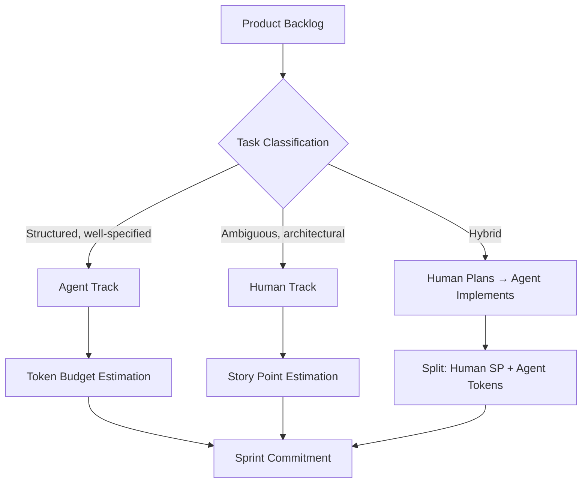
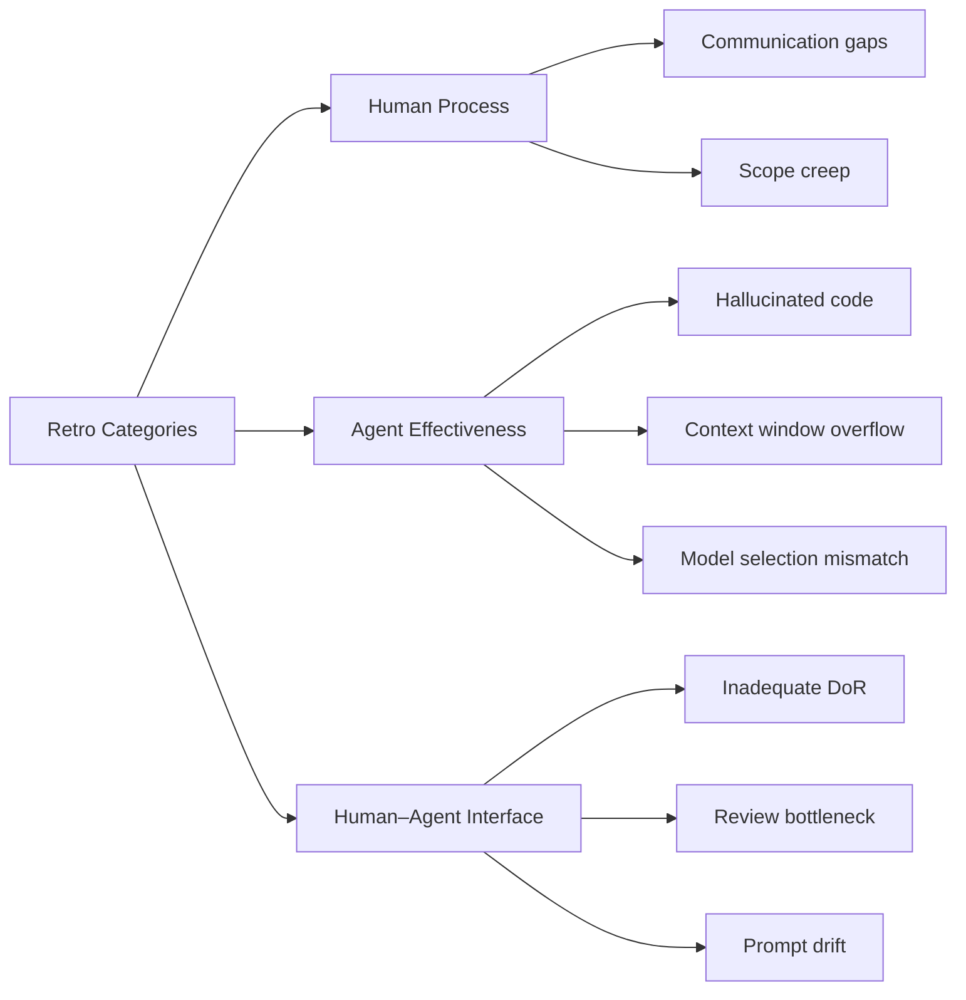
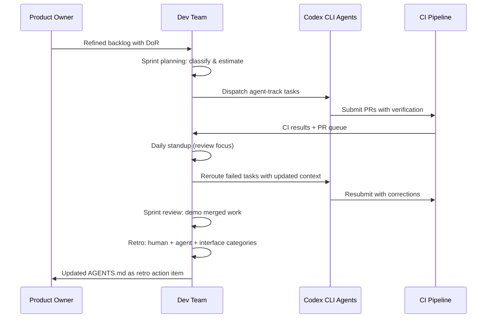

# Adapting Agile Ceremonies for AI Coding Agents: Sprint Planning, Standups, and Retros


---

When autonomous coding agents handle 40–60% of implementation work, the standard Scrum playbook breaks down. Story points lose their meaning, standups become status theatre, and retrospectives miss the most important failure modes. This article examines how to adapt each core Agile ceremony for teams where Codex CLI, Claude Code, and similar agents are first-class contributors — not just tools that developers happen to use.

## The Core Problem: Context Transfer

Every Agile ceremony exists to solve one problem: **context transfer** [^1]. Standups transfer status. Sprint planning transfers intent. Retros transfer learning. Human ceremonies evolved around human bandwidth limitations — short attention spans, lossy memory, and the overhead of switching between tasks.

AI agents have different constraints. They do not get tired, but they lose context between sessions [^1]. They execute rapidly, but they cannot negotiate scope with stakeholders. They produce code at scale, but they cannot self-assess whether the code solves the right problem. Adapting ceremonies means redesigning context transfer for a workforce that is part-human, part-machine.

## Sprint Planning: From Story Points to Task Routing

### Why Story Points Fail for Agents

Story points were designed to measure human cognitive load, uncertainty, and fatigue [^2]. An autonomous agent running on o3 does not experience cognitive fatigue, runs around the clock, and processes structured tasks with near-constant throughput [^2]. Assigning story points to agent work conflates two fundamentally different capacity models.

The 18th State of Agile Report found that 84% of teams use AI somewhere in their workflow, but only 41% have integrated it into their ceremonies in a coordinated way [^3]. Most teams are still bolting agent output onto human-shaped processes.

### The Two-Track Backlog

Before sprint planning begins, segment the backlog into two tracks:



**Agent Track** tasks are well-specified, have clear acceptance criteria, and map to capabilities the agent demonstrably handles: refactoring, test generation, boilerplate implementation, documentation updates, and data transformation [^4]. These tasks get **token budget estimates** rather than story points — forecast the API token consumption and compute time, not human effort [^2].

**Human Track** tasks retain traditional story point estimation: architectural decisions, security sign-offs, stakeholder negotiations, and strategic "why" decisions [^2].

**Hybrid tasks** — the most common category — split into a human planning phase and an agent implementation phase. The human writes the technical design; the agent executes it.

### Definition of Ready for Agent Tasks

A standard user story is insufficient context for an agent. The Definition of Ready for agent-routed tasks must include [^2]:

- **Data schemas** and type definitions the agent will touch
- **Negative constraints** — what the agent must *not* change
- **Verification commands** — how to confirm the task is done (e.g., `npm test`, `cargo clippy`)
- **Context file references** — which `AGENTS.md` or `CLAUDE.md` sections apply [^1]
- **API documentation** links for any external integrations

In Codex CLI terms, this maps directly to the four-element prompt structure from OpenAI's best practices: goal, context, constraints, and done criteria [^5].

### Capacity Planning: The Review Bottleneck

The critical constraint is not agent throughput — it is **human review bandwidth** [^2]. An agent can produce 50 pull requests in a day; a four-person team can review perhaps 15 thoroughly. Plan sprint capacity so that agent output never outpaces human review:

```
Agent capacity = min(compute_budget, human_review_bandwidth × review_ratio)
```

Teams that ignore this create a growing queue of unreviewed PRs, which is worse than having no agent at all — it is invisible technical debt accumulating behind a facade of velocity [^2].

## Standups: Reporting on Agent Work

### The Problem with Traditional Standups

A standard "what did you do yesterday, what will you do today, any blockers" format fails when half the work happened autonomously overnight. Developers end up either ignoring agent output or spending the entire standup narrating what their agents did.

### A Modified Standup Template

Structure standups around three questions per developer:

1. **What did I review and merge?** — The human's primary output is now validated, merged agent work.
2. **What is queued for agent execution?** — Tasks dispatched to Codex CLI automations [^6] or background worktrees.
3. **What needs human judgement?** — Blockers that require architectural decisions, scope negotiation, or security review.

For the agent work itself, surface status through tooling rather than verbal updates. Codex CLI's automation panel [^6] and the `codex-plugin-cc` status commands [^7] can generate a machine-readable summary:

```bash
# Quick status of overnight agent work
codex --status --format=summary

# Or via the cross-provider bridge in Claude Code
/codex:status
```

### Async Agent Standups

For distributed teams, consider an **async agent standup** — a daily automated summary posted to Slack or your project management tool. This is a natural extension of Codex CLI's automation feature, which supports scheduled tasks running in background worktrees [^6]:

```toml
# Example: Codex automation that posts daily agent status
[automations.daily-status]
schedule = "0 8 * * 1-5"
prompt = "Summarise all PRs opened by agents in the last 24 hours. Group by status: merged, pending review, changes requested, failed CI."
```

## Retrospectives: New Failure Categories

### Standard Retro Formats Miss Agent Failures

A "what went well / what didn't / action items" retro captures human process failures but misses the failure modes unique to agent-assisted development. Teams need additional categories:



### Agent-Specific Retro Questions

Add these to your standard retro format:

- **Prompt quality**: Did poorly specified tasks cause agent rework? Track the ratio of first-attempt acceptance to revision cycles.
- **Model routing**: Were expensive reasoning models (o3) used for tasks that o4-mini could handle? Codex CLI's dynamic model routing [^8] makes this a tuneable parameter, not a fixed cost.
- **Context drift**: Did long-running agent sessions produce increasingly off-target output? This signals the need for session boundaries or subagent decomposition [^9].
- **Review fatigue**: Did reviewers approve agent PRs without adequate scrutiny? Track defect escape rate from agent-generated code specifically.
- **AGENTS.md gaps**: Did the agent repeatedly make mistakes that a better `AGENTS.md` would have prevented? Treat `AGENTS.md` updates as retro action items [^5].

### Velocity Tracking: Blended Metrics

Traditional velocity charts become misleading when agent throughput inflates the numbers. Track two separate velocity streams:

| Metric | Human Track | Agent Track |
|--------|------------|-------------|
| **Throughput** | Story points completed | Tasks completed + tokens consumed |
| **Quality** | Defects per SP | Defects per task, first-pass acceptance rate |
| **Cost** | Developer hours | API spend (USD) |
| **Bottleneck** | Context switching | Review queue depth |

Report them together on the same sprint dashboard, but never sum them into a single velocity number. A sprint where "velocity doubled" means nothing if the entire increase came from agent-generated boilerplate that required zero architectural thought.

## Definition of Done: The Agent Extension

Extend your existing Definition of Done with agent-specific criteria:

1. **Code review by a human** — Agent-generated code requires the same review standard as human code. No exceptions.
2. **Cross-provider review** — For critical paths, use `codex-plugin-cc`'s adversarial review [^7] to have a second model review the first model's output.
3. **CI green** — Agents must run verification commands before submitting. Codex CLI supports this via `AGENTS.md` verification sections [^5].
4. **Context documented** — Any architectural decisions made during implementation are captured in comments or ADRs, not buried in agent chat logs.
5. **No phantom dependencies** — Verify the agent has not introduced libraries or APIs that were hallucinated rather than real [^10].

## Putting It Together: A Sprint Lifecycle with Agents



## Common Anti-Patterns

- **Counting agent PRs as developer productivity** — This incentivises dispatching trivial work to inflate metrics.
- **Skipping review for "simple" agent changes** — Agent errors cluster in edge cases and naming, exactly the areas humans skip when reviewing "simple" diffs.
- **Single-track velocity** — Blending human and agent throughput into one number makes sprint planning unreliable.
- **Agent standup theatre** — Developers narrating agent logs verbally wastes everyone's time. Automate status reporting.
- **Ignoring token economics** — A sprint that "completes" 200% more stories but triples API spend is not an improvement without ROI analysis.

## Conclusion

Agile ceremonies are not obsolete in the age of AI agents — they are more important than ever, because the context transfer problem has become harder, not easier. The adaptation is straightforward in principle: separate human and agent capacity models, redesign standups around review rather than implementation, and add agent-specific failure categories to retros. The teams that get this right will not just ship faster — they will ship faster without the invisible debt that comes from unreviewed, under-specified agent output.

---

## Citations

[^1]: Josh Owens, "Your AI Doesn't Need Better Prompts. It Needs a Sprint Planning Session," [joshowens.dev](https://joshowens.dev/ceremonies-for-ai), 2026.
[^2]: "How to do Sprint Planning for AI Agents," Agile Leadership Day India, [agileleadershipdayindia.org](https://agileleadershipdayindia.org/blogs/ai-augmented-scrum-framework/ai-augmented-sprint-planning.html), March 2026.
[^3]: "AI in Agile Project Management: What's Actually Working in 2026," Kollabe, [kollabe.com](https://kollabe.com/posts/ai-in-agile-project-management), 2026.
[^4]: "Agentic IDEs: Cut Agile Dev Cycles by 40%," Agile Leadership Day India, [agileleadershipdayindia.org](https://agileleadershipdayindia.org/blogs/agentic-ai-sdlc-agile/agentic-ide-agile-software-development.html), April 2026.
[^5]: "Workflows – Codex," OpenAI Developers, [developers.openai.com](https://developers.openai.com/codex/workflows), 2026.
[^6]: "Features – Codex CLI," OpenAI Developers, [developers.openai.com](https://developers.openai.com/codex/cli/features), 2026.
[^7]: Daniel Vaughan, "codex-plugin-cc: OpenAI's Official Cross-Provider Bridge for Claude Code," codex-resources, [2026-04-12](2026-04-12-codex-plugin-cc-cross-provider-bridge.md).
[^8]: Daniel Vaughan, "Dynamic Model Routing in Codex CLI," codex-resources, [2026-04-12](2026-04-12-codex-cli-dynamic-model-routing-mid-session-switching.md).
[^9]: "Subagents – Codex," OpenAI Developers, [developers.openai.com](https://developers.openai.com/codex/subagents), 2026.
[^10]: "The State of AI Coding Agents (2026): From Pair Programming to Autonomous AI Teams," Dave Patten, [medium.com](https://medium.com/@dave-patten/the-state-of-ai-coding-agents-2026-from-pair-programming-to-autonomous-ai-teams-b11f2b39232a), March 2026.
