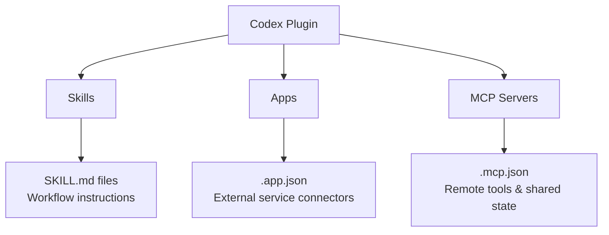
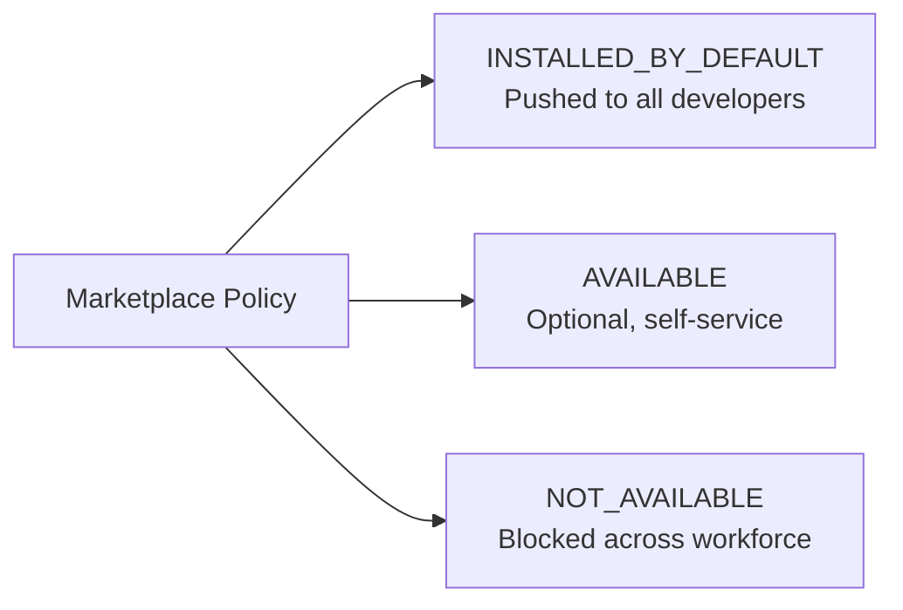
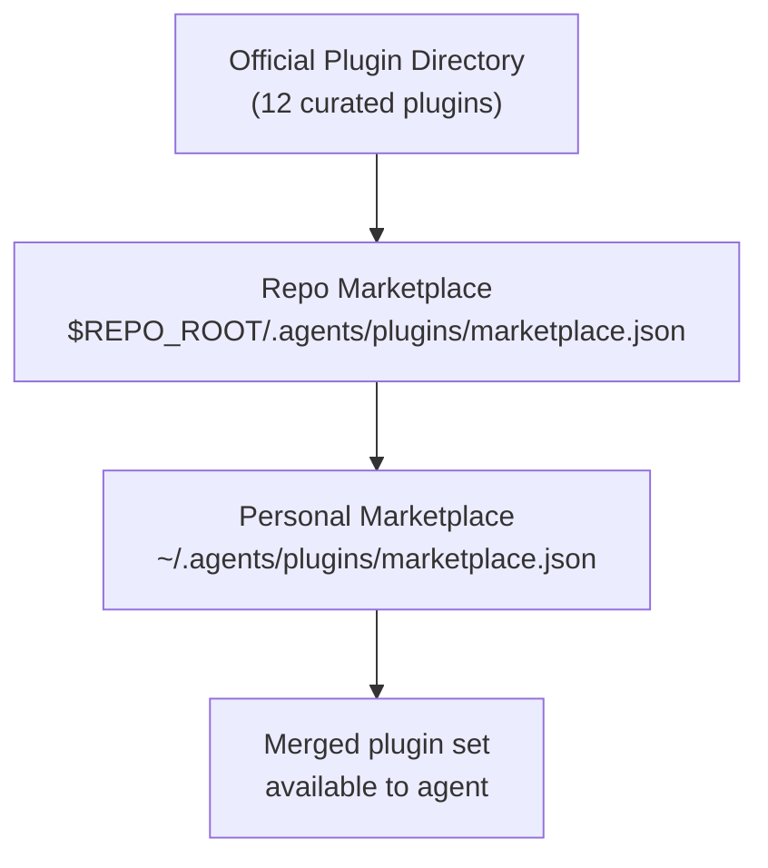

# Building Codex CLI Plugins: Architecture, Manifests, and Enterprise Distribution


## Introduction

Since their launch on 26 March 2026, Codex plugins have matured from a curiosity into a genuine distribution mechanism for reusable AI workflows[^1]. The official Plugin Directory now ships twelve curated integrations — GitHub, Slack, Figma, Notion, Linear, Vercel, Google Drive, Box, Cloudflare, Hugging Face, Sentry, and Gmail — while the community ecosystem has already grown to over 55 third-party plugins spanning nine domains[^2][^3].

Our earlier article on the [Codex Marketplace](2026-04-11-codex-marketplace-plugin-distribution.md) covered the `codex marketplace add` command and discovery workflows. This article goes deeper: how plugins are *built*, what each component does, how manifests and marketplaces are structured, and how enterprises govern plugin distribution across teams.

## Plugin Anatomy: Three Components, One Bundle

A Codex plugin bundles up to three kinds of component into a single installable unit[^4]:



**Skills** are Markdown-based workflow instructions that the agent discovers and executes at runtime. They follow the `SKILL.md` format with YAML frontmatter for metadata and progressive-disclosure instructions in the body[^5].

**Apps** handle connections to external services — OAuth flows, API key management, capability scoping, and token lifecycle. A plugin's `.app.json` maps each integration to its connector type and declares the permissions it requires[^6].

**MCP Servers** extend the agent's tool surface by exposing remote tools and shared context through the Model Context Protocol. The `.mcp.json` file specifies server commands, arguments, and environment variables[^7].

Each component is optional and independent. A plugin can ship a single skill with no external integrations, or bundle an MCP server with no skills at all. This separation of concerns keeps individual components reusable across multiple plugins[^6].

## Directory Structure and the Manifest

Every plugin requires a `.codex-plugin/plugin.json` manifest at its root. All other components sit alongside it at the plugin root level[^4]:

```
my-plugin/
├── .codex-plugin/
│   └── plugin.json          # Required manifest
├── skills/
│   └── review-pr/
│       └── SKILL.md         # Skill instructions
├── .app.json                # Optional app connectors
├── .mcp.json                # Optional MCP server config
└── assets/                  # Optional icons, screenshots
    ├── logo.png
    └── screenshot-1.png
```

A critical structural rule: only `plugin.json` belongs inside `.codex-plugin/`. Skills, assets, `.mcp.json`, and `.app.json` must remain at the plugin root[^4].

### The Minimal Manifest

A plugin needs surprisingly little metadata to be installable:

```json
{
  "name": "pr-reviewer",
  "version": "1.0.0",
  "description": "Automated PR review with architecture checks",
  "skills": "./skills/"
}
```

The `name` field must use kebab-case — Codex uses it as the plugin identifier and component namespace[^4].

### Complete Manifest Fields

For plugins destined for team or public distribution, the full manifest surface includes[^4]:

| Field Group | Fields | Purpose |
|---|---|---|
| **Package metadata** | `name`, `version`, `description`, `author`, `homepage`, `repository`, `license`, `keywords` | Identity and discovery |
| **Component pointers** | `skills`, `mcpServers`, `apps` | Paths to bundled components (relative, prefixed with `./`) |
| **Install surface** (`interface`) | `displayName`, `shortDescription`, `longDescription`, `developerName`, `category`, `capabilities` | Presentation in the Plugin Directory |
| **Visual assets** (`interface`) | `composerIcon`, `logo`, `screenshots`, `brandColor` | Branding in the install UI |
| **Legal/external** (`interface`) | `websiteURL`, `privacyPolicyURL`, `termsOfServiceURL` | Compliance links |
| **UX hints** (`interface`) | `defaultPrompt` | Suggested first prompt after install |

All component paths must be relative to the plugin root and start with `./`[^4].

## Building a Plugin: The Practical Workflow

### Scaffolding with `$plugin-creator`

The fastest route to a working plugin is the built-in `$plugin-creator` skill. Invoke it by describing the functionality you want:

```
@$plugin-creator Create a plugin that reviews PRs against our architecture decision records
```

This scaffolds the `.codex-plugin/plugin.json` manifest, a starter `SKILL.md`, and optionally a local `marketplace.json` entry for testing[^4][^8].

### Writing a Skill

Each skill lives in its own directory under `skills/` with a `SKILL.md` file:

```markdown
---
name: architecture-review
description: Review PRs against architecture decision records (ADRs).
---

## Steps

1. Read the PR diff from the current branch against the base branch.
2. Locate all ADR files in `docs/architecture/decisions/`.
3. For each changed file, identify which ADRs are relevant based on the
   component or pattern affected.
4. Flag any changes that contradict an active ADR.
5. Produce a structured review comment with ADR references.

## References

- ADR directory: `docs/architecture/decisions/`
- ADR format: MADR (Markdown Architectural Decision Records)
```

The frontmatter `name` and `description` fields are mandatory — they drive skill discovery when the agent decides which skills to load for a given task[^5].

### Configuring App Connectors

The `.app.json` file at the plugin root maps each external service to its connector and capability scope:

```json
{
  "github": {
    "connector": "github-api",
    "auth": "oauth",
    "capabilities": ["read-repos", "create-prs", "write-issues"]
  },
  "slack": {
    "connector": "slack-api",
    "auth": "oauth",
    "capabilities": ["post-messages", "read-channels"]
  }
}
```

Apps handle token management, rate limiting, and connection lifecycle — abstracting this complexity away from the skill's workflow logic[^6]. Authentication is triggered either at install time or on first use, depending on the marketplace policy.

### Adding MCP Servers

The `.mcp.json` file follows the standard MCP server configuration format:

```json
{
  "mcpServers": {
    "adr-search": {
      "command": "adr-mcp-server",
      "args": ["--root", "${WORKSPACE_DIR}/docs/architecture"],
      "env": {
        "INDEX_ON_STARTUP": "true"
      }
    }
  }
}
```

MCP servers are particularly valuable when a plugin needs custom tools that persist state across sessions or require access to external systems not covered by the built-in app connectors[^7].

## Local Testing and Installation

### Repo-Scoped Marketplace

For team-level distribution before publishing to the official directory, create a marketplace file at `$REPO_ROOT/.agents/plugins/marketplace.json`:

```json
{
  "name": "team-engineering",
  "plugins": [
    {
      "name": "pr-reviewer",
      "source": {
        "source": "local",
        "path": "./plugins/pr-reviewer"
      },
      "policy": {
        "installation": "INSTALLED_BY_DEFAULT",
        "authentication": "ON_INSTALL"
      },
      "category": "Code Quality"
    }
  ]
}
```

Store the plugin source under `$REPO_ROOT/plugins/pr-reviewer`. When any team member opens the repository in Codex, the plugin appears in `/plugins` and installs according to the declared policy[^4].

### Personal Marketplace

For individual use or cross-project plugins, place the marketplace file at `~/.agents/plugins/marketplace.json` and store plugins under `~/.codex/plugins/`[^4].

### Plugin Cache

Installed plugins are cached at `~/.codex/plugins/cache/$MARKETPLACE_NAME/$PLUGIN_NAME/$VERSION/`. For locally-sourced plugins the version is `local`, and Codex loads from the cache rather than the source directory[^4]. This means changes to a local plugin require reinstallation to take effect.

## Enterprise Governance

The plugin system's governance layer is where Codex diverges most sharply from competing agentic tools. Organisations define plugin catalogs as JSON marketplace files and assign one of three installation policies to each entry[^1][^9]:



| Policy | Behaviour | Use Case |
|---|---|---|
| `INSTALLED_BY_DEFAULT` | Plugin installs automatically for all developers in scope | Mandated security scanners, approved PR review workflows |
| `AVAILABLE` | Plugin appears in `/plugins` but requires manual install | Optional productivity tools, experimental integrations |
| `NOT_AVAILABLE` | Plugin is blocked; does not appear in discovery | Unapproved or deprecated plugins |

Authentication timing is separately configurable via the `authentication` field — either `ON_INSTALL` (prompt during setup) or deferred to first use[^4].

### Distribution Hierarchy

Codex resolves plugins from three sources in order[^4]:



This layered model mirrors patterns familiar from package managers and MDM profiles: the organisation sets a baseline, repositories add project-specific tooling, and individual developers supplement with personal utilities[^9].

### Enterprise Deployment Pattern

A typical enterprise rollout distributes the repo-scoped marketplace through the organisation's monorepo or shared configuration repository:

```bash
# In the shared config repo
.agents/
└── plugins/
    └── marketplace.json    # Organisation-wide plugin catalog
```

Combined with Codex's existing managed policy infrastructure — `requirements.toml` for approval modes, `AGENTS.override.md` for instruction guardrails — the plugin governance layer gives IT teams a complete control surface over what AI workflows developers can access[^9][^10].

## The Community Ecosystem

Despite the official Plugin Directory remaining closed to third-party submissions (self-serve publishing is documented as "coming soon")[^4], the community ecosystem has grown rapidly. The `awesome-codex-plugins` registry on GitHub catalogues 55+ plugins with trust scores across installability, maintenance, security, provenance, and publisher quality[^2].

Notable community contributions include:

- **Registry Broker** — delegates tasks to specialist agents based on domain
- **AgentOps** — DevOps layer with persistent memory across sessions
- **Blueprint** — specification-driven development from architectural documents
- **Brooks Lint** — code reviews grounded in six classic software engineering books
- **Claude Code for Codex** — cross-agent review with tracked background jobs[^2]

The ecosystem spans 223 production-ready skills and 298 Python tools across categories including engineering, marketing, product, and compliance[^2].

## Comparison with Claude Code Skills

For teams evaluating both platforms, the key architectural difference is scope. Claude Code skills are single `SKILL.md` files — powerful but standalone. Codex plugins bundle skills *with* their infrastructure dependencies: the MCP servers they need, the app connectors they authenticate through, and the governance policies that control their distribution[^11].

| Dimension | Claude Code Skills | Codex Plugins |
|---|---|---|
| **Unit of distribution** | Single `SKILL.md` file | Bundle (skills + apps + MCP + manifest) |
| **Governance** | None (file-system access controls only) | JSON policy: `INSTALLED_BY_DEFAULT` / `AVAILABLE` / `NOT_AVAILABLE` |
| **External integrations** | Manual MCP config in `settings.json` | Bundled `.app.json` + `.mcp.json` |
| **Discovery** | File system or custom slash commands | `/plugins` browser, `@` invocation |
| **Enterprise distribution** | Git submodules or manual copy | Marketplace catalogs with policy enforcement |

## What's Still Missing

The plugin system has clear gaps as of April 2026:

- **No self-serve publishing** to the official Plugin Directory — distribution requires private marketplaces or community registries[^4]
- **No plugin versioning conflict resolution** — if a repo marketplace and personal marketplace declare the same plugin at different versions, behaviour is undefined ⚠️
- **No runtime permission escalation** — a plugin's capability set is fixed at install time; there is no mechanism for a plugin to request additional permissions dynamically ⚠️
- **No plugin dependency graph** — plugins cannot declare dependencies on other plugins, limiting composability ⚠️

## Conclusion

The Codex plugin system transforms individual skills from loose files into governed, distributable workflow bundles. For individual developers, the `$plugin-creator` skill and local marketplaces provide a low-friction path to packaging reusable workflows. For enterprises, the three-tier installation policy model and layered marketplace resolution offer the kind of centralised governance that makes AI tooling deployable at scale.

The ecosystem is young — the official directory ships just twelve plugins, and self-serve publishing remains on the roadmap. But with 55+ community plugins already catalogued and the governance primitives already in place, the plugin system is positioned to become the primary distribution mechanism for Codex workflows in 2026.

## Citations

[^1]: [OpenAI adds plugin system to Codex to help enterprises govern AI coding agents — InfoWorld](https://www.infoworld.com/article/4151214/openai-adds-plugin-system-to-codex-to-help-enterprises-govern-ai-coding-agents.html)
[^2]: [awesome-codex-plugins — GitHub (hashgraph-online)](https://github.com/hashgraph-online/awesome-codex-plugins)
[^3]: [OpenAI Launches Plugin Marketplace for Codex with Enterprise Controls — WinBuzzer](https://winbuzzer.com/2026/03/31/openai-launches-plugin-marketplace-codex-enterprise-controls-xcxwbn/)
[^4]: [Build plugins — Codex Developer Documentation](https://developers.openai.com/codex/plugins/build)
[^5]: [Agent Skills — Codex Developer Documentation](https://developers.openai.com/codex/skills)
[^6]: [Skills vs Apps vs MCP Servers in Codex Plugins — BSWEN](https://docs.bswen.com/blog/2026-03-27-codex-components-guide/)
[^7]: [Plugins — Codex Developer Documentation](https://developers.openai.com/codex/plugins)
[^8]: [Codex Plugins, Explained — PAS7 Studio](https://pas7.com.ua/blog/en/codex-plugins-explained-2026)
[^9]: [OpenAI Codex Update 2026: Powerful Plugins Transform AI Coding — TechGenyz](https://techgenyz.com/openai-codex-update-plugin-system-enterprise-coding/)
[^10]: [OpenAI Introduces Plugin Feature for Codex for Enterprise — MLQ](https://mlq.ai/news/openai-introduces-plugin-feature-for-codex-for-enterprise-ai-coding-governance/)
[^11]: [Claude Code Skills vs MCP vs Plugins: Complete Guide 2026 — MorphLLM](https://www.morphllm.com/claude-code-skills-mcp-plugins)
