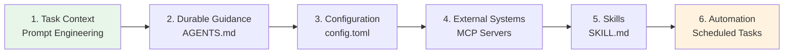
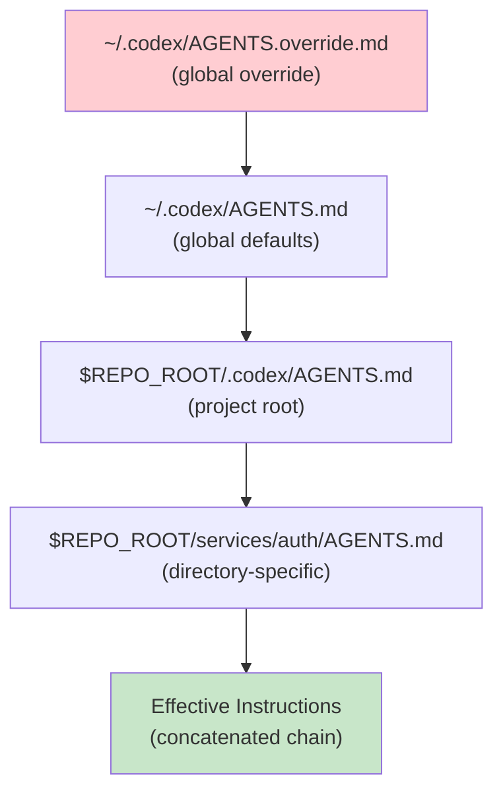
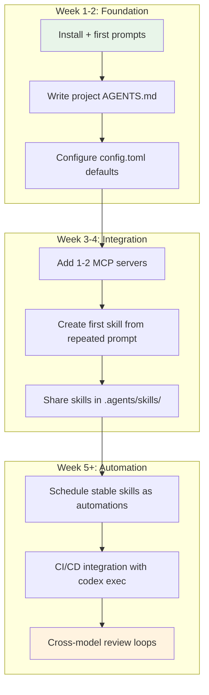

# The Official Codex CLI Best Practices Decoded: OpenAI's Six-Stage Workflow Maturity Model


OpenAI recently published a canonical best practices guide at `developers.openai.com/codex/learn/best-practices` [^1] — their first attempt at codifying the progression from novice Codex CLI user to autonomous workflow architect. The guide is not merely a list of tips; it describes a **six-stage maturity model** for how practitioners should evolve their relationship with the tool. This article decodes each stage, maps it to concrete configuration and code, and highlights where community practice has already outpaced the official guidance.

## The Six-Stage Maturity Model

OpenAI's best practices page structures its guidance around a deliberate progression [^1]:

1. **Task context** — start with the right prompt
2. **Durable guidance** — encode knowledge in AGENTS.md
3. **Configuration** — tune Codex to match your workflow
4. **External systems** — connect tools via MCP
5. **Skills** — package repeated work as reusable workflows
6. **Automation** — schedule stable workflows to run unattended



Each stage builds on the previous one. Skipping stages — writing skills before establishing AGENTS.md, or automating before achieving manual reliability — is explicitly called out as an anti-pattern [^1].

## Stage 1: Task Context — The Four-Element Prompt

OpenAI recommends every prompt include four elements [^1]:

- **Goal** — what you are building or changing
- **Context** — relevant files, folders, documentation, or errors
- **Constraints** — standards, architecture, safety requirements
- **Done criteria** — completion conditions (tests passing, behaviour verification)

```bash
codex
# Goal: Migrate the auth module from session-based to JWT
# Context: @src/auth/ @docs/auth-spec.md @tests/auth/
# Constraints: Must remain backward-compatible with v2 API clients
# Done: All existing auth tests pass, new JWT tests cover token refresh
```

### Reasoning Effort Selection

The guide maps reasoning effort to task complexity [^1]:

| Task Type | Reasoning Effort | Example |
|---|---|---|
| Well-scoped, routine | `low` | Fix a typo, update a dependency version |
| Standard development | `medium` (default) | Implement a feature from a clear spec |
| Complex debugging | `high` | Trace a race condition across three services |
| Long agentic sessions | `xhigh` | Multi-file refactoring with architectural implications |

Configure defaults in `config.toml`:

```toml
[codex]
model = "gpt-5.4"
model_reasoning_effort = "medium"
plan_mode_reasoning_effort = "high"
```

### Planning Before Execution

For multi-step tasks, the guide recommends three planning approaches [^1]:

1. **Plan mode** — toggle with `/plan` or `Shift+Tab` to gather context before implementation
2. **Interview mode** — ask Codex to question your assumptions before coding
3. **PLANS.md template** — configure execution-plan templates for standardised multi-step work

The interview pattern is particularly effective for architectural decisions:

```
Before implementing anything, interview me about this feature.
Challenge my assumptions. Ask about edge cases I haven't considered.
Only proceed to implementation after we agree on the approach.
```

## Stage 2: Durable Guidance — AGENTS.md as a Living Constitution

The official AGENTS.md guide [^2] establishes a clear hierarchy:



### What the Official Docs Recommend Including

OpenAI's guidance is specific about AGENTS.md content [^2]:

- Repository layout and important directories
- How to run the project (build, test, lint commands)
- Engineering conventions and PR expectations
- Constraints and "do-not" rules
- Completion definitions and verification methods

### The 32 KiB Ceiling

The default `project_doc_max_bytes` is 32 KiB [^2]. Files stop loading once this threshold is reached. For large monorepos, this means your root AGENTS.md must be concise — push service-specific guidance into nested files that load only when Codex operates within that directory.

### Verification

The guide recommends a simple verification command [^2]:

```bash
codex --ask-for-approval never "Summarise current instructions."
```

This prints the concatenated instruction chain Codex will follow, letting you audit exactly what the agent sees before starting real work.

### What the Official Docs Do Not Say

The official guidance is silent on several practices the community has established:

- **The ICLR 2026 finding** that non-interactive defaults in AGENTS.md (specifying `--full-auto`-safe commands) significantly outperform interactive steering [^3]
- **The 500-line guideline** from the Agentic AI Foundation (AAIF), which recommends keeping AGENTS.md under 500 lines for optimal agent comprehension [^4]
- **Cross-tool portability** — AGENTS.md now works across 25+ tools including Gemini CLI, Cursor, Copilot, and Aider under AAIF governance [^4]

## Stage 3: Configuration — Layered Defaults

OpenAI recommends a three-layer configuration strategy [^1]:

```toml
# ~/.codex/config.toml — personal defaults
[codex]
model = "gpt-5.4"
model_reasoning_effort = "medium"
approval_policy = "unless-allow-listed"

[features]
codex_hooks = true
smart_approvals = true
```

```toml
# .codex/config.toml — project-level overrides
[codex]
model_reasoning_effort = "high"
sandbox_mode = "workspace-write"

[permissions.network]
allow_domains = ["registry.npmjs.org", "api.github.com"]
```

The principle: **start restrictive, loosen deliberately**. Default to `read-only` sandbox and `suggest` approval mode; grant `workspace-write` or `full-auto` only for trusted repositories with strong test coverage [^1].

### Profile-Based Switching

For practitioners who work across different contexts, profiles provide named configuration presets [^5]:

```toml
[profiles.ci]
model = "gpt-5.4-mini"
model_reasoning_effort = "medium"
approval_policy = "full-auto"
sandbox_mode = "read-only"

[profiles.deep-review]
model = "gpt-5.4"
model_reasoning_effort = "xhigh"
```

Invoke with `codex --profile ci exec "Run the test suite and report failures"`.

## Stage 4: External Systems — MCP as the Integration Layer

The official guidance is pragmatic about MCP adoption [^1]: start with one or two servers that eliminate manual loops, then expand. Avoid wiring in every available server initially — each server adds token overhead at session startup.

```toml
# .codex/config.toml — targeted MCP integration
[[mcp_servers]]
name = "jira"
command = "npx"
args = ["-y", "@anthropic/atlassian-mcp-server"]
env = { JIRA_API_TOKEN = "env:JIRA_TOKEN" }

[[mcp_servers]]
name = "datadog"
command = "npx"
args = ["-y", "@datadog/mcp-server"]
```

### The MCP Maturity Path

v0.119.0 and v0.120.0 significantly expanded MCP capabilities [^6]:

- **Resource reads** — resolving long-standing `list_mcp_resources` failures
- **outputSchema** — typed tool declarations for structured responses
- **Elicitations** — servers can request structured user input mid-turn
- **File-parameter uploads** — binary data transfer to MCP tools
- **Tool-call metadata** — tracing and audit information per invocation

These additions move Codex CLI's MCP support from tools-only to full protocol coverage, matching the depth that Claude Code offers natively [^6].

## Stage 5: Skills — The Reusability Threshold

OpenAI's skills guidance [^7] introduces a clear decision criterion: **convert a prompt to a skill when you keep reusing it or correcting the same workflow**. The SKILL.md format provides structured packaging:

```markdown
---
name: code-change-verification
description: >
  Run formatting, linting, type-checking, and tests after
  substantive code changes. Trigger when runtime code, tests,
  examples, or build/test behaviour changes.
---

# Code Change Verification

## Steps

1. Run `make format` and stage any formatting changes
2. Run `make lint` — fix all errors before proceeding
3. Run `make typecheck` — resolve type errors
4. Run `make tests` — all tests must pass
5. If any step fails, fix the issue and restart from step 1
```

### Discovery Locations

Skills load from four scope levels [^7]:

| Scope | Path | Use Case |
|---|---|---|
| Repository (CWD) | `.agents/skills/` | Folder-specific workflows |
| Repository (root) | `$REPO_ROOT/.agents/skills/` | Organisation-wide skills |
| User | `$HOME/.agents/skills/` | Personal cross-project skills |
| Admin | `/etc/codex/skills/` | System-level automation |

### The OSS Maintenance Case Study

OpenAI's own Agents SDK team demonstrated the power of skills-based workflows [^8]. Between December 2025 and February 2026, two SDK repositories merged **457 PRs** — up from 316 in the previous three months — a **44.6% throughput increase**. The key skills driving this improvement:

- **`code-change-verification`** — deterministic formatting, linting, type-checking, and testing
- **`examples-auto-run`** — executes code examples with automated prompt answering
- **`integration-tests`** — publishes to a local Verdaccio registry and tests across Node.js, Bun, Deno, and Cloudflare Workers
- **`final-release-review`** — diffs previous release tag against `main`, makes explicit green/yellow/red release calls with evidence
- **`pr-draft-summary`** — generates PR title and description after substantive changes

The critical design principle: **scripts handle deterministic shell work; the model handles interpretation and comparison** [^8]. A verification skill does not ask the LLM to decide whether tests pass — it runs `make tests` and lets the exit code speak.

### Description Quality as Routing Signal

The official blog post highlights a non-obvious insight [^8]: skill descriptions function as the primary routing signal for implicit invocation. A weak description leads to unreliable activation:

- **Weak:** "Create a PR title and draft description for a pull request."
- **Strong:** "Create a PR title and draft description after substantive code changes are finished. Trigger when wrapping up a moderate-or-larger change (runtime code, tests, build config, docs with behaviour impact)..."

The strong version specifies both the function and the trigger conditions, giving the model enough context to invoke the skill at the right moment.

## Stage 6: Automation — Schedule Only What Works Manually

The final stage in the maturity model converts stable, reliable workflows into scheduled background tasks [^1]. The official guidance is emphatic: **skills define methodology; automations define schedule**. If a workflow still needs steering, it is not ready for automation.

Good automation candidates identified by OpenAI [^1]:

- Commit summarisation
- Bug scanning and vulnerability triage
- Release note generation
- CI failure analysis
- Standup summaries
- Repeatable analysis workflows

In the Codex App, automations run in dedicated git worktrees, providing isolation from your working tree. In the CLI, equivalent automation uses `codex exec` with cron or CI scheduling:

```bash
# Daily CI failure analysis — scheduled via GitHub Actions
codex exec --full-auto \
  --profile ci \
  -c model=gpt-5.4-mini \
  "Analyse the last 24 hours of CI failures. Group by root cause. \
   Propose fixes for the top 3 recurring failures." \
  -o ci-analysis.md
```

## The Eight Anti-Patterns

The official best practices page identifies eight common mistakes [^1]. These deserve attention because they represent the most frequent failure modes OpenAI observes across their user base:

1. **Overloading prompts with durable rules** — move recurring instructions to AGENTS.md or skills
2. **Not showing the agent how to run builds and tests** — the agent cannot verify its own work without explicit commands
3. **Skipping planning for multi-step tasks** — complex work without `/plan` leads to architectural drift
4. **Granting full permissions prematurely** — start restrictive, loosen only for trusted repositories
5. **Running live threads without git worktrees** — risky for parallel work or experimental changes
6. **Automating before manual reliability** — premature automation produces unreliable results at scale
7. **Requiring step-by-step monitoring** — Codex works best when you delegate and review results, not watch every step
8. **Using one thread per project** — causes bloated context; use one thread per coherent task unit

Anti-pattern #7 is particularly counter-intuitive: the natural instinct is to monitor the agent closely, but this both slows the practitioner and reduces the agent's autonomy to explore solution paths. The official guidance explicitly recommends parallel work — start a task, move to other work, review the output [^1].

## Mapping the Maturity Model to Team Adoption



For teams adopting Codex CLI, a realistic timeline is two weeks for the foundation stages (prompting, AGENTS.md, configuration), another two weeks for integration (MCP, first skills), and ongoing evolution for automation and advanced patterns. Attempting to jump directly to stage 5 or 6 without the earlier foundations is the most common cause of team-level adoption failure.

## Where Community Practice Exceeds Official Guidance

The official best practices page is deliberately conservative. Several areas where community practice has moved beyond the official guidance:

- **Cross-model adversarial review** — using a different model to review agent output catches blind spots that same-model self-review misses [^9]
- **Subagent delegation for context management** — spawning fresh subagents instead of extending long sessions avoids compaction quality loss [^10]
- **The complexity ratchet** — periodically instructing agents to simplify rather than add, resisting the natural tendency of agents to accumulate code [^11]
- **External orchestration** — tools like Oh-My-Codex (OMX) extend beyond the built-in `max_threads=6` limit to run 20+ parallel agents with worktree isolation [^12]

These patterns represent the frontier of Codex CLI practice — where the tool is being pushed beyond its designed boundaries by practitioners who have already mastered the official maturity model.

## Practical Takeaway

The official best practices page is not a reference manual — it is a **maturity model** disguised as a list of tips. Read it as a progression: master each stage before advancing to the next. The practitioners who get the most from Codex CLI are not those who enable every feature on day one, but those who build a solid foundation of AGENTS.md, configuration, and manual reliability before layering skills and automation on top.

Start with `codex /init` to scaffold your AGENTS.md [^2], configure your `config.toml` with conservative defaults [^5], and resist the temptation to automate until your workflows run reliably with manual invocation. The maturity model works because each stage creates the guardrails that make the next stage safe.

## Citations

[^1]: [Best practices – Codex | OpenAI Developers](https://developers.openai.com/codex/learn/best-practices)
[^2]: [Custom instructions with AGENTS.md – Codex | OpenAI Developers](https://developers.openai.com/codex/guides/agents-md)
[^3]: [Codex CLI Customisation Stack article — ICLR 2026 non-interactive defaults finding](https://codex.danielvaughan.com/2026/04/12/codex-cli-customisation-stack-unified-system/)
[^4]: [AGENTS.md as an Open Standard: Cross-Tool Portability Under Linux Foundation Governance](https://codex.danielvaughan.com/2026/04/07/agents-md-open-standard-cross-tool-portability/)
[^5]: [Configuration Reference – Codex | OpenAI Developers](https://developers.openai.com/codex/config-reference)
[^6]: [Changelog – Codex | OpenAI Developers](https://developers.openai.com/codex/changelog)
[^7]: [Agent Skills – Codex | OpenAI Developers](https://developers.openai.com/codex/skills)
[^8]: [Using skills to accelerate OSS maintenance | OpenAI Developers](https://developers.openai.com/blog/skills-agents-sdk)
[^9]: [Cross-Model Adversarial Review: Using Multiple AI Models to Catch Agent Blind Spots](https://codex.danielvaughan.com/2026/03/28/cross-model-adversarial-review/)
[^10]: [Context Window Management: Avoiding Compaction with Sub-Agent Delegation](https://codex.danielvaughan.com/2026/03/27/context-window-management-subagent-delegation/)
[^11]: [The AI Complexity Ratchet: Why Agentic Automation Drifts Into the Pit at 200 mph](https://codex.danielvaughan.com/2026/04/07/cross-model-review-loop-automation/)
[^12]: [Oh-My-Codex (OMX): The Community Orchestration Layer](https://codex.danielvaughan.com/2026/04/10/oh-my-codex-omx-orchestration-layer/)
