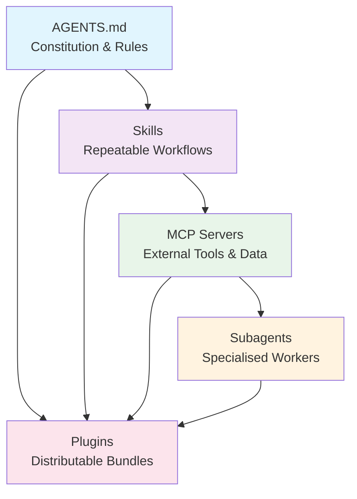
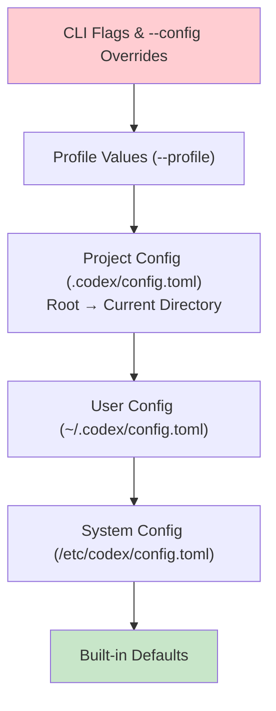

# The Codex CLI Customisation Stack: How AGENTS.md, Skills, MCP, Subagents, and Plugins Compose Into One System


---

Codex CLI's customisation surface has grown from a single AGENTS.md file into a five-layer architecture spanning instructions, skills, external tools, agent definitions, and distributable plugins. Each layer solves a different problem, and understanding how they compose is the difference between a well-orchestrated project and a tangled mess of overlapping configurations.

This guide maps the complete customisation stack as it stands in April 2026, explains when to reach for each layer, and walks through a practical project setup from scratch.

## The Five Layers

The official OpenAI documentation recommends a specific build sequence: establish AGENTS.md conventions, then install or create skills, connect MCP for external systems, and finally implement subagents for specialised work[^1]. Plugins bundle the first four layers into distributable packages.



Each layer has a distinct responsibility:

| Layer | What it does | When to use it | Discovery scope |
|-------|-------------|----------------|-----------------|
| **AGENTS.md** | Sets rules, conventions, and architecture context | Always — every project needs one | Directory hierarchy |
| **Skills** | Packages repeatable multi-step workflows | When a prompt pattern recurs 3+ times | User → repo → directory |
| **MCP** | Connects to external tools and live data | When context lives outside the repo | config.toml scoped |
| **Subagents** | Delegates bounded tasks to focused workers | When tasks benefit from parallelism or isolation | TOML agent definitions |
| **Plugins** | Bundles skills + MCP + agents for distribution | When a workflow needs to ship across teams | Marketplace + local |

## Layer 1: AGENTS.md — The Constitution

AGENTS.md is loaded before the agent does any work[^2]. Codex reads it by walking the directory tree from project root to your current working directory, concatenating all matches from root to leaf. This means you can layer instructions: broad conventions at the root, specific rules in subdirectories.

### Discovery Order

At each directory level, Codex checks[^3]:

1. `AGENTS.override.md` (if present, takes precedence)
2. `AGENTS.md`
3. Any fallback filenames configured via `project_doc_fallback_filenames`

Only the first non-empty file at each level is used. The global file at `~/.codex/AGENTS.md` applies to every repository.

### What Belongs in AGENTS.md

The official best practices guide recommends five categories[^1]:

- **Repository layout** — directory structure, key modules
- **Build, test, lint commands** — exact invocations, not descriptions
- **Engineering conventions** — naming, patterns, error handling
- **Constraints** — what the agent must never do
- **Verification methods** — how to confirm work is complete

```markdown
# AGENTS.md

## Architecture
- Frontend: Next.js 15 + TypeScript in `apps/web/`
- API: FastAPI in `services/api/`
- Shared types: `packages/types/`

## Commands
- Test: `pnpm test --filter=<package>`
- Lint: `pnpm lint --filter=<package>`
- Build: `pnpm build`

## Rules
- Always run tests after modifying source files
- Use snake_case for Python, camelCase for TypeScript
- Never modify migration files after merge to main
```

The critical constraint: keep AGENTS.md under the 32 KiB `project_doc_max_bytes` limit[^4]. Long AGENTS.md files suffer context truncation. Front-load the most critical instructions, and push detailed reference material into skills or MCP-served documentation.

## Layer 2: Skills — Repeatable Workflows

When you find yourself writing the same prompt pattern repeatedly, extract it into a skill. A skill is a directory containing a `SKILL.md` file with YAML frontmatter, plus optional scripts, references, and templates[^5].

### Storage Locations

Skills are discovered from multiple scopes, checked in order of specificity[^5]:

```
./.agents/skills/              # Current directory
../.agents/skills/             # Parent directory
$REPO_ROOT/.agents/skills/     # Repository root
$HOME/.agents/skills/          # Personal, cross-repo
/etc/codex/skills/             # System-level (admin)
Bundled with Codex             # Built-in skills
```

Project skills live under `.agents/skills/` and should be version-controlled. Personal skills live under `~/.agents/skills/` (or equivalently `~/.codex/skills/`).

### SKILL.md Format

```yaml
---
name: generate-migration
description: >
  Generate a database migration from schema changes.
  Use when the developer asks to create, alter, or drop tables.
---

## Steps

1. Read the current schema from `prisma/schema.prisma`
2. Identify the requested change
3. Run `npx prisma migrate dev --name <descriptive-name>`
4. Verify the migration SQL in `prisma/migrations/`
5. Run `pnpm test --filter=database` to confirm
```

The `description` field is critical — it controls when the model decides to invoke the skill. Write it as a trigger condition, not a title[^6]. The `/init` command can scaffold a starter AGENTS.md, and the `$skill-creator` built-in skill can scaffold new skills[^7].

### When Skills Beat Prompts

The pragmatic threshold: if a prompt works every time with 10 words, save it as a `/command` and move on. If it needs file context, tool access, or multi-step logic, write a `SKILL.md`. If it touches production data or runs unattended, invest in evaluation[^8].

## Layer 3: MCP — External Tools and Data

Model Context Protocol connects Codex to external systems when context lives outside the repository[^9]. Configure MCP servers in `config.toml`:

```toml
[mcp_servers.jira]
command = "npx"
args = ["-y", "@anthropic/atlassian-mcp-server"]
env = { JIRA_API_TOKEN = "env:JIRA_API_TOKEN_VAR" }
enabled_tools = ["jira_search", "jira_get_issue", "jira_update_issue"]

[mcp_servers.datadog]
command = "npx"
args = ["-y", "@datadog/mcp-server"]
env = { DD_KEY = "env:DATADOG_KEY_VAR" }
```

As of v0.119.0, MCP support extends beyond tools to include resource reads, `outputSchema` in tool declarations, server-driven elicitations, and file-parameter uploads[^10]. Custom MCP server tool search enables progressive disclosure — tools load on demand rather than consuming context upfront[^11].

### MCP vs Skills

The distinction is straightforward: skills package instructions for the agent, MCP provides tools the agent can call. A skill might say "search Jira for the current sprint and summarise blockers" — the MCP server provides the `jira_search` tool that makes it possible. They compose naturally: skills invoke MCP tools when external systems are needed.

## Layer 4: Subagents — Specialised Workers

Subagents delegate bounded tasks to focused workers that run in parallel[^12]. Define custom agents as TOML files in `.codex/agents/`:

```toml
# .codex/agents/security-reviewer.toml
name = "security-reviewer"
description = "Reviews code changes for security vulnerabilities"
nickname_candidates = ["SecBot", "Guardian"]

developer_instructions = """
You are a security-focused code reviewer. Analyse changes for:
- SQL injection, XSS, CSRF vulnerabilities
- Secrets or credentials in code
- Insecure dependencies
- Missing input validation

Report findings as a structured list with severity ratings.
"""

model = "gpt-5.4"
sandbox_mode = "read-only"
```

### Global Settings

```toml
[agents]
max_threads = 6        # Concurrent agent cap
max_depth = 1          # Nesting depth limit
job_max_runtime_seconds = 300  # Timeout per CSV job worker
```

Three built-in agent types ship with Codex: `default` (general-purpose), `worker` (execution-focused), and `explorer` (read-heavy codebase analysis)[^12]. Custom agents inherit sandbox policies from the parent session unless explicitly overridden.

### When to Use Subagents

Subagents shine when tasks are naturally parallelisable — reviewing multiple modules simultaneously, running exploration and implementation in parallel, or batch-processing work items via `spawn_agents_on_csv`[^12]. They add overhead: each subagent consumes its own context window and tokens. For simple sequential tasks, a single agent with good AGENTS.md guidance is more efficient.

## Layer 5: Plugins — Distributable Bundles

Plugins package skills, MCP servers, app connectors, and agent definitions into a distributable unit[^13]. The plugin manifest (`plugin.json`) declares metadata, component pointers, and installation policies:

```json
{
  "name": "spring-boot-toolkit",
  "version": "1.0.0",
  "description": "Skills and MCP config for Spring Boot projects",
  "components": {
    "skills": ["skills/generate-migration", "skills/api-scaffold"],
    "mcp_servers": ["mcp/spring-actuator.json"],
    "agents": ["agents/test-runner.toml"]
  },
  "install_policy": "AVAILABLE"
}
```

Three installation policies control how plugins appear[^13]:

- **INSTALLED_BY_DEFAULT** — active immediately after install
- **AVAILABLE** — visible but opt-in
- **NOT_AVAILABLE** — hidden from users (admin use)

The `codex marketplace add` command (v0.120.0) installs plugins from git repositories, GitHub shorthand, or local directories[^14].

## The Complete Directory Layout

Here is how all five layers materialise on disk for a well-configured project:

```
my-project/
├── AGENTS.md                          # Layer 1: Project constitution
├── .codex/
│   ├── config.toml                    # Project-level config overrides
│   └── agents/
│       ├── security-reviewer.toml     # Layer 4: Custom subagent
│       └── test-runner.toml           # Layer 4: Custom subagent
├── .agents/
│   └── skills/
│       ├── generate-migration/        # Layer 2: Project skill
│       │   └── SKILL.md
│       ├── api-scaffold/              # Layer 2: Project skill
│       │   ├── SKILL.md
│       │   └── templates/
│       │       └── controller.ts.hbs
│       └── deploy-preflight/          # Layer 2: Project skill
│           ├── SKILL.md
│           └── scripts/
│               └── check-env.sh
├── services/
│   └── api/
│       └── AGENTS.md                  # Layer 1: Service-specific overrides
└── apps/
    └── web/
        └── AGENTS.md                  # Layer 1: Frontend-specific rules
```

And at the user level:

```
~/.codex/
├── config.toml                        # User-level config (model, approval, MCP)
├── AGENTS.md                          # Global personal conventions
├── auth.json                          # Stored credentials
├── rules/                             # Execution policy rules (.rules files)
├── memory/                            # Persistent memory files
└── themes/                            # Custom .tmTheme files

~/.agents/
└── skills/
    ├── my-review-skill/               # Personal cross-repo skill
    │   └── SKILL.md
    └── quick-test/                    # Personal utility skill
        └── SKILL.md
```

## Configuration Precedence

When layers overlap, Codex resolves settings through a clear precedence stack[^15]:



For AGENTS.md, the semantics differ: files are concatenated rather than overridden. A subdirectory AGENTS.md adds to the root file; `AGENTS.override.md` replaces the corresponding AGENTS.md at that level[^3].

## Practical Setup Walkthrough

For a team adopting Codex CLI on an existing project, follow this sequence:

### Step 1: Bootstrap AGENTS.md

```bash
cd my-project
codex
# In the TUI:
/init
```

Review the generated scaffold, then edit to match your actual conventions. Commit it immediately — AGENTS.md is a version-controlled team artefact[^1].

### Step 2: Extract Recurring Workflows as Skills

After a week of use, review your session history. Any prompt you have typed three or more times is a skill candidate. Scaffold with:

```bash
# In a Codex session:
@skill-creator "Create a skill that generates API endpoint scaffolding for our FastAPI services"
```

The `$skill-creator` skill generates the directory structure and SKILL.md frontmatter[^7].

### Step 3: Connect MCP for External Context

Add MCP servers for the external systems your team uses daily. Start with one — the most frequently needed context source:

```toml
# .codex/config.toml (project-level)
[mcp_servers.github]
command = "npx"
args = ["-y", "@github/mcp-server"]
env = { GITHUB_TOKEN = "env:GITHUB_TOKEN_VAR" }
```

### Step 4: Define Subagents for Parallel Work

Once your team is comfortable with single-agent workflows, add custom agents for tasks that benefit from parallelism:

```toml
# .codex/agents/explorer.toml
name = "codebase-explorer"
description = "Read-only exploration agent for large codebase searches"
sandbox_mode = "read-only"
model = "gpt-5.4-mini"
```

### Step 5: Package as a Plugin (Optional)

If your team configuration is useful across multiple repositories, package it as a plugin for distribution via the marketplace[^13].

## The Anti-Pattern Checklist

The official best practices documentation identifies several common mistakes that map to the customisation stack[^1]:

1. **Overloading prompts** instead of moving durable rules into AGENTS.md
2. **Not revealing build/test commands** — the agent cannot verify work without exact command invocations
3. **Skipping planning** on complex multi-step tasks that need subagent decomposition
4. **Granting full permissions prematurely** — start with `suggest` or `auto-edit` before `full-access`
5. **Running live threads without worktrees** — subagents that write files need isolation
6. **Bloated AGENTS.md** — exceeding the 32 KiB limit causes truncation[^4]; push detail into skills or MCP

ICLR 2026 research found that agents "default to non-interactive behaviour without explicit encouragement"[^16] — unless your AGENTS.md explicitly instructs the agent to run tests and verify output, it will skip those steps.

## Version Control Strategy

Everything in the customisation stack should be version-controlled except credentials:

| Component | Version control? | Location |
|-----------|-----------------|----------|
| AGENTS.md | ✅ Yes — committed | Repo root + subdirectories |
| .agents/skills/ | ✅ Yes — committed | Repo `.agents/skills/` |
| .codex/config.toml | ✅ Yes — committed (project) | Repo `.codex/` |
| .codex/agents/*.toml | ✅ Yes — committed | Repo `.codex/agents/` |
| ~/.codex/config.toml | ❌ Personal | User home |
| ~/.codex/auth.json | ❌ Never commit | User home |
| MCP server env vars | ❌ Via env/secrets | CI/CD secrets store |

When marking a project as untrusted, Codex skips all project-scoped `.codex/` layers and relies only on user, system, and built-in settings[^15]. This is the security boundary that makes committed project config safe.

## Conclusion

The five customisation layers compose into a unified system: AGENTS.md sets the rules, skills encode workflows, MCP connects external context, subagents provide parallel execution, and plugins bundle everything for distribution. Start with AGENTS.md, add layers only when the previous layer is insufficient, and resist the temptation to reach for subagents or plugins before you have exhausted the simpler options.

The build sequence matters. A well-written AGENTS.md with two targeted skills will outperform a poorly configured five-layer stack every time.

## Citations

[^1]: OpenAI, "Best practices – Codex", developers.openai.com/codex/learn/best-practices, accessed April 2026.
[^2]: OpenAI, "Custom instructions with AGENTS.md – Codex", developers.openai.com/codex/guides/agents-md, accessed April 2026.
[^3]: OpenAI, "Customization – Codex", developers.openai.com/codex/concepts/customization, accessed April 2026.
[^4]: OpenAI, "Configuration Reference – Codex", developers.openai.com/codex/config-reference, `project_doc_max_bytes` default 32 KiB, accessed April 2026.
[^5]: OpenAI, "Agent Skills – Codex", developers.openai.com/codex/skills, accessed April 2026.
[^6]: Blake Crosley, "AGENTS.md Patterns: What Actually Changes Agent Behavior", blakecrosley.com/blog/agents-md-patterns, 2026.
[^7]: OpenAI, "Slash commands in Codex CLI", developers.openai.com/codex/cli/slash-commands, `$skill-creator` scaffolding skill reference, accessed April 2026.
[^8]: Alan Hemmings, discussion on skill minimalism vs production investment, referenced in community discourse, April 2026.
[^9]: OpenAI, "Features – Codex CLI", developers.openai.com/codex/cli/features, MCP integration section, accessed April 2026.
[^10]: OpenAI, Codex CLI v0.119.0 release notes, github.com/openai/codex/releases, April 10, 2026.
[^11]: OpenAI, Codex CLI v0.119.0 — custom-server tool search feature, PR #16465, github.com/openai/codex, 2026.
[^12]: OpenAI, "Subagents – Codex", developers.openai.com/codex/subagents, accessed April 2026.
[^13]: OpenAI, Codex CLI plugin system documentation, `plugin.json` manifest format, v0.117.0+, 2026.
[^14]: OpenAI, Codex CLI v0.120.0 release notes — `codex marketplace add` command, PR #17087, April 11, 2026.
[^15]: OpenAI, "Config basics – Codex", developers.openai.com/codex/config-basic, precedence hierarchy and trust model, accessed April 2026.
[^16]: Jim Zandueta, "From AI Chaos to Team Flow: Codex Boilerplate That Actually Worked", dev.to, referencing ICLR 2026 findings on agent non-interactive defaults, April 2026.
