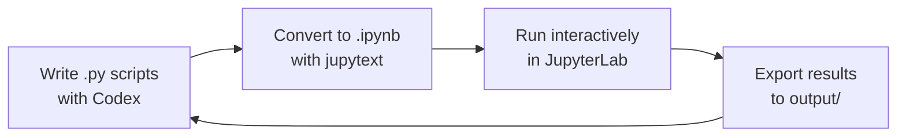

# Codex CLI for Data Science Teams: Pandas, Polars, and Notebook-Adjacent Workflows


---

Data scientists live in a different world from application developers. The work is exploratory, the toolchain revolves around DataFrames and visualisations rather than compilers and test suites, and "done" often means a stakeholder-ready report rather than a deployed service. Codex CLI — OpenAI's open-source, Rust-built terminal agent [^1] — fits this world surprisingly well once you tune the setup. This article covers the practical patterns for using Codex CLI with Pandas, Polars, and the broader data-science stack in 2026.

## Why Codex CLI Rather Than ChatGPT Code Interpreter?

Code Interpreter runs in a sandboxed cloud VM with a fixed set of pre-installed packages [^2]. That is fine for quick ad-hoc analysis, but it falls short when you need:

- **Your own data on disk** — parquet files in a data lake, CSVs behind a VPN, or databases behind SSH tunnels.
- **Your own environment** — a `uv`-managed virtualenv with pinned library versions.
- **Reproducibility** — scripts committed to Git, not ephemeral notebook sessions.
- **Long-running tasks** — Codex can stay on a task for up to seven hours, carrying context forward and refining results [^3].

Codex CLI runs locally, reads and writes your filesystem, and executes code in your shell. For data teams that already have infrastructure on their laptops or dev servers, it slots in without friction.

## Project Layout and AGENTS.md

The official Codex documentation recommends a canonical directory structure for data projects [^4]:

```
project/
├── AGENTS.md
├── data/
│   ├── raw/          # immutable source files
│   └── processed/    # cleaned, merged outputs
├── analysis/         # exploratory scripts and notebooks
├── output/           # final artefacts (reports, charts, CSVs)
├── scripts/          # reusable pipeline code
└── pyproject.toml
```

The `AGENTS.md` file is where you encode project conventions so Codex behaves predictably. For a data-science repo, a minimal but effective configuration looks like:

```markdown
# Project Rules

- Use `uv run` for all Python execution
- Keep raw data in `data/raw/` — never overwrite source files
- Write cleaned data to `data/processed/`
- Prefer `.py` scripts over `.ipynb` for reproducibility
- Use Polars for datasets > 100 MB; Pandas is fine for smaller work
- Default chart library: matplotlib with seaborn styling
- All outputs go to `output/` with ISO-dated filenames
```

This is not ceremonial — Codex reads `AGENTS.md` at session start and uses it to guide every decision [^4].

## Pandas Workflows: The Familiar Path

For datasets that fit comfortably in memory (under ~2 GB), Pandas remains the pragmatic choice [^5]. Codex handles Pandas fluently because the model's training data is saturated with Pandas examples.

A typical prompt-driven EDA session:

```bash
codex "Load data/raw/sales_2025.csv, profile it — show shape, dtypes, \
null rates, and numeric summary stats. Save the profile to output/profile.md"
```

Codex will generate a script that calls `pd.read_csv()`, runs `.describe()`, calculates null percentages, and writes a Markdown report. The key insight is **telling Codex where to write output** — without that, it defaults to printing to stdout, which is less useful for data work.

For merge-heavy workflows, the Codex documentation specifically recommends a "merge profiling" step before joining DataFrames [^4]:

```bash
codex "Before merging customers.csv and orders.csv on customer_id, \
check candidate key uniqueness, null rates in the join column, and \
trial join coverage. Report any issues."
```

This catches the silent data-quality bugs that plague production pipelines.

## Polars Workflows: The Performance Path

Polars has matured significantly through 2025–2026 and now offers a complete DataFrame API written in Rust with Python bindings [^6]. Benchmarks consistently show 10–30× speedups over Pandas on operations like groupby-aggregation and joins [^7]. The lazy evaluation engine means Polars can optimise query plans before touching the data — a pattern familiar to anyone who has used Spark, but without the JVM overhead.

Codex generates idiomatic Polars code when prompted correctly. The trick is being explicit:

```bash
codex "Using Polars (not Pandas), read data/raw/transactions.parquet \
with lazy scanning. Filter to 2025 transactions, group by merchant_category, \
compute total_amount and transaction_count, sort descending by total_amount. \
Collect and save to output/merchant_summary.csv"
```

The generated code will use `pl.scan_parquet()` and the lazy API:

```python
import polars as pl

(
    pl.scan_parquet("data/raw/transactions.parquet")
    .filter(pl.col("transaction_date").dt.year() == 2025)
    .group_by("merchant_category")
    .agg(
        pl.col("amount").sum().alias("total_amount"),
        pl.col("amount").count().alias("transaction_count"),
    )
    .sort("total_amount", descending=True)
    .collect()
    .write_csv("output/merchant_summary.csv")
)
```

### The Hybrid Stack

The emerging best practice in 2026 is a "DuckDB + Polars + Pandas" hybrid stack [^8]. Use DuckDB for SQL-native ingestion and heavy aggregation, Polars for expressive DataFrame transformations, and Pandas only where library compatibility demands it (certain plotting libraries, legacy codebases). Codex navigates this stack well if your `AGENTS.md` documents the preference hierarchy.

## Handling Notebooks — The .ipynb Problem

Jupyter notebooks remain the default interactive environment for data science [^9], but Codex CLI has a known friction point with `.ipynb` files. The JSON structure of notebook files means edits can produce invalid formatting, and the work is more laborious for the agent compared to plain `.py` files [^10].

The recommended workflow:



Use `jupytext` to maintain a bidirectional sync between `.py` and `.ipynb` formats [^9]. Let Codex work on the `.py` representation, then open the notebook in JupyterLab for interactive exploration and visualisation. This gives you the best of both worlds: agent-friendly plain text for automation, and the rich cell-based interface for human exploration.

## Building Data Skills

Codex skills — reusable workflow packages stored in `.agents/skills/` — are particularly powerful for data teams [^11]. A skill bundles instructions, optional scripts, and reference material so Codex can follow a workflow reliably.

Here is an example `csv-profiler` skill:

```
.agents/skills/csv-profiler/
├── SKILL.md
└── scripts/
    └── profile.py
```

The `SKILL.md`:

```markdown
---
name: csv-profiler
description: Profile a CSV file — row/column counts, dtypes, null rates, numeric stats, and a sample
---

# CSV Profiler

When invoked with `$csv-profiler <path>`:

1. Run `scripts/profile.py` with the target file path
2. Output a markdown report to `output/` with an ISO-dated filename
3. Flag any columns with >20% null values as warnings
```

Invoke it with:

```bash
codex "$csv-profiler data/raw/customers.csv"
```

Skills can be distributed as plugins across a team [^12], ensuring every data scientist on the project gets the same profiling, cleaning, and reporting workflows without reinventing prompts.

## Automating Pipelines with Exec Mode

For recurring data jobs — daily report generation, weekly metric refreshes — Codex's exec mode runs non-interactively [^3]:

```bash
codex exec "Read data/raw/weekly_metrics.csv, compute week-over-week \
percentage changes for all numeric columns, generate a bar chart of \
the top 5 movers, save chart to output/weekly_movers_$(date +%F).png \
and summary to output/weekly_summary_$(date +%F).md"
```

This pipes results to stdout and can be wrapped in a cron job or CI pipeline. Combined with `--cd` to set the working directory, you can point Codex at different project roots from a single orchestration script [^3].

## Chart Generation Patterns

Visualisation is where Codex shines for data teams. Effective prompts specify:

1. **Chart type** — "grouped bar chart", "scatter with regression line"
2. **Styling** — "seaborn whitegrid theme, colourblind-safe palette"
3. **Output format** — "save as PNG at 300 DPI to output/"
4. **Annotations** — "label the top 3 outliers with their values"

```bash
codex "Create a faceted scatter plot of price vs volume for each \
product_category in data/processed/products.csv. Use seaborn with \
the 'colorblind' palette. Add a linear regression line per facet. \
Save to output/price_volume_facets.png at 300 DPI"
```

For more complex dashboards, consider having Codex generate a Streamlit app:

```bash
codex "Build a Streamlit dashboard in scripts/dashboard.py that loads \
data/processed/metrics.csv and shows: a KPI row of current month totals, \
a time series chart with selectable metrics, and a data table with \
download button"
```

## Practical Tips

- **Pin your environment**: Always use `uv run` or activate your virtualenv before starting Codex. The agent inherits whatever Python is on `$PATH` [^3].
- **Use `--add-dir`** to expose data directories outside your project root: `codex --add-dir /mnt/data/shared` [^3].
- **Prefer explicit file paths** in prompts. "Analyse the data" is vague; "Load `data/raw/q1_sales.parquet` and group by region" is actionable.
- **Check candidate keys before merges** — encode this in `AGENTS.md` as a mandatory step [^4].
- **Use Polars for anything over 100 MB** — the performance difference is not marginal, it is transformative [^7].

## Citations

[^1]: [Codex CLI overview](https://developers.openai.com/codex/cli) — OpenAI Developers, 2026
[^2]: [Beyond Code Generation: AI for the Full Data Science Workflow](https://towardsdatascience.com/beyond-code-generation-ai-for-the-full-data-science-workflow/) — Towards Data Science
[^3]: [Codex CLI features — exec mode, environment, long-running tasks](https://developers.openai.com/codex/cli/features) — OpenAI Developers, 2026
[^4]: [Analyse datasets and ship reports — Codex use cases](https://developers.openai.com/codex/use-cases/datasets-and-reports) — OpenAI Developers, 2026
[^5]: [Pandas vs Polars vs DuckDB: What Data Scientists Should Use in 2026](https://www.analyticsinsight.net/programming/pandas-vs-polars-vs-duckdb-what-data-scientists-should-use-in-2026) — Analytics Insight, 2026
[^6]: [Polars — DataFrames for the new era](https://pola.rs/) — Polars official site
[^7]: [Python Data Processing 2026: Deep Dive into Pandas, Polars, and DuckDB](https://dev.to/dataformathub/python-data-processing-2026-deep-dive-into-pandas-polars-and-duckdb-2c1) — DEV Community, 2026
[^8]: [Mastering Python Data Analysis in 2026: From Pandas to Polars](https://nerdleveltech.com/mastering-python-data-analysis-in-2026-from-pandas-to-polars) — Nerd Level Tech, 2026
[^9]: [Jupyter 2026: Interactive Notebooks, Data Science, and the Python Kernel Edge](https://www.programming-helper.com/tech/jupyter-2026-interactive-notebooks-data-science-python) — Programming Helper Tech, 2026
[^10]: [Codex working with Jupyter notebook .ipynb files](https://community.openai.com/t/codex-working-with-jupyter-notebook-ipynb-files/1260513) — OpenAI Developer Community
[^11]: [Agent Skills — Codex](https://developers.openai.com/codex/skills) — OpenAI Developers, 2026
[^12]: [Plugins — Codex](https://developers.openai.com/codex/plugins) — OpenAI Developers, 2026
