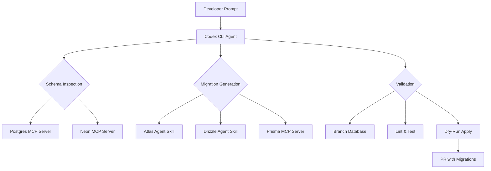
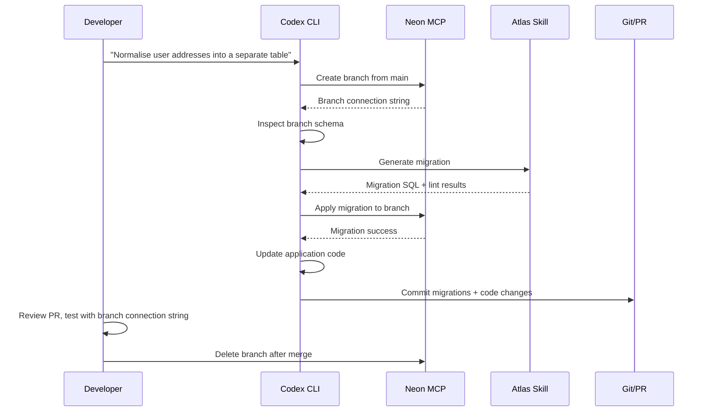

# Codex CLI and Database Migrations: Atlas Skills, MCP Servers, and Schema-Driven Workflows


---

Database schema migrations sit at the intersection of precision and risk — the kind of task where agentic coding either shines or causes real damage. Codex CLI's skill and MCP ecosystems now provide a layered toolkit for safe, agent-driven database workflows: the Atlas agent skill for deterministic migration generation, Postgres and Neon MCP servers for live schema inspection, and ORM-specific skills for Drizzle and Prisma. This article maps the full stack, from `SKILL.md` installation to branch-isolated migration validation.

## The Migration Safety Problem

Letting an AI agent write `ALTER TABLE` statements against a production database is, to put it mildly, inadvisable. The challenge is threefold:

1. **Schema drift** — the agent's mental model of the database diverges from reality
2. **Destructive irreversibility** — a dropped column cannot be un-dropped
3. **Data-dependent correctness** — a migration that passes on an empty dev database may fail on production data with constraint violations

Codex CLI addresses each layer through a different mechanism: MCP servers provide live schema truth, agent skills enforce deterministic workflows, and branch-based databases offer disposable sandboxes.



## Layer 1: Schema Inspection via MCP

Before generating any migration, the agent needs an accurate picture of the current schema. Two MCP server patterns dominate.

### The Postgres MCP Server

The reference `@modelcontextprotocol/server-postgres` package provides read-only schema inspection and query execution[^1]. Registration is a single command:

```bash
codex mcp add postgres-dev -- \
  npx -y @modelcontextprotocol/server-postgres \
  "$DATABASE_URL"
```

This creates a `[mcp_servers.postgres-dev]` entry in `~/.codex/config.toml`[^2]. The server exposes schema introspection (column names, types, constraints) and read query execution. For migration workflows, the critical capability is inspecting the current state so the agent can diff against desired state.

**Security note:** passing `DATABASE_URL` directly as an argument embeds credentials in the config file. The safer pattern uses an environment variable wrapper:

```toml
[mcp_servers.postgres-dev]
command = "npx"
args = ["-y", "@modelcontextprotocol/server-postgres"]
env = { DATABASE_URL_FROM = "DEV_DATABASE_URL" }
```

### The Neon MCP Server

Neon's MCP server adds branch-based isolation to the inspection layer[^3]. Configuration uses the remote MCP transport:

```toml
[mcp_servers.neon]
url = "https://mcp.neon.tech/mcp"
bearer_token_env_var = "NEON_API_KEY"
```

The `experimental_use_rmcp_client = true` flag is required in `config.toml` for remote MCP connections. Once configured, Codex can create instant copy-on-write database branches — production-like sandboxes where destructive migrations fail harmlessly[^4].

### Supabase MCP

Supabase's hosted MCP server provides a similar remote integration, with tools organised into feature groups covering project management, table design, migration generation, and SQL querying[^5]. The remote transport configuration mirrors Neon's pattern.

## Layer 2: The Atlas Agent Skill

Atlas — the "Terraform for databases" — provides the most mature agent skill for migration workflows[^6]. The skill packages Atlas's entire CLI surface into a `SKILL.md` that Codex loads automatically when database operations are detected.

### Installation

```bash
mkdir -p ~/.codex/skills/atlas
# Download SKILL.md and references
curl -o ~/.codex/skills/atlas/SKILL.md \
  https://atlasgo.io/guides/ai-tools/agent-skills/SKILL.md
mkdir -p ~/.codex/skills/atlas/references
curl -o ~/.codex/skills/atlas/references/schema-sources.md \
  https://atlasgo.io/guides/ai-tools/agent-skills/references/schema-sources.md
```

For team-wide consistency, commit the skill to `.codex/skills/atlas/` in the repository root[^7].

### The Deterministic Workflow

The Atlas skill enforces a seven-step pipeline that the agent follows regardless of prompting style[^6]:

1. **Inspect** — `atlas schema inspect` reads the current database state
2. **Edit** — modify schema source files (HCL, SQL, or ORM definitions)
3. **Validate** — `atlas schema validate` checks syntax and semantics
4. **Generate** — `atlas migrate diff` produces a versioned migration file
5. **Lint** — `atlas migrate lint` catches destructive changes, naming violations, and policy breaches
6. **Test** — `atlas migrate test` executes against a dev database (requires Atlas Cloud login)
7. **Apply** — `atlas migrate apply --dry-run` previews, then applies

The skill's critical rules prevent the agent from hardcoding credentials, skipping the lint step, or applying without a dry-run preview[^6].

### Multi-Dialect Support

Atlas supports MySQL, PostgreSQL, SQLite, SQL Server, and ClickHouse[^6]. The same skill works across dialects because `atlas.hcl` encapsulates the connection details:

```hcl
env "dev" {
  src = "file://schema.hcl"
  url = getenv("DATABASE_URL")
  dev = "docker://postgres/17/dev?search_path=public"
  migration {
    dir = "file://migrations"
  }
}
```

The `dev` database URL is crucial — it determines whether Atlas operates in schema-scoped or database-scoped mode, affecting how extensions and cross-schema references are handled[^7].

### ORM Integration

Atlas can diff against ORM schema definitions rather than raw SQL. Supported ORMs include GORM, Drizzle, SQLAlchemy, Django, Ent, Sequelize, and TypeORM[^6]. This means the agent can modify a Drizzle TypeScript schema file, and Atlas generates the corresponding SQL migration automatically.

## Layer 3: ORM-Specific Skills and MCP Servers

### Drizzle Agent Skill

The Drizzle migration skill — available from multiple community authors on SkillsMP and Smithery[^8] — guides the agent through Drizzle Kit's `generate → review → migrate` pipeline:

```bash
# Agent follows this sequence:
bun run db:generate   # Reads schema files, diffs, emits SQL
# Agent reviews generated SQL for DROP statements
bun run db:migrate    # Applies with migration journaling
```

The skill includes a mandatory SQL review checklist, catching unintended `DROP` statements and foreign key ordering issues before application[^8]. Install project-locally:

```bash
mkdir -p .codex/skills/drizzle-migration
# Place SKILL.md with Drizzle Kit workflow instructions
```

### Prisma MCP Server

Prisma takes a different approach: rather than a `SKILL.md` skill, it exposes migration tools via a local MCP server built into the Prisma CLI (v6.6.0+)[^9]:

```bash
npx -y prisma mcp
```

This exposes `migrate-dev`, `migrate-status`, and `migrate-reset` as MCP tools, alongside schema introspection and query execution[^9]. Prisma includes built-in safety checks that detect invocation by AI coding agents and block destructive commands like `prisma migrate reset --force` unless the developer explicitly sets `PRISMA_USER_CONSENT_FOR_DANGEROUS_AI_ACTION`[^10].

For Codex CLI, register as a local MCP server:

```toml
[mcp_servers.prisma]
command = "npx"
args = ["-y", "prisma", "mcp"]
```

## The Branch-Isolated Migration Pattern

The safest agent-driven migration workflow combines Neon branches with Atlas or Drizzle:



The Neon branch acts as a disposable sandbox — an instant copy-on-write clone of production data where syntax errors and constraint violations fail safely[^4]. The agent can autonomously retry failed migrations on the branch without any risk to production.

### AGENTS.md for Database Projects

A production `AGENTS.md` for database-heavy projects should codify migration safety rules:

```markdown
# Database Migration Rules

## CRITICAL
- NEVER execute migrations against production databases
- ALWAYS use a branch or dev database for migration testing
- NEVER hardcode database credentials — use environment variables
- ALWAYS run `atlas migrate lint` or review generated SQL before applying

## Workflow
1. Inspect current schema via MCP before generating migrations
2. Generate migration files using Atlas or Drizzle Kit
3. Lint/review generated SQL for destructive operations
4. Apply to branch/dev database first
5. Commit migration files to version control
6. Production application happens via CI/CD pipeline only

## Test Commands
- `atlas migrate lint --env dev` — lint migrations
- `bun run db:generate && bun run db:check` — Drizzle validation
- `npx prisma migrate status` — Prisma migration status
```

## The MCP Server Landscape: Gaps and Maturity

The current database migration MCP ecosystem is uneven. A recent ChatForest survey rated the overall landscape 2.5 out of 5[^11]. The tools with solid MCP support — Prisma, Atlas, Drizzle, and Neon — cover the TypeScript and Go ecosystems well. But significant gaps remain:

| Tool | MCP Status | Notes |
|------|-----------|-------|
| **Atlas** | Community (`mcp-atlas`), 5 tools | Declarative, multi-dialect |
| **Prisma** | Official (CLI v6.6.0+) | Built-in safety checks |
| **Drizzle** | Community (`drizzle-mcp`) | SQLite + PostgreSQL only |
| **Neon** | Official (remote MCP) | Branch isolation |
| **Supabase** | Official (remote MCP) | Full project management |
| **Flyway** | ❌ None | 10.7K GitHub stars, zero MCP[^11] |
| **Alembic** | ❌ None | Python/SQLAlchemy standard[^11] |
| **golang-migrate** | ❌ None | 16.4K GitHub stars[^11] |
| **Rails migrations** | ❌ None | The original migration framework[^11] |
| **Liquibase** | ⚠️ Private preview | 19 tools, registration-gated[^11] |

For teams using Flyway, Alembic, or Rails migrations, the current workaround is writing a custom `SKILL.md` that wraps the CLI commands — functional but less integrated than a native MCP server.

## Multi-Agent Migration Workflows

For complex schema changes spanning multiple services, Codex CLI's subagent architecture enables parallel migration work:

```toml
[agents.schema-analyst]
model = "o3"
instructions = """
Inspect the current database schema via MCP.
Identify all tables affected by the requested change.
Produce a migration plan with dependency ordering.
"""

[agents.migration-writer]
model = "gpt-5.4"
instructions = """
Given the migration plan from schema-analyst,
generate Atlas migration files.
Run atlas migrate lint on each file.
Report any lint warnings.
"""
```

The schema analyst uses a reasoning model to plan the change, whilst the migration writer generates and validates the actual SQL. This separation prevents the writer from making assumptions about the current schema state.

## Known Limitations

- **Prisma's remote MCP server** works only with Prisma Postgres — self-hosted PostgreSQL requires the local MCP server[^9]
- **Neon branch-based workflows** require a Neon account and are limited to PostgreSQL[^4]
- **Atlas Cloud features** (testing, linting policies) require an Atlas Cloud login[^6]
- **No rollback MCP support** — none of the current MCP servers expose automated rollback tools; Liquibase's private preview is the only exception[^11]
- **Cross-database orchestration** — no MCP server currently handles migrations across multiple database instances in a single workflow[^11]
- ⚠️ The `mcp-atlas` community MCP server is maintained by a solo developer, and adoption metrics are unclear[^11]

## Citations

[^1]: [PostgreSQL MCP Server — Anthropic reference implementation](https://www.pulsemcp.com/servers/modelcontextprotocol-postgres)
[^2]: [Creating and using Postgres MCP with Codex — Greycloak](https://greycloak.com/post/2026-02-20-creating-and-using-mcp-postres/)
[^3]: [Neon MCP Server overview — Neon Docs](https://neon.com/docs/ai/neon-mcp-server)
[^4]: [Safe AI-powered schema refactoring with OpenAI Codex and Neon — Neon Guides](https://neon.com/guides/openai-codex-neon-mcp)
[^5]: [Model Context Protocol (MCP) — Supabase Docs](https://supabase.com/docs/guides/getting-started/mcp)
[^6]: [Database Schema Migration Skill for AI Agents — Atlas Guides](https://atlasgo.io/guides/ai-tools/agent-skills)
[^7]: [OpenAI Codex with Atlas — Atlas Guides](https://www.atlasgo.io/guides/ai-tools/codex-instructions)
[^8]: [Drizzle Migration Agent Skill — Smithery](https://smithery.ai/skills/Dexploarer/drizzle-migration)
[^9]: [Prisma MCP Server Documentation](https://www.prisma.io/docs/postgres/integrations/mcp-server)
[^10]: [About MCP Servers & How We Built One for Prisma — Prisma Blog](https://www.prisma.io/blog/about-mcp-servers-and-how-we-built-one-for-prisma)
[^11]: [Database Migration & Schema Management MCP Servers — ChatForest](https://chatforest.com/reviews/database-migration-mcp-servers/)
