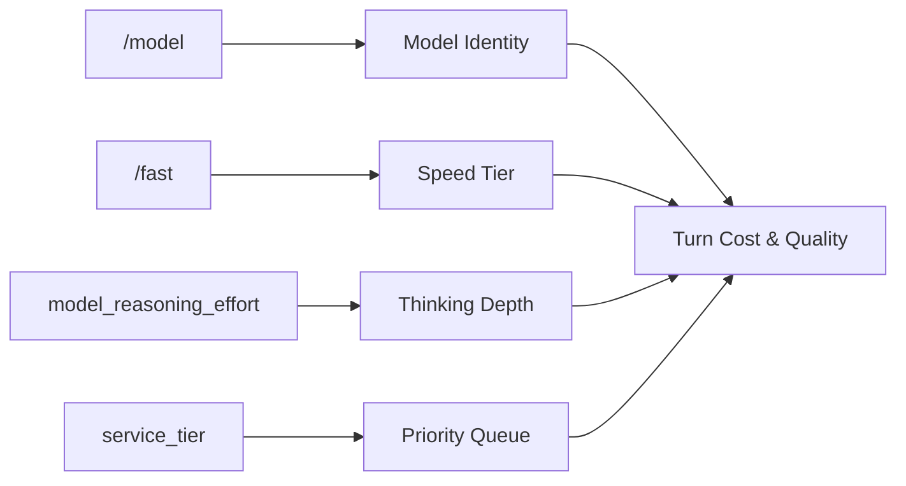
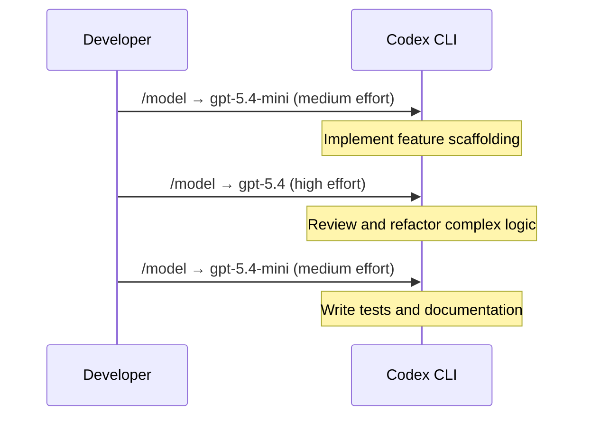
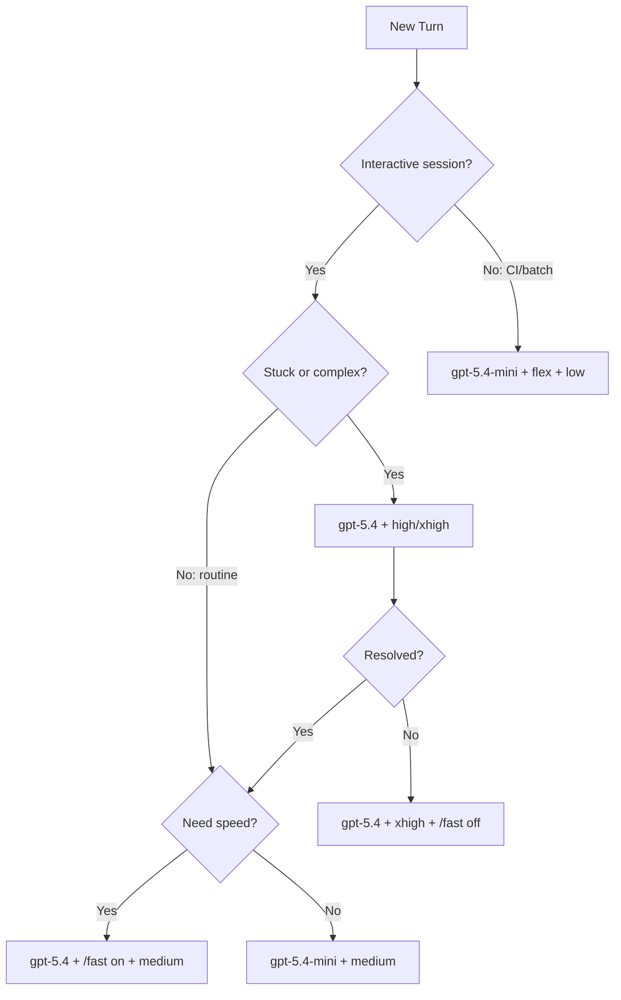

# Dynamic Model Routing in Codex CLI: Mid-Session Switching, /fast Mode, and Service Tier Workflows


---

Not every turn in a Codex CLI session demands the same model, the same speed, or the same reasoning depth. A planning pass benefits from deep deliberation; a batch of file renames does not. Since v0.117.0, Codex CLI lets you change the model, reasoning effort, fast mode, and service tier *within a running session* — without losing context or restarting. This article explains every lever, how they interact, and how to compose them into cost-effective workflow patterns.

## The Four Routing Levers

Codex CLI exposes four independent controls that together determine what model runs, how hard it thinks, how quickly it responds, and how much it costs per turn.



| Lever | Slash Command | Config Key | Values |
|---|---|---|---|
| Model | `/model` | `model` | `gpt-5.4`, `gpt-5.4-mini`, `gpt-5.3-codex`, `gpt-5.3-codex-spark` |
| Fast mode | `/fast on/off/status` | `features.fast_mode`, `service_tier = "fast"` | on / off |
| Reasoning effort | via `/model` picker | `model_reasoning_effort` | `minimal`, `low`, `medium`, `high`, `xhigh` |
| Service tier | CLI flag only | `service_tier` | `fast`, `flex` |

## Switching Models Mid-Session with /model

The `/model` command opens a picker listing every model available to your account[^1]. Selecting a new model applies it to all subsequent turns in the session — the full conversation history carries forward without truncation or re-encoding[^2].

```bash
# Start a session with the default model
codex

# After initial planning, switch to a cheaper model for implementation
/model
# → Select gpt-5.4-mini from the picker
```

When the active provider is a local server (Ollama or LM Studio), `/model` fetches the available model list directly from the running endpoint and presents a searchable picker[^3]. Subsequent selections of the same model switch instantly without re-prompting.

### What Happens to Context on Switch

The conversation transcript, plan history, and approval decisions persist across model switches[^4]. The new model receives the same input context — it simply produces its next response using different weights. This means you can:

1. Plan with `gpt-5.4` at `high` reasoning effort
2. Switch to `gpt-5.4-mini` for rapid implementation
3. Switch back to `gpt-5.4` for a final review pass

Each model sees the full thread. The only constraint is context window size — if you switch to a model with a smaller window, compaction may trigger earlier.

## /fast Mode: 1.5x Speed at 2x Credits

Fast mode is currently exclusive to GPT-5.4[^5]. When enabled, the model runs 1.5× faster with identical intelligence and reasoning capability — the speed-up comes from infrastructure prioritisation, not model degradation[^6].

### Toggling Fast Mode

```bash
/fast on      # Enable fast mode
/fast off     # Disable fast mode
/fast status  # Check current setting
```

### Persistent Configuration

To default to fast mode for all sessions:

```toml
# ~/.codex/config.toml
service_tier = "fast"

[features]
fast_mode = true
```

### When to Use Fast Mode

Fast mode excels during interactive development where maintaining flow state matters more than credit efficiency[^7]:

- **Live debugging sessions** — rapid iteration on failing tests
- **Interactive prototyping** — quick feedback on UI changes
- **Steer mode corrections** — mid-turn steering benefits from faster response

Fast mode is wasteful for background tasks, batch processing, or overnight codex exec runs where latency is irrelevant.

> **Availability note:** Fast mode requires a ChatGPT subscription (Plus or Pro). API key users cannot access fast mode credits and instead use standard API pricing[^5].

## Service Tiers: fast vs flex

Beyond the `/fast` toggle, Codex CLI supports a `service_tier` configuration that controls the priority queue for API requests[^8].

| Tier | Speed | Cost | Best For |
|---|---|---|---|
| `fast` | 1.5× baseline | 2× credits | Interactive sessions, live debugging |
| *(default)* | Baseline | 1× credits | General development |
| `flex` | Variable (higher latency) | ~50% cheaper | CI/CD pipelines, batch processing, overnight tasks |

The `flex` tier accepts additional latency in exchange for significant cost savings[^9]. It is ideal for non-time-sensitive workloads like:

```toml
# Profile for CI pipeline runs
[profiles.ci]
model = "gpt-5.4-mini"
service_tier = "flex"
model_reasoning_effort = "medium"
```

## Reasoning Effort: Five Levels of Thinking Depth

The `model_reasoning_effort` parameter controls how many reasoning tokens the model generates before producing its response[^10]. Lower effort favours speed and token efficiency; higher effort favours deeper analysis.

| Level | Use Case | Relative Cost |
|---|---|---|
| `minimal` | Boilerplate, simple renames | Lowest |
| `low` | Straightforward CRUD, formatting | Low |
| `medium` | General development (recommended default) | Moderate |
| `high` | Complex refactoring, architecture decisions | High |
| `xhigh` | Deep debugging, security review, benchmark-grade quality | Highest |

GPT-5.4 achieved 57.7% on SWE-Bench Pro in `xhigh` mode[^11] — but for routine file operations, `medium` produces equivalent results at a fraction of the cost.

### Plan Mode Reasoning Override

Codex CLI supports a separate reasoning effort for plan mode via `plan_mode_reasoning_effort`[^12]. When unset, plan mode uses its built-in preset default (currently `medium`). When explicitly set — including to `none` — it overrides the preset:

```toml
# Daily driver config
model_reasoning_effort = "medium"
plan_mode_reasoning_effort = "high"
```

This pattern uses deeper reasoning only during planning, then reverts to standard effort during execution.

### Additional Reasoning Controls

Two lesser-known config keys fine-tune reasoning output:

```toml
# Control reasoning summary verbosity
model_reasoning_summary = "concise"    # auto | concise | detailed | none

# Force reasoning metadata for custom providers
model_supports_reasoning_summaries = true
```

## Composing the Levers: Workflow Patterns

### Pattern 1: The Cost-Conscious Sprint

Start cheap, escalate only when needed.



**Estimated savings:** GPT-5.4-mini costs 18.75 credits/M input tokens vs 62.50 for GPT-5.4[^13] — a 70% reduction on implementation and testing turns.

### Pattern 2: The Interactive Deep Session

Maximise speed for flow state, then review.

```toml
# Start with fast mode for rapid iteration
[features]
fast_mode = true

# Switch off for final review
# /fast off (mid-session)
```

```bash
# Session workflow:
codex
# → Rapid prototyping with /fast on, gpt-5.4, medium effort
# → When stuck: /fast off, increase to high effort
# → Final review: /model gpt-5.4, xhigh effort, /fast off
```

### Pattern 3: The CI Pipeline Optimiser

Use profiles to hard-code the cheapest viable configuration:

```toml
[profiles.ci]
model = "gpt-5.4-mini"
model_reasoning_effort = "low"
service_tier = "flex"

[profiles.deep-review]
model = "gpt-5.4"
model_reasoning_effort = "xhigh"
```

```bash
# CI runs use the cheap profile
codex --profile ci exec "Run the test suite and fix failures"

# Code review uses the expensive profile
codex --profile deep-review exec review --base main
```

### Pattern 4: Spark for Drafts, Flagship for Final

GPT-5.3-Codex-Spark delivers 1,000+ tokens per second on Cerebras WSE-3 hardware[^14], making it ideal for rapid draft generation:

```bash
codex
/model
# → Select gpt-5.3-codex-spark
# Generate 3-4 implementation approaches rapidly

/model
# → Select gpt-5.4
# Review and select the best approach
```

> **Access note:** Spark is restricted to ChatGPT Pro subscribers and is text-only with a 128K context window[^15].

## The Model Routing Decision Matrix



## Subagent Model Routing

When using multi-agent workflows, each subagent can specify its own model in its TOML definition file under `.codex/agents/`[^16]:

```toml
# .codex/agents/implementer.toml
model = "gpt-5.4-mini"
model_reasoning_effort = "medium"

# .codex/agents/reviewer.toml
model = "gpt-5.4"
model_reasoning_effort = "high"
```

This creates a natural cost hierarchy: cheap models for implementation workers, expensive models for review and orchestration. The `[agents]` config section controls parallelism:

```toml
[agents]
max_threads = 4
max_depth = 1
```

Combined with model routing, a four-subagent swarm using `gpt-5.4-mini` costs roughly the same as a single `gpt-5.4` agent — but produces four parallel work streams.

## Token Economics of Dynamic Routing

The April 2026 credit-based pricing makes the cost difference between routing strategies concrete[^13]:

| Model | Input (credits/M) | Output (credits/M) | Cached (credits/M) |
|---|---|---|---|
| GPT-5.4 | 62.50 | 375.00 | 6.25 |
| GPT-5.4-mini | 18.75 | 113.00 | 1.875 |
| GPT-5.3-Codex | 43.75 | 350.00 | 4.375 |

With `/fast on`, all rates double. With `service_tier = "flex"`, rates drop by approximately 50%[^9].

**Worked example:** A 20-turn session where 14 turns are routine implementation and 6 turns are complex review:

- **All GPT-5.4:** ~1,250 output credits (assuming 200K output tokens)
- **Routed (14×mini + 6×5.4):** ~810 output credits — a **35% saving**
- **Routed + flex on routine turns:** ~695 output credits — a **44% saving**

## Configuration Precedence

When multiple configuration sources set different models or tiers, Codex CLI resolves them in this order (highest priority first)[^17]:

1. Mid-session `/model` or `/fast` command
2. CLI flags (`-m`, `--service-tier`, `-c key=value`)
3. Project config (`.codex/config.toml`)
4. User config (`~/.codex/config.toml`)
5. System/managed config
6. Built-in defaults

A `/model` switch mid-session overrides everything — including profile settings. This is intentional: the developer at the keyboard always has final say.

## Known Limitations

- **No per-turn model in codex exec:** The `codex exec` non-interactive mode uses a single model for the entire run. Dynamic switching requires the interactive TUI[^18].
- **Spark context ceiling:** GPT-5.3-Codex-Spark has a 128K context window vs 1M for GPT-5.4[^15]. Switching to Spark late in a long session may trigger immediate compaction.
- **Fast mode is GPT-5.4 only:** The `/fast` toggle has no effect on other models[^5].
- **No reasoning slash command yet:** While `/model` includes a reasoning effort picker, a dedicated `/reasoning` slash command was requested in issue #2106 but has not yet shipped[^19].
- ⚠️ The interaction between `service_tier = "flex"` and `/fast on` within the same session is not well-documented. In testing, `/fast on` appears to override the flex tier, but this behaviour may change.

## Citations

[^1]: [Slash commands in Codex CLI — OpenAI Developers](https://developers.openai.com/codex/cli/slash-commands)
[^2]: [How to Switch Models in Codex CLI — Inventive HQ](https://inventivehq.com/knowledge-base/openai/how-to-switch-models)
[^3]: [feat: /model support for LM Studio and Ollama local model switching — GitHub Issue #17261](https://github.com/openai/codex/issues/17261)
[^4]: [Features — Codex CLI — OpenAI Developers](https://developers.openai.com/codex/cli/features)
[^5]: [Speed — Codex CLI — OpenAI Developers](https://developers.openai.com/codex/speed)
[^6]: [OpenAI Developers on X — Codex got more speed](https://x.com/OpenAIDevs/status/2029635632918843610)
[^7]: [How GPT-5.4 Codex Fast Mode Changes Developer Productivity — Goldie Agency](https://goldie.agency/gpt-5-4-codex-fast-mode/)
[^8]: [Configuration Reference — Codex — OpenAI Developers](https://developers.openai.com/codex/config-reference)
[^9]: [Pricing — Codex — OpenAI Developers](https://developers.openai.com/codex/pricing)
[^10]: [Reasoning models — OpenAI API](https://developers.openai.com/api/docs/guides/reasoning)
[^11]: [Introducing GPT-5.4 — OpenAI](https://openai.com/index/introducing-gpt-5-4/)
[^12]: [Advanced Configuration — Codex — OpenAI Developers](https://developers.openai.com/codex/config-advanced)
[^13]: [Pricing — Codex — OpenAI Developers](https://developers.openai.com/codex/pricing)
[^14]: [GPT-5.3-Codex-Spark: Cerebras-Powered Real-Time Coding — codex.danielvaughan.com](https://codex.danielvaughan.com/2026/03/28/codex-spark-cerebras-ultrafast-model/)
[^15]: [Models — Codex — OpenAI Developers](https://developers.openai.com/codex/models)
[^16]: [Codex CLI Multi-Agent v2 — OpenAI Developers](https://developers.openai.com/codex/cli/features)
[^17]: [Config basics — Codex — OpenAI Developers](https://developers.openai.com/codex/config-basic)
[^18]: [Command line options — Codex CLI — OpenAI Developers](https://developers.openai.com/codex/cli/reference)
[^19]: [Add /reasoning slash command — GitHub Issue #2106](https://github.com/openai/codex/issues/2106)
