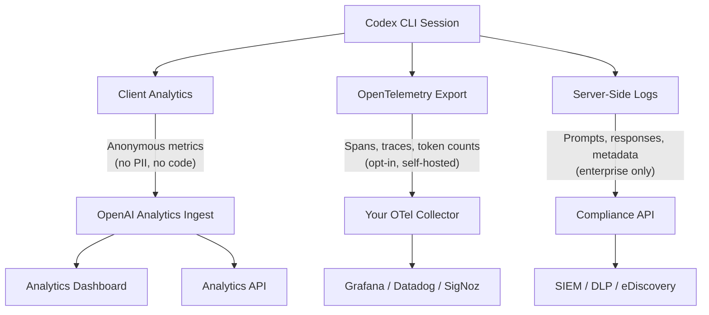
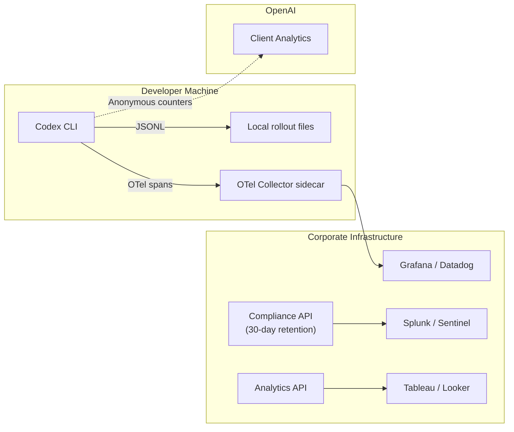

# Codex CLI Governance APIs: Analytics Dashboard, Compliance Exports, and the Enterprise Audit Pipeline


---

Codex CLI ships three distinct data pipelines — client-side analytics, the Analytics API, and the Compliance API — each serving a different audience and governed by different controls. As the PR to enable general analytics by default lands [^1], and enterprise teams scale from a handful of CLI users to hundreds, understanding what data flows where, who controls it, and how to wire it into your existing SIEM and audit toolchain has become a practical necessity rather than a nice-to-have.

This article maps the complete governance data architecture, from the anonymous metrics leaving every CLI session through to the Compliance API exports your security team feeds into Splunk.

## The Three Data Pipelines

Codex's observability story is not a single stream — it is three independent pipelines with different purposes, different privacy profiles, and different configuration surfaces.



### Pipeline 1: Client-Side Analytics

Client analytics are lightweight, anonymous counters that help OpenAI detect product issues and understand feature adoption [^2]. Every metric is prefixed with `codex.` and none contain code, prompts, file paths, or personally identifiable information [^3].

Representative metrics include:

- Feature flags in use (e.g. `codex_hooks`, `multi_agent`, `smart_approvals`)
- Counts of `/review` commands executed per session
- Approval requests approved versus refused
- Average tool-call duration [^3]

As of v0.120.0, analytics default to **enabled** — except in jurisdictions where opt-out is legally required [^1]. The collection code lives in the open-source repository, making it auditable by anyone [^3].

**Opting out** is a single TOML key:

```toml
[analytics]
enabled = false
```

For enterprise-wide enforcement, place this in `requirements.toml`:

```toml
# /etc/codex/requirements.toml (Unix)
# Enforced — users cannot override
[analytics]
enabled = false
```

Or distribute it via MDM on macOS:

```
com.openai.codex → requirements_toml_base64 = <base64-encoded TOML>
```

Cloud-managed requirements (ChatGPT Business/Enterprise) take the highest precedence, followed by MDM, then the system `requirements.toml` [^4].

### Pipeline 2: OpenTelemetry Export

OTel is entirely opt-in and disabled by default [^5]. Unlike client analytics, OTel spans flow to **your** infrastructure — Grafana, Jaeger, SigNoz, Datadog, VictoriaMetrics — and can include rich operational detail:

```toml
[otel]
environment = "production"
exporter = "otlp-http"
log_user_prompt = false  # Redact prompts by default

[otel.exporter.otlp-http]
endpoint = "https://otel.internal.example.com/v1/logs"
protocol = "binary"
headers = { "x-otlp-api-key" = "${OTLP_TOKEN}" }
```

Events tracked include API requests, stream events, WebSocket activity, tool decisions, and — if explicitly enabled — prompt text [^5]. The critical control is `log_user_prompt`: leave it `false` unless your security team has explicitly approved prompt logging, as prompts may contain file contents or credentials pasted by users.

Enterprise admins can pin OTel settings via managed defaults:

```toml
# /etc/codex/managed_config.toml
[otel]
environment = "prod"
exporter = "otlp-http"
log_user_prompt = false
```

This ensures every developer's CLI session emits traces to the corporate collector without relying on individual configuration [^4].

### Pipeline 3: Compliance API

The Compliance API is the enterprise audit backbone — designed for integration with eDiscovery, DLP, and SIEM systems [^6]. Unlike client analytics (anonymous counters) or OTel (operational traces), the Compliance API exports the full conversation record:

- Prompt text sent to Codex
- Model responses
- Workspace, user, timestamp, and model identifiers
- Token usage and request metadata [^6]

**Data retention:** Audit logs persist for up to 30 days for ChatGPT-authenticated usage. API-key-authenticated sessions follow your organisation's settings and are not included in Compliance API exports [^6].

This distinction matters: if your CI/CD pipelines use API keys via `CODEX_API_KEY`, those `codex exec` runs will **not** appear in Compliance API output. For full audit coverage in regulated environments, use ChatGPT authentication with device-code flow even in CI [^7].

## The Analytics Dashboard and API

The self-serve Analytics Dashboard provides adoption visibility across all four Codex surfaces (CLI, IDE Extension, Cloud, Code Review) [^6]:

- Daily active users segmented by surface
- Code review completion rates and priority distributions
- Cloud task activity and VS Code extension usage
- Session starts and per-user message counts

Data exports in CSV or JSON format enable custom analysis in your BI tooling [^6].

The **Analytics API** offers the same data programmatically with daily time-series granularity, optional per-user and per-client breakdowns, and cursor-based pagination [^6]. Available metrics include:

- Thread, turn, and credit totals with client-surface segmentation
- Pull request reviews and comment generation counts
- User engagement metrics (replies, reactions, upvotes/downvotes)

For a team tracking Codex ROI — a common ask from engineering leadership — the Analytics API provides the hard numbers without requiring JSONL parsing or third-party tools.

## Enterprise Configuration Precedence

Understanding the precedence stack is essential for governance teams. Codex applies configuration in this order (highest wins) [^4]:

| Layer | Source | Can user override? |
|-------|--------|--------------------|
| 1 | Cloud-managed requirements (Business/Enterprise workspace) | No |
| 2 | macOS MDM preferences (`com.openai.codex`) | No |
| 3 | System `requirements.toml` (`/etc/codex/requirements.toml`) | No |
| 4 | Managed defaults (`managed_config.toml`) | Yes (per session) |
| 5 | User `config.toml` | Yes |
| 6 | CLI flags and `-c key=value` overrides | Yes |

Requirements (layers 1–3) are **non-overridable constraints**. Managed defaults (layer 4) are starting values that users can adjust during a session [^4]. This two-tier model lets admins enforce security boundaries (analytics, sandbox mode, approval policy) whilst allowing developers flexibility on preferences (model selection, reasoning effort, personality).

Group-based assignment enables different requirements for different teams — the security team might enforce `read-only` sandbox mode while the platform team operates in `workspace-write` [^4].

## Community Monitoring Ecosystem

Beyond the first-party governance APIs, a healthy ecosystem of community tools fills gaps in local monitoring:

**ccusage** parses local JSONL session files to produce daily, monthly, and per-session cost reports [^8]. The `@ccusage/codex` package handles Codex-specific rollout formats. It runs entirely offline using pre-cached pricing data — no API calls required.

**Codextime** takes a team-oriented approach: each developer runs `npx codextime-tracker <userId>`, which streams session data to a shared Supabase dashboard with usage heatmaps, subscription ROI calculations, and cost forecasting [^9].

**SessionWatcher** and **CodexBar** provide macOS menu-bar widgets showing live token consumption, rate limits, burn rate, and time remaining in the current billing window [^10][^11]. At $2.99 one-time, SessionWatcher auto-detects Codex sessions and displays per-model token breakdowns (input, output, cache, reasoning).

**SigNoz** offers a pre-built Codex dashboard template that visualises OTel spans from Codex CLI sessions, including token counts, tool-call latency, and API error rates [^12].

These tools operate at different layers: ccusage and Codextime analyse local JSONL (no data leaves your machine unless you choose Supabase), whilst SigNoz and Datadog consume OTel exports that you explicitly configure.

## Wiring It Together: A Production Audit Architecture

For a regulated enterprise (SOC 2, HIPAA, FedRAMP), the recommended architecture layers all three pipelines:



1. **Client analytics** — leave enabled for product health unless policy prohibits any third-party telemetry. The data is genuinely anonymous [^3].
2. **OTel** — route to your corporate collector with `log_user_prompt = false`. Use for operational monitoring: API latency, tool-call failure rates, compaction frequency [^5].
3. **Compliance API** — poll daily to ingest conversation records into your SIEM. Set up alerts for anomalous patterns (e.g. a session touching 500+ files, or prompts containing keywords matching your DLP dictionary) [^6].
4. **Local JSONL** — run ccusage in CI to generate weekly cost reports per team, catching runaway sessions before they hit billing surprises [^8].

## Privacy Checklist for Engineering Leaders

Before rolling out Codex CLI to your organisation, verify these controls:

- [ ] `[analytics] enabled` — decide whether anonymous metrics are acceptable under your data policy
- [ ] `[otel] log_user_prompt = false` — enforce via `managed_config.toml` unless explicitly approved
- [ ] Compliance API integration — confirm 30-day retention aligns with your audit requirements; extend via SIEM archival if needed
- [ ] API-key sessions — understand these fall outside Compliance API; use ChatGPT auth for full coverage
- [ ] `requirements.toml` distributed — ensure constraints cannot be overridden locally
- [ ] MDM profiles deployed — for macOS fleets, distribute via Jamf/Kandji/Fleet [^4]

## What's Missing

The governance story is solid but not complete. ⚠️ There is currently no built-in mechanism to preview exactly which analytics metrics will be transmitted before they are sent — the community requested an interactive `codex analytics show` command, which OpenAI declined in favour of documentation-only transparency [^3]. For teams that require packet-level verification, intercepting traffic to OpenAI's analytics endpoint via a corporate proxy remains the only option.

Additionally, `codex exec` sessions authenticated via API keys are invisible to the Compliance API [^6]. If your CI/CD pipelines are a significant source of Codex usage, this creates an audit gap that must be filled by local JSONL analysis or OTel exports.

## Citations

[^1]: GitHub Discussion #8291 — Codex Client Analytics. [https://github.com/openai/codex/discussions/8291](https://github.com/openai/codex/discussions/8291)
[^2]: OpenAI Developers — Advanced Configuration: Metrics. [https://developers.openai.com/codex/config-advanced](https://developers.openai.com/codex/config-advanced)
[^3]: GitHub Discussion #8291 — Community Q&A on analytics data, PII exclusion, and opt-out mechanisms. [https://github.com/openai/codex/discussions/8291](https://github.com/openai/codex/discussions/8291)
[^4]: OpenAI Developers — Managed Configuration. [https://developers.openai.com/codex/enterprise/managed-configuration](https://developers.openai.com/codex/enterprise/managed-configuration)
[^5]: OpenAI Developers — Advanced Configuration: OTel. [https://developers.openai.com/codex/config-advanced](https://developers.openai.com/codex/config-advanced)
[^6]: OpenAI Developers — Governance: Analytics API and Compliance API. [https://developers.openai.com/codex/enterprise/governance](https://developers.openai.com/codex/enterprise/governance)
[^7]: OpenAI Developers — Codex CLI Authentication. [https://developers.openai.com/codex/cli](https://developers.openai.com/codex/cli)
[^8]: ryoppippi/ccusage — CLI tool for analysing Claude Code/Codex CLI usage from local JSONL files. [https://github.com/ryoppippi/ccusage](https://github.com/ryoppippi/ccusage)
[^9]: Codextime — Codex Usage Tracker & OpenAI Cost Analytics. [https://codexti.me/](https://codexti.me/)
[^10]: SessionWatcher — Codex Monitor. [https://www.sessionwatcher.com/codex](https://www.sessionwatcher.com/codex)
[^11]: steipete/CodexBar — macOS menu-bar usage stats for OpenAI Codex and Claude Code. [https://github.com/steipete/CodexBar](https://github.com/steipete/CodexBar)
[^12]: SigNoz — OpenAI Codex Dashboard Template. [https://signoz.io/docs/dashboards/dashboard-templates/codex-dashboard/](https://signoz.io/docs/dashboards/dashboard-templates/codex-dashboard/)
