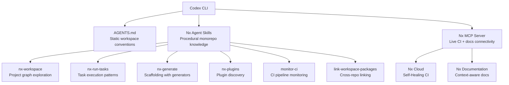
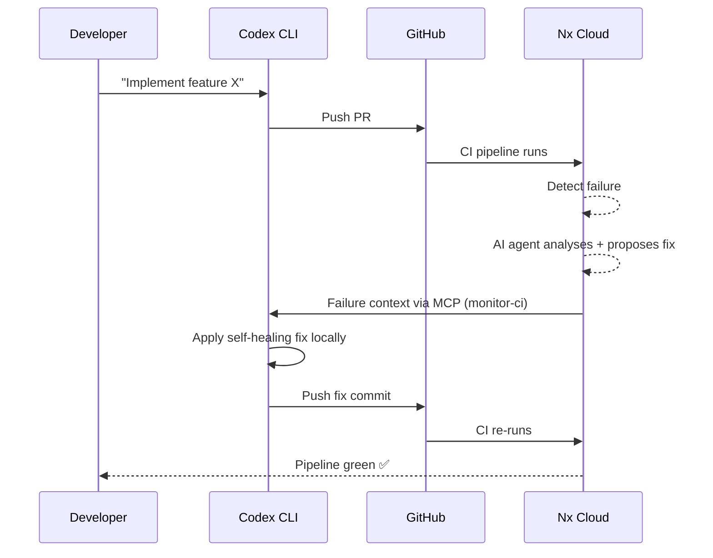

# Codex CLI and Nx: Agent Skills, Project Graph Awareness, and Self-Healing CI for Monorepos


---

Monorepos are where AI coding agents stumble hardest. A 200-package Nx workspace has implicit dependency chains, shared libraries, generator conventions, and CI pipelines that no amount of AGENTS.md prose can fully capture. Nx's answer — released in February 2026 — is a purpose-built set of agent skills and an MCP server that give Codex CLI structural awareness of the workspace graph, generator catalogue, and CI pipeline state[^1]. This article covers the complete integration: setup, the six core skills, the Nx MCP server, self-healing CI, and practical patterns for Codex CLI teams working in Nx monorepos.

## Why Generic AGENTS.md Falls Short in Monorepos

A well-crafted AGENTS.md can tell Codex "run `nx test my-lib` before committing" and "shared utilities live in `libs/shared/`." But it cannot dynamically convey which projects are affected by a change to `libs/shared/utils`, which generators your workspace provides for scaffolding a new library, or what the current CI pipeline status is for your branch. These require structured, queryable data — exactly what Nx's project graph provides.

The Nx integration solves this with a two-layer architecture: **skills** for procedural domain knowledge (workspace exploration, task execution, code generation) and an **MCP server** for live connectivity to Nx Cloud CI pipelines and documentation[^2].



## Setup: One Command, Full Integration

The `configure-ai-agents` command scaffolds everything Codex CLI needs[^3]:

```bash
npx nx configure-ai-agents
```

The interactive wizard prompts you to select which AI assistants to configure. For Codex CLI, it generates:

- An **AGENTS.md** file at the repository root with Nx-specific conventions (task commands, project structure guidance, generator usage patterns)
- **Skill files** copied into the workspace (for agents that lack plugin support, skills are delivered as files rather than installed via a plugin registry)[^4]
- **MCP server configuration** for connecting to Nx Cloud

For Codex CLI specifically, you need to wire the Nx MCP server into your `.codex/config.toml`:

```toml
[mcp_servers.nx]
command = "npx"
args = ["nx", "mcp"]
```

If your Nx version is below 21.4, use the standalone package instead:

```toml
[mcp_servers.nx]
command = "npx"
args = ["nx-mcp@latest"]
```

The MCP server supports three transport modes — `stdio` (default, used by Codex CLI), `sse`, and `http` — configured via the `--transport` flag[^5]. For most Codex CLI workflows, stdio is correct and requires no additional configuration.

## The Six Core Skills

Nx agent skills are portable instruction bundles that follow the agentskills.io SKILL.md format[^6]. Each skill teaches Codex a specific monorepo capability.

### 1. nx-workspace: Project Graph Exploration

The foundational skill. It teaches Codex how to explore the monorepo structure using Nx CLI commands rather than manually traversing directories:

```bash
# List all projects in the workspace
nx show projects

# Show projects affected by current changes
nx affected -t build --print-affected

# Open the interactive dependency graph
nx graph
```

This matters because Codex's default behaviour — reading `package.json` files and directory listings — misses implicit dependencies that Nx tracks through its project graph. The skill instructs Codex to query the graph first, then read source files[^7].

### 2. nx-run-tasks: Correct Task Execution

Monorepo task execution is deceptively complex. Running `npm test` at the root does not behave the same as `nx run my-lib:test`. This skill teaches three execution modes[^1]:

- **Single task**: `nx run <project>:<target>` — execute one specific task
- **Multiple tasks**: `nx run-many -t test --projects=lib-a,lib-b` — batch execution
- **Affected tasks**: `nx affected -t test` — only run tasks for projects affected by current changes

The affected command is particularly valuable for Codex CLI workflows: after making changes, Codex can run only the tests that matter, reducing feedback loop time in large workspaces.

### 3. nx-generate: Scaffolding with Generators

Rather than having Codex generate boilerplate from scratch (token-expensive, inconsistent), the skill teaches it to discover and use existing Nx generators[^2]:

```bash
# Discover available generators
nx list @nx/react

# Run a generator with flags
nx generate @nx/react:library --name=my-lib --directory=libs/shared
```

The key insight: "The generator handles the predictable scaffolding; the AI agent handles the intelligence of figuring out what to generate and where"[^1]. This produces code that follows existing workspace conventions — import paths, barrel files, test configuration — without burning tokens on boilerplate.

### 4. nx-plugins: Plugin Discovery and Installation

Teaches Codex to discover available Nx plugins and install them:

```bash
# List installed plugins and available capabilities
nx list

# Add a new plugin
nx add @nx/nest
```

### 5. monitor-ci: CI Pipeline Monitoring

This skill opens a communication channel between Codex CLI and Nx Cloud[^8]. When you push a PR and CI fails, the skill enables Codex to:

1. Query the current pipeline status via the Nx MCP server
2. Receive structured failure context (which task failed, error output, affected projects)
3. Propose and apply fixes locally
4. Push the fix and continue monitoring

### 6. link-workspace-packages: Cross-Repo Package Linking

Handles the mechanics of linking packages across monorepo boundaries for pnpm, yarn, npm, and bun[^1]. Useful when Codex needs to test changes against a consuming application in a different workspace.

## The Nx MCP Server: Live Workspace Intelligence

The MCP server runs in **minimal mode** by default, exposing only Nx Cloud connectivity tools to keep token overhead low[^5]. Workspace analysis tools are intentionally hidden because skills handle that more efficiently through "incrementally-loaded instructions rather than tool-call-based data dumps"[^5].

### Available MCP Tools

The server exposes twelve tools across three categories[^5]:

**Documentation and monitoring:**

- `nx_docs` — retrieves relevant Nx documentation for contextual queries
- `nx_current_running_tasks_details` — lists active Nx TUI processes
- `nx_current_running_task_output` — returns terminal output for specific running tasks
- `nx_visualize_graph` — opens interactive project graph visualisations

**Nx Cloud integration:**

- `ci_information` — retrieves pipeline execution data, failed tasks, and self-healing status
- `update_self_healing_fix` — applies or rejects suggested CI fixes from Nx Cloud

**Analytics (Nx Cloud):**

- `cloud_analytics_pipeline_executions_search` — identifies CI/CD trends
- `cloud_analytics_pipeline_execution_details` — investigates pipeline bottlenecks
- `cloud_analytics_runs_search` — tracks performance and productivity patterns
- `cloud_analytics_run_details` — investigates command execution performance
- `cloud_analytics_tasks_search` — aggregates task performance statistics
- `cloud_analytics_task_executions_search` — analyses individual task execution trends

For workspaces without Nx Cloud, you can filter the tool surface:

```toml
[mcp_servers.nx]
command = "npx"
args = ["nx", "mcp", "--tools", "nx_docs,nx_visualize_graph"]
```

### Expanding Beyond Minimal Mode

If your AI client does not support skills (e.g., some IDE integrations), pass `--no-minimal` to expose workspace analysis tools directly via MCP[^5]:

```bash
npx nx mcp --no-minimal
```

This adds project listing, dependency querying, and generator discovery as MCP tools — at the cost of higher per-turn token overhead.

## Self-Healing CI: The Autonomous Loop

The headline feature of the Nx Cloud integration is **self-healing CI**[^8][^9]. The workflow:



The self-healing agent in Nx Cloud classifies the failure, proposes a verified fix, and the local Codex CLI agent receives this through the `ci_information` MCP tool[^9]. Codex can then apply the fix with `update_self_healing_fix` or reject it and implement its own solution.

This is particularly powerful in Codex CLI's `codex exec` mode for CI/CD pipelines, where the entire push → fail → fix → re-push cycle can run autonomously.

## Practical Configuration for Codex CLI Teams

### Combined config.toml

A production-ready configuration that integrates Nx with Codex CLI's existing feature set:

```toml
[mcp_servers.nx]
command = "npx"
args = ["nx", "mcp"]

# Subagent for Nx-aware CI monitoring
[profiles.nx-ci]
model = "gpt-5.4-mini"
model_reasoning_effort = "medium"
sandbox_mode = "write-protected"
```

### AGENTS.md Integration

The generated AGENTS.md from `nx configure-ai-agents` should be treated as a starting point. Extend it with project-specific conventions:

```markdown
## Nx Workspace Conventions

- Always use `nx affected -t test` after changes, not `npm test`
- Scaffold new libraries with `nx generate @nx/node:library` — never create manually
- Check the project graph before modifying shared libraries: `nx graph --focus=<project>`
- Run `nx format:check` before committing

## Generator Preferences

- React components: `@nx/react:component --style=css-modules`
- Node libraries: `@nx/node:library --unitTestRunner=vitest`
- API endpoints: `@custom/api:endpoint` (workspace generator)
```

### Subagent Pattern for Large Workspaces

For monorepos with 50+ projects, delegate Nx-specific tasks to a subagent with focused context:

```toml
# .codex/agents/nx-specialist.toml
[agent]
name = "nx-specialist"
model = "gpt-5.4-mini"
instructions = """
You are an Nx workspace specialist. Use the nx-workspace skill to explore
the project graph before making any changes. Always use nx affected to
scope test runs. Use generators instead of manual file creation.
"""

[agent.mcp_servers.nx]
command = "npx"
args = ["nx", "mcp"]
```

This keeps the primary Codex CLI session focused on implementation while the Nx specialist handles workspace navigation, affected analysis, and generator execution.

## Token Economics

The Nx integration is designed to be token-efficient[^2]:

| Component | Token Impact | Notes |
|-----------|-------------|-------|
| AGENTS.md (Nx section) | ~500 tokens | Loaded once per session |
| Skills (loaded on demand) | ~200-400 per skill | Only loaded when invoked |
| MCP server (minimal mode) | ~800 tokens | Tool declarations only |
| MCP server (full mode) | ~2,400 tokens | All 12 tools declared |
| `nx show projects` output | Varies | ~10 tokens per project |

For a 100-project workspace, the overhead is approximately 1,500-2,500 tokens per session in minimal mode — well within Codex CLI's 32 KiB AGENTS.md budget.

## Known Limitations

- **No first-party Codex CLI plugin**: Unlike Claude Code, Codex CLI does not have a dedicated Nx plugin in the marketplace. Skills are copied into the workspace as files rather than installed via a plugin registry[^4].
- **Nx Cloud required for CI features**: The `monitor-ci` skill and self-healing CI require an Nx Cloud connection. Without it, the MCP server provides only documentation and graph visualisation tools.
- **Skill discovery**: Codex CLI does not yet have automatic skill discovery from MCP servers (issue #14507)[^10]. Skills must be manually placed in the correct directory.
- **Generator output handling**: Nx generators that produce interactive prompts may conflict with Codex CLI's non-interactive execution model. Use `--no-interactive` flags where available.

## When to Use This Integration

The Nx + Codex CLI integration is most valuable when:

- Your workspace has **10+ projects** with non-trivial dependency relationships
- You use **Nx generators** for scaffolding (the nx-generate skill saves significant tokens vs AI-generated boilerplate)
- You have **Nx Cloud** for CI and want the self-healing loop
- Multiple developers are using Codex CLI and need **consistent workspace conventions** via shared AGENTS.md

For smaller workspaces (under 10 projects), the overhead of the MCP server and skill files may not justify the benefit — a well-crafted AGENTS.md with explicit `nx` commands is sufficient.

## Citations

[^1]: Nx Blog, "Teach Your AI Agent How to Work in a Monorepo," February 12, 2026. [https://nx.dev/blog/nx-ai-agent-skills](https://nx.dev/blog/nx-ai-agent-skills)

[^2]: Nx Documentation, "Enhance Your AI Coding Agent." [https://nx.dev/docs/features/enhance-ai](https://nx.dev/docs/features/enhance-ai)

[^3]: Nx Documentation, "Integrate Nx with your Coding Assistant." [https://nx.dev/docs/getting-started/ai-setup](https://nx.dev/docs/getting-started/ai-setup)

[^4]: GitHub, nrwl/nx-ai-agents-config — Official AI agent configuration artifacts for Nx. [https://github.com/nrwl/nx-ai-agents-config](https://github.com/nrwl/nx-ai-agents-config)

[^5]: Nx Documentation, "Nx MCP Server Reference." [https://nx.dev/docs/reference/nx-mcp](https://nx.dev/docs/reference/nx-mcp)

[^6]: AgentSkills.io, "nx-generate — Agent Skill by nrwl/nx-ai-agents-config." [https://agentskills.so/skills/nrwl-nx-ai-agents-config-nx-generate](https://agentskills.so/skills/nrwl-nx-ai-agents-config-nx-generate)

[^7]: Nx Documentation, "Nx — Smart Monorepos." [https://nx.dev/](https://nx.dev/)

[^8]: Nx Blog, "End to End Autonomous AI Agent Workflows with Nx." [https://nx.dev/blog/autonomous-ai-workflows-with-nx](https://nx.dev/blog/autonomous-ai-workflows-with-nx)

[^9]: Nx Documentation, "AI-Powered Self-Healing CI." [https://nx.dev/docs/features/ci-features/self-healing-ci](https://nx.dev/docs/features/ci-features/self-healing-ci)

[^10]: OpenAI, Codex CLI issue #14507 — "Tool search not yet in CLI for MCP." [https://github.com/openai/codex/issues/14507](https://github.com/openai/codex/issues/14507)
