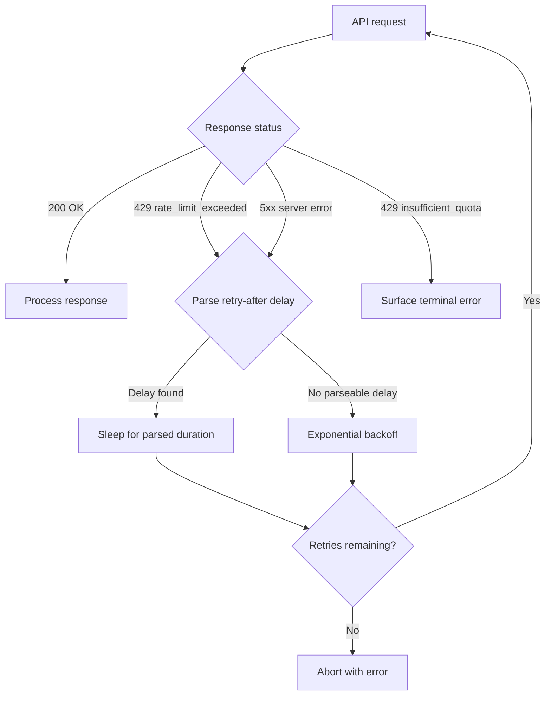

# Codex CLI Rate Limiting Behaviour: Backoff, Retry, and Quota Exhaustion Patterns


---

Rate limits are the most common operational failure mode in Codex CLI sessions, yet the retry machinery that handles them is poorly understood by most users. This article dissects the retry pipeline end-to-end — from the HTTP 429 response through exponential backoff, `retry-after` header parsing, and config.toml tuning — and covers the distinct failure paths for ChatGPT-plan quota exhaustion versus API-key rate limits.

## The Two Faces of 429

Not all 429 responses are equal. OpenAI's API returns two fundamentally different `error.type` values under the same HTTP status code[^1]:

| `error.type` | Meaning | Recovery |
|---|---|---|
| `rate_limit_exceeded` | You have hit your RPM, TPM, RPD, or TPD ceiling | Back off and retry — the rolling window advances |
| `insufficient_quota` | Your account or organisation has no remaining credits | Terminal — no retry will help |

Codex CLI treats these differently. A `rate_limit_exceeded` triggers the retry pipeline. An `insufficient_quota` *should* surface immediately as a terminal error, though a long-standing bug meant the TUI would sometimes hang on "Processing request…" indefinitely instead of reporting the error[^2]. This was addressed in the `codex-rs` rewrite, but edge cases around organisation-scoped API keys can still cause confusing behaviour[^3].

## The Retry Pipeline

When a retryable 429 arrives, Codex CLI's Rust core (`core/src/client.rs`) executes the following sequence[^4]:



### Retry-After Parsing

The retry pipeline first attempts to extract a delay from the error response. OpenAI's standard format is:

```
Rate limit reached for o4-mini … Please try again in 2.515s.
```

The `try_parse_retry_after()` function in `client.rs` matches this with a regex[^5]. Since PR #5956, the parser also handles natural-language variants from third-party providers — "Try again in 35 seconds", "1.5 minutes", "2 hours" — which matters if you route through Azure, Vercel, or a local proxy[^6].

When no parseable delay exists, the pipeline falls back to exponential backoff: base delay of 1 second, doubling each attempt, with jitter added to prevent thundering-herd effects[^7].

### Request vs Stream Retries

Codex CLI distinguishes two retry counters because failures occur at different stages:

- **`request_max_retries`** governs the initial HTTP request. If the API returns 429 or 5xx before any tokens stream, this counter applies. Default: **4**[^8].
- **`stream_max_retries`** governs mid-stream disconnections. If the SSE connection drops after tokens have started flowing, this counter applies. Default: **5**[^8].

Both are configurable per model provider in `config.toml`:

```toml
[model_providers.openai]
name = "OpenAI"
base_url = "https://api.openai.com/v1"
env_key = "OPENAI_API_KEY"
request_max_retries = 6       # default 4, max 100
stream_max_retries = 12       # default 5, max 100
stream_idle_timeout_ms = 300000  # 5 min idle before treating stream as dead
```

The `stream_idle_timeout_ms` setting (default 300,000 ms) controls how long Codex waits for the next SSE event before declaring the stream dead and triggering a stream retry[^8].

## ChatGPT Plan Limits vs API Key Limits

The rate limiting model differs substantially depending on your authentication method.

### ChatGPT Plan (OAuth)

ChatGPT plan users (Plus, Pro) face **5-hour rolling windows** with message-count limits that vary by model[^9]:

| Model | Plus/Business | Pro 5× | Pro 20× |
|---|---|---|---|
| GPT-5.4 | 20–100 | 200–1,000 | 400–2,000 |
| GPT-5.4-mini | 60–350 | 600–3,500 | 1,200–7,000 |
| GPT-5.3-Codex | 30–150 | 300–1,500 | 600–3,000 |

The ranges reflect dynamic adjustment based on system load. When you hit the ceiling, Codex CLI receives a 429 with a `rate_limit_exceeded` type and a retry delay that typically points to the window reset time — often tens of minutes rather than seconds[^9].

### API Key (Pay-as-you-go)

API key users face OpenAI's standard tier-based rate limits measured in RPM (requests per minute) and TPM (tokens per minute)[^1]. As of early 2026, Tier 1 provides approximately 500,000 TPM for GPT-5 models, with higher tiers scaling substantially[^10]. Rate limit hits here produce short retry windows (typically 1–10 seconds) and are genuinely transient.

The practical implication: **retry tuning matters far more for API key users**. ChatGPT plan limits are hard ceilings where retrying is futile until the window resets, whilst API key rate limits are rolling and recover quickly.

## Multi-Agent Amplification

Subagent workflows amplify rate limit pressure. Each spawned subagent makes independent API requests, and there is no built-in coordination of rate budgets across agents[^11]. A `max_threads = 4` configuration with an active parent agent can produce five concurrent request streams, all counting against the same account's rate limits.

The failure mode is predictable: the parent agent's request succeeds, three subagents succeed, and the fourth hits 429. That agent retries, but by then another agent has started its next turn, triggering a cascade of 429s with progressively longer backoff delays.

Mitigations:

1. **Reduce `max_threads`** when running against rate-limited accounts. Two concurrent subagents is often the practical maximum on Plus plans.
2. **Use a higher-tier API key** for multi-agent work. Tier 3+ rate limits accommodate parallel agents comfortably.
3. **Increase `request_max_retries`** for the provider to absorb burst contention:

```toml
[model_providers.openai]
request_max_retries = 8
stream_max_retries = 10
```

## Quota Exhaustion UX

When credits are genuinely exhausted (as opposed to a transient rate limit), the ideal behaviour is an immediate, clear error. The current state is improved but imperfect:

- **API key**: the CLI surfaces "Insufficient quota" and exits with a non-zero code[^2].
- **ChatGPT plan**: the 5-hour window exhaustion is reported as a rate limit, not a quota error. The CLI retries until `request_max_retries` is exhausted, then displays the error. This can mean a silent wait of 30+ seconds before the user learns their window is spent[^12].

A known issue (#6512) documented the worst case: the CLI hanging indefinitely when the workspace was out of credits, with the poller never breaking out of the spinner loop[^2]. The fix treats `insufficient_quota`, `requires_payment_method`, and HTTP 402 as terminal states, but if you encounter hangs on older versions, upgrading to the latest CLI release resolves it.

## Diagnosing Rate Limit Issues

### Reading the Error

A typical 429 response includes actionable detail:

```
Rate limit reached for gpt-5.3-codex in organization org-xxxxx
on tokens per min (TPM): Limit 200000, Used 136502, Requested 71884.
Please try again in 2.515s.
```

This tells you exactly which dimension (TPM) was hit, the current usage, and when to retry[^5].

### Hooks for Observability

Use a `SessionStart` hook to log rate limit events for post-hoc analysis:

```toml
[[hooks]]
event = "on_agent_error"
type = "command"
command = "echo \"$(date -u +%Y-%m-%dT%H:%M:%SZ) rate_limit $CODEX_ERROR_TYPE\" >> ~/.codex/rate-limits.log"
```

⚠️ The `on_agent_error` hook event is not yet documented in the official hook reference. Community implementations suggest it fires on retryable errors, but behaviour may vary across versions.

### Environment Variable Debugging

Set `CODEX_LOG_LEVEL=debug` to see retry attempts in stderr:

```bash
CODEX_LOG_LEVEL=debug codex "refactor auth module" 2> /tmp/codex-debug.log
```

The debug output includes each retry attempt number, the parsed delay, and whether the retry-after header was honoured or exponential backoff was used.

## Configuration Reference

A complete rate-limit-aware provider configuration:

```toml
[model_providers.openai]
name = "OpenAI"
base_url = "https://api.openai.com/v1"
env_key = "OPENAI_API_KEY"
wire_api = "responses"
request_max_retries = 6
stream_max_retries = 10
stream_idle_timeout_ms = 300000

[model_providers.azure]
name = "Azure OpenAI"
base_url = "https://my-instance.openai.azure.com/openai"
wire_api = "responses"
request_max_retries = 8       # Azure often returns 429 during autoscale
stream_max_retries = 12
stream_idle_timeout_ms = 180000
```

For multi-agent workloads, consider a dedicated profile with higher retry counts:

```toml
[profiles.multi-agent]
model = "gpt-5.3-codex"
model_provider = "openai"

[profiles.multi-agent.model_providers.openai]
request_max_retries = 10
stream_max_retries = 15
```

## Key Takeaways

- Codex CLI's retry pipeline handles transient 429s automatically — you do not need external retry wrappers.
- `request_max_retries` (default 4) and `stream_max_retries` (default 5) are the primary tuning knobs, configurable per provider in `config.toml`.
- ChatGPT plan limits and API key rate limits are fundamentally different beasts; retry tuning helps the latter far more than the former.
- Multi-agent workflows multiply rate limit pressure with no built-in coordination — reduce `max_threads` or upgrade your API tier.
- The retry-after parser now handles natural-language delay formats from third-party providers since PR #5956.

## Citations

[^1]: [OpenAI Rate Limits Guide](https://developers.openai.com/api/docs/guides/rate-limits) — official documentation on RPM, TPM, RPD, TPD dimensions and error types.
[^2]: [Issue #6512: Codex CLI hangs indefinitely when workspace is out of credits](https://github.com/openai/codex/issues/6512) — terminal state handling for quota exhaustion.
[^3]: [Issue #1953: Insufficient quota with organisation API keys](https://github.com/openai/codex/issues/1953) — organisation-scoped key routing confusion.
[^4]: [Issue #690: Codex CLI exits abruptly on rate_limit_exceeded](https://github.com/openai/codex/issues/690) — original issue documenting the crash-on-429 behaviour, closed with codex-rs rewrite.
[^5]: [Issue #233: Add built-in exponential backoff & retry](https://github.com/openai/codex/issues/233) — initial implementation of retry logic, closed in release 0.1.2504221401.
[^6]: [Issue #4161: Stream retry does not honour provider delay formats](https://github.com/openai/codex/issues/4161) — extended retry-after parsing via PR #5956.
[^7]: [OpenAI Cookbook: How to Handle Rate Limits](https://cookbook.openai.com/examples/how_to_handle_rate_limits) — official exponential backoff guidance with jitter.
[^8]: [Codex CLI Configuration Reference](https://developers.openai.com/codex/config-reference) — `request_max_retries`, `stream_max_retries`, `stream_idle_timeout_ms` defaults and ranges.
[^9]: [Codex Pricing](https://developers.openai.com/codex/pricing) — ChatGPT plan 5-hour window limits by model and tier.
[^10]: [OpenAI Rate Limits: Complete Guide to TPM, RPM & Tier Limits (2026)](https://inference.net/content/openai-rate-limits-guide/) — Tier 1 TPM increase to 500,000 for GPT-5 models.
[^11]: [Codex Subagents Documentation](https://developers.openai.com/codex/subagents) — `max_threads` and parallel agent execution.
[^12]: [Issue #2903: No warning before rate limit auto-shutoff](https://github.com/openai/codex/issues/2903) — UX gap in communicating impending limit exhaustion.
