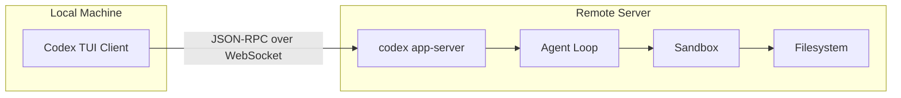
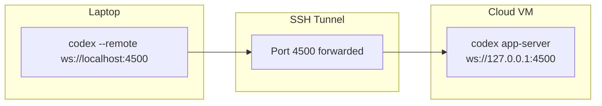
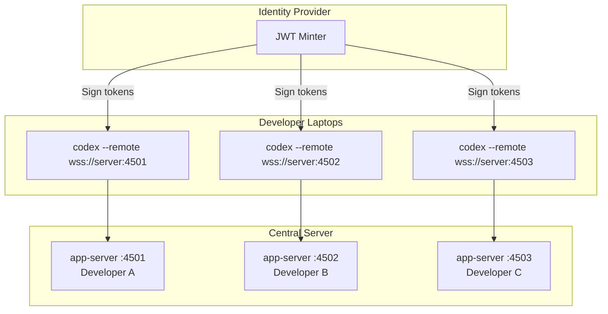

# Remote Development with Codex CLI: App-Server WebSocket Transport, the --remote Flag, and Persistent Agent Sessions


---

The shift to remote-first development has been underway for years, but AI coding agents complicate matters. Codex CLI's interactive TUI traditionally required a local terminal with direct filesystem access — fine for laptop-based workflows, less so when your code lives on a beefy cloud VM, a shared dev server, or inside a devcontainer. The app-server architecture, now default since v0.117.0 and substantially upgraded in v0.119.0–v0.120.0, solves this by decoupling the agent runtime from the user interface through a JSON-RPC 2.0 protocol over stdio or WebSocket transport [^1][^2].

This article covers the full remote development stack: running the app-server on remote infrastructure, connecting via the `--remote` flag, authenticating with capability or signed bearer tokens, integrating with SSH tunnels and devcontainers, and leveraging the experimental `codex exec-server` subcommand.

## The Architecture: Decoupled Agent and TUI

Before v0.117.0, the Codex CLI was a monolithic process — the TUI, agent loop, tool execution, and sandbox all lived in one binary [^3]. The app-server refactoring split this into a client–server model:



The app-server handles authentication, conversation history, approvals, streamed agent events, and sandbox-aware filesystem operations — all exposed through bidirectional JSON-RPC 2.0 messages [^1]. The TUI becomes a thin client that renders events and relays user input. This means the agent stays close to compute and storage, continuing work even if your laptop sleeps or disconnects [^2].

## Transport Options

The app-server supports three transport modes [^4]:

| Transport | Flag | Format | Use Case |
|-----------|------|--------|----------|
| stdio | `--listen stdio://` (default) | Newline-delimited JSONL | Local integration, VS Code extension |
| WebSocket | `--listen ws://IP:PORT` | One JSON-RPC message per text frame | Remote TUI, cross-machine sessions |
| off | `--listen off` | None | Embedding scenarios where transport is handled externally |

⚠️ WebSocket transport remains experimental and unsupported for production workloads as of v0.120.0 [^4]. Loopback listeners (`ws://127.0.0.1:PORT`) are explicitly endorsed for localhost and SSH port-forwarding workflows.

## Setting Up Remote Sessions

### Starting the App-Server

On the remote machine (cloud VM, dev server, or container), start the app-server with WebSocket transport:

```bash
# Bind to loopback only — access via SSH tunnel
codex app-server --listen ws://127.0.0.1:4500

# Or bind to all interfaces (requires authentication)
codex app-server --listen ws://0.0.0.0:4500 \
  --ws-auth capability-token \
  --ws-token-file /home/dev/.codex/ws-token
```

The WebSocket listener exposes two HTTP health endpoints [^4]:

- `GET /readyz` — returns `200 OK` once the server is accepting connections
- `GET /healthz` — returns `200 OK` (rejects requests with an `Origin` header with `403 Forbidden` to prevent browser-based CSRF)

### Connecting from the Local TUI

From your local machine, connect the TUI to the remote app-server:

```bash
# Via SSH tunnel (recommended)
ssh -L 4500:127.0.0.1:4500 dev@remote-host -N &
codex --remote ws://127.0.0.1:4500

# Direct connection with authentication
export CODEX_WS_TOKEN="$(cat ~/.codex/ws-token)"
codex --remote wss://remote-host:4500 \
  --remote-auth-token-env CODEX_WS_TOKEN
```

The `--remote` flag is supported for `codex`, `codex resume`, and `codex fork`; other subcommands reject remote mode [^5]. Remote `--cd` forwarding was added in v0.120.0, allowing the TUI to specify the working directory on the remote server [^6].

### The Initialisation Handshake

Every connection begins with a JSON-RPC `initialize` request carrying client metadata [^1]:

```json
{
  "method": "initialize",
  "id": 0,
  "params": {
    "clientInfo": {
      "name": "codex_remote_tui",
      "title": "Codex Remote TUI",
      "version": "0.120.0"
    },
    "capabilities": {
      "experimentalApi": true
    }
  }
}
```

The server responds with `userAgent`, `codexHome`, `platformFamily`, and `platformOs`. The client then emits an `initialized` notification, after which threads and turns can begin [^1].

## Authentication: Three Modes

WebSocket authentication is enforced before the JSON-RPC `initialize` handshake [^4]. Three modes are available:

### No Authentication (Loopback Only)

Suitable for SSH tunnel workflows where the tunnel itself provides authentication:

```bash
codex app-server --listen ws://127.0.0.1:4500
```

### Capability Token

A shared secret stored in a file, verified on every connection:

```bash
# Generate token on the server
TOKEN_FILE="$HOME/.codex/codex-app-server-token"
install -d -m 700 "$(dirname "$TOKEN_FILE")"
openssl rand -base64 32 > "$TOKEN_FILE"
chmod 600 "$TOKEN_FILE"

# Start server with capability token auth
codex app-server --listen ws://0.0.0.0:4500 \
  --ws-auth capability-token \
  --ws-token-file "$TOKEN_FILE"
```

Clients present the token as `Authorization: Bearer <token>` during the WebSocket handshake [^4].

### Signed Bearer Token (JWT)

For enterprise deployments requiring identity verification and token expiry:

```bash
# Server-side
codex app-server --listen wss://0.0.0.0:4500 \
  --ws-auth signed-bearer-token \
  --ws-shared-secret-file /etc/codex/hmac-secret \
  --ws-issuer "corp-auth-service" \
  --ws-audience "codex-remote" \
  --ws-max-clock-skew-seconds 30
```

Tokens must be HS256-signed JWTs with a required `exp` claim; `nbf`, `iss`, and `aud` are validated when the corresponding server flags are set [^4]. This integrates cleanly with enterprise identity providers that can mint short-lived JWTs.

**Security note:** Authentication tokens are only transmitted over `wss://` URLs or `ws://` URLs targeting localhost/`127.0.0.1`/`::1` [^5]. Non-local remote listeners must operate behind TLS.

## Backpressure and Reliability

The app-server uses bounded queues between transport ingress, request processing, and outbound writes [^1]. When the request queue is saturated, new requests receive a JSON-RPC error:

```json
{
  "error": {
    "code": -32001,
    "message": "Server overloaded; retry later."
  }
}
```

Clients should implement exponential backoff. The TUI handles this transparently, but custom integrations built against the app-server API must account for it [^1].

## The exec-server Subcommand

v0.120.0 introduced an experimental `codex exec-server` subcommand [^6]. Where `codex app-server` runs the full agent runtime with thread management, `codex exec-server` provides a lighter-weight execution endpoint — designed for scenarios where you want non-interactive `codex exec` semantics but accessible over a persistent server connection rather than a one-shot process.

This is particularly useful for:

- **CI/CD pipelines** that need to submit multiple tasks to a single warm Codex instance
- **IDE integrations** that want to run non-interactive commands without the overhead of spawning a new process per request
- **Orchestration layers** (like Oh-My-Codex or custom harnesses) that delegate tasks to a persistent backend

The subcommand inherits global configuration overrides and exits when the downstream client closes the connection [^5].

## Practical Deployment Patterns

### Pattern 1: SSH Tunnel (Simplest)

The lowest-friction remote setup. No authentication configuration needed — SSH handles it.



```bash
# Terminal 1: SSH tunnel
ssh -L 4500:127.0.0.1:4500 dev@gpu-server.internal -N

# Terminal 2: Connect TUI
codex --remote ws://127.0.0.1:4500 --cd /home/dev/project
```

### Pattern 2: Devcontainer Integration

For teams using VS Code devcontainers or GitHub Codespaces, the app-server runs inside the container with port forwarding:

```json
{
  "name": "codex-dev",
  "image": "mcr.microsoft.com/devcontainers/base:ubuntu",
  "features": {
    "ghcr.io/devcontainers/features/node:1": {}
  },
  "postCreateCommand": "npm install -g @openai/codex",
  "forwardPorts": [4500],
  "portsAttributes": {
    "4500": { "label": "Codex App Server", "onAutoForward": "silent" }
  }
}
```

Start the app-server as a background process in the container, then connect from the host terminal or VS Code extension [^7].

### Pattern 3: Enterprise Central Server

For regulated environments, run a single app-server instance per developer on a shared server, with signed bearer tokens issued by the corporate identity provider:



This pattern keeps source code on the central server (satisfying data residency requirements), uses signed JWTs for authentication, and benefits from the server's compute for agent execution [^4].

## Filesystem Operations Over the Wire

The app-server exposes sandbox-respecting filesystem operations through the JSON-RPC API, meaning the TUI can browse, read, and write files on the remote machine without separate SFTP or SCP [^1]:

- `fs/readFile`, `fs/writeFile` — base64-encoded content transfer
- `fs/createDirectory`, `fs/readDirectory`, `fs/getMetadata`
- `fs/watch`, `fs/unwatch` — subscribe to filesystem change notifications via `fs/changed`
- `fs/remove`, `fs/copy`

All operations respect the sandbox policy configured on the server. A `workspaceWrite` policy limits writes to specified roots; `readOnly` prevents any modifications [^1].

## Sandbox Policies for Remote Sessions

Remote sessions should use explicit sandbox policies rather than relying on defaults:

```toml
# On the remote server: config.toml
[sandbox]
mode = "workspace-write"

[permissions.network]
allow_domains = ["api.openai.com", "registry.npmjs.org"]
```

The app-server supports four sandbox policy types [^1]:

| Policy | Behaviour |
|--------|-----------|
| `dangerFullAccess` | No restrictions — use only for trusted environments |
| `readOnly` | Read-only with optional access constraints |
| `workspaceWrite` | Write access to specified roots; optional `networkAccess` |
| `externalSandbox` | Skip app-server enforcement (for container-level isolation) |

For devcontainer deployments, `externalSandbox` makes sense — the container itself provides isolation, and doubling up with Landlock/seatbelt adds complexity without benefit.

## Community Tools for Remote Codex

Several community projects extend the remote development story:

- **Remodex** (github.com/Emanuele-web04/remodex) — a remote control wrapper that provides a web dashboard for managing Codex sessions on remote machines [^8]
- **CliGate** (codeking-ai/cligate) — a local gateway proxy that can route Codex CLI traffic through a unified endpoint, useful for multi-account failover in remote setups [^9]
- **Configurable Dev Container issue #13410** — an open feature request for configurable app-server WebSocket port/endpoint for VS Code connecting to Codex inside devcontainers (one container per worktree) [^10]

## Logging and Debugging Remote Sessions

When troubleshooting remote connections, enable structured JSON logging on the server:

```bash
RUST_LOG=debug LOG_FORMAT=json \
  codex app-server --listen ws://127.0.0.1:4500 2>>/var/log/codex-app-server.json
```

This emits one JSON event per line to stderr, suitable for ingestion by centralised logging systems [^4]. Key events to watch for:

- Authentication failures (token mismatch or expired JWT)
- Backpressure rejections (`-32001` errors)
- WebSocket connection drops and reconnections
- Sandbox policy violations

## What's Still Missing

Despite the substantial progress in v0.119.0–v0.120.0, several gaps remain:

- **No automatic reconnection** — if the WebSocket connection drops, the TUI exits rather than attempting to reconnect. Session state is preserved server-side, so `codex resume --remote` works, but the user experience is jarring [^2]
- **`exec-server` is experimental** — limited documentation and the subcommand's behaviour may change between releases [^6]
- **No multiplexing** — each TUI connection maps to one app-server instance. There's no built-in way to share a single server across multiple simultaneous users [^1]
- **Realtime voice over remote** — v0.120.0 defaults to WebRTC for realtime voice, but WebRTC peer connections through SSH tunnels require additional STUN/TURN configuration not yet documented [^6]
- **No worktree path environment variable** — issue #13576 tracks the request for exposing the worktree path as an env var, which would simplify remote container workflows [^10]

## Summary

The Codex CLI app-server transforms remote development from a workaround into a first-class workflow. The JSON-RPC 2.0 protocol over WebSocket provides a clean, authenticated channel between a thin TUI client and a remote agent runtime. SSH tunnel setups work today with zero configuration; enterprise deployments can layer signed JWT authentication and centralised logging. The experimental `exec-server` points toward a future where persistent Codex backends serve multiple clients — CI pipelines, IDE extensions, and orchestration layers — from a single warm instance.

For most developers, the SSH tunnel pattern (`ssh -L` + `codex --remote`) is the pragmatic starting point. Get it running, verify the agent has access to your remote filesystem, and iterate from there.

## Citations

[^1]: [App Server – Codex | OpenAI Developers](https://developers.openai.com/codex/app-server) — Official app-server API documentation covering JSON-RPC protocol, transport options, authentication, filesystem operations, and sandbox policies.

[^2]: [Unlocking the Codex harness: how we built the App Server | OpenAI](https://openai.com/index/unlocking-the-codex-harness/) — OpenAI blog post on app-server architecture and design motivations.

[^3]: [App-Server TUI: The Architecture Shift That Enables Remote Sessions](https://codex.danielvaughan.com/2026/03/30/codex-app-server-tui-architecture-shift/) — Prior article covering the v0.117.0 architecture shift.

[^4]: [codex-rs/app-server/README.md – openai/codex](https://github.com/openai/codex/blob/main/codex-rs/app-server/README.md) — Source-level documentation for transport options, WebSocket health probes, authentication modes, and logging.

[^5]: [Command line options – Codex CLI | OpenAI Developers](https://developers.openai.com/codex/cli/reference) — Official CLI reference documenting `--remote`, `--remote-auth-token-env`, `exec-server`, and all global flags.

[^6]: [Codex CLI 0.120.0 Changelog – Codex | OpenAI Developers](https://developers.openai.com/codex/changelog) — v0.120.0 release notes covering exec-server, remote `--cd` forwarding, and realtime voice v2 WebRTC default.

[^7]: [Cloud-Based Agentic Dev Container: Claude Code, Codex, and OpenCode in One](https://www.fzeba.com/posts/50_cloud-based-agentic-dev-container/) — Practical guide to running AI coding agents in cloud devcontainers with persistent volumes.

[^8]: [Remodex: Remote Control for Codex – GitHub](https://github.com/Emanuele-web04/remodex) — Community tool for remote Codex session management.

[^9]: [CliGate – GitHub](https://github.com/codeking-ai/cligate) — Local gateway proxy for multi-CLI routing, useful in remote setups.

[^10]: [Configurable App Server WebSocket port/endpoint for VS Code devcontainers – Issue #13410](https://github.com/openai/codex/issues/13410) — Open feature request for better devcontainer integration.
