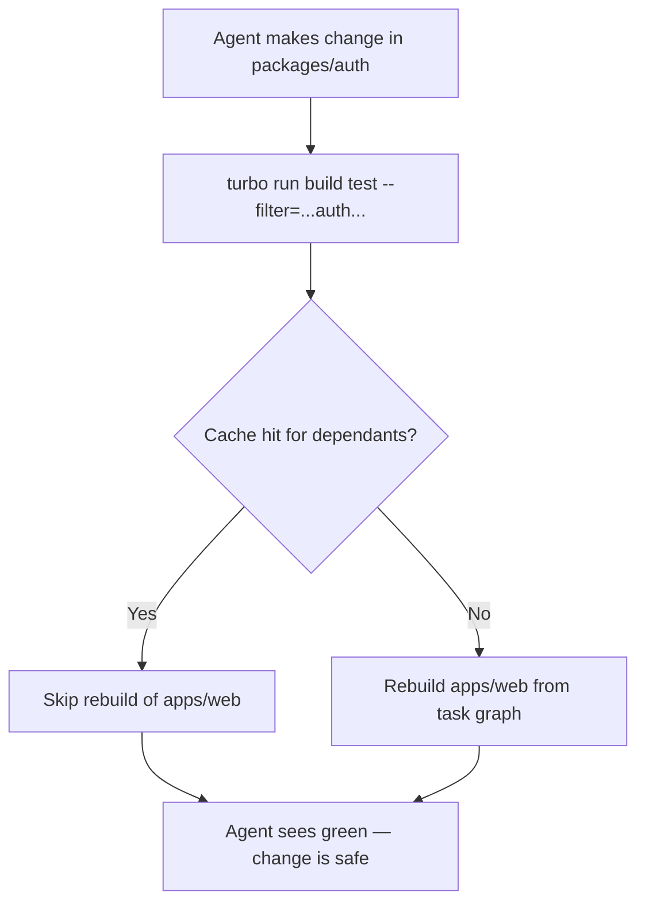
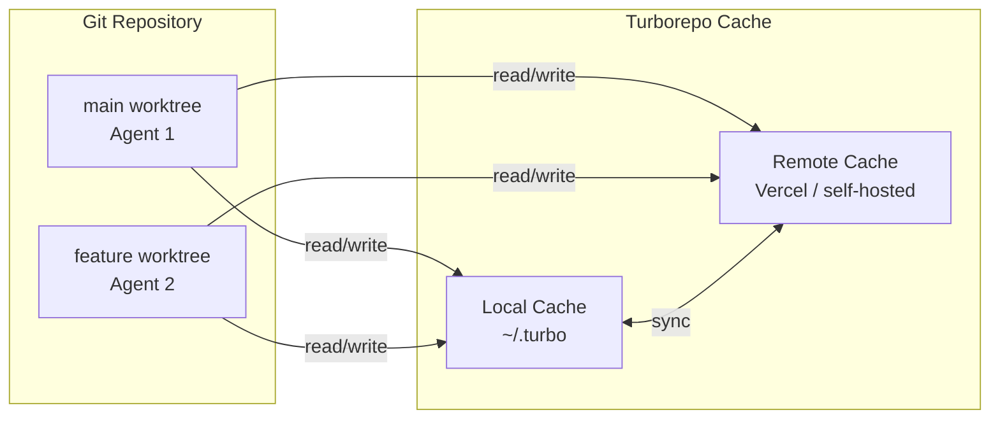

# Codex CLI and Turborepo: Agent-Aware Builds, Task Caching, and Remote Cache Integration


---

Turborepo 2.8 and 2.9 introduced first-class support for AI coding agents, making it the first major JavaScript build tool to explicitly optimise for agentic workflows[^1]. If you are running Codex CLI against a Turborepo monorepo, there is now a well-defined surface area — from `turbo.json` task descriptions to shared worktree caches — that lets the agent understand your dependency graph, execute scoped builds, and benefit from cached artefacts without any bespoke glue code.

This article covers the integration points that matter: how to structure `AGENTS.md` for Turborepo workspaces, how task caching interacts with agent-generated code, and how to wire up remote caching so parallel agents do not duplicate work.

## Why Turborepo Needs Agent Awareness

A monorepo build tool's job is to run the minimum set of tasks needed for a change. An AI agent's job is to make changes. Without coordination, an agent will either run too much (burning tokens waiting for irrelevant builds) or too little (missing breakage in downstream consumers).

Turborepo solves this with its task graph — a DAG derived from `turbo.json` `dependsOn` declarations and the package dependency graph[^2]. The agent needs to understand that graph to:

1. **Scope its changes** to the correct workspace
2. **Run only affected tasks** via `--filter`
3. **Trust cached results** for packages it has not touched



## Structuring AGENTS.md for Turborepo Monorepos

Codex CLI reads `AGENTS.md` files at the repository root and in subdirectories to understand project context[^3]. In a Turborepo monorepo, a layered approach works best.

### Root AGENTS.md

The root file should map the workspace topology and establish routing rules:

```markdown
# AGENTS.md

## Workspace Layout
- `apps/` — Deployable applications (Next.js, Express)
- `packages/` — Shared libraries consumed via workspace protocol
- `services/` — Backend microservices

## Routing Rules
1. Identify the owning workspace before making changes
2. App-only changes: run `turbo run lint test --filter=<app-name>`
3. Shared package changes: run `turbo run lint test build --filter=...<package-name>...`
4. Never modify `infra/` without explicit user instruction

## Verification Reporting
State: what changed, what was verified, what was intentionally skipped.
```

The `...` syntax in `--filter` is critical — it tells Turborepo to include all dependants of the named package[^4], ensuring the agent catches downstream breakage.

### Workspace-Level AGENTS.md

Each significant workspace can carry its own instructions:

```markdown
# packages/auth/AGENTS.md

## Overview
OAuth 2.1 client library. Consumed by apps/web and apps/mobile.

## Commands
- `turbo run test --filter=auth` — unit tests
- `turbo run test --filter=...auth...` — unit + integration across consumers
- `turbo run build --filter=auth` — compile TypeScript to dist/

## Constraints
- Do not modify the token refresh logic without running the full consumer suite
- Environment variables: AUTH_CLIENT_ID, AUTH_ISSUER_URL (see turbo.json env)
```

Codex CLI merges instructions from all `AGENTS.md` files it encounters when walking up from the current working directory[^3], so workspace-level files supplement rather than replace the root.

## Configuring turbo.json for Agent Comprehension

Turborepo 2.8 introduced the `description` field on task definitions[^1]. This is explicitly designed as "a human- or agent-readable description" that does not affect execution or caching[^2]:

```json
{
  "$schema": "https://turborepo.dev/schema.json",
  "tasks": {
    "build": {
      "description": "Compiles TypeScript source and bundles for production",
      "dependsOn": ["^build"],
      "outputs": ["dist/**"],
      "env": ["NODE_ENV", "API_BASE_URL"]
    },
    "test": {
      "description": "Runs Vitest unit and integration suites",
      "dependsOn": ["build"],
      "outputs": [],
      "env": ["CI", "TEST_DATABASE_URL"]
    },
    "lint": {
      "description": "ESLint and Prettier checks — safe to run without build",
      "outputs": []
    }
  }
}
```

Key points for agent interaction:

- **`description`** gives the agent semantic understanding of each task without parsing build scripts[^1]
- **`env`** declares which environment variables affect the cache hash[^2]. Agents should never modify these variables without understanding the caching implications
- **`outputs`** tells Turborepo what to cache. If an agent generates new build artefacts in an unexpected directory, they will not be cached unless added here
- **`dependsOn: ["^build"]`** means "run build in all dependencies first"[^2]. The agent can rely on this to know that running `turbo run build --filter=apps/web` will automatically build upstream packages

## Scoped Agent Runs with --filter

The `--filter` flag is how an agent limits blast radius. Turborepo supports several filter patterns[^4]:

```bash
# Only the auth package
turbo run test --filter=auth

# auth and everything that depends on it
turbo run test --filter=...auth...

# Only packages changed since main
turbo run build test --filter="[main...HEAD]"

# Combine: changed packages plus their dependants
turbo run build test --filter="...[main...HEAD]..."
```

For Codex CLI, the most useful pattern is the last one — it mirrors what a CI pipeline would run and gives the agent confidence that its changes are safe across the full dependency cone. You can encode this in `AGENTS.md`:

```markdown
## Default Verification Command
turbo run build test lint --filter="...[main...HEAD]..."
```

## Git Worktrees and Parallel Agents

One of Turborepo 2.8's headline features is automatic cache sharing across Git worktrees[^1]. This is directly relevant when running multiple Codex CLI instances in parallel.

```bash
# Create a worktree for a second agent
git worktree add ../agent-2-worktree feature/auth-refactor

# In the worktree, Turborepo shares the local cache automatically
cd ../agent-2-worktree
turbo run build --filter=auth
# Cache hit if the primary worktree already built auth with identical inputs
```



The local cache is stored in a shared location, so both worktrees hit and populate the same cache entries[^1]. When combined with Vercel Remote Cache or a self-hosted equivalent, agents running on different machines also benefit.

### Setting Up Remote Cache

```bash
# Authenticate with Vercel Remote Cache
npx turbo login

# Link the repository
npx turbo link
```

Or configure via environment variables for CI and headless agent runs:

```bash
export TURBO_TOKEN="your-vercel-token"
export TURBO_TEAM="your-team-slug"
```

With remote caching enabled, an agent's build artefacts are available to every other agent and every CI runner immediately[^5]. This is particularly valuable when Codex CLI spawns subagents — each subagent working in its own worktree can read cached results from the others without rebuilding.

## The Turborepo Agent Skill

Turborepo 2.8 also introduced an Agent Skill via the open-standard Skills framework[^1]:

```bash
npx skills add vercel/turborepo
```

This injects Turborepo-specific knowledge into compatible agents, covering best practices, monorepo conventions, anti-patterns, and performance optimisation techniques[^1]. While Codex CLI does not natively consume the Skills framework at the time of writing, the skill's content can be extracted and placed into `AGENTS.md` for equivalent effect.

## Querying the Task Graph with turbo query

Turborepo 2.9 graduated `turbo query` to stable[^6], providing a GraphQL interface to the package and task graphs:

```bash
# Which packages are affected by current changes?
turbo query affected

# List all packages with dependency details
turbo query ls

# Custom GraphQL query
turbo query "{ packages { name dependencies { name } } }"
```

For agent workflows, `turbo query affected` is the most valuable — it gives the agent a machine-readable answer to "what do I need to rebuild and test?" without parsing `turbo.json` or `package.json` files manually.

## Performance Considerations

Turborepo 2.9 delivered dramatic Time to First Task improvements[^6]:

| Repository Size | Improvement |
|----------------|-------------|
| 1,037 packages (Vercel backend) | 91% faster (8.1s → 716ms) |
| 132 packages (Vercel frontend) | 81% faster (1.9s → 361ms) |
| 6 packages (create-turbo) | 80% faster (676ms → 132ms) |

For agents, this means `turbo run` overhead is now negligible even in large monorepos. Combined with cache hits, an agent can verify its changes in under a second for cached paths — fast enough to run verification after every edit rather than batching changes.

## Comparison with Nx Agent Skills

Both Turborepo and Nx now offer agent integration, but with different philosophies[^7]:

| Aspect | Turborepo | Nx |
|--------|-----------|-----|
| Agent integration | Agent Skill + AGENTS.md + `description` field | Nx Agent Skills with `nx.json` metadata |
| Task graph query | `turbo query` (GraphQL) | `nx graph` + `nx affected` |
| Cache sharing | Automatic across worktrees | Manual configuration needed |
| Remote cache | Vercel Remote Cache (free tier) | Nx Cloud (free tier) |
| Affected detection | `--filter="[main...HEAD]"` | `nx affected --target=build` |

Turborepo's worktree cache sharing is a notable advantage for parallel agent workflows, as it requires zero configuration[^1]. Nx's affected graph is more mature for computing precise impact, but Turborepo's `turbo query affected` is closing that gap rapidly[^6].

## Practical Checklist

Before running Codex CLI against a Turborepo monorepo:

1. **Add task descriptions** to `turbo.json` so the agent understands each task's purpose
2. **Create layered `AGENTS.md` files** — root for topology, workspace-level for commands and constraints
3. **Enable remote caching** for multi-agent and CI cache sharing
4. **Document `--filter` patterns** in `AGENTS.md` with the `...` dependant syntax
5. **Use `turbo query affected`** in verification commands for precise scope
6. **Set up worktrees** for parallel agent runs — caching is automatic

## Citations

[^1]: Vercel, "Turborepo 2.8" (2026). [https://turborepo.dev/blog/2-8](https://turborepo.dev/blog/2-8)
[^2]: Turborepo, "Configuring turbo.json" (2026). [https://turborepo.dev/docs/reference/configuration](https://turborepo.dev/docs/reference/configuration)
[^3]: OpenAI, "Custom instructions with AGENTS.md – Codex CLI" (2026). [https://developers.openai.com/codex/guides/agents-md](https://developers.openai.com/codex/guides/agents-md)
[^4]: Turborepo, "Filtering" documentation (2026). [https://turborepo.dev/docs/reference/run#--filter-string](https://turborepo.dev/docs/reference/run#--filter-string)
[^5]: Vercel, "Making Turborepo 96% faster with agents, sandboxes, and humans" (2026). [https://vercel.com/blog/making-turborepo-ninety-six-percent-faster-with-agents-sandboxes-and-humans](https://vercel.com/blog/making-turborepo-ninety-six-percent-faster-with-agents-sandboxes-and-humans)
[^6]: Vercel, "Turborepo 2.9" (2026). [https://turborepo.dev/blog/2-9](https://turborepo.dev/blog/2-9)
[^7]: d4b.dev, "AI agents in monorepos: what to configure differently from a single-product repo" (2026). [https://www.d4b.dev/blog/2026-04-03-ai-agents-in-monorepos-what-to-configure-differently-from-a-single-product-repo](https://www.d4b.dev/blog/2026-04-03-ai-agents-in-monorepos-what-to-configure-differently-from-a-single-product-repo)
