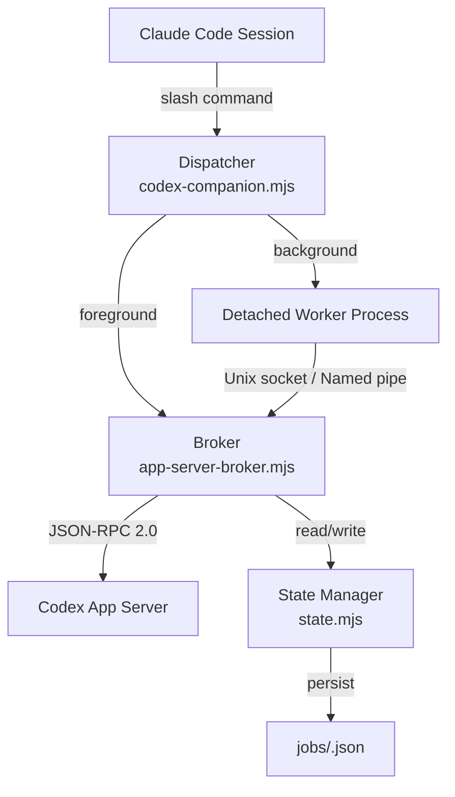
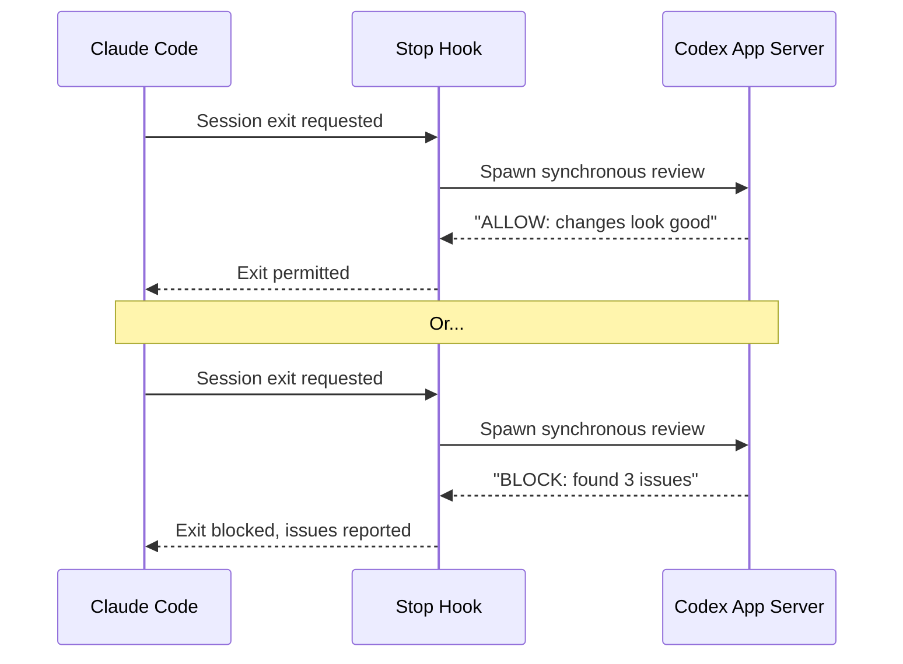

# codex-plugin-cc: OpenAI's Official Cross-Provider Bridge for Claude Code


On 30 March 2026, OpenAI did something unprecedented in the AI coding tool market: it shipped an official plugin that installs *inside a competitor's product*[^1]. `codex-plugin-cc` gives Claude Code users direct access to Codex CLI's review engine, adversarial analysis, and task delegation — without leaving their Claude Code session. Two weeks later the plugin has 55 merged pull requests, 37 open PRs, and a rapidly expanding command surface that now includes multi-agent spawning, diff-review workflows, and an experimental review gate that blocks Claude Code output until Codex approves it[^2].

This article dissects the plugin's architecture, walks through every command, explains the broker multiplexing layer that makes background jobs possible, and examines the strategic logic behind giving a rival's users a one-command on-ramp to Codex.

## Why Cross-Provider Review Matters

Same-model self-review is a well-documented anti-pattern. When Claude writes code and Claude reviews it, both passes share identical blind spots — the reviewer perpetuates the same errors the writer introduced[^3]. Cross-provider review breaks this cycle by routing the review through a model with fundamentally different training data, architecture, and failure modes.

The codex-plugin-cc makes this trivially easy. Claude generates code; Codex independently audits it. If Codex finds a bug Claude missed, that is a genuine quality improvement that neither model could achieve alone[^4].

## Installation and Setup

Prerequisites: Node.js 18.18+, a ChatGPT subscription (Free tier or above) or an OpenAI API key[^1].

```bash
# Inside a Claude Code session:
/plugin marketplace add openai/codex-plugin-cc
/plugin install codex@openai-codex
/codex:setup
```

The setup command verifies Codex CLI is installed, checks authentication, and optionally enables the review gate. If Codex is missing and npm is available, the plugin offers to install it automatically[^1].

Authentication uses the same local Codex credentials you already have — the plugin delegates through the local `codex` binary and the Codex app server, inheriting your existing `config.toml`, MCP servers, and sandbox settings[^5].

## Architecture: The Four-Layer Stack

The plugin is not a thin wrapper. It implements a layered architecture with four distinct components that handle command dispatch, process multiplexing, state persistence, and lifecycle management[^6].



### Dispatcher (`codex-companion.mjs`)

The central entry point parses CLI arguments and routes each command to the appropriate handler. It normalises flags like `--wait`, `--background`, `--model`, and `--effort` before passing them downstream[^6].

### Broker (`app-server-broker.mjs`)

Codex only supports one active session at a time. The broker solves this by multiplexing requests through a single Codex app-server connection[^6]. Key design decisions:

- Only one streaming request is active at any time via `activeRequestSocket`
- Additional requests receive error code `-32001` (`BROKER_BUSY_RPC_CODE`)
- Exception: `turn/interrupt` requests bypass the lock for cancellation support
- Notifications route back to the originating socket

Two transport modes exist: direct `stdin`/`stdout` spawn for the broker's own Codex connection, and Unix socket (macOS/Linux) or Named Pipe (Windows) for multiplexed client access[^6].

### State Manager (`state.mjs`)

Job metadata persists to the filesystem in a structured format[^6]:

- `state.json` — global configuration and job summaries (capped at 50 entries)
- `jobs/<job-id>.json` — full metadata per job (exit code, thread ID, rendered output)
- `jobs/<job-id>.log` — ISO-timestamped execution logs

The `runTrackedJob` wrapper handles persistence automatically. Jobs follow a state lifecycle: `queued` → `running` → `success` / `failed` / `cancelled`.

### Lifecycle Hooks

Three Claude Code hooks wire the plugin into the session lifecycle[^6]:

| Hook | Script | Purpose |
|------|--------|---------|
| `SessionStart` | `session-lifecycle-hook.mjs` | Initialises broker, exports `CODEX_COMPANION_SESSION_ID` |
| `SessionEnd` | `session-lifecycle-hook.mjs` | Shuts down broker, kills orphaned jobs, prunes state |
| `Stop` | `stop-review-gate-hook.mjs` | Optional quality gate (see below) |

## The Command Surface

### `/codex:review` — Standard Code Review

Runs a read-only Codex review against your current work. The plugin's `resolveReviewTarget` function automatically determines the review scope[^6]:

```bash
# Review uncommitted changes (default)
/codex:review

# Review current branch against main
/codex:review --base main

# Run in background, continue working
/codex:review --background

# Force foreground with streaming output
/codex:review --wait
```

When neither `--wait` nor `--background` is specified, the plugin estimates diff size using `git diff --shortstat` and recommends the appropriate execution mode. For smaller diffs, the full content is sent inline to Codex. For larger changes, Codex reads the files independently[^6].

### `/codex:adversarial-review` — Devil's Advocate Analysis

A steerable review that challenges design decisions, hidden assumptions, and failure modes[^1]. This is the command that makes cross-provider review genuinely valuable — it is not just checking for bugs but actively questioning whether the approach is sound.

```bash
# Challenge assumptions on a migration
/codex:adversarial-review focus on data migration edge cases

# Target specific concerns
/codex:adversarial-review --base main challenge the auth token refresh logic

# Select a specific model
/codex:adversarial-review --model gpt-5.4 review the concurrency model
```

### `/codex:rescue` — Task Delegation

Hands off complex tasks to the `codex:codex-rescue` subagent. This is not a review — it is full task delegation where Codex implements, investigates, or fixes[^1].

```bash
# Delegate a bug investigation
/codex:rescue investigate the memory leak in the WebSocket handler

# Resume a previous Codex session
/codex:rescue --resume

# Start fresh with a specific model and reasoning effort
/codex:rescue --fresh --model gpt-5.4 --effort xhigh
```

The rescue subagent supports thread resumption via the `task-resume-candidate --json` helper, enabling continuity across sessions[^6].

### Job Management Commands

```bash
# Check active and recent jobs
/codex:status

# Retrieve full output from a completed job
/codex:result <job-id>

# Cancel an active background job
/codex:cancel <job-id>
```

### `/codex:setup` — Configuration

```bash
# Verify installation and auth
/codex:setup

# Enable the automatic review gate
/codex:setup --enable-review-gate

# Disable the review gate
/codex:setup --disable-review-gate
```

## The Review Gate: Automatic Quality Enforcement

The review gate is the plugin's most ambitious feature and its most controversial. When enabled, it intercepts Claude Code's session exit via a `Stop` hook and spawns a synchronous Codex review[^6]. The gate mechanism works as follows:



Codex outputs `ALLOW:` or `BLOCK:` prefixes to signal the gate decision. The timeout is set to 15 minutes (`STOP_REVIEW_TIMEOUT_MS`). On timeout or failure, the gate defaults to **blocking** for safety — a fail-closed design[^6].

⚠️ The README explicitly warns that the review gate "can rapidly consume usage limits" without human supervision[^1]. For teams on credit-based plans, this is a genuine cost concern. Each session exit triggers a full Codex review turn, which may consume significant tokens depending on the size of accumulated changes.

## Emerging Commands (Open PRs)

The community is rapidly expanding the plugin's command surface. Several PRs opened in early April 2026 signal the direction[^2]:

| PR | Command | Description |
|----|---------|-------------|
| #149 | `/codex:agent-team` | Tmux split-pane multi-agent spawning with git worktree isolation[^7] |
| #146 | `/codex:diff-review` | Targeted diff-based review with enhanced context collection[^8] |
| #146 | `/codex:watch` | Continuous monitoring mode for ongoing changes[^8] |
| #146 | `/codex:config` | In-session configuration management[^8] |
| #146 | `/codex:optimize` | Performance and code quality optimisation suggestions[^8] |
| #152 | `/codex:usage` | Rate limit and usage quota display[^9] |
| #136 | `/codex:plan-review` | Review of plan-mode output before execution[^10] |
| #206 | `/codex:test` | Strict test workflow integration[^2] |

The `/codex:agent-team` PR is particularly noteworthy — it enables spawning parallel Codex agents in separate tmux panes, each operating in isolated git worktrees. This brings OMX-style multi-agent orchestration directly into the Claude Code environment[^7].

## Git Context Resolution

The plugin's review target resolution is more sophisticated than a simple `git diff`. The `resolveReviewTarget` function implements a three-tier strategy[^6]:

1. **Explicit base** — `--base <ref>` triggers a branch diff against the specified reference
2. **Working tree** — collects staged, unstaged, and untracked files (untracked limited to 24 KiB to avoid overwhelming Codex with generated files)
3. **Auto-detection** — if the working tree is clean, falls back to a branch diff against the detected default branch (`main` or `master`)

For context collection, the plugin chooses between two modes based on diff size:

- **Inline diff** — the full diff content is sent directly to Codex (smaller changes)
- **Self-collect** — a summary is sent and Codex reads the files independently (larger changes)

## Strategic Significance

The plugin's existence is a strategic calculation by OpenAI. Claude Code has an estimated $2.5 billion in annualised revenue and accounts for roughly 4% of public GitHub commits — approximately 135,000 per day[^4]. Codex CLI has 3 million weekly active users[^11]. Rather than competing for user acquisition, OpenAI creates a Codex touchpoint *inside* Claude Code, capturing usage-based revenue without requiring users to switch primary tools[^4].

For practitioners, the strategic implications matter less than the practical value: you get cross-provider review with a single command, using models with genuinely different architectures and failure modes. The plugin is not asking you to abandon Claude Code — it is giving you a second opinion from a different model family on every change you make.

## When to Use Each Command

| Scenario | Command | Why |
|----------|---------|-----|
| Standard code review before commit | `/codex:review` | Quick, read-only, familiar |
| Security-sensitive changes | `/codex:adversarial-review` | Challenges assumptions, finds edge cases |
| Stuck on a bug | `/codex:rescue` | Full delegation with thread continuity |
| High-stakes migration | `/codex:adversarial-review --model gpt-5.4 --effort xhigh` | Maximum scrutiny |
| Rapid iteration, low risk | Skip — single-model is sufficient | Cost and latency savings |

## Known Limitations

- **Single active session**: the broker multiplexes, but only one streaming request can be active at a time. Concurrent background jobs queue rather than parallelise[^6].
- **Review gate cost**: enabling the review gate on a credit-based plan can consume tokens rapidly. Monitor usage carefully[^1].
- **Open PRs not merged**: the expanded command surface (`/codex:agent-team`, `/codex:watch`, etc.) remains in open pull requests as of 12 April 2026[^2].
- **Broker disconnect hangs**: PR #184 addresses an issue where tracked jobs hang indefinitely on broker disconnect[^2].
- **ANSI escape sequences**: PR #171 fixes JSONL parsing failures caused by ANSI escape codes in Codex output[^2].

## Citations

[^1]: OpenAI, "Introducing Codex Plugin for Claude Code," OpenAI Developer Community, 30 March 2026. [https://community.openai.com/t/introducing-codex-plugin-for-claude-code/1378186](https://community.openai.com/t/introducing-codex-plugin-for-claude-code/1378186)

[^2]: OpenAI, "codex-plugin-cc Pull Requests," GitHub, accessed 12 April 2026. [https://github.com/openai/codex-plugin-cc/pulls](https://github.com/openai/codex-plugin-cc/pulls)

[^3]: MindStudio, "What Is the OpenAI Codex Plugin for Claude Code? Cross-Provider AI Review Explained," MindStudio Blog, April 2026. [https://www.mindstudio.ai/blog/openai-codex-plugin-claude-code-cross-provider-review-2](https://www.mindstudio.ai/blog/openai-codex-plugin-claude-code-cross-provider-review-2)

[^4]: SmartScope, "OpenAI Releases Official Claude Code Plugin — What codex-plugin-cc Means," SmartScope Blog, March 2026. [https://smartscope.blog/en/blog/codex-plugin-cc-openai-claude-code-2026/](https://smartscope.blog/en/blog/codex-plugin-cc-openai-claude-code-2026/)

[^5]: Vaibhav (VB) Srivastav (@reach_vb), "Starting today you can use Codex in Claude Code," X (Twitter), 30 March 2026. [https://x.com/reach_vb/status/2038671858862583967](https://x.com/reach_vb/status/2038671858862583967)

[^6]: OpenAI, "codex-plugin-cc repository — architecture and source code," GitHub, accessed 12 April 2026. [https://github.com/openai/codex-plugin-cc](https://github.com/openai/codex-plugin-cc); DeepWiki analysis: [https://deepwiki.com/openai/codex-plugin-cc](https://deepwiki.com/openai/codex-plugin-cc)

[^7]: MoizIbnYousaf, "Add /codex:agent-team for tmux split-pane multi-agent spawning," PR #149, openai/codex-plugin-cc, 5 April 2026. [https://github.com/openai/codex-plugin-cc/pull/149](https://github.com/openai/codex-plugin-cc/pull/149)

[^8]: durgeshmahajann, "feat: add /codex:diff-review, /codex:watch, /codex:config and codex:optimize," PR #146, openai/codex-plugin-cc, 4 April 2026. [https://github.com/openai/codex-plugin-cc/pull/146](https://github.com/openai/codex-plugin-cc/pull/146)

[^9]: sabiut, "Add /codex:usage command to show rate limits and usage," PR #152, openai/codex-plugin-cc, 5 April 2026. [https://github.com/openai/codex-plugin-cc/pull/152](https://github.com/openai/codex-plugin-cc/pull/152)

[^10]: erickreutz, "Add /codex:plan-review command," PR #136, openai/codex-plugin-cc, 3 April 2026. [https://github.com/openai/codex-plugin-cc/pull/136](https://github.com/openai/codex-plugin-cc/pull/136)

[^11]: Sam Altman, Codex 3 million weekly active users milestone, April 2026. Referenced via [https://releasebot.io/updates/openai/codex](https://releasebot.io/updates/openai/codex)
