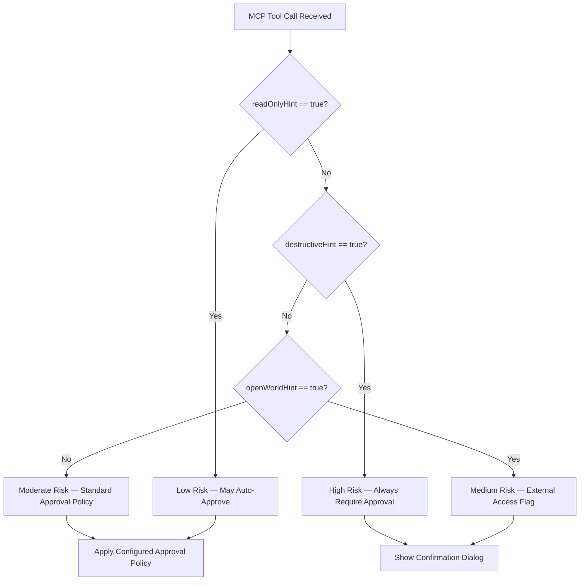
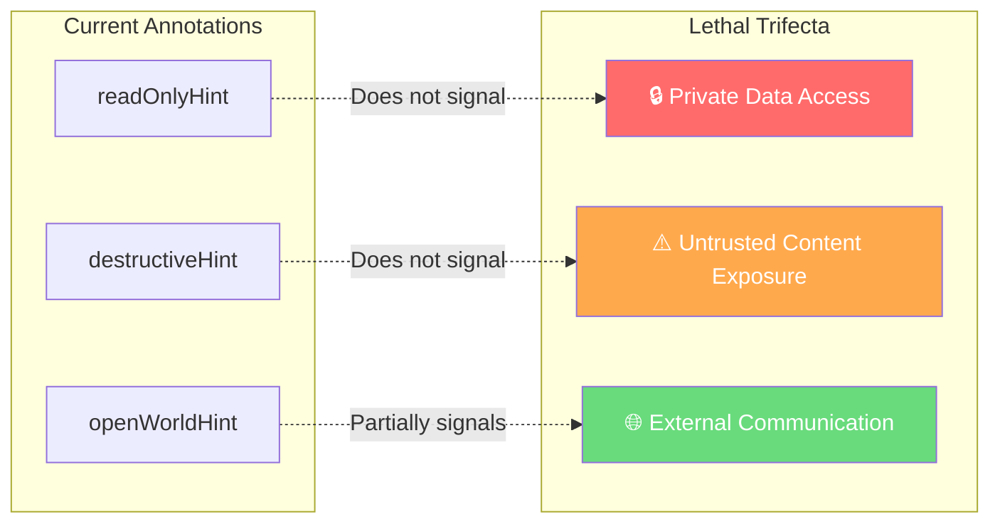
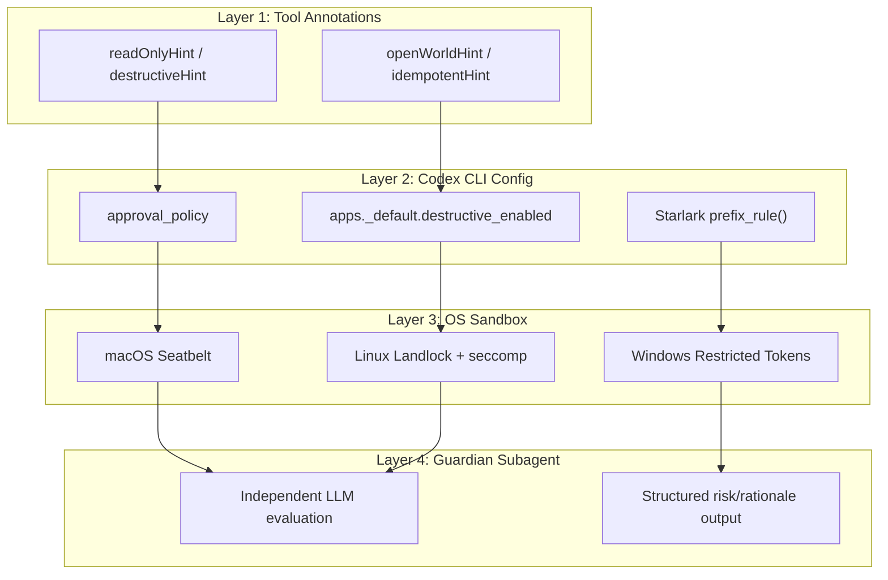

# MCP Tool Annotations as Risk Vocabulary: How Codex CLI Uses Hints to Drive Approval Decisions


---

Every MCP server exposes tools. Some tools read a database schema. Others delete production tables. Without a shared language for expressing this difference, every AI coding agent must either ask about everything — drowning the developer in approval prompts — or assume everything is safe, which is how codebases get destroyed. MCP tool annotations are the specification's answer: a four-field risk vocabulary that lets servers declare what their tools do, so clients like Codex CLI can make intelligent approval decisions automatically.

This article dissects how tool annotations work at the protocol level, how Codex CLI interprets them to control its approval framework, and where the specification's deliberate limitations create security gaps that practitioners must fill with configuration.

## The Four Hint Fields

The MCP specification (revision 2025-03-26) defines four boolean annotation fields on every tool definition[^1]:

| Field | Default | Meaning |
|---|---|---|
| `readOnlyHint` | `false` | Tool does not modify its environment |
| `destructiveHint` | `true` | Modifications are destructive rather than additive |
| `idempotentHint` | `false` | Safe to call repeatedly with the same arguments |
| `openWorldHint` | `true` | Interacts with external entities beyond a closed domain |

The defaults are deliberately pessimistic[^2]. A tool with no annotations is assumed to be non-read-only, potentially destructive, non-idempotent, and open-world. This cautious posture means that MCP server authors must opt *in* to permissive treatment — silence is treated as risk.



A fifth field, `title`, provides a human-readable display name but carries no security semantics[^1].

## Hints, Not Guarantees

The specification is explicit: annotations are *hints*, not contracts[^1]. The official text states that "clients MUST consider tool annotations to be untrusted unless they come from a trusted server." This is a deliberate design choice with significant implications.

A malicious MCP server could mark a destructive tool as `readOnlyHint: true` and `destructiveHint: false`. The specification does not prevent this. Annotations inform the host-layer approval UX — they do not enforce behaviour at the model layer or sandbox layer[^2]. Actual security comes from Codex CLI's sandbox (Seatbelt on macOS, Landlock on Linux, restricted tokens on Windows) and its Starlark-based rules engine, not from trusting server-provided metadata.

This means tool annotations are best understood as a *risk signalling* mechanism rather than a *security enforcement* mechanism. They optimise the developer experience by reducing unnecessary prompts for known-safe operations, whilst maintaining hard gates for known-dangerous ones.

## How Codex CLI Interprets Annotations

Codex CLI uses tool annotations at three decision points in its approval framework.

### 1. Approval Routing

When Codex CLI receives an MCP tool call, it inspects the tool's annotations to determine whether approval is required[^3]:

- **`readOnlyHint == true`**: The tool may be auto-approved under permissive approval policies (`on-request` or `never`).
- **`destructiveHint == true`**: Approval is *always* required, regardless of other hints. Even if a tool advertises `readOnlyHint: true` alongside `destructiveHint: true`, the destructive annotation takes precedence[^3].
- **`openWorldHint == true`**: Flags the tool as accessing external systems, which may trigger additional scrutiny depending on the configured approval policy.

### 2. App-Level Filtering

Codex CLI's `config.toml` exposes per-app controls that act on annotation values directly[^4]:

```toml
# Block destructive tools from a specific app
[apps.my_database_app]
destructive_enabled = false
open_world_enabled = true

# Set blanket defaults across all apps
[apps._default]
destructive_enabled = true
open_world_enabled = false
```

Setting `destructive_enabled = false` on an app prevents Codex CLI from executing *any* tool from that app that advertises `destructiveHint: true`. This is a hard block, not a prompt — the tool is simply unavailable. The `open_world_enabled` key works identically for tools advertising `openWorldHint: true`[^4].

### 3. Session-Scoped Approval Memory

PR #10584 (merged February 2026) introduced "Allow and remember" as a session-scoped approval option for MCP tool calls[^5]. When a developer approves a tool call from an app routed through `codex_apps`, Codex stores a temporary approval keyed on `(server, connector_id, tool_name)`. Subsequent matching calls skip the approval prompt for the remainder of the session.

This mechanism requires the tool to include a `connector_id` in its metadata. Without it, the "Allow and remember" option does not appear, and the developer sees only Accept, Decline, or Cancel[^5].

## Granular Approval Policies

Codex CLI's approval policy system provides fine-grained control over how different approval categories are handled[^4]:

```toml
# Granular approval policy
[approval_policy]
granular = true

[approval_policy.categories]
sandbox_approval = true        # Sandbox escalation prompts
rules = true                   # Execpolicy prompt-rule triggers
mcp_elicitations = true        # MCP server elicitation requests
request_permissions = true     # Runtime permission requests
skill_approval = true          # Skill-script approval prompts
```

Setting `mcp_elicitations = false` auto-rejects all MCP elicitation prompts — useful in CI/CD pipelines where no human is available to respond, but risky if your MCP servers rely on elicitations for disambiguation or credential collection.

## The Lethal Trifecta Problem

Simon Willison identified the "lethal trifecta" for AI agents in June 2025: when an agent has access to private data, exposure to untrusted content, and the ability to communicate externally, the conditions for data theft via prompt injection are met[^6].

Tool annotations map directly to two legs of this trifecta:



The current annotation set has a critical gap: no field signals whether a tool reads private data or exposes the agent to untrusted content[^2]. A tool marked `readOnlyHint: true` and `openWorldHint: false` could still read sensitive environment variables or credentials from local files — nothing in the annotation system captures this risk.

## Proposed Extensions: SEP-1075 and Beyond

Five independent Specification Enhancement Proposals (SEPs) have been filed to expand the annotation vocabulary[^2][^7]. The most significant is SEP-1075, which proposes security-specific annotations for MCP tool definitions[^7]:

- `reads_private_data` — signals access to user or organisation data
- `sees_untrusted_content` — signals exposure to potentially attacker-controlled input
- `can_exfiltrate` — signals ability to transmit data to external parties

The proposed runtime enforcement model is compelling: "never allow all three in a single tainted execution path"[^2]. If adopted, a client like Codex CLI could automatically detect when a session assembles all three legs of the lethal trifecta and either refuse to proceed or escalate to mandatory human approval.

However, these proposals face the same fundamental tension as existing annotations: they are hints from potentially untrusted servers. The MCP blog post frames the evaluation criteria clearly[^2]:

1. What specific client behaviour changes based on this annotation?
2. Does it require trust to be actionable?
3. Could namespaced `_meta` fields serve the purpose instead?
4. Does it help reason about tool *combinations*?
5. Is it informational guidance or a hard contract?

⚠️ As of April 2026, none of the five SEPs have been merged into the specification. Codex CLI does not yet implement any of the proposed security annotations.

## Cross-Client Comparison

Different AI coding agents interpret tool annotations with varying sophistication[^8][^9]:

| Capability | Codex CLI | Claude Code | Gemini CLI |
|---|---|---|---|
| Annotation-aware approval | ✅ Full 4-field support | ✅ Deep MCP integration | ✅ Plan mode review |
| Per-app annotation filtering | ✅ `destructive_enabled`, `open_world_enabled` | Partial (per-sub-agent MCP config) | ❌ No per-extension filtering |
| Session-scoped approval memory | ✅ "Allow and remember" | ✅ Auto-mode classifier | ✅ Shift+Tab mode cycling |
| Annotation-based auto-approval | ✅ `readOnlyHint` in permissive modes | ✅ Classifier-based risk assessment | ✅ Default mode auto-execution |
| Hard tool limit | None | None | None (40 slash commands) |

Codex CLI's approach is the most configurable at the annotation field level, with explicit `config.toml` keys for destructive and open-world filtering. Claude Code takes a classifier-based approach through its auto mode (Team plan), where a secondary model assesses risk rather than relying solely on declared annotations[^8]. Gemini CLI's Plan Mode writes proposed changes to a review file before execution, providing human oversight without annotation-level granularity[^9].

## Practical Configuration for MCP Server Authors

If you are building MCP servers for use with Codex CLI, annotation accuracy directly affects your users' experience. Inaccurate annotations cause either approval fatigue (everything prompts) or silent risk (nothing prompts when it should).

### Annotation Checklist

```toml
# In your MCP server tool definition
[tool.list_users]
readOnlyHint = true
destructiveHint = false
idempotentHint = true
openWorldHint = false

[tool.delete_user]
readOnlyHint = false
destructiveHint = true
idempotentHint = false   # Deleting twice is not the same as deleting once
openWorldHint = false

[tool.send_webhook]
readOnlyHint = false
destructiveHint = false
idempotentHint = true    # Sending the same webhook twice is safe
openWorldHint = true     # Reaches external systems
```

### Common Mistakes

1. **Omitting all annotations** — defaults to maximum restriction. Your read-only query tool will trigger approval prompts.
2. **Marking write tools as read-only** — bypasses approval gates. If the tool is later used with `destructive_enabled = false`, it still executes because the destructive hint was not set.
3. **Ignoring `openWorldHint`** — tools that call external APIs should always set this to `true`. Codex CLI's `open_world_enabled = false` config will silently block them otherwise.
4. **Conflicting hints** — setting both `readOnlyHint: true` and `destructiveHint: true` is logically contradictory. Codex CLI resolves this by treating destructive as dominant[^3], but other clients may behave differently.

## Defence in Depth: Annotations Are One Layer

Tool annotations optimise the approval UX but should never be the sole security mechanism. A production Codex CLI configuration layers multiple defences:



Annotations inform Layer 1. The sandbox enforces Layer 3 regardless of what annotations claim. The Guardian subagent (Smart Approvals) provides an independent LLM-based assessment at Layer 4[^10]. Together, these layers mean that even a malicious MCP server with fraudulent annotations cannot bypass Codex CLI's security posture if the sandbox and guardian are properly configured.

## Key Takeaways

1. **Annotate your MCP tools accurately** — every unannotated tool defaults to maximum restriction, causing approval fatigue for your users.
2. **Use `destructive_enabled` and `open_world_enabled` in `config.toml`** — these are hard blocks that override approval policies for entire tool categories.
3. **Never rely on annotations alone for security** — they are untrusted hints, not enforcement mechanisms. Layer them with sandbox modes and Starlark rules.
4. **Watch SEP-1075** — security annotations for private data access and exfiltration capability will transform how clients like Codex CLI handle the lethal trifecta.
5. **Session-scoped approval memory reduces friction** — but only works with tools routed through `codex_apps` that include a `connector_id`.

## Citations

[^1]: [MCP Specification — Tools (Annotations)](https://modelcontextprotocol.io/legacy/concepts/tools) — Model Context Protocol official specification, revision 2025-03-26.
[^2]: [Tool Annotations as Risk Vocabulary: What Hints Can and Can't Do](https://blog.modelcontextprotocol.io/posts/2026-03-16-tool-annotations/) — Model Context Protocol Blog, 16 March 2026.
[^3]: [Agent Approvals & Security — Codex CLI](https://developers.openai.com/codex/agent-approvals-security) — OpenAI Developer Documentation, April 2026.
[^4]: [Configuration Reference — Codex CLI](https://developers.openai.com/codex/config-reference) — OpenAI Developer Documentation, April 2026.
[^5]: [PR #10584: Add option to approve and remember MCP/Apps tool usage](https://github.com/openai/codex/pull/10584) — OpenAI Codex GitHub, merged February 2026.
[^6]: [The lethal trifecta for AI agents: private data, untrusted content, and external communication](https://simonwillison.net/2025/Jun/16/the-lethal-trifecta/) — Simon Willison, 16 June 2025.
[^7]: [SEP-1075: Security Annotations for MCP Tool Definitions](https://github.com/modelcontextprotocol/modelcontextprotocol/issues/1075) — Model Context Protocol GitHub.
[^8]: [Gemini CLI vs Claude Code: Differences and Use Cases (2026)](https://www.datacamp.com/blog/gemini-cli-vs-claude-code) — DataCamp, 2026.
[^9]: [Claude Code vs Codex CLI vs Gemini CLI (2026 Comparison)](https://www.deployhq.com/blog/comparing-claude-code-openai-codex-and-google-gemini-cli-which-ai-coding-assistant-is-right-for-your-deployment-workflow) — DeployHQ, 2026.
[^10]: [Codex CLI Rules Engine: Starlark Policies, Smart Approvals, and the Guardian Subagent](https://codex.danielvaughan.com/2026/03/30/codex-cli-rules-engine-starlark-smart-approvals/) — Daniel Vaughan, 30 March 2026.
