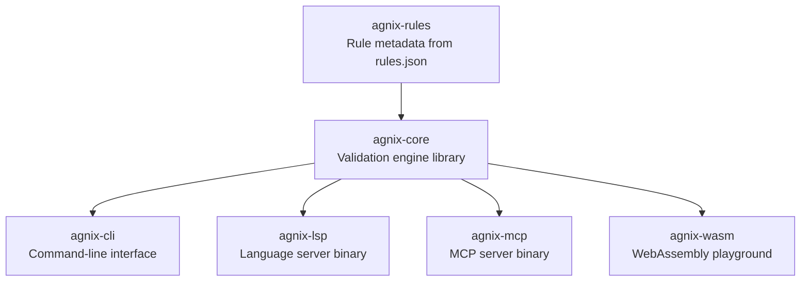

# Agnix: Linting Your Codex CLI Agent Configurations Before They Break Your Workflow


---

Your AGENTS.md is 600 lines of carefully crafted instructions. Your `config.toml` has nested profiles, MCP server declarations, and subagent TOML files in `.codex/agents/`. Your skills directory holds a dozen SKILL.md files with YAML front matter. Everything works — until it doesn't. A mistyped model name silently falls back to defaults. A skill with a malformed description never triggers. An MCP server declaration missing a timeout key causes a hang that takes 20 minutes to diagnose.

Agnix[^1] is a Rust-based linter and Language Server Protocol (LSP) implementation that validates AI coding agent configuration files — including Codex CLI's — before they reach production. With 399 rules across 36 categories and 126 auto-fixable patterns[^2], it catches the configuration errors that silent failures hide.

## Why Configuration Linting Matters for Codex CLI

Vercel's research indicates that skills invoke at 0% without correct syntax[^3]. GitHub's analysis of 2,500 repositories found that AGENTS.md quality directly correlates with agent effectiveness[^4]. The problem is structural: Codex CLI loads configuration from multiple layers (user config, project config, directory-scoped AGENTS.md, skills, MCP servers, subagent TOML files) with silent fallback behaviour. A typo in `model_reasoning_effort` doesn't throw an error — it just uses the default.

Agnix addresses this by treating agent configuration as code that deserves the same validation rigour as application source.

## The Agnix Architecture

Agnix ships as a six-crate Rust workspace[^1]:



The separation matters: `agnix-core` is embeddable in custom tooling, `agnix-lsp` provides real-time IDE diagnostics, `agnix-mcp` exposes validation as an MCP tool (meaning Codex CLI can lint its own configuration mid-session), and `agnix-wasm` powers an online playground[^5] for testing rules without installation.

Performance is acceptable for CI pipelines: single file validation completes in under 10ms, a 100-file project in roughly 200ms, and a 1,000-file monorepo in approximately 2 seconds[^2].

## Installation

```bash
# npm (recommended — matches Codex CLI's npm-first ecosystem)
npm install -g agnix

# Run without installing
npx agnix .

# Homebrew
brew tap agent-sh/agnix && brew install agnix

# Cargo (for Rust teams)
cargo install agnix-cli
```

## Codex CLI-Specific Rules

Agnix v0.18.0 (released 1 April 2026)[^6] includes 16+ Codex-specific configuration rules and 14 plugin rules, grouped into three prefixes:

### CDX-CFG: Config.toml Validation

These rules validate your `~/.codex/config.toml` and project-level `.codex/config.toml`:

| Rule | Severity | What It Catches |
|------|----------|-----------------|
| CDX-CFG-001–022 | HIGH/MEDIUM | Invalid `sandbox_mode` values, unrecognised model identifiers, malformed `model_provider` blocks, incorrect `model_reasoning_summary` keys, invalid TUI configuration, misconfigured MCP OAuth fields, `model_context_window` outside valid ranges, `model_auto_compact_token_limit` exceeding 90% ceiling |
| CDX-CFG-023–027 | MEDIUM | Added in v0.17.0 — stricter validation for newer config keys introduced in Codex CLI v0.119+ |

### CDX-AG: AGENTS.md Validation

| Rule | Severity | What It Catches |
|------|----------|-----------------|
| CDX-AG-004 | HIGH | AGENTS.md exceeds Codex CLI's 32 KiB size limit |
| CDX-AG-005 | MEDIUM | Referenced files that do not exist in the repository |
| CDX-AG-006 | MEDIUM | Missing project context sections (build commands, test commands) |
| CDX-AG-007 | HIGH | Contradictions between AGENTS.md instructions and config.toml settings |

### CDX-PL: Plugin Validation

Added in v0.18.0[^6], these 14 rules (CDX-PL-001 through CDX-PL-014) validate the `plugin.json` manifest, `.mcp.json` server configurations, and `.app.json` connector files within `.codex-plugin/` directories.

## Cross-Platform Rules

Beyond Codex-specific validation, Agnix's cross-platform rules catch issues that matter when running multiple CLI agents on the same codebase:

- **AGM-001**: Valid Markdown structure in AGENTS.md[^2]
- **AGM-003**: Character limit enforcement — Windsurf's 12,000-character constraint would silently truncate content that works in Codex CLI's 32 KiB limit[^2]
- **AGM-005**: Platform-specific features used without guard comments
- **XP-008**: Cross-platform CLAUDE.md ↔ AGENTS.md consistency validation[^7]
- **AS-001–019**: Agent Skills (SKILL.md) frontmatter validation — name formatting, description quality, file size and depth limits, path separator normalisation[^2]
- **MCP-001–012**: MCP server configuration validation across `*.mcp.json` files[^2]

## IDE Integration: Real-Time Validation

The VS Code extension[^8] (`avifenesh.agnix`) provides real-time diagnostics as you edit configuration files:

```json
{
  "agnix.enable": true,
  "agnix.codeLens.enable": true,
  "agnix.versions.codex": "0.120.0",
  "agnix.rules.disabledRules": ["PE-003"]
}
```

Key features include context-aware code completion for SKILL.md front matter, inline CodeLens showing rule violations, and quick-fix with diff preview. Extensions also exist for JetBrains[^1] and Neovim[^9], with a Zed extension under review[^10].

Version pinning (`agnix.versions.codex`) ensures rules match your installed Codex CLI version — important given the pace of configuration changes across releases.

## CI/CD Integration with agnix-ci

The `agnix-ci` GitHub Action[^11] integrates validation into pull request workflows:

```yaml
name: Validate Agent Configs
on: [pull_request]

jobs:
  lint-agent-configs:
    runs-on: ubuntu-latest
    steps:
      - uses: actions/checkout@v4
      - name: Validate agent configurations
        uses: agent-sh/agnix@v0
        with:
          target: 'codex'
```

This catches configuration regressions before they reach the main branch. For teams running multiple CLI agents, omitting the `target` parameter validates all supported tool configurations in a single pass.

Combining `agnix-ci` with `openai/codex-action` creates a two-gate CI pipeline: agnix validates the configuration, then Codex CLI validates the code.

## Auto-Fix Capabilities

Of the 399 rules, 126 support automatic fixing[^2] at three confidence tiers:

```bash
# Safe fixes only (HIGH confidence — formatting, missing fields with obvious defaults)
agnix --fix-safe .

# Standard fixes (HIGH + MEDIUM confidence)
agnix --fix .

# Aggressive fixes (all confidence levels — review the diff)
agnix --fix-unsafe .

# Preview before applying
agnix --dry-run --show-fixes .
```

The `--strict` flag treats warnings as errors — useful for CI pipelines where you want zero tolerance for configuration drift.

## Project Configuration

A `.agnix.toml` at the repository root configures behaviour per project:

```toml
target = "Codex"

[rules]
disabled_rules = ["PE-003"]
```

Disabling `PE-003` (a prompt engineering heuristic) is common for teams that prefer their own AGENTS.md conventions over agnix's opinionated suggestions. Rule precedence follows: VS Code settings > `.agnix.toml` > defaults[^2].

## The Broader Validation Ecosystem

Agnix is not the only option. AgentLinter[^12] (`npx agentlinter`) offers 25+ rules with a scoring system across 8 dimensions and a three-layer security scanner. For teams that only need basic structural validation, it may suffice. Other tools include cclint (Claude Code-specific), ctxlint (checks referenced files exist), and ai-linter (Python-based SKILL.md frontmatter validation)[^13].

Agnix's differentiator is breadth: 11 tools supported (Claude Code, Codex CLI, OpenCode, Cursor, GitHub Copilot, Gemini CLI, Cline, Windsurf, Roo Code, Kiro, Amp)[^2], a proper LSP for real-time feedback, and the MCP server mode that enables agents to self-validate.

## Practical Recommendations

1. **Start with `npx agnix .`** in your Codex CLI project directory. The zero-config experience catches the most common issues immediately.

2. **Pin the Codex CLI version** in `.agnix.toml` or VS Code settings. Configuration keys change across releases — v0.119.0 and v0.120.0 introduced several new config fields that older agnix versions do not validate.

3. **Add `agnix-ci` to your PR pipeline** alongside `openai/codex-action`. Configuration validation is faster than running the agent and catches issues earlier.

4. **Use `--strict` in CI, default severity locally.** Developers benefit from warnings during editing; CI should enforce zero violations.

5. **Enable the MCP server** (`agnix-mcp`) if you want Codex CLI to validate its own configuration changes mid-session — a useful meta-pattern for teams that use Codex to modify their own AGENTS.md files.

## What Agnix Cannot Do

Agnix validates syntax, structure, and known patterns. It cannot validate whether your AGENTS.md instructions are *effective* — that requires runtime evaluation with tools like Skillgrade[^14] or the `codex exec` eval pipeline. Think of agnix as the equivalent of a TypeScript compiler: it catches structural errors, not logic errors.

⚠️ The VS Code extension currently has 85 installs[^8], suggesting early-stage adoption. Expect rough edges, particularly around auto-fix reliability for complex multi-file configurations.

## Citations

[^1]: agent-sh/agnix GitHub repository. [https://github.com/agent-sh/agnix](https://github.com/agent-sh/agnix)
[^2]: Agnix documentation site. [https://agent-sh.github.io/agnix/](https://agent-sh.github.io/agnix/)
[^3]: Avi Fenesh, "Your AI Agent Configs Are Probably Broken — And You Don't Know It," DEV.to, 2026. [https://dev.to/avifenesh/your-ai-agent-configs-are-probably-broken-and-you-dont-know-it-16n1](https://dev.to/avifenesh/your-ai-agent-configs-are-probably-broken-and-you-dont-know-it-16n1)
[^4]: Matt Nigh, "How to write a great agents.md: lessons from over 2,500 repositories," GitHub Blog, 2026. [https://github.blog/ai-and-ml/github-copilot/how-to-write-a-great-agents-md-lessons-from-over-2500-repositories/](https://github.blog/ai-and-ml/github-copilot/how-to-write-a-great-agents-md-lessons-from-over-2500-repositories/)
[^5]: Agnix online playground. [https://agent-sh.github.io/agnix/playground](https://agent-sh.github.io/agnix/playground)
[^6]: Agnix v0.18.0 release notes, 1 April 2026. [https://github.com/agent-sh/agnix/releases/tag/v0.18.0](https://github.com/agent-sh/agnix/releases/tag/v0.18.0)
[^7]: Agnix v0.13.0 release notes — XP-008 cross-platform rule. [https://github.com/agent-sh/agnix/releases/tag/v0.13.0](https://github.com/agent-sh/agnix/releases/tag/v0.13.0)
[^8]: Agnix VS Code extension on Visual Studio Marketplace. [https://marketplace.visualstudio.com/items?itemName=avifenesh.agnix](https://marketplace.visualstudio.com/items?itemName=avifenesh.agnix)
[^9]: Agnix Neovim plugin. [https://github.com/agent-sh/agnix/tree/main/editors/neovim](https://github.com/agent-sh/agnix/tree/main/editors/neovim)
[^10]: Zed extension PR #4743. [https://github.com/zed-industries/extensions/pull/4743](https://github.com/zed-industries/extensions/pull/4743)
[^11]: agnix-ci GitHub Action. [https://github.com/marketplace/actions/agnix-ci](https://github.com/marketplace/actions/agnix-ci)
[^12]: AgentLinter. [https://agentlinter.com/](https://agentlinter.com/)
[^13]: AGENTS.md specification site. [https://agents.md/](https://agents.md/)
[^14]: Skillgrade CLI by Minko Gechev. [https://github.com/mgechev/skillgrade](https://github.com/mgechev/skillgrade)
