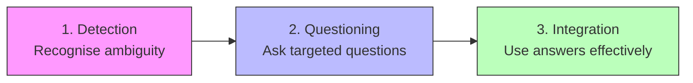
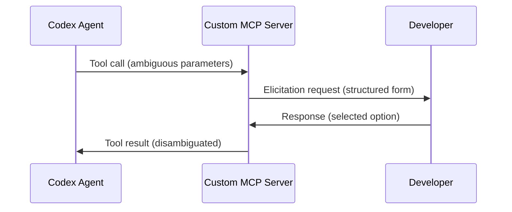

# The Silent Guessing Problem: Why AI Coding Agents Don't Ask Clarifying Questions and What AMBIG-SWE Means for Codex CLI


---

A Carnegie Mellon research team has published one of the most practically important findings for agentic coding in 2026: when given ambiguous instructions, AI coding agents almost never ask for clarification. They guess silently — and get it wrong far more often than they should. The AMBIG-SWE paper, accepted at ICLR 2026[^1], quantifies this problem and offers a framework that every Codex CLI user should understand.

## The Core Finding: Agents Default to Silence

Vijayvargiya et al. constructed a benchmark of 500 issues derived from SWE-Bench Verified, synthetically reducing detail to simulate the kind of underspecified bug reports and feature requests that arrive in real-world repositories[^1]. The results are striking: when agents were given these ambiguous instructions in a non-interactive setting, resolve rates dropped to as low as 37.94% for Claude Sonnet 3.5, compared to 59.52% when the same model could ask clarifying questions — a 57% relative recovery[^1].

The most damaging finding is behavioural, not architectural: **models default to non-interactive behaviour unless explicitly prompted to ask questions**[^1]. Without strong encouragement, agents almost never interact, even when instructions are severely underspecified. Qwen 3 Coder achieved a 100% false negative rate across all prompt configurations — it never once detected that it lacked sufficient information[^1].

## The Three-Capability Framework

AMBIG-SWE decomposes the problem into three capabilities that agents need but largely lack[^1]:



1. **Detection** — can the agent identify when instructions are incomplete? Claude Sonnet 4 achieved 89% accuracy with strong encouragement, but dropped to 74% without it[^1].
2. **Questioning** — can it ask the right questions? Claude Sonnet 4 obtained equivalent information gains to Qwen 3 Coder using 50% fewer questions, by employing an "exploration-first" strategy — examining the codebase before asking the user[^1].
3. **Integration** — can it actually use the answers? Even when models received navigation hints, Qwen 3 Coder's resolve rate *declined* from 47.60% to 40.20%, suggesting some models cannot effectively integrate new information[^1].

## Why This Matters for Codex CLI Users

Every Codex CLI session operates on a spectrum from fully interactive (the TUI) to fully non-interactive (`codex exec`). The AMBIG-SWE findings map directly onto this spectrum.

### The Interactive Gap

In a standard interactive session, Codex CLI can theoretically pause and ask you questions. In practice, GPT-5.3-Codex and GPT-5.4 share the same behavioural bias the paper identifies: they prefer to guess and proceed rather than interrupt your flow with clarifying questions[^2]. This is partly by design — the official Codex system prompt includes an "autonomy directive" that biases the agent toward action[^3] — and partly an artefact of RLHF training that rewards task completion over collaborative disambiguation.

### The Non-Interactive Cliff

For `codex exec` users — CI/CD pipelines, background automation, scheduled tasks — the problem is structural. Non-interactive mode cannot ask questions at all[^4]. Every ambiguous instruction becomes a silent guess. The AMBIG-SWE data suggests this costs you roughly 20 percentage points of resolve rate compared to what an interactive, clarification-seeking agent could achieve[^1].

## Practical Mitigation Patterns

The good news: Codex CLI already provides mechanisms to address each capability in the AMBIG-SWE framework, even if they were not designed with this paper in mind.

### Pattern 1: Plan Mode as Forced Disambiguation

OpenAI's own best practices guide explicitly recommends plan mode for ambiguous tasks: "Plan mode lets Codex gather context, ask clarifying questions, and build a stronger plan before implementation"[^5]. Toggling `/plan` or pressing `Shift+Tab` activates a mode where the agent must articulate its understanding before acting.

This directly addresses AMBIG-SWE's **detection** and **questioning** capabilities. By forcing the agent to produce a plan, you create a natural checkpoint where missing information becomes visible:

```bash
# In the TUI, start with plan mode for ambiguous tasks
codex
# Then type: /plan
# Then provide your ambiguous task description
```

The plan output reveals the agent's assumptions. If it assumed the wrong database, the wrong branch, or the wrong test framework, you catch it before any code is written.

### Pattern 2: The Interview Pattern

The best practices guide also recommends a pattern that mirrors AMBIG-SWE's ideal interactive agent: "Ask Codex to interview you. If you have a rough idea of what you want but aren't sure how to describe it well, ask Codex to question you first"[^5].

In practice, this means prefixing your prompt:

```
Before implementing anything, ask me 3-5 clarifying questions about
the requirements. I want to fix the authentication flow in the
user service, but I'm not sure about the exact scope.
```

This inverts the default behaviour: instead of the agent guessing silently, it must explicitly surface its uncertainties.

### Pattern 3: AGENTS.md as Ambient Disambiguation

The AMBIG-SWE paper found that exploration-first strategies — examining the codebase before asking — produced more efficient questioning[^1]. AGENTS.md serves as pre-emptive disambiguation by encoding the answers to common questions before the agent even starts:

```markdown
# AGENTS.md

## Architecture
- Authentication uses OAuth 2.0 PKCE flow via `/auth` service
- Database is PostgreSQL 16 with pgvector extension
- All API responses follow RFC 7807 Problem Details format

## Conventions
- Tests use pytest with Testcontainers — never mock the database
- Branch naming: `feat/JIRA-123-short-description`
- PRs require at least one approval before merge

## Constraints
- NEVER modify migration files after they have been applied
- All new endpoints MUST have OpenAPI annotations
- If a task is ambiguous, output your assumptions and stop
```

That last line — "If a task is ambiguous, output your assumptions and stop" — is the AGENTS.md equivalent of AMBIG-SWE's "strong encouragement" prompt. It explicitly instructs the agent to detect and surface ambiguity rather than guessing through it[^6].

### Pattern 4: Structured Prompts for codex exec

For non-interactive pipelines where the agent cannot ask questions, the solution is to eliminate ambiguity at the prompt level. OpenAI recommends a four-component prompt structure[^5]:

```bash
codex exec --full-auto "$(cat <<'PROMPT'
Goal: Add rate limiting to the /api/users endpoint
Context: The rate limiter should use Redis (already running on
  localhost:6379). See src/middleware/rateLimit.ts for the existing
  pattern used on /api/auth.
Constraints: Use the sliding window algorithm. Maximum 100 requests
  per minute per API key. Follow the existing middleware pattern exactly.
Done when: All existing tests pass AND new tests in
  src/__tests__/rateLimit.test.ts cover the happy path, over-limit
  response (429), and window reset.
PROMPT
)"
```

Each component maps to AMBIG-SWE's framework: **Context** provides the information the agent would otherwise need to ask about; **Constraints** eliminate the ambiguity space; **Done when** provides verification criteria that remove subjective interpretation.

### Pattern 5: MCP Elicitation for Custom Servers

Codex CLI v0.119.0 introduced MCP elicitation — the ability for custom MCP servers to interrupt an agent turn and request structured user input via `mcpServer/elicitation/request`[^7]. This is the closest Codex CLI comes to the interactive clarification loop that AMBIG-SWE demonstrates:



For teams building custom MCP servers, this provides a mechanism to enforce clarification at tool boundaries rather than relying on the model's self-awareness of ambiguity.

### Pattern 6: Steer Mode for Mid-Turn Correction

When an agent has already started executing but you notice it has silently guessed wrong, steer mode (press `Enter` to interrupt immediately, `Tab` to queue for next turn) provides real-time correction[^8]. This is a reactive version of AMBIG-SWE's interaction loop — you supply the missing information after observing the agent's behaviour rather than before.

The combination of plan mode (proactive) and steer mode (reactive) covers both ends of the disambiguation timeline.

## The Exploration-First Lesson

AMBIG-SWE's most actionable finding for Codex CLI practitioners is the **exploration-first strategy**: Claude Sonnet 4 achieved the same information gains as Qwen 3 Coder using half the questions by first examining the codebase and then asking targeted questions about what remained unclear[^1].

This maps directly to Codex CLI's `Auto` approval mode, where the agent can read files freely before asking permission to write[^9]. An AGENTS.md instruction that encourages this pattern:

```markdown
## Workflow
When given an ambiguous task:
1. Read all relevant files in the affected directories first
2. Check existing tests for behavioural expectations
3. Review recent git log for context on recent changes
4. THEN propose your plan — listing any assumptions you are making
5. Wait for confirmation before implementing
```

This encodes the exploration-first strategy as a repeatable workflow. The agent gathers context from the codebase (which costs no human time) and only then surfaces its remaining uncertainties (which requires human attention).

## The Bigger Picture: Interactive Agents as a Design Goal

The AMBIG-SWE paper concludes that dedicated training approaches are needed rather than relying on prompt engineering alone[^1]. Current models were not trained to detect and act on ambiguity — they were trained to complete tasks. Until model providers address this at the training level, the burden falls on practitioners to create environments that compensate for the agent's bias toward silent guessing.

For Codex CLI users, this means:

1. **Default to plan mode** for any task you cannot specify in four precise sentences
2. **Write AGENTS.md files** that answer the questions your agent would ask if it were designed to ask them
3. **Structure codex exec prompts** with the four-component framework to eliminate ambiguity before submission
4. **Use steer mode** when you see the agent heading down the wrong path
5. **Build MCP servers** with elicitation support for domain-specific disambiguation

The 74% improvement that AMBIG-SWE demonstrates is not an incremental gain — it is the difference between an agent that silently produces plausible-looking wrong code and one that collaborates with you to produce correct code. The tools exist in Codex CLI today. The research tells us we need to use them more deliberately.

## Citations

[^1]: Vijayvargiya, S., Zhou, X., Yerukola, A., Sap, M., & Neubig, G. (2026). "AMBIG-SWE: Interactive Agents to Overcome Underspecificity in Software Engineering." ICLR 2026. [arXiv:2502.13069](https://arxiv.org/abs/2502.13069)

[^2]: OpenAI. "Codex CLI Features." [developers.openai.com/codex/cli/features](https://developers.openai.com/codex/cli/features)

[^3]: OpenAI. "Codex Prompting Guide." OpenAI Cookbook, 2026. [developers.openai.com/codex/learn/prompting](https://developers.openai.com/codex/learn/prompting)

[^4]: OpenAI. "Non-interactive mode — Codex." [developers.openai.com/codex/noninteractive](https://developers.openai.com/codex/noninteractive)

[^5]: OpenAI. "Best Practices — Codex." [developers.openai.com/codex/learn/best-practices](https://developers.openai.com/codex/learn/best-practices)

[^6]: Blake Crosley. "AGENTS.md Patterns: What Actually Changes Agent Behavior." [blakecrosley.com/blog/agents-md-patterns](https://blakecrosley.com/blog/agents-md-patterns)

[^7]: OpenAI. "Codex CLI Changelog — v0.119.0." [developers.openai.com/codex/changelog](https://developers.openai.com/codex/changelog)

[^8]: SmartScope. "Codex Plan Mode: Stop Code Drift with Plan→Execute (2026)." [smartscope.blog](https://smartscope.blog/en/generative-ai/chatgpt/codex-plan-mode-complete-guide/)

[^9]: OpenAI. "Custom Instructions with AGENTS.md." [developers.openai.com/codex/guides/agents-md](https://developers.openai.com/codex/guides/agents-md)
