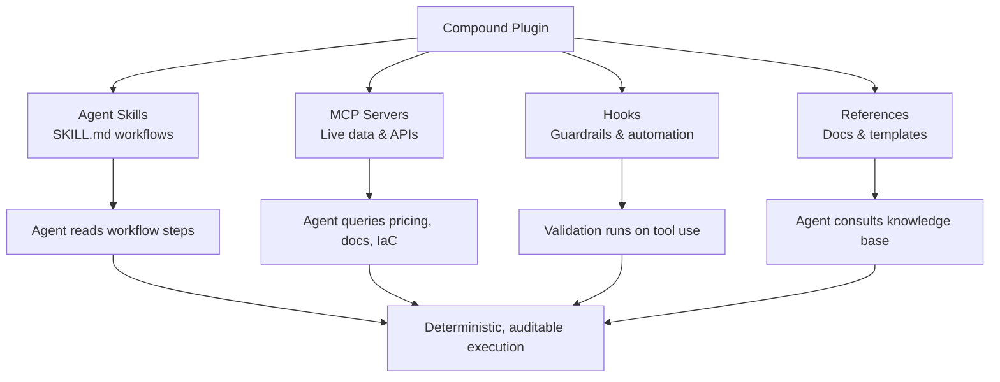
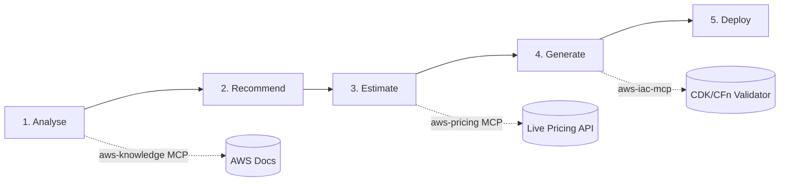
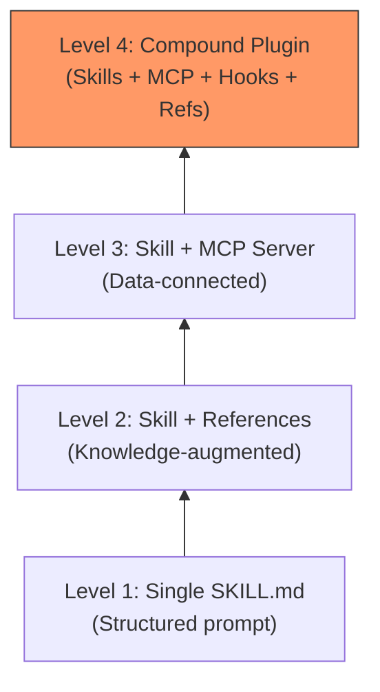

# AWS Agent Plugins and the Compound Plugin Pattern: How Cloud Providers Are Shipping Production-Grade Agent Skills


---

On 17 February 2026, AWS Labs open-sourced `awslabs/agent-plugins` — the first major cloud provider plugin suite purpose-built for AI coding agents [^1]. The repository ships seven plugins that work across Claude Code, Codex CLI, and Cursor [^2], and introduces what is arguably the most important architectural pattern in the nascent plugin ecosystem: the **compound plugin**.

This article dissects the compound plugin architecture, walks through the deploy-on-aws workflow, shows how to wire these plugins into Codex CLI via `marketplace.json`, and considers what Azure and GCP will need to ship to compete.

## What Is a Compound Plugin?

A traditional agent skill is a single `SKILL.md` file — a structured workflow document that an agent reads and follows. It is essentially a sophisticated prompt template with step-by-step instructions.

A **compound plugin** bundles four distinct artifact types into a single distributable unit [^1]:

| Artifact | Purpose | Example |
|---|---|---|
| **Agent Skills** | Structured workflows and best-practice playbooks | `skills/deploy/SKILL.md` |
| **MCP Servers** | Live connections to external services, data, and APIs | `aws-pricing`, `aws-knowledge`, `aws-iac-mcp` |
| **Hooks** | Automation and guardrails triggered on developer actions | `validate-drawio.sh` (PostToolUse) |
| **References** | Documentation, configuration defaults, and knowledge | Style guides, templates, example diagrams |

The key insight is that skills alone lack runtime context. An agent following a deployment playbook cannot estimate costs without a pricing API, cannot validate IaC without a CDK linter, and cannot enforce diagram standards without a PostToolUse hook. The compound plugin pattern solves this by packaging the entire capability surface — instruction, data access, validation, and knowledge — into a single installable unit.



## The Seven AWS Plugins

The `awslabs/agent-plugins` marketplace ships seven plugins as of April 2026 [^2][^3]:

| Plugin | Focus | Key Capabilities |
|---|---|---|
| `deploy-on-aws` | Infrastructure deployment | Architecture recommendations, cost estimates, CDK/CloudFormation generation |
| `aws-serverless` | Lambda, API Gateway, EventBridge, Step Functions | Serverless architecture patterns and deployment |
| `aws-amplify` | Full-stack apps with Amplify Gen 2 | Auth, data, storage, serverless functions, sandbox deployment |
| `databases-on-aws` | Database guidance (Aurora DSQL initially) | Database selection, schema design, connection patterns |
| `amazon-location-service` | Maps, geocoding, routing | Geospatial feature integration |
| `migration-to-aws` | GCP-to-AWS migration | Resource discovery, architecture mapping, cost analysis |
| `sagemaker-ai` | ML model lifecycle | Build, train, deploy AI/ML models |

Each plugin is a compound plugin — not merely a skill file, but a complete capability unit with its own MCP servers, hooks, and reference material [^1].

## Deep Dive: deploy-on-aws

The `deploy-on-aws` plugin is the flagship and the best illustration of the compound pattern. It implements a five-step deterministic workflow [^4][^5]:

### The Five-Step Workflow



1. **Analyse** — examines project structure, dependencies, and runtime requirements [^5]
2. **Recommend** — proposes AWS services with rationale (e.g., App Runner for the backend, RDS PostgreSQL for the database, CloudFront + S3 for the frontend) [^5]
3. **Estimate** — queries the `aws-pricing` MCP server for real-time cost projections before any infrastructure is committed [^4]
4. **Generate** — produces CDK or CloudFormation code with security defaults applied [^4]
5. **Deploy** — executes deployment only after explicit user confirmation [^5]

### Three Backing MCP Servers

The skill file alone would be a 600-line prompt with no access to live data. The compound pattern solves this with three bundled MCP servers [^4]:

- **`aws-knowledge`** — architecture decisions, service documentation, and best practices
- **`aws-pricing`** — real-time cost data from the AWS Pricing API
- **`aws-iac-mcp`** — CDK and CloudFormation validation and guidance

### Hooks as Safety Rails

The deploy-on-aws plugin also ships PostToolUse hooks — notably `validate-drawio.sh` for the architecture diagram skill, which validates generated `.drawio` diagrams against style guides and templates stored in the `references/` directory [^6]. This pattern ensures that agent outputs conform to organisational standards without requiring the developer to manually review every artefact.

## Installing AWS Plugins in Codex CLI

Codex CLI supports plugin installation via repo-local or personal `marketplace.json` files [^7][^8]. To add the AWS agent plugins marketplace:

### Step 1: Add the Marketplace

```bash
codex marketplace add https://github.com/awslabs/agent-plugins
```

This registers the AWS marketplace in your Codex plugin configuration. Codex reads the marketplace catalogue and makes all seven plugins available for installation [^8].

### Step 2: Install a Plugin

```bash
codex marketplace install deploy-on-aws
```

Codex installs the plugin into `~/.codex/plugins/cache/awslabs-agent-plugins/deploy-on-aws/<version>/`, wiring up the skill files, MCP server configurations, and hooks automatically [^7].

### Step 3: Configure in config.toml

For enterprise deployments, you may want to pin plugins in your project's `config.toml`:

```toml
[plugins]
marketplaces = ["https://github.com/awslabs/agent-plugins"]

[plugins.installed]
deploy-on-aws = { version = "latest", policy = "INSTALLED_BY_DEFAULT" }
aws-serverless = { version = "latest", policy = "AVAILABLE" }
```

The three-tier installation policy (`INSTALLED_BY_DEFAULT`, `AVAILABLE`, `NOT_AVAILABLE`) gives enterprise teams granular control over which plugins are active by default versus opt-in [^7].

## The Plugin Directory Structure

Understanding the on-disk layout clarifies how the compound pattern works:

```
plugins/deploy-on-aws/
├── .codex-plugin/
│   └── plugin.json          # Manifest: metadata, component pointers
├── .mcp.json                # MCP server definitions
├── skills/
│   ├── deploy/
│   │   ├── SKILL.md         # Five-step deployment workflow
│   │   └── references/      # Architecture patterns, defaults
│   └── aws-architecture-diagram/
│       ├── SKILL.md          # Diagram generation skill
│       └── references/       # Style guides, templates, examples
└── scripts/
    ├── validate-drawio.sh    # PostToolUse hook
    └── lib/                  # Post-processing pipeline
```

The `plugin.json` manifest is the glue — it declares which skills, MCP servers, and hooks the plugin provides, along with package metadata and installation surface fields [^6][^7].

## Cross-Tool Portability

One of the most significant aspects of the compound plugin pattern is its emerging cross-tool portability. The `@every-env/compound-plugin` CLI can convert Claude Code plugins into formats for Kiro, OpenCode, Codex, Factory Droid, Gemini CLI, GitHub Copilot, and others [^9]. Skills and MCP server configurations translate cleanly; hooks are the current gap, as hook models differ between tools and are dropped during conversion [^9].

This suggests a future where compound plugins become a lingua franca for agent capabilities — write once for Claude Code's plugin format, convert for Codex CLI's marketplace, and deploy across your team's heterogeneous tooling.

## What Azure and GCP Need to Ship

AWS's first-mover advantage is substantial. As of April 2026, the competitive landscape looks like this [^10][^11]:

| Capability | AWS | Azure | GCP |
|---|---|---|---|
| Official agent plugin suite | ✅ 7 compound plugins | ❌ No equivalent | ❌ No equivalent |
| MCP servers for coding agents | ✅ 60+ servers | ✅ Azure DevOps, AI Foundry | ✅ Smaller count, granular controls |
| Deterministic deployment workflow | ✅ Five-step with cost estimation | ❌ | ❌ |
| Cross-tool support | ✅ Claude Code, Codex, Cursor | Partial (VS Code integration) | Partial (Gemini CLI) |
| Plugin marketplace format | ✅ marketplace.json | ❌ | ❌ |

Azure's strongest card is deep Visual Studio and Azure DevOps integration — the Azure DevOps MCP Server for work items, pipelines, and test management is a genuine differentiator that AWS lacks [^10]. But Azure has no compound plugin equivalent that bundles skills, MCP servers, hooks, and references into a single deployable unit.

GCP has invested in the Agent Development Kit (ADK) with a Python-first approach and has official MCP servers with granular read-only/read-write controls [^11]. However, GCP's MCP server count is the smallest of the three, and there is no plugin marketplace format.

For Azure and GCP to compete, they need to ship:

1. **Compound plugin specifications** — a manifest format that bundles skills, MCP, hooks, and references
2. **Deployment workflow plugins** — deterministic, auditable deployment pipelines with real-time cost estimation
3. **Marketplace infrastructure** — discoverability and version management for plugin distribution

## Security Considerations

The compound plugin pattern introduces a broader attack surface than simple skill files. Each MCP server is a network-connected process with access to cloud APIs. Enterprise teams should consider:

- **Least-privilege IAM** — each MCP server should use scoped credentials, not broad administrator access
- **Hook validation** — PostToolUse hooks execute arbitrary scripts; review them as you would CI pipeline code
- **Plugin pinning** — use specific versions rather than `latest` in production environments
- **Network policy** — restrict MCP server outbound connections using Codex CLI's `[permissions.network]` domain allowlists

⚠️ The current plugin format does not include a cryptographic signing mechanism for verifying plugin integrity. This is an open gap for enterprise adoption.

## The Plugin Maturity Ladder

Not every capability needs the full compound treatment. The AWS plugin suite illustrates a natural maturity progression:



Start with a `SKILL.md` for internal workflows. Add references when the agent needs domain knowledge. Connect an MCP server when live data is required. Graduate to a full compound plugin when you need guardrails, validation, and cross-tool distribution.

## Conclusion

AWS's `agent-plugins` repository is more than a collection of cloud deployment shortcuts. It establishes the compound plugin as the unit of distribution for production-grade agent capabilities — bundling instruction, data access, automation, and knowledge into a single installable package. With cross-tool converters already emerging and Codex CLI's marketplace infrastructure maturing, the compound plugin pattern is likely to become the standard way cloud providers and enterprises ship agent skills.

The question is no longer whether your cloud provider supports MCP. It is whether they ship compound plugins that actually work end-to-end.

---

## Citations

[^1]: [Introducing Agent Plugins for AWS — AWS Developer Tools Blog](https://aws.amazon.com/blogs/developer/introducing-agent-plugins-for-aws/)
[^2]: [awslabs/agent-plugins — GitHub](https://github.com/awslabs/agent-plugins)
[^3]: [AWS Weekly Roundup: Agent Plugin for AWS Serverless — March 30, 2026](https://aws.amazon.com/blogs/aws/aws-weekly-roundup-aws-ai-ml-scholars-program-agent-plugin-for-aws-serverless-and-more-march-30-2026/)
[^4]: [AWS Launches Agent Plugins to Automate Cloud Deployment — InfoQ](https://www.infoq.com/news/2026/03/aws-launches-agent-plugins/)
[^5]: [Beyond Assistance: The Executive Power of "Agent Plugins for AWS" — DEV Community](https://dev.to/aws-builders/beyond-assistance-the-executive-power-of-agent-plugins-for-aws-5hnh)
[^6]: [agent-plugins/plugins/deploy-on-aws — GitHub](https://github.com/awslabs/agent-plugins/tree/main/plugins/deploy-on-aws)
[^7]: [Build plugins — Codex CLI Developer Documentation](https://developers.openai.com/codex/plugins/build)
[^8]: [Plugin support: local-based marketplace.json — openai/codex PR #13422](https://github.com/openai/codex/pull/13422)
[^9]: [Compound Engineering Plugin — EveryInc/compound-engineering-plugin — GitHub](https://github.com/EveryInc/compound-engineering-plugin)
[^10]: [Azure MCP Server: Setup, Tools, and Configuration for AI Coding Agents (2026)](https://www.morphllm.com/azure-mcp-server)
[^11]: [AWS Agent Plugin: Frictionless Deployment? Developer Honeypot? — Futurum Group](https://futurumgroup.com/insights/awss-deploy-to-aws-plugin-frictionless-deployment-or-developer-honeypot/)
