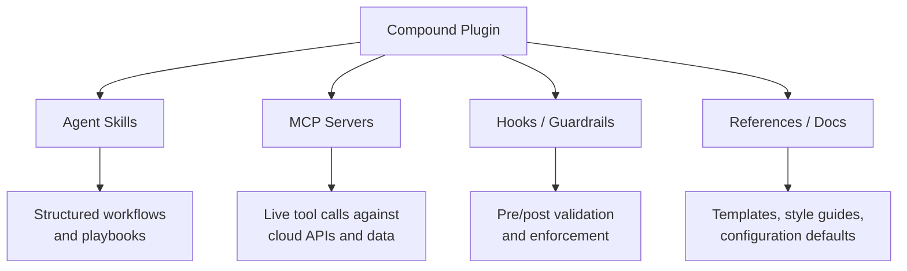
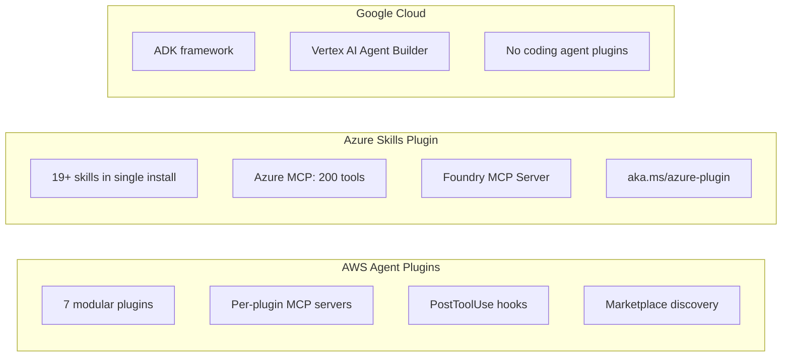

# Cloud Agent Plugin Suites: AWS Led, Azure Followed, and the GCP Gap


---

In February 2026, AWS Labs open-sourced `awslabs/agent-plugins` — the first major cloud provider plugin suite built for AI coding agents [^1]. Five weeks later, Microsoft responded with the Azure Skills Plugin, bundling 19+ curated skills and two MCP servers into a single install [^2]. Google Cloud, meanwhile, has invested heavily in its Agent Development Kit and Vertex AI Agent Builder but has shipped nothing equivalent for the coding agent ecosystem. For teams running Codex CLI, Claude Code, or Cursor in multi-cloud environments, this asymmetry creates real workflow gaps.

This article compares the two shipping plugin suites, examines what each brings to Codex CLI specifically, and analyses what Google Cloud would need to ship to close the gap.

## The Compound Plugin Pattern

Both AWS and Azure follow a similar architectural pattern — what the AWS repository calls a **compound plugin** [^1]. Rather than shipping a single `SKILL.md` prompt template, a compound plugin bundles multiple artifact types into a distributable unit:



This layered approach matters because skills alone cannot execute actions — they guide the agent through decision trees, whilst MCP servers provide the actual tool calls. Hooks enforce guardrails automatically. References supply domain knowledge without consuming context window on every turn.

## AWS Agent Plugins: The First Mover

AWS Labs published `awslabs/agent-plugins` on 17 February 2026 [^1][^3]. The repository ships seven plugins:

| Plugin | Focus |
|---|---|
| `deploy-on-aws` | Architecture recommendations, cost estimation, IaC generation |
| `aws-serverless` | Lambda, API Gateway, EventBridge, Step Functions |
| `aws-amplify` | Full-stack TypeScript apps with Gen 2 workflows |
| `databases-on-aws` | Aurora DSQL schema design, query optimisation |
| `amazon-location-service` | Maps, geocoding, routing, place search |
| `migration-to-aws` | GCP-to-AWS infrastructure migration planning |
| `sagemaker-ai` | Model building, training, and deployment |

Each plugin ships with a `.codex-plugin/plugin.json` manifest alongside `.claude-plugin/plugin.json`, meaning the same plugin works across Claude Code (≥2.1.29), Codex CLI, and Cursor (≥2.5) [^1].

### Installing in Codex CLI

AWS plugins integrate via the marketplace discovery mechanism. Clone the repository locally and Codex discovers the plugins from `.agents/plugins/marketplace.json`:

```bash
git clone https://github.com/awslabs/agent-plugins.git ~/.codex/plugins/aws
```

After restarting Codex, the plugins appear in the marketplace and can be activated per-project or globally [^1].

### Architectural Highlights

The `deploy-on-aws` plugin exemplifies the compound pattern. Its skill workflow walks the agent through a multi-step process: analyse the project, recommend an architecture, estimate costs via the AWS Pricing MCP server, generate IaC templates, and validate with hooks before deployment [^1]. The agent never guesses at pricing or service limits — it queries live data through the MCP server.

Each skill activates on trigger keywords. For example, "deploy to AWS" or "host on AWS" activates the `deploy-on-aws` skill [^1]. This means developers do not need to remember plugin names — natural language intent is sufficient.

## Azure Skills Plugin: The Fast Follower

Microsoft shipped the Azure Skills Plugin on 9 March 2026, three weeks after AWS [^2]. Where AWS took a modular approach with seven separate plugins, Microsoft went monolithic — a single install that bundles everything.

### What Ships in the Box

The Azure Skills Plugin includes three major components [^2]:

1. **19+ Azure Skills** covering preparation, validation, deployment, cost optimisation, diagnostics, compute, observability, AI, compliance, storage, migration, RBAC, and messaging
2. **Azure MCP Server** — approximately 200 structured tools across 40+ Azure services for resource management, pricing checks, log queries (KQL), diagnostics, and deployment workflows
3. **Foundry MCP Server** — model deployment, agent management, and AI Foundry integration

### Key Skills

Five skills form the core deployment workflow [^2]:

| Skill | Purpose |
|---|---|
| `azure-prepare` | Analyses project, generates infrastructure code, Dockerfiles, and deployment config |
| `azure-validate` | Runs pre-flight checks before deployment |
| `azure-deploy` | Orchestrates the actual deployment pipeline |
| `azure-cost-optimization` | Identifies waste and produces savings recommendations |
| `azure-diagnostics` | Troubleshoots failures with logs, metrics, and KQL queries |

### Supported Agents

The Azure Skills Plugin works with GitHub Copilot in VS Code, Copilot CLI, and Claude Code [^2]. Codex CLI support is available through the MCP server components — the Bicep MCP server, for instance, explicitly lists Codex CLI as a supported client [^4].

### Configuring the Bicep MCP Server in Codex CLI

The Azure Bicep MCP server provides ten tools for generating and validating Bicep code [^4]. To wire it into Codex CLI:

```toml
# ~/.codex/config.toml
[mcp_servers.bicep]
type = "stdio"
command = "dnx"
args = ["-y", "Azure.Bicep.McpServer"]
```

This gives Codex access to resource type schemas, AVM module metadata, Bicep diagnostics, ARM template decompilation, and best-practice guidance — all without leaving the terminal [^4][^5].

## Comparing the Two Approaches



| Dimension | AWS | Azure |
|---|---|---|
| **Release date** | 17 February 2026 [^3] | 9 March 2026 [^2] |
| **Distribution model** | Modular — pick individual plugins | Monolithic — single install, all skills |
| **Plugin count** | 7 plugins, each with skills + MCP | 19+ skills + 2 MCP servers |
| **MCP tool density** | Per-service (pricing, IaC, knowledge) | ~200 tools across 40+ services [^2] |
| **Codex CLI support** | Native `.codex-plugin/plugin.json` [^1] | Via MCP server configuration [^4][^5] |
| **Hook system** | PostToolUse validation hooks [^1] | Not documented in public release |
| **Cross-agent support** | Claude Code, Codex, Cursor [^1] | Copilot, Claude Code [^2] |

The modular vs monolithic distinction matters for enterprise teams. AWS's approach lets you install only `aws-serverless` if that is all you need, keeping context overhead minimal. Azure's approach trades granularity for convenience — one install and you have everything, but all 19+ skill descriptions land in the agent's context.

## The GCP Gap

Google Cloud has invested significantly in agent infrastructure [^6][^7], but none of it targets the coding agent plugin ecosystem:

- **Agent Development Kit (ADK)** is a framework for building multi-agent systems in Python, TypeScript, Go, and Java [^6]. It is designed for deploying autonomous agents on Vertex AI, Cloud Run, or GKE — not for extending Codex CLI or Claude Code.
- **Vertex AI Agent Builder** provides a suite for building, scaling, and governing AI agents in production [^7], with 100+ connectors via Apigee. Again, this targets production agent deployments, not developer workflow integration.
- **Agent Garden** offers sample agents and tools in the Google Cloud console [^7], but these are not packaged as coding agent plugins.

None of these ship skills, MCP servers, or hooks that a developer can install into Codex CLI with a single command. There is no `gcp-agent-plugins` repository, no `deploy-on-gcp` skill, and no Google Cloud MCP server with structured tools for resource management.

### What GCP Would Need to Ship

To reach parity with AWS and Azure, Google Cloud would need:

1. **A compound plugin suite** with skills for core GCP workflows — Cloud Run deployment, GKE orchestration, BigQuery analytics, Firestore schema design, and Cloud Functions development
2. **A GCP MCP server** exposing structured tools for resource management, pricing, IAM, and logging via Cloud Logging queries
3. **Codex CLI manifests** (`.codex-plugin/plugin.json`) for native marketplace discovery
4. **Cross-agent support** — Claude Code and Cursor at minimum, given market share

The demand is real. Claude Code already runs natively on Vertex AI [^8], and Gemini CLI integrates deeply with Firebase and Google Cloud [^9]. But neither provides the structured, skill-driven workflows that AWS and Azure now offer through their plugin suites.

## Multi-Cloud Plugin Configuration in Codex CLI

For teams operating across clouds, Codex CLI's MCP configuration in `config.toml` supports multiple servers simultaneously [^5]:

```toml
# AWS plugins via marketplace
# (discovered automatically from cloned repo)

# Azure Bicep MCP
[mcp_servers.bicep]
type = "stdio"
command = "dnx"
args = ["-y", "Azure.Bicep.McpServer"]

# OpenTofu Registry (community)
[mcp_servers.opentofu]
type = "stdio"
command = "npx"
args = ["-y", "@opentofu/registry-mcp"]
```

Fine-grained control is available through `enabled_tools` and `disabled_tools` to restrict which MCP server capabilities the agent can access [^5] — important when running multiple cloud MCP servers simultaneously to prevent the agent from accidentally provisioning resources in the wrong cloud.

## Enterprise Implications

The plugin asymmetry creates practical problems for multi-cloud enterprises:

- **Skill parity**: An agent can deploy to AWS or Azure with guided, validated workflows. The same agent deploying to GCP falls back to generic prompting and public documentation, with no guardrails or live validation.
- **Cost governance**: Both AWS and Azure plugins include pricing tools. GCP deployments have no equivalent cost-estimation step in the agent workflow.
- **Compliance**: Hooks in the AWS plugin suite can enforce organisational standards automatically. Without hooks, GCP workflows rely entirely on post-hoc review.

The compound plugin pattern is becoming the standard distribution format for cloud expertise in coding agents. With two of three hyperscalers shipping, the question is not whether GCP will follow — but how long multi-cloud teams will wait.

## Citations

[^1]: AWS Labs, "Agent Plugins for AWS," GitHub repository, February 2026. [https://github.com/awslabs/agent-plugins](https://github.com/awslabs/agent-plugins)

[^2]: Microsoft, "Announcing the Azure Skills Plugin," All Things Azure blog, 9 March 2026. [https://devblogs.microsoft.com/all-things-azure/announcing-the-azure-skills-plugin/](https://devblogs.microsoft.com/all-things-azure/announcing-the-azure-skills-plugin/)

[^3]: AWS, "Introducing Agent Plugins for AWS," AWS Developer Tools Blog, February 2026. [https://aws.amazon.com/blogs/developer/introducing-agent-plugins-for-aws/](https://aws.amazon.com/blogs/developer/introducing-agent-plugins-for-aws/)

[^4]: Microsoft, "Bicep MCP server," Azure Resource Manager documentation, updated March 2026. [https://learn.microsoft.com/en-us/azure/azure-resource-manager/bicep/bicep-mcp-server](https://learn.microsoft.com/en-us/azure/azure-resource-manager/bicep/bicep-mcp-server)

[^5]: OpenAI, "Model Context Protocol – Codex," Codex developer documentation. [https://developers.openai.com/codex/mcp](https://developers.openai.com/codex/mcp)

[^6]: Google, "Agent Development Kit (ADK)," ADK documentation. [https://google.github.io/adk-docs](https://google.github.io/adk-docs)

[^7]: Google Cloud, "Vertex AI Agent Builder," Google Cloud documentation. [https://cloud.google.com/products/agent-builder](https://cloud.google.com/products/agent-builder)

[^8]: Anthropic, "Claude Code on Google Vertex AI," Claude Code documentation. [https://code.claude.com/docs/en/google-vertex-ai](https://code.claude.com/docs/en/google-vertex-ai)

[^9]: DeployHQ, "Claude Code vs Codex CLI vs Gemini CLI (2026 Comparison)." [https://www.deployhq.com/blog/comparing-claude-code-openai-codex-and-google-gemini-cli-which-ai-coding-assistant-is-right-for-your-deployment-workflow](https://www.deployhq.com/blog/comparing-claude-code-openai-codex-and-google-gemini-cli-which-ai-coding-assistant-is-right-for-your-deployment-workflow)
