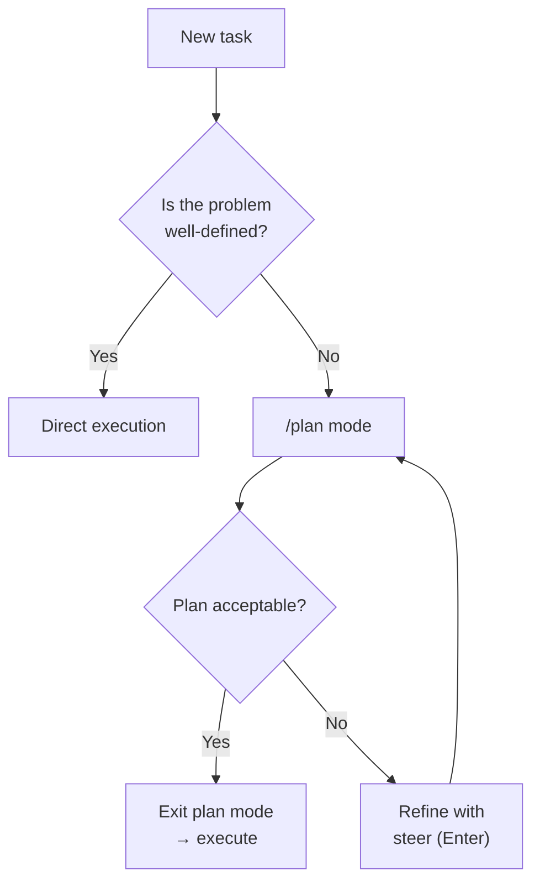
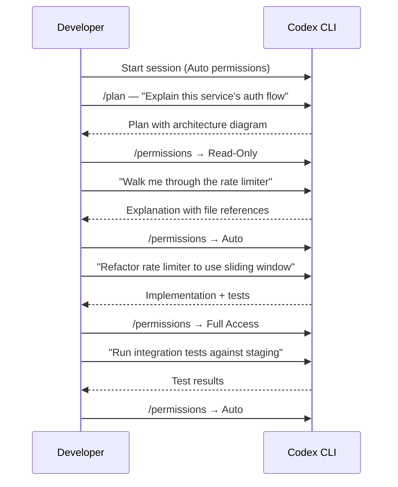

# Dynamic Session Control in Codex CLI: Mid-Session Switching of Models, Permissions, and Workflow Modes


---

A Codex CLI session is not a static environment. Every slash command that adjusts the model, the approval policy, the reasoning effort, or the workflow mode reshapes what the agent can do — without losing the conversational context you have built up. This article treats the full suite of mid-session levers as a single, composable system and shows how senior developers use them to move fluidly between exploration, planning, and high-trust execution within a single terminal session.

## The Five Session Control Levers

Codex CLI exposes five orthogonal axes of control that can be changed at any point during an interactive session [^1]:

| Lever | Slash command | What it changes |
|---|---|---|
| **Model** | `/model` | Which LLM processes the next turn |
| **Speed / cost** | `/fast` | Toggles GPT-5.4 fast mode (1.5× speed, 2× credits) [^2] |
| **Approval policy** | `/permissions` | How much autonomy the agent has before asking |
| **Workflow mode** | `/plan` or `Shift+Tab` | Whether the agent plans or executes |
| **Steering** | `Enter` (immediate) / `Tab` (queued) | Redirects or queues instructions mid-turn |

Each lever operates independently: switching the model does not reset your approval policy; entering plan mode does not change your sandbox. This orthogonality is what makes mid-session control genuinely useful rather than a gimmick.

## The `/permissions` Command: A Progressive Trust Ladder

The `/permissions` command exposes three approval presets that can be swapped at any point in a session [^3]:

```
/permissions
```


- **Read-Only** — Codex can browse files but will not make changes or run commands without explicit approval. Ideal for code review, architecture exploration, and onboarding to an unfamiliar codebase [^3].
- **Auto** (default) — Codex reads, edits, and runs commands within the working directory. It still asks before touching anything outside scope or accessing the network [^3].
- **Full Access** — unrestricted machine-wide access including network. Use sparingly and only when you trust both the repository and the task [^3].

The official best practices recommend starting conservatively: "Keep approval and sandboxing tight by default, then loosen permissions only for trusted repos or specific workflows once the need is clear" [^4]. In practice, this means a typical session begins in Auto, temporarily escalates to Full Access for a network-dependent task (e.g. running integration tests against a staging API), then steps back down.

### Granular Approval Policy in config.toml

For teams that need finer control than the three presets, `config.toml` supports a granular approval policy object [^5]:

```toml
[approval_policy]
granular.sandbox_approval = true
granular.rules = true
granular.mcp_elicitations = false
granular.request_permissions = true
granular.skill_approval = true
```

This lets you, for example, auto-approve sandbox escalations but block MCP elicitations — useful when running trusted local tools alongside untrusted third-party MCP servers.

## The `/model` Command: Switching Models Without Losing Context

Type `/model` and select from the available models. Codex clears the visible transcript and starts a fresh chat in the same CLI session, preserving your working directory and configuration [^1]:

```
/model
→ Select: gpt-5.4
→ Codex confirms the new model in the transcript
```

This is not just a convenience — it is a cost and quality lever. Common mid-session model switches include:

| Scenario | Switch to | Why |
|---|---|---|
| Exploratory chat → implementation | `gpt-5.4` | Full reasoning for complex code generation |
| Quick formatting / boilerplate | `gpt-5.4-mini` | 30% of the credit consumption [^6] |
| Rapid multi-draft iteration | `gpt-5.3-codex-spark` | 1,000+ tok/s on Cerebras WSE-3 (Pro only) [^7] |
| Deep architectural analysis | `gpt-5.4` with `xhigh` reasoning | Maximum reasoning depth |

### Combining `/model` with `/fast`

The `/fast` toggle is exclusive to GPT-5.4 and doubles credit consumption in exchange for approximately 1.5× speed [^2]. It maps to the `service_tier = "fast"` config key [^5]. For cost-conscious workflows, the opposite — `service_tier = "flex"` — saves approximately 50% but may increase latency during peak hours.

```toml
# Profile for rapid iteration
[profiles.sprint]
model = "gpt-5.4"
service_tier = "fast"
model_reasoning_effort = "medium"

# Profile for deep review
[profiles.deep-review]
model = "gpt-5.4"
service_tier = "flex"
model_reasoning_effort = "xhigh"
plan_mode_reasoning_effort = "xhigh"
```

## Plan Mode: The `/plan` Toggle

Plan mode (`/plan` or `Shift+Tab`) instructs Codex to gather context, ask clarifying questions, and build a plan before writing any code [^4]. This is not merely a prompt change — plan mode uses a separate reasoning effort level (`plan_mode_reasoning_effort`) that can exceed the execution-phase effort [^5]:

```toml
model_reasoning_effort = "medium"
plan_mode_reasoning_effort = "high"
```

The decision framework is straightforward:



Plan mode is particularly valuable when combined with `/fork`: plan in one thread, fork to execute, and preserve the planning context as a reference [^1].

## Mid-Turn Steering: Enter vs Tab

Steer mode (default since v0.98.0) lets you redirect the agent while it is actively working [^8]:

- **Enter** — sends input immediately. Codex reads your message mid-turn and adjusts its approach without losing context [^1]. Use this for urgent corrections: "Stop — don't modify the database migration, only the application code."
- **Tab** — queues a follow-up for the next turn [^1]. Use this for additions: "After you finish, also run the linter."

The critical distinction: Enter interrupts the current reasoning chain; Tab preserves it. Overusing Enter degrades output quality because the model must reconcile its partially completed work with new instructions.

## Composing the Levers: Session Progression Patterns

### Pattern 1: The Trust Escalation

A session that starts cautiously and opens up as confidence grows:



### Pattern 2: The Model Cascade

Progressively upgrade the model as the task demands more reasoning:

1. **Explore** with `gpt-5.4-mini` (cheap, fast) — understand the codebase
2. **Plan** with `gpt-5.4` at `high` reasoning — design the approach
3. **Execute** with `gpt-5.4` at `medium` reasoning — implement the plan
4. **Review** with `gpt-5.4` at `xhigh` reasoning — deep code review of your own changes

This cascade can save 40–50% of credits compared to running `gpt-5.4` at `xhigh` for the entire session [^9].

### Pattern 3: The Fork-and-Compare

Use `/fork` combined with `/model` to generate competing implementations:

1. Plan the approach in the main thread
2. `/fork` → switch to `gpt-5.4` → implement option A
3. Return to the original thread → `/fork` → implement option B
4. Compare diffs and merge the better approach

### Pattern 4: The CI Profile Switch

For developers who run `codex exec` in CI but also use interactive sessions locally, profiles eliminate the need to remember different flag combinations [^5]:

```toml
[profiles.ci]
model = "gpt-5.4-mini"
model_reasoning_effort = "medium"
approval_policy = "on-request"
sandbox_mode = "workspace-write"
personality = "none"

[profiles.interactive]
model = "gpt-5.4"
model_reasoning_effort = "high"
approval_policy = "on-request"
sandbox_mode = "workspace-write"
personality = "friendly"
```

Launch with `codex --profile ci` or `codex --profile interactive`.

## The `/compact` Command as a Session Reset Point

Long sessions accumulate context that degrades output quality. The `/compact` command summarises the conversation history to free tokens [^1] [^10]. It is also a natural inflection point for switching modes: after compacting, the agent has a fresh context window and is better positioned to handle a model or permission change.

A practical pattern:

1. Complete a major task
2. `/compact` — summarise what was accomplished
3. `/model` — switch to a cheaper model for the next phase
4. `/permissions` — adjust trust level for the new task

## What Cannot Be Changed Mid-Session

Not everything is dynamic. The following require restarting Codex:

- **Sandbox mode** (`read-only` / `workspace-write` / `danger-full-access`) — set at launch via `--sandbox` or config.toml [^11]
- **MCP server connections** — configured at startup via `config.toml` [^12]
- **Profile selection** — the `--profile` flag is a launch-time argument [^5]
- **Feature flags** — toggled via `codex features enable/disable` but take effect on next session [^13]

The `/permissions` command changes the *approval policy* within the current sandbox mode. It does not escalate the sandbox itself. If you started with `workspace-write`, switching to Full Access via `/permissions` does not grant `danger-full-access` filesystem permissions — it only suppresses approval prompts within the existing sandbox boundaries [^3].

This is an important distinction that catches many developers. The sandbox is a kernel-level enforcement mechanism (Seatbelt on macOS, Landlock on Linux, restricted tokens on Windows) [^11]. The approval policy is a software-level gate. `/permissions` controls the gate; the sandbox remains fixed.

## Recommendations

1. **Default to Auto permissions** — escalate only when needed, step back when done
2. **Use profiles** for repeatable configurations rather than manually switching levers each session
3. **Pair `/plan` with `/fork`** — plan in one thread, execute in a fork, keep the plan as a reference
4. **Use `/compact` as a mode-switch checkpoint** — it gives the agent a clean slate for the next phase
5. **Avoid `/fast` for reasoning-heavy tasks** — the speed gain is not worth the quality trade-off on complex architectural decisions
6. **Steer with Tab by default, Enter only for corrections** — Tab preserves the reasoning chain; Enter disrupts it

## Citations

[^1]: [Codex CLI Features — OpenAI Developers](https://developers.openai.com/codex/cli/features)
[^2]: [Codex CLI Slash Commands — OpenAI Developers](https://developers.openai.com/codex/cli/slash-commands)
[^3]: [Agent Approvals & Security — OpenAI Developers](https://developers.openai.com/codex/agent-approvals-security)
[^4]: [Best Practices — Codex, OpenAI Developers](https://developers.openai.com/codex/learn/best-practices)
[^5]: [Configuration Reference — Codex, OpenAI Developers](https://developers.openai.com/codex/config-reference)
[^6]: [GPT-5.4 mini in Codex CLI — codex.danielvaughan.com](https://codex.danielvaughan.com/2026/03/30/gpt54-mini-codex-subagent-delegation/)
[^7]: [GPT-5.3-Codex-Spark — Cerebras blog](https://www.cerebras.ai/blog/openai-codexspark)
[^8]: [Codex CLI Mid-Turn Steering — codex.danielvaughan.com](https://codex.danielvaughan.com/2026/03/29/codex-cli-mid-turn-steering/)
[^9]: [Codex CLI Token Costs and Billing — codex.danielvaughan.com](https://codex.danielvaughan.com/2026/03/28/codex-cli-cost-management-token-strategy/)
[^10]: [Codex CLI Context Compaction — codex.danielvaughan.com](https://codex.danielvaughan.com/2026/03/31/codex-cli-context-compaction-architecture/)
[^11]: [Sandboxing — Codex, OpenAI Developers](https://developers.openai.com/codex/concepts/sandboxing)
[^12]: [Codex CLI MCP Integration — codex.danielvaughan.com](https://codex.danielvaughan.com/2026/03/26/codex-cli-mcp-integration/)
[^13]: [Codex CLI Feature Flags — codex.danielvaughan.com](https://codex.danielvaughan.com/2026/03/28/codex-cli-feature-flags-tui-tuning/)
