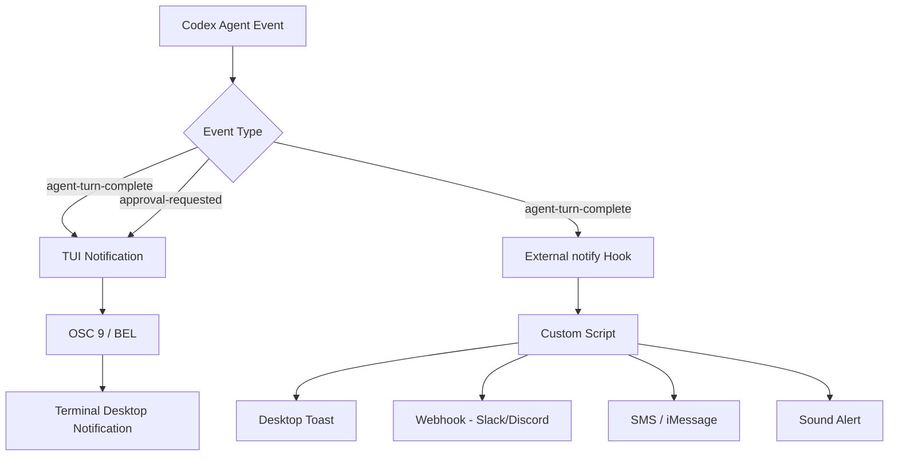

# The Codex CLI Notification Pipeline: OSC 9, Notify Hooks, and Never Missing an Agent Event


---

Agentic coding sessions routinely run for minutes — sometimes hours. You fire off a complex refactoring task, switch to a browser tab, and fifteen minutes later wonder whether Codex is still working, waiting for approval, or finished. The notification pipeline is how you solve that problem without polling.

Codex CLI ships a three-layer notification architecture: built-in TUI notifications for in-terminal alerts, OSC 9 escape sequences for desktop notifications via supported terminals, and an external `notify` hook for arbitrary side-channel alerting. This article covers all three layers, the configuration that wires them together, the JSON payload format, community tooling, and practical patterns for teams.

## The Three Notification Layers



The layers are complementary, not competing. The TUI layer handles both `agent-turn-complete` and `approval-requested` events natively[^1]. The external `notify` hook currently fires only for `agent-turn-complete`[^2] — a limitation tracked in Issues #11808 and #14813[^3]. Using both together gives you the broadest coverage.

## Layer 1: Built-in TUI Notifications

The `[tui]` section in `config.toml` controls the built-in notification behaviour:

```toml
[tui]
notifications = ["agent-turn-complete", "approval-requested"]
notification_method = "osc9"
```

### Notification Method

The `tui.notification_method` key accepts three values[^4]:

| Value | Behaviour |
|-------|-----------|
| `auto` | Probes terminal capabilities; prefers OSC 9, falls back to BEL |
| `osc9` | Emits an OSC 9 escape sequence (`\e]9;<message>\a`) |
| `bel` | Emits a terminal bell character (`\x07`) |

The default is `auto`, which works well for most setups. If you know your terminal supports OSC 9, setting it explicitly avoids the probe overhead.

### Event Filtering

The `notifications` key accepts either a boolean (`true` to enable all events) or an array of event type strings[^1]. As of v0.120.0, the two supported event types are:

- **`agent-turn-complete`** — the agent has finished its response and is idle
- **`approval-requested`** — the agent is blocked waiting for you to approve a command or file edit

### Focused-Window Notifications

v0.119.0 added an opt-in mode for notifications even when the terminal is focused (PRs #17174 and #17175)[^5]. Previously, Codex suppressed notifications if the terminal was in the foreground — reasonable for casual use, but problematic when you have multiple panes open and are not watching the Codex session. The `focused_notifications` setting controls this behaviour:

```toml
[tui]
notifications = true
notification_method = "osc9"
focused_notifications = true
```

### Warp OSC 9 Support

Warp gained OSC 9 support in early 2026[^6]. If you use Warp, set `notification_method = "osc9"` explicitly — the `auto` probe may not detect Warp's support reliably in all configurations.

## Layer 2: The External `notify` Hook

The `notify` key is a root-level config entry (not inside any table) that points to an external command[^7]. Codex invokes it whenever an `agent-turn-complete` event fires, passing a JSON payload as the first argument.

```toml
notify = ["/bin/bash", "/Users/you/.codex/hooks/notify.sh"]

[tui]
notifications = ["approval-requested"]
notification_method = "osc9"
```

> **TOML ordering matters**: root-level keys like `notify` must appear before any `[table]` headers in the file.

### JSON Payload Format

The hook receives a single JSON argument with the following structure[^2]:

```json
{
  "type": "agent-turn-complete",
  "turn-id": "abc123",
  "input-messages": ["Run the test suite and fix any failures"],
  "last-assistant-message": "All 47 tests now pass. I fixed the off-by-one error in pagination.rs."
}
```

Key fields:

| Field | Description |
|-------|-------------|
| `type` | Event name (currently always `agent-turn-complete`) |
| `turn-id` | Unique identifier for the completed turn |
| `input-messages` | Array of the user messages that triggered this turn |
| `last-assistant-message` | The agent's final response text — useful for notification previews |

### A Minimal Notify Script

Here is a basic macOS notification script using `terminal-notifier`[^8]:

```bash
#!/bin/bash
# ~/.codex/hooks/notify.sh
# Requires: brew install terminal-notifier

JSON="$1"
MESSAGE=$(echo "$JSON" | jq -r '.["last-assistant-message"]' 2>/dev/null)

# Sanitise: strip leading hyphens, trim to 220 chars
MESSAGE="${MESSAGE#-}"
MESSAGE="${MESSAGE:0:220}"

if [ -z "$MESSAGE" ]; then
  MESSAGE="Turn complete"
fi

terminal-notifier \
  -title "Codex CLI" \
  -message "$MESSAGE" \
  -sound default \
  -activate "com.googlecode.iterm2"
```

Make it executable:

```bash
chmod +x ~/.codex/hooks/notify.sh
```

### An OSC 9 Forwarding Script

If you want the `notify` hook to emit an OSC 9 sequence (useful when running Codex over SSH where the TUI's built-in OSC 9 may not reach the local terminal):

```bash
#!/bin/bash
# ~/.codex/hooks/notify-osc9.sh

JSON="$1"
MSG=$(echo "$JSON" | jq -r '.["last-assistant-message"]' 2>/dev/null \
  | tr '\n' ' ' | cut -c1-50)

[ -z "$MSG" ] && MSG="Turn complete"

printf '\e]9;Codex: %s\e\\' "$MSG" > /dev/tty
```

The `> /dev/tty` redirect is essential — without it, the escape sequence goes to stdout, which Codex may not pass through to the terminal[^9].

## Layer 3: Webhook and Remote Alerting

For teams or developers who step away from the terminal entirely, the `notify` hook can forward events to external services.

### Slack Webhook Example

```bash
#!/bin/bash
# ~/.codex/hooks/notify-slack.sh

JSON="$1"
MSG=$(echo "$JSON" | jq -r '.["last-assistant-message"]' 2>/dev/null \
  | head -c 500)
TURN=$(echo "$JSON" | jq -r '.["turn-id"]' 2>/dev/null)

curl -s -X POST "$CODEX_SLACK_WEBHOOK_URL" \
  -H 'Content-Type: application/json' \
  -d "$(jq -n --arg text ":white_check_mark: *Codex turn complete* (\`$TURN\`)\n$MSG" '{text: $text}')"
```

Set `CODEX_SLACK_WEBHOOK_URL` in your environment or hardcode the URL. The same pattern works for Discord (different payload shape), Telegram (via Bot API), and ntfy (plain POST to a topic URL).

### SMS/iMessage via Poke

The Poke service provides a REST API that forwards to SMS or iMessage[^10]. A two-line addition to any notify script:

```bash
curl -s "https://api.pokepush.com/v1/push?token=$POKE_TOKEN&message=Codex+done:+${MSG:0:100}"
```

## Terminal Compatibility Matrix

Not all terminals handle OSC 9 identically. Here is the current state as of April 2026:

| Terminal | OSC 9 | BEL | Click-to-Focus | Notes |
|----------|-------|-----|-----------------|-------|
| iTerm2 | ✅ | ✅ | ✅ | Enable in Settings → Profiles → Terminal → Notifications[^8] |
| WezTerm | ✅ | ✅ | ✅ | Works out of the box |
| Windows Terminal | ✅ | ✅ | ❌ | Toast notifications, no focus redirect |
| Ghostty | ✅ | ✅ | ✅ | Supported since v1.1[^11] |
| Warp | ✅ | ✅ | ✅ | Requires Warp 2026.1+ for OSC 9[^6] |
| kitty | ⚠️ | ✅ | ✅ | Uses its own notification protocol; OSC 9 partial |
| Alacritty | ❌ | ✅ | ❌ | No native notification support; use notify hook |
| VS Code Terminal | ✅ | ✅ | ✅ | Via "Terminal Notification" extension[^9] |

Test your terminal's OSC 9 support with:

```bash
printf '\e]9;OSC9 test notification\a'
```

If you see a desktop notification, you are good to go. If not, fall back to `bel` or use the external `notify` hook with `terminal-notifier` or equivalent.

## Community Notification Tools

The limitation of the built-in notification system — particularly the `notify` hook's restriction to `agent-turn-complete` — has spawned a healthy ecosystem of community tools:

### agent-notify

The most comprehensive option. Supports Codex CLI, Claude Code, and Gemini CLI with auto-detection of 10 terminals and 4 multiplexers (tmux, zellij, kitty, WezTerm)[^11]. Five event categories with distinct sounds, plus rich webhook support for Slack, Discord, Telegram, and ntfy. Installs via Homebrew:

```bash
brew tap paultendo/agent-notify https://github.com/paultendo/agent-notify
brew install agent-notify
agent-notify --setup
```

The `--setup` command auto-detects your terminal and configures the `notify` entry in `config.toml`.

### code-notify

A cross-platform tool (macOS, Linux, Windows) supporting Codex, Claude Code, and Gemini CLI[^12]. Installs via Homebrew, npm, or shell script. Includes voice announcements on macOS and Windows, and per-project configuration via scoped settings files.

```bash
brew install mylee04/tools/code-notify
```

### codex-notify

A lightweight Node.js handler that pops a native macOS notification via `osascript`, plays a sound, and logs every payload to `payload-log.jsonl` for debugging[^13]:

```bash
git clone https://github.com/heydong1/codex-notify.git ~/codex-notify
cd ~/codex-notify && pnpm install
```

```toml
notify = ["node", "/Users/you/codex-notify/notify.ts"]
```

## Practical Patterns

### Pattern 1: Layered Alert Escalation

Use TUI notifications for approval prompts (you are probably nearby), and the `notify` hook for turn completions (you might have context-switched):

```toml
notify = ["bash", "/Users/you/.codex/hooks/notify-slack.sh"]

[tui]
notifications = ["approval-requested"]
notification_method = "osc9"
```

This avoids notification fatigue from double-alerting on turn completions whilst ensuring you never miss an approval prompt.

### Pattern 2: CI/CD Pipeline Notifications

In `codex exec` pipelines, the TUI is absent. Use the `notify` hook to post completion status to a Slack channel or update a GitHub check:

```toml
notify = ["bash", "/opt/ci/codex-notify-github.sh"]
```

The script can use the `turn-id` from the payload to correlate with the pipeline run and post a status update.

### Pattern 3: Multi-Session Monitoring

When running parallel Codex sessions across worktrees, configure each session's `notify` hook to include the project name:

```bash
#!/bin/bash
PROJECT=$(basename "$(pwd)")
MSG=$(echo "$1" | jq -r '.["last-assistant-message"]' | head -c 100)
terminal-notifier -title "Codex: $PROJECT" -message "$MSG" -sound default
```

This gives you at-a-glance context about which session completed.

## Known Limitations

- The external `notify` hook fires only for `agent-turn-complete` events — not `approval-requested` (Issues #11808, #14813)[^3]. The TUI layer handles approvals, but external webhook consumers cannot currently react to them.
- On WSL2, the `notify` hook can fail for approval-adjacent events due to Windows/Linux IPC boundaries (Issue #8189)[^14]. ⚠️ The Windows-native toast backend requested in that issue has not yet landed.
- There is no built-in rate limiting or deduplication — rapid sub-agent completions can produce a burst of notifications. Community tools like agent-notify include throttling; roll-your-own scripts should add a cooldown.
- ⚠️ The `focused_notifications` setting mentioned in the v0.119.0 release notes (PRs #17174, #17175) may not be documented in all configuration references yet. Verify with `codex config get tui.focused_notifications` if unsure.

## What's Coming

The community has been vocal about extending the `notify` hook to cover `approval-requested` events[^3]. Given that the TUI layer already supports this event type, it seems likely the external hook will follow. Issue #14813 has received attention from maintainers, suggesting this is on the roadmap.

A broader event taxonomy — including `error`, `session-limit`, `authentication-required` — would align Codex with what agent-notify already categorises on the consumer side[^11]. Whether OpenAI implements this natively or the community continues to bridge the gap remains to be seen.

## Citations

[^1]: OpenAI, "Advanced Configuration – Codex," developers.openai.com, 2026. [https://developers.openai.com/codex/config-advanced](https://developers.openai.com/codex/config-advanced)

[^2]: @samwize, "Setup Codex CLI notifications on macOS (iTerm2 + terminal-notifier)," samwize.com, February 2026. [https://samwize.com/2026/02/05/setup-codex-cli-notifications-on-macos-iterm2-terminal-notifier/](https://samwize.com/2026/02/05/setup-codex-cli-notifications-on-macos-iterm2-terminal-notifier/)

[^3]: "Run `notify` hook for approval-request events," GitHub Issue #11808 and "Expose approval-requested event to external notify hook," GitHub Issue #14813, openai/codex. [https://github.com/openai/codex/issues/11808](https://github.com/openai/codex/issues/11808)

[^4]: OpenAI, "Configuration Reference – Codex," developers.openai.com, 2026. [https://developers.openai.com/codex/config-reference](https://developers.openai.com/codex/config-reference)

[^5]: OpenAI, "Release 0.119.0," GitHub, April 2026. PRs #17174 and #17175. [https://github.com/openai/codex/releases/tag/rust-v0.119.0](https://github.com/openai/codex/releases/tag/rust-v0.119.0)

[^6]: Warp, "Desktop notifications," docs.warp.dev, 2026. [https://docs.warp.dev/terminal/more-features/notifications](https://docs.warp.dev/terminal/more-features/notifications)

[^7]: Simon Alford, "My setup for Claude Code + Codex Notifications in iTerm2 and VS Code," Substack, 2026. [https://simonalford.substack.com/p/my-setup-for-claude-code-codex-notifications](https://simonalford.substack.com/p/my-setup-for-claude-code-codex-notifications)

[^8]: Apple, "terminal-notifier," via Homebrew; iTerm2 notification setup. [https://samwize.com/2026/02/05/setup-codex-cli-notifications-on-macos-iterm2-terminal-notifier/](https://samwize.com/2026/02/05/setup-codex-cli-notifications-on-macos-iterm2-terminal-notifier/)

[^9]: Simon Alford, "My setup for Claude Code + Codex Notifications in iTerm2 and VS Code," Substack, 2026. [https://simonalford.substack.com/p/my-setup-for-claude-code-codex-notifications](https://simonalford.substack.com/p/my-setup-for-claude-code-codex-notifications)

[^10]: JP Caparas, "Get SMS (or iMessage) alerts from Codex CLI via Poke," Reading.sh, 2026. [https://reading.sh/get-sms-or-imessage-alerts-from-codex-cli-via-poke-797dd95b61fa](https://reading.sh/get-sms-or-imessage-alerts-from-codex-cli-via-poke-797dd95b61fa)

[^11]: paultendo, "agent-notify: macOS notifications for Codex with VSCode activation," GitHub, 2026. [https://github.com/paultendo/agent-notify](https://github.com/paultendo/agent-notify)

[^12]: mylee04, "code-notify: Cross-platform desktop notifications for Claude Code, Codex, and Gemini CLI," GitHub, 2026. [https://github.com/mylee04/code-notify](https://github.com/mylee04/code-notify)

[^13]: heydong1, "codex-notify: macOS desktop notification helper for Codex CLI's notify hook," GitHub, 2026. [https://github.com/heydong1/codex-notify](https://github.com/heydong1/codex-notify)

[^14]: "WSL2: notifications/notify hook often fails for approval prompts," GitHub Issue #8189, openai/codex. [https://github.com/openai/codex/issues/8189](https://github.com/openai/codex/issues/8189)
