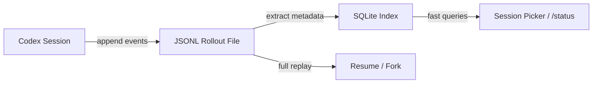
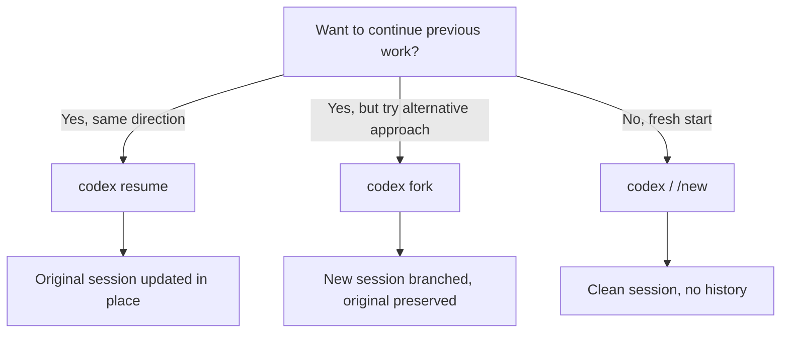

# Session Management in Codex CLI: Resume, Fork, and JSONL Transcripts


Most agentic coding sessions are not one-shot affairs. You investigate a bug, break for lunch, then return to fix it. You scaffold a feature in one sitting and write tests in another. Codex CLI's session management — built on persistent JSONL transcripts, a SQLite metadata index, and first-class `resume` and `fork` subcommands — turns ephemeral terminal conversations into durable, branchable work streams. This article covers the storage internals, the commands that operate on them, and the patterns that make multi-session workflows practical.

## How Sessions Are Persisted

Every interactive Codex CLI session is automatically persisted as a **rollout file** — a newline-delimited JSON (JSONL) archive stored under `~/.codex/sessions/`[^1]. Files are organised by date:

```
~/.codex/sessions/
  2026/
    04/
      13/
        rollout-2026-04-13T09-41-22-a1b2c3d4.jsonl.zst
        rollout-2026-04-13T14-07-55-e5f6g7h8.jsonl.zst
```

Each line in the rollout file is a serialised `RolloutItem`, one of three variants[^2]:

| Variant | Purpose |
|---|---|
| `SessionMeta` | Initial metadata — CWD, model, reasoning effort, Git branch |
| `EventMsg` | Protocol events: user messages, model responses, tool calls, approvals |
| `ResponseItem` | Structured model outputs |

This append-only format enables incremental persistence: Codex writes each event as it occurs, so even a session killed with `Ctrl+C` retains everything up to the last completed turn[^1].

### Two-Tier Storage: JSONL + SQLite

Raw rollout files are the source of truth, but Codex also maintains a **SQLite metadata index** (`StateRuntime`) for fast queries[^2]. The `extract` module parses rollout lines on write to populate the index with thread IDs, timestamps, working directories, Git branches, first user messages, and token counts. This two-tier design means the session picker can list hundreds of sessions instantly without scanning JSONL files.



## Thread Identity and Metadata

Every session receives a **UUID v7 thread ID** at creation[^2]. The `ThreadMetadata` record captures:

- **Source**: CLI, VS Code extension, or JetBrains plugin
- **Working directory** and Git branch at session start
- **First user message** (used as a preview in the picker)
- **Token usage** totals
- **Custom thread name** (if set via PR #10340's `thread_name` field)[^3]

Thread names surface in the resume picker, replacing the default first-message preview — useful when you have dozens of sessions against the same repository.

## Resuming Sessions

The `resume` subcommand reopens an earlier thread with its full transcript, plan history, and approval state intact[^1].

### Command-Line Interface

```bash
# Interactive picker — scoped to current working directory
codex resume

# Skip picker, jump to most recent session in this directory
codex resume --last

# Include sessions from all directories
codex resume --all

# Target a specific session by UUID
codex resume 7f9f9a2e-1b3c-4c7a-9b0e-abcdef123456
```

The `--last` flag scopes to the current working directory by default. Combine with `--all` to resume the most recent session regardless of where it was started[^4].

### In-Session Slash Command

Within an active session, `/resume` opens the session picker without exiting Codex[^5]. Select a previous session to switch context immediately — the current session is preserved and can itself be resumed later.

### What Gets Restored

The resumption flow replays the rollout file line-by-line through five restoration stages[^2]:

1. **Metadata restoration** — CWD, model provider, reasoning effort settings
2. **Context restoration** — replays `UserMessage` events to reconstruct conversation history
3. **Token tracking** — restores cumulative `tokens_used` from `EventMsg::TokenCount` entries
4. **Dynamic tools** — reloads any tools dynamically registered in the previous session via `get_dynamic_tools(thread_id)`
5. **Memory configuration** — restores thread-specific memory mode settings

The `apply_rollout_item` function updates in-memory `ThreadMetadata` during replay without modifying the persisted rollout file[^2]. This means resuming is non-destructive — the original transcript remains untouched.

### The Resume Picker

The `resume_picker.rs` TUI component provides paginated, sortable session selection[^2][^6]:

| Feature | Detail |
|---|---|
| Pagination | Cursor-based, `PAGE_SIZE = 25` |
| Sorting | Toggle between `CreatedAt` and `UpdatedAt` timestamps |
| Filtering | Scoped to CWD unless `--all` is passed |
| Async loading | Non-blocking via `BackgroundEvent::PageLoaded` |
| Thread names | Displayed when set, falling back to first-message preview |

PR #10752 added the sortable timestamp toggle[^6], and PR #10340 added thread name display[^3] — both merged in early 2026.

## Forking Sessions

Where `resume` continues a session in place, `fork` creates a **new thread branching from an existing one** whilst leaving the original untouched[^5].

```bash
# Interactive picker
codex fork

# Fork the most recent session
codex fork --last

# Fork a specific session
codex fork 7f9f9a2e-1b3c-4c7a-9b0e-abcdef123456
```

### Fork Mechanics

Forking uses the `InitialHistory::Forked` variant[^2]:

| Property | Behaviour |
|---|---|
| Thread ID | Fresh UUID v7 |
| `forked_from_id` | Points to parent thread |
| History | Inherits all turns from parent up to fork point |
| Parent rollout | Remains unmodified |
| Initial status | `Interrupted` or `Idle`, ready for new input |

The in-session `/fork` command clones the current conversation into a new thread with a fresh ID[^5]. For forking *saved* sessions (not the current one), use the `codex fork` subcommand from the terminal.

### When to Fork vs Resume



Use `fork` when you want to explore an alternative implementation path without losing the original conversation. The parent session remains available for resumption if the fork turns out to be a dead end.

## Non-Interactive Resume: CI/CD Patterns

The `codex exec resume` subcommand brings session continuity to automated pipelines[^1][^7]:

```bash
# Stage 1: analyse
codex exec "Review src/ for race conditions" \
  --approval-mode full-auto

# Stage 2: fix (resumes the analysis session)
codex exec resume --last "Fix the race conditions you found"
```

Each resumed exec run preserves the original transcript, plan history, and approvals[^1]. This enables multi-stage CI pipelines where context accumulates across steps rather than being repeated.

A practical three-stage pattern:

```bash
# 1. Analyse
codex exec "Audit the authentication module for security issues"

# 2. Fix
codex exec resume --last "Implement fixes for the issues you identified"

# 3. Verify
codex exec resume --last "Write tests proving the fixes work, then run them"
```

## Managing Long Sessions with /compact

Sessions that run for extended periods — Codex supports continuous operation for up to seven hours[^1] — inevitably approach context limits. The `/compact` slash command replaces earlier turns with a concise summary, freeing tokens whilst preserving critical decisions[^5].

```
/compact
```

Codex also compacts automatically when approaching context boundaries, but explicit compaction gives you control over *when* summarisation happens. Run `/compact` before switching to a new phase of work to ensure maximum context headroom for the next task.

## Session Lifecycle Slash Commands

A complete reference for session-related commands[^5]:

| Command | Purpose |
|---|---|
| `/resume` | Open session picker, switch to a saved session |
| `/fork` | Clone current conversation into a new thread |
| `/new` | Start fresh conversation without leaving the terminal |
| `/compact` | Summarise history to free context tokens |
| `/status` | Show session ID, model, token usage, context utilisation |

## Practical Patterns

### Pattern 1: Investigation → Fix Across Sessions

```bash
# Morning: investigate
codex
> Analyse the failing integration tests in tests/api/ and identify root causes

# Afternoon: resume and fix
codex resume --last
> Fix the issues you identified this morning, starting with the auth timeout
```

### Pattern 2: Parallel Exploration via Fork

```bash
# Start with a shared analysis
codex
> Review the payment module architecture and suggest two refactoring approaches

# Fork to try approach A
codex fork --last
> Implement approach A: extract PaymentProcessor into a separate service

# In another terminal, fork the original to try approach B
codex fork <original-session-id>
> Implement approach B: introduce the Strategy pattern for payment methods
```

### Pattern 3: Session-Aware CI with GitHub Actions

```yaml
- name: Analyse changes
  run: |
    codex exec "Review the PR diff for bugs and style issues" \
      --approval-mode full-auto
- name: Apply fixes
  run: |
    codex exec resume --last "Fix all issues you found" \
      --approval-mode full-auto
```

## Known Limitations

- **No cross-machine sync**: sessions live in `~/.codex/sessions/` on the local filesystem. Remote sessions via `--remote` maintain their own storage on the server side[^4].
- **No session search by content**: the picker filters by CWD and sorts by timestamp, but there is no full-text search across transcript content. ⚠️ Thread names (PR #10340) partially mitigate this, but a dedicated search command is not yet available.
- **Compaction is lossy**: `/compact` summarises earlier turns irreversibly. If you need the full history, fork before compacting.
- **App re-enablement bug**: PR #13533 (merged March 2026) fixed an issue where apps were not re-enabled after `codex resume`[^8] — ensure you are on v0.119.0 or later.

## Citations

[^1]: [Features – Codex CLI | OpenAI Developers](https://developers.openai.com/codex/cli/features)
[^2]: [Session Resumption and Forking | openai/codex | DeepWiki](https://deepwiki.com/openai/codex/4.4-session-resumption-and-forking)
[^3]: [Session picker shows thread_name if set — PR #10340 | openai/codex](https://github.com/openai/codex/pull/10340)
[^4]: [Command line options – Codex CLI | OpenAI Developers](https://developers.openai.com/codex/cli/reference)
[^5]: [Slash commands in Codex CLI | OpenAI Developers](https://developers.openai.com/codex/cli/slash-commands)
[^6]: [feat(tui): add sortable resume picker with created/updated timestamp toggle — PR #10752 | openai/codex](https://github.com/openai/codex/pull/10752)
[^7]: [Non-interactive mode – Codex | OpenAI Developers](https://developers.openai.com/codex/noninteractive)
[^8]: [[apps] Fix the issue where apps is not enabled after codex resume — PR #13533 | openai/codex](https://github.com/openai/codex/pull/13533)
