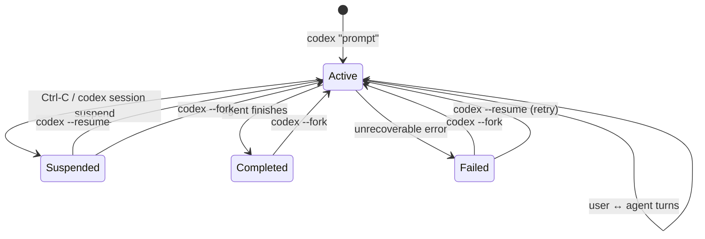
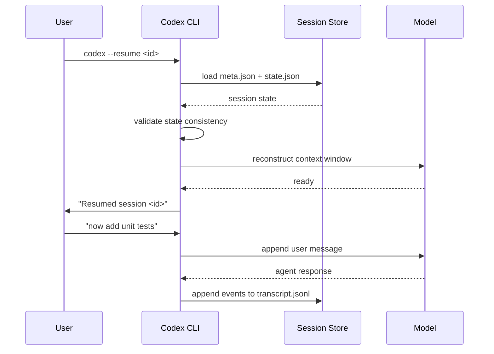
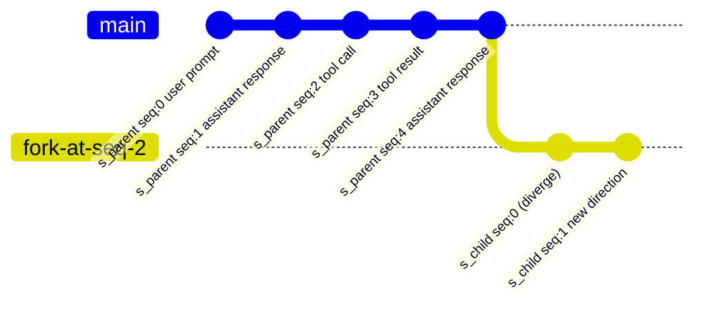

# Codex CLI Session Persistence: Resume, Fork, and Analytics

> **Consolidated reference** -- this article unifies coverage previously spread
> across five separate pieces on thread management, session analytics, thread
> search, session lifecycle, and session transcripts. It is the single
> authoritative source for Codex CLI session management.

---

## Table of Contents

1. [Session Architecture](#session-architecture)
2. [Resume Semantics](#resume-semantics)
3. [Fork Workflows](#fork-workflows)
4. [JSONL Analytics](#jsonl-analytics)
5. [Thread Search](#thread-search)
6. [Multi-Session Patterns](#multi-session-patterns)
7. [Configuration Reference](#configuration-reference)
8. [Troubleshooting](#troubleshooting)

---

## Session Architecture

Every Codex CLI invocation creates a **session** -- a self-contained record of
the conversation between the user and the agent. Sessions are the fundamental
unit of persistence.

### Storage Layout

Sessions are stored under the Codex data directory (`$CODEX_DATA_HOME`,
defaulting to `~/.codex/`):

```
~/.codex/
  sessions/
    <session-id>/
      meta.json          # session metadata
      transcript.jsonl   # ordered event log
      state.json         # last-known agent state snapshot
      refs/
        parent           # pointer to parent session (if forked)
        children/        # symlinks to child sessions
```

Each session is identified by a **session ID** -- a URL-safe, time-sortable
string (e.g., `s_2026-04-13T09-31-22_a1b2c3`).

### Session Metadata (`meta.json`)

| Field            | Type     | Description                                      |
|------------------|----------|--------------------------------------------------|
| `id`             | string   | Unique session identifier                        |
| `created_at`     | ISO 8601 | Timestamp of session creation                    |
| `updated_at`     | ISO 8601 | Timestamp of last activity                       |
| `status`         | enum     | `active`, `completed`, `suspended`, `failed`     |
| `parent_id`      | string?  | ID of the parent session (null if root)          |
| `fork_point`     | int?     | Event index in parent where this fork diverges   |
| `model`          | string   | Model used (e.g., `claude-opus-4-6`)           |
| `cwd`            | string   | Working directory at session start               |
| `title`          | string?  | Auto-generated or user-supplied session title    |
| `tags`           | string[] | User-defined labels                              |
| `token_usage`    | object   | `{ prompt, completion, total }` token counts     |
| `tool_calls`     | int      | Number of tool invocations                       |
| `duration_s`     | float    | Wall-clock duration in seconds                   |

### Session Lifecycle



A session transitions through well-defined states. The key insight is that
**resume** re-enters the *same* session while **fork** creates a *new* session
rooted at a point in the original.

### Transcript Format

The `transcript.jsonl` file contains one JSON object per line. Each object is
an **event** in the session:

```jsonl
{"seq":0,"ts":"2026-04-13T09:31:22Z","type":"user","content":"Refactor the auth module"}
{"seq":1,"ts":"2026-04-13T09:31:24Z","type":"assistant","content":"I'll start by reading the current auth module..."}
{"seq":2,"ts":"2026-04-13T09:31:25Z","type":"tool_call","tool":"Read","params":{"file_path":"/src/auth.ts"},"call_id":"tc_001"}
{"seq":3,"ts":"2026-04-13T09:31:25Z","type":"tool_result","call_id":"tc_001","status":"ok","content":"...file contents..."}
{"seq":4,"ts":"2026-04-13T09:31:28Z","type":"assistant","content":"The auth module has three main areas to refactor..."}
```

Event types:

| Type            | Description                              |
|-----------------|------------------------------------------|
| `user`          | User message                             |
| `assistant`     | Agent response                           |
| `tool_call`     | Tool invocation request                  |
| `tool_result`   | Tool invocation result                   |
| `system`        | System-level event (config change, etc.) |
| `error`         | Error event                              |
| `checkpoint`    | State snapshot marker                    |

---

## Resume Semantics

Resuming a session continues the conversation from where it left off. This is
the primary mechanism for returning to interrupted work.

### Basic Resume

```bash
# Resume the most recent session
codex --resume

# Resume a specific session by ID
codex --resume s_2026-04-13T09-31-22_a1b2c3

# Resume with an additional prompt
codex --resume s_2026-04-13T09-31-22_a1b2c3 "now add unit tests"
```

### How Resume Works

1. **State reconstruction** -- Codex loads `state.json` to restore the agent's
   last-known state (file context, conversation history, pending operations).
2. **Transcript replay** -- If `state.json` is missing or stale, Codex replays
   `transcript.jsonl` to rebuild state from events.
3. **Context window management** -- The full transcript is loaded into the
   model's context. If the transcript exceeds the context window, Codex applies
   **smart truncation**: it keeps the first exchange (for task framing), the
   most recent N exchanges, and any exchanges containing tool calls that
   modified files still present on disk.
4. **Continuation** -- The session status returns to `active` and the user can
   issue new prompts.



### Resume Edge Cases

| Scenario                        | Behavior                                                    |
|---------------------------------|-------------------------------------------------------------|
| Session completed normally      | Resumes with a note that the session was previously finished |
| Session failed with error       | Retries from the last successful checkpoint                 |
| Working directory deleted       | Prompts user for a new `cwd`; logs a warning                |
| Model no longer available       | Falls back to default model; logs a warning                 |
| Transcript exceeds context      | Applies smart truncation (see above)                        |
| Concurrent resume attempts      | Second attempt blocked with lock error                      |

### Resume with Checkpoint Rollback

If a session reached a bad state, you can resume from an earlier checkpoint:

```bash
# List checkpoints in a session
codex session checkpoints s_2026-04-13T09-31-22_a1b2c3

# Resume from a specific checkpoint
codex --resume s_2026-04-13T09-31-22_a1b2c3 --from-checkpoint 3
```

Checkpoints are created automatically at key moments (after significant file
edits, before destructive operations, at user-defined intervals).

---

## Fork Workflows

Forking creates a **new session** that branches from an existing one. The
original session is unmodified. This is the session equivalent of `git branch`.

### Basic Fork

```bash
# Fork from the end of a session
codex --fork s_2026-04-13T09-31-22_a1b2c3

# Fork from a specific event index
codex --fork s_2026-04-13T09-31-22_a1b2c3 --at 4

# Fork from a checkpoint
codex --fork s_2026-04-13T09-31-22_a1b2c3 --from-checkpoint 2

# Fork with a new prompt
codex --fork s_2026-04-13T09-31-22_a1b2c3 "try a different approach using dependency injection"
```

### Fork Mechanics



When forking:

1. A new session is created with a fresh `id`.
2. `meta.json` records the `parent_id` and `fork_point`.
3. Events up to the fork point are **copied** into the new session's
   `transcript.jsonl` (not symlinked -- the child is fully self-contained).
4. A symlink is created in the parent's `refs/children/` directory.
5. The new session enters `active` status.

### Fork vs. Resume Comparison

| Aspect              | Resume                        | Fork                                  |
|---------------------|-------------------------------|---------------------------------------|
| Session identity    | Same session continues        | New session created                   |
| Original preserved  | Modified (new events appended)| Unmodified                            |
| Branch point        | Always from the end           | Any event index or checkpoint         |
| Use case            | Continue interrupted work     | Explore alternatives                  |
| Parent-child link   | N/A                           | Recorded in both sessions' metadata   |
| Transcript          | Appended in-place             | Copied up to fork point, then new     |

### Practical Fork Patterns

**Pattern 1: A/B testing approaches**

```bash
# Original session tried approach A
codex --fork s_original "try approach B: use an event-driven architecture"

# Compare results
codex session diff s_original s_fork_b
```

**Pattern 2: Checkpoint recovery**

```bash
# Session went wrong after checkpoint 3
codex --fork s_original --from-checkpoint 3 "undo the database migration approach, use file storage instead"
```

**Pattern 3: Team handoff**

```bash
# Export a session for a teammate
codex session export s_original --format bundle > session-bundle.tar.gz

# Teammate imports and forks
codex session import session-bundle.tar.gz
codex --fork s_original "continue from where Alice left off"
```

---

## JSONL Analytics

The JSONL transcript format enables powerful analytics over session data.
Codex CLI ships with built-in analytics commands and supports export to external
tools.

### Built-in Analytics

```bash
# Summary statistics for a session
codex session stats s_2026-04-13T09-31-22_a1b2c3
```

Example output:

```
Session: s_2026-04-13T09-31-22_a1b2c3
Status:  completed
Duration: 12m 34s

Events:    47
  user:        8
  assistant:  14
  tool_call:  12
  tool_result: 12
  checkpoint:  1

Tokens:
  prompt:     42,318
  completion: 11,204
  total:      53,522

Tools used:
  Read:       6 calls
  Edit:       4 calls
  Bash:       2 calls

Files touched:
  /src/auth.ts         (read 3x, edited 2x)
  /src/auth.test.ts    (created, edited 1x)
  /src/types.ts        (read 1x)
```

### Aggregate Analytics

```bash
# Analytics across all sessions in the last 7 days
codex session analytics --since 7d

# Filter by tag
codex session analytics --tag refactoring

# Output as JSON for external processing
codex session analytics --since 30d --format json > analytics.json
```

Aggregate output includes:

| Metric                  | Description                                   |
|-------------------------|-----------------------------------------------|
| `total_sessions`        | Number of sessions in the time range          |
| `total_duration_s`      | Cumulative wall-clock time                    |
| `total_tokens`          | Total token usage (prompt + completion)       |
| `avg_tokens_per_session`| Mean token usage per session                  |
| `tool_call_distribution`| Breakdown of tool usage across all sessions   |
| `completion_rate`       | Fraction of sessions reaching `completed`     |
| `avg_turns`             | Mean number of user-agent turn pairs          |
| `top_files`             | Most frequently read/edited files             |
| `sessions_by_status`    | Count of sessions by status                   |

### JSONL Processing with External Tools

The transcript format is designed for interoperability with standard UNIX tools
and data pipelines.

**Count tool calls per session:**

```bash
cat ~/.codex/sessions/s_*/transcript.jsonl \
  | jq -r 'select(.type == "tool_call") | .tool' \
  | sort | uniq -c | sort -rn
```

**Extract all file paths touched:**

```bash
jq -r 'select(.type == "tool_call") | .params.file_path // empty' \
  ~/.codex/sessions/s_*/transcript.jsonl \
  | sort -u
```

**Token usage over time (for graphing):**

```bash
for dir in ~/.codex/sessions/s_*/; do
  jq -r '[.created_at, .token_usage.total] | @csv' "$dir/meta.json"
done | sort > token_usage_over_time.csv
```

**Export to SQLite for deeper analysis:**

```bash
codex session export --format sqlite --since 30d > sessions.db

# Then query with sqlite3
sqlite3 sessions.db "
  SELECT date(created_at) as day, count(*) as sessions, sum(token_usage_total) as tokens
  FROM sessions
  GROUP BY day
  ORDER BY day
"
```

### JSONL Rollout History

The JSONL transcript format was introduced through a phased rollout:

| Phase   | Date Range          | Scope                                      |
|---------|---------------------|---------------------------------------------|
| Alpha   | 2026-03-15 -- 03-22 | Internal dogfooding, schema iteration       |
| Beta    | 2026-03-23 -- 03-29 | Opt-in via `--enable-transcripts`           |
| GA      | 2026-03-30+         | On by default; opt-out via config           |

The schema stabilized at v2 during the beta phase. Key changes from v1:

- Added `seq` field for deterministic ordering
- Added `call_id` linking `tool_call` and `tool_result` events
- Added `checkpoint` event type
- Moved token counts from per-event to session-level metadata

To check your transcript schema version:

```bash
codex session info s_<id> | grep schema_version
```

---

## Thread Search

Thread search lets you find and filter past sessions using full-text search,
metadata queries, and semantic similarity.

### Text Search

```bash
# Search session transcripts for a string
codex session search "auth module"

# Search with regex
codex session search --regex "refactor.*(auth|login)"

# Limit to recent sessions
codex session search "database migration" --since 7d

# Search only in user messages
codex session search "auth module" --type user
```

### Metadata Queries

```bash
# List sessions by status
codex session list --status completed

# List sessions by tag
codex session list --tag refactoring

# List sessions for a specific directory
codex session list --cwd /projects/myapp

# List sessions using a specific model
codex session list --model claude-opus-4-6

# Combined filters
codex session list --status completed --tag refactoring --since 14d
```

### Session List Output

```bash
codex session list --since 7d
```

```
ID                                    Created              Status     Duration  Title
s_2026-04-13T09-31-22_a1b2c3         2026-04-13 09:31     completed  12m 34s   Refactor auth module
s_2026-04-12T14-02-11_d4e5f6         2026-04-12 14:02     completed   8m 12s   Add user settings API
s_2026-04-12T10-15-33_g7h8i9         2026-04-12 10:15     suspended   3m 45s   Debug flaky test
s_2026-04-11T16-44-09_j0k1l2         2026-04-11 16:44     completed  22m 01s   Migrate to new ORM
```

### Semantic Search

When configured with an embedding provider, Codex supports semantic search
across session transcripts:

```bash
# Find sessions conceptually related to a query
codex session search --semantic "handling authentication errors gracefully"
```

Semantic search indexes session content at the turn level, allowing it to
surface relevant sessions even when the exact wording differs.

### Search Result Interaction

Search results can feed directly into resume or fork operations:

```bash
# Search and then resume the first match
codex --resume $(codex session search "auth module" --limit 1 --id-only)

# Interactive session picker
codex session search "database" --interactive
```

---

## Multi-Session Patterns

Complex tasks often span multiple sessions. Codex provides patterns and tooling
for managing session relationships.

### Session Trees

Forks create a tree structure. You can visualize it:

```bash
codex session tree s_root_session
```

```
s_2026-04-11T09-00-00_root
  Refactor auth module
  ├── s_2026-04-11T10-30-00_fork1
  │     Try approach A: middleware pattern
  ├── s_2026-04-11T10-35-00_fork2
  │     Try approach B: decorator pattern
  │     └── s_2026-04-12T09-00-00_fork2a
  │           Refine decorator + add tests
  └── s_2026-04-12T14-00-00_fork3
        Try approach C: event-driven
```

### Session Chains (Sequential Work)

For tasks that span multiple sittings but should be logically connected:

```bash
# Start a new session linked to a previous one (not a fork -- fresh context)
codex --continue-from s_previous "continue the API migration"
```

This creates a new session with a `continues` relationship (distinct from
`parent`/fork). The new session starts with a summary of the previous session
rather than its full transcript, keeping context manageable.

### Session Groups

Tag-based grouping for organizing related sessions:

```bash
# Tag sessions
codex session tag s_abc123 "project:myapp" "sprint:42"
codex session tag s_def456 "project:myapp" "sprint:42"

# List the group
codex session list --tag "project:myapp" --tag "sprint:42"

# Aggregate analytics for the group
codex session analytics --tag "project:myapp"
```

### Diff Between Sessions

Compare what two sessions did differently:

```bash
codex session diff s_fork1 s_fork2
```

```
Divergence point: seq 4 in parent s_root

Session s_fork1 (approach A):
  + Created /src/middleware/auth.ts
  + Edited /src/server.ts (added middleware chain)
  + 3 tool calls, 4,200 tokens after fork

Session s_fork2 (approach B):
  + Created /src/decorators/auth.ts
  + Edited /src/auth.ts (added decorator usage)
  + Edited /src/types.ts (added decorator types)
  + 5 tool calls, 6,100 tokens after fork
```

### Session Export and Sharing

```bash
# Export a single session as a readable transcript
codex session export s_abc123 --format markdown > session-transcript.md

# Export as a self-contained bundle (metadata + transcript + state)
codex session export s_abc123 --format bundle > session.tar.gz

# Export a session tree (parent + all forks)
codex session export s_root --format bundle --include-forks > session-tree.tar.gz

# Import a session bundle
codex session import session.tar.gz
```

### Session Cleanup

```bash
# Delete a single session
codex session delete s_abc123

# Delete sessions older than 30 days
codex session prune --older-than 30d

# Delete sessions by status
codex session prune --status failed --older-than 7d

# Dry run to see what would be deleted
codex session prune --older-than 30d --dry-run
```

---

## Configuration Reference

Session behavior is controlled via `~/.codex/config.toml` or environment
variables.

```toml
[sessions]
# Where to store sessions (default: ~/.codex/sessions)
data_dir = "~/.codex/sessions"

# Whether to record transcripts (default: true since GA rollout)
enable_transcripts = true

# Transcript schema version (default: 2)
transcript_schema_version = 2

# Auto-checkpoint interval: create a checkpoint every N tool calls
auto_checkpoint_interval = 5

# Maximum transcript size before smart truncation on resume (in events)
max_transcript_events = 500

# Session title generation (auto, manual, off)
auto_title = "auto"

# Default analytics time range
default_analytics_range = "7d"

[sessions.search]
# Enable semantic search (requires embedding provider config)
semantic_search = false

# Embedding provider for semantic search
embedding_provider = "openai"
embedding_model = "text-embedding-3-small"
```

Environment variable overrides (prefixed with `CODEX_`):

| Variable                            | Equivalent config key              |
|-------------------------------------|------------------------------------|
| `CODEX_SESSIONS_DATA_DIR`           | `sessions.data_dir`               |
| `CODEX_ENABLE_TRANSCRIPTS`          | `sessions.enable_transcripts`     |
| `CODEX_AUTO_CHECKPOINT_INTERVAL`    | `sessions.auto_checkpoint_interval`|

---

## Troubleshooting

### "Session not found" on resume

The session may have been pruned or the data directory may have changed. Check:

```bash
# Verify the session exists
ls ~/.codex/sessions/s_<id>/

# Check your configured data directory
codex config get sessions.data_dir
```

### "Lock held by another process" on resume

Another Codex process has the session open. Either terminate it or wait:

```bash
# See which process holds the lock
cat ~/.codex/sessions/s_<id>/.lock

# Force-release (use with caution)
codex session unlock s_<id>
```

### Transcript too large for context window

If resuming a session with a very long transcript, Codex applies smart
truncation automatically. To control this:

```bash
# Resume with explicit truncation
codex --resume s_<id> --max-context-events 100

# Or fork from a recent checkpoint to start with less history
codex --fork s_<id> --from-checkpoint latest
```

### Missing tool results in transcript

If a session was interrupted during a tool call (e.g., power loss), the
transcript may contain a `tool_call` without a matching `tool_result`. On
resume, Codex detects this and:

1. Logs a warning about the orphaned tool call.
2. Inserts a synthetic `tool_result` with `status: "interrupted"`.
3. Informs the agent so it can decide whether to retry.

---

*This article consolidates and supersedes the following sources:*
- *Thread Management: Fork and Resume (2026-03-28)*
- *Session Analytics JSONL Rollout (2026-03-30)*
- *Thread Search and Session Management (2026-03-30)*
- *Session Lifecycle: Resume, Fork, Rollouts (2026-04-11)*
- *Session Management: Resume, Fork, Transcripts (2026-04-13)*
