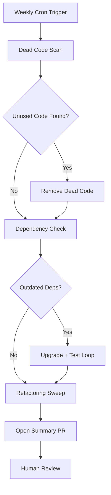

# Codex CLI for Technical Debt Reduction: Automated Refactoring, Dead Code Detection, and Dependency Upgrades


---

Technical debt accumulates silently — unused imports, deprecated API calls, dead functions that nobody dares delete, and dependency versions frozen two majors behind. Most teams know where the debt lives. The problem is finding the engineering hours to address it. Codex CLI transforms technical debt reduction from a quarterly grudge match into a continuous, automated workflow.

This article covers three core debt-reduction patterns: automated refactoring across large codebases, dead code detection and removal, and dependency upgrade automation — all driven by AGENTS.md conventions, subagent orchestration, and `codex exec` CI integration.

## The AGENTS.md Constitution for Debt Work

Before pointing Codex at technical debt, encode your project's constraints in AGENTS.md. Debt reduction is high-risk refactoring — the agent needs guardrails [^1].

```markdown
# AGENTS.md — Technical Debt Rules

## Test Commands
- Run `npm test` after every change
- Run `npm run lint` before committing
- Never modify test files during refactoring tasks

## Refactoring Rules
- Preserve all public API signatures unless explicitly instructed to change them
- Do not introduce new dependencies during refactoring
- Keep commits atomic — one logical change per commit
- When removing dead code, verify zero references with `grep -r` before deletion

## Architecture
- Follow existing patterns: do not refactor toward a pattern not already used in the codebase
- Prefer composition over inheritance (existing convention)
```

The key principle from OpenAI's best practices is that AGENTS.md should encode *durable guidance* — conventions the agent must follow every session, not just once [^2]. For debt work, this means specifying test commands, architectural constraints, and the verification sequence the agent must complete before considering a change safe.

## Pattern 1: Automated Large-Scale Refactoring

Codex excels at propagating mechanical changes across hundreds of files — renaming variables, migrating API calls, updating import paths after a module restructure [^3]. The trick is decomposing large refactors into parallelisable units using subagents.

### Subagent TOML for Parallel Refactoring

Create a refactoring orchestrator in `.codex/agents/refactor-worker.toml`:

```toml
[agent]
name = "refactor-worker"
model = "gpt-5.4-mini"
model_reasoning_effort = "medium"
instructions = """
You are a refactoring specialist. You receive a specific directory path and a refactoring instruction.
Apply the refactoring to all files in your assigned directory only.
Run tests after each file change. If tests fail, revert and report the failure.
"""
```

Then orchestrate from the interactive session:

```
Refactor all uses of the deprecated `createConnection()` API to use `createPool()` instead.
Spawn one subagent per top-level service directory under src/services/.
Each agent handles its own directory independently. Run tests after each change.
```

This pattern leverages Codex's multi-agent v2 architecture with path-based addressing [^4]. Each subagent operates in isolation, and the parent aggregates results. For codebases with 50+ files requiring changes, this reduces wall-clock time from hours to minutes.

### The Verify-First Pattern

Never let the agent refactor blind. Structure your prompt to force verification before mutation:

```
1. First, search the entire codebase for all uses of `OldClassName`
2. List every file and line number
3. Show me the count before making any changes
4. Then replace each occurrence, running tests after each file
5. Show the final count (should be zero)
```

This maps to OpenAI's recommended four-element prompt structure: goal, context, constraints, and done-criteria [^2].

## Pattern 2: Dead Code Detection and Removal

Dead code is the most satisfying debt to eliminate — it reduces cognitive load with zero behavioural change. But identifying truly dead code requires more than grep.

### The Three-Pass Detection Approach

```markdown
## Prompt for dead code sweep

Pass 1 — Static analysis: Run `knip` (or `ts-prune` for TypeScript, `vulture` for Python)
to identify unused exports, unreferenced functions, and orphaned files.

Pass 2 — Verify each candidate: For every item flagged as unused, search for dynamic
references (string interpolation, reflection, configuration-driven loading).
Mark anything with potential dynamic usage as SKIP.

Pass 3 — Remove confirmed dead code: Delete only items confirmed dead in both passes.
Run the full test suite after each removal batch.
```

The VoltAgent awesome-codex-subagents repository includes a `refactoring_specialist` subagent designed for exactly this workflow — it uses a `search_specialist` to locate code, a `knowledge_synthesizer` to assess the current design, and then proposes minimal removal plans [^5].

### AGENTS.md Override for Aggressive Cleanup

For dedicated cleanup sprints, drop an `AGENTS.override.md` in the project root:

```markdown
# AGENTS.override.md — Cleanup Sprint Mode

## Additional Rules
- You MAY delete files entirely if all exports are confirmed unused
- You MAY remove unused npm dependencies from package.json
- After removing a dependency, run `npm install` to verify the lockfile is clean
- Track all removals in a CLEANUP-LOG.md file with date and reason
```

This override file stacks on top of the base AGENTS.md, adding permissions the agent does not normally have [^6]. Remove it when the sprint ends.

## Pattern 3: Dependency Upgrade Automation

Dependency upgrades are tedious, risky, and often deferred until a security advisory forces the issue. Codex can automate the upgrade-test-fix cycle.

### Interactive Upgrade Session

```
Upgrade all npm dependencies to their latest major versions, one at a time.
For each upgrade:
1. Run `npm outdated` to see the current vs latest version
2. Update one package at a time with `npm install package@latest`
3. Run the full test suite
4. If tests fail, read the package's CHANGELOG for breaking changes
5. Apply the necessary code changes to fix compatibility
6. Run tests again
7. Commit the working upgrade as a single atomic commit
```

This sequential approach ensures each upgrade is isolated and testable. For large dependency lists, use subagent fan-out with `spawn_agents_on_csv` — generate a CSV of outdated packages and let parallel agents handle non-conflicting upgrades simultaneously [^4].

### CI/CD Autofix for Upgrade Regressions

The official OpenAI Cookbook provides a GitHub Actions pattern for auto-fixing CI failures [^7]. Adapt it for dependency upgrades:

```yaml
name: Codex Dependency Autofix
on:
  workflow_run:
    workflows: ["CI"]
    types: [completed]

jobs:
  autofix:
    if: ${{ github.event.workflow_run.conclusion == 'failure' }}
    runs-on: ubuntu-latest
    steps:
      - uses: actions/checkout@v4
        with:
          ref: ${{ github.event.workflow_run.head_sha }}

      - uses: openai/codex-action@v1
        with:
          openai-api-key: ${{ secrets.OPENAI_API_KEY }}
          prompt: |
            The CI build failed. Read the test output, identify the failing tests,
            and fix the code to make them pass. Do not modify the tests themselves.
          sandbox: workspace-write
          model: gpt-5.4-mini
```

This creates a self-healing loop: CI fails after a dependency bump, Codex reads the failure output, applies a fix, and opens a PR for human review [^7].

## The Weekly Debt Sweep Automation

Combine all three patterns into a scheduled Codex App automation that runs weekly:



Configure this as a Codex App automation with a weekly schedule [^8]. The automation runs in a dedicated worktree, ensuring it never conflicts with active development branches. The output is a single PR summarising all debt-reduction changes for human review.

### The codex exec One-Liner

For teams preferring CLI-driven automation over the desktop app:

```bash
codex exec --full-auto --profile ci \
  "Run knip to find dead code, remove confirmed unused exports, \
   check for outdated dependencies, upgrade any with patch-level updates, \
   run tests after each change, and commit the results."
```

The `--profile ci` flag selects a locked-down profile with `workspace-write` sandbox mode and `gpt-5.4-mini` for cost efficiency [^9].

## Cost Considerations

Technical debt work is token-intensive — the agent reads many files, runs many tools, and iterates through test cycles. Practical cost management:

| Task | Recommended Model | Typical Cost |
|---|---|---|
| Dead code scan (100 files) | gpt-5.4-mini | ~$0.15–0.40 |
| Single dependency upgrade | gpt-5.4-mini | ~$0.05–0.15 |
| Large-scale refactor (50 files) | gpt-5.4 | ~$1.50–4.00 |
| Full weekly sweep | gpt-5.4-mini | ~$0.50–1.50 |

Use `gpt-5.4-mini` for mechanical debt work — it handles 97% of refactoring tasks at 30% of the flagship cost [^10]. Reserve `gpt-5.4` with `xhigh` reasoning for architectural refactors that require understanding cross-cutting concerns.

## What to Watch Out For

**The complexity ratchet.** Agents optimise locally — each change is correct in isolation but may collectively obscure the original design [^11]. Review debt-reduction PRs with the same rigour you apply to feature work.

**False positive dead code.** Dynamic dispatch, reflection, and configuration-driven loading can make live code appear dead. Always verify with the three-pass approach before deletion.

**Upgrade cascades.** Upgrading package A may require upgrading package B, which breaks package C. The sequential one-at-a-time approach prevents cascades from compounding.

**Test coverage gaps.** Codex trusts your test suite as ground truth. If coverage is low, the agent may "successfully" apply a breaking change that passes all (insufficient) tests. Address coverage before automating refactoring.

## Citations

[^1]: [OpenAI — Best practices for Codex CLI](https://developers.openai.com/codex/learn/best-practices) — AGENTS.md as durable project guidance
[^2]: [OpenAI — Codex Prompting Guide](https://developers.openai.com/cookbook/examples/gpt-5/codex_prompting_guide) — Four-element prompt structure and best practices
[^3]: [Byteable — Top AI Code Refactoring Tools for Tackling Technical Debt in 2026](https://www.byteable.ai/blog/top-ai-code-refactoring-tools-for-tackling-technical-debt-in-2026) — Large-scale refactoring capabilities
[^4]: [OpenAI — Codex CLI Features: Subagents](https://developers.openai.com/codex/cli/features) — Multi-agent orchestration with path-based addressing
[^5]: [VoltAgent — awesome-codex-subagents](https://github.com/VoltAgent/awesome-codex-subagents) — 136+ specialised subagents including refactoring specialist
[^6]: [OpenAI — Codex CLI Configuration Reference](https://developers.openai.com/codex/config-reference) — AGENTS.md override files and scope chain
[^7]: [OpenAI Cookbook — Use Codex CLI to automatically fix CI failures](https://developers.openai.com/cookbook/examples/codex/autofix-github-actions) — GitHub Actions autofix pattern
[^8]: [OpenAI — Codex App Automations](https://developers.openai.com/codex/app) — Scheduled background automations in dedicated worktrees
[^9]: [OpenAI — Codex CLI Command Line Options](https://developers.openai.com/codex/cli/reference) — codex exec flags and profile system
[^10]: [OpenAI — Introducing upgrades to Codex](https://openai.com/index/introducing-upgrades-to-codex/) — GPT-5.4-mini performance at reduced cost
[^11]: [Daniel Vaughan — The AI Complexity Ratchet](https://codex.danielvaughan.com/2026/03/29/vibe-coding-vs-agentic-engineering/) — Why agentic automation drifts into complexity
