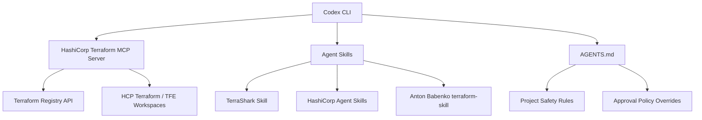
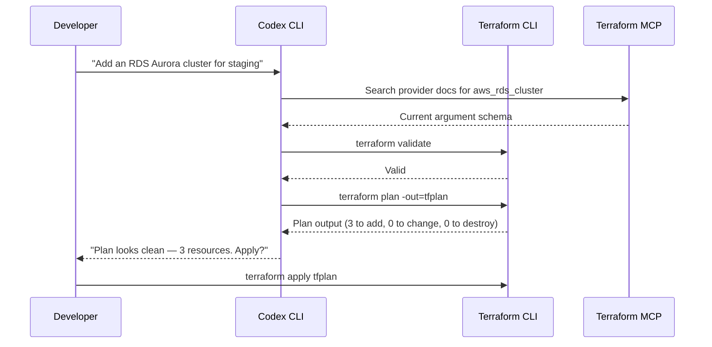

# Codex CLI and Terraform: Agent Skills, MCP Servers, and Infrastructure-as-Code Workflows


---

Infrastructure as Code is one of the highest-stakes domains for AI-assisted development. A hallucinated resource argument in a Terraform plan can provision an unencrypted S3 bucket or tear down a production database. This article covers the current Codex CLI integration surface for Terraform: the HashiCorp MCP server, community and first-party agent skills, AGENTS.md guardrails, and practical workflow patterns that keep blast radius under control.

## The Integration Landscape

Codex CLI connects to Terraform through three complementary layers: **MCP servers** for live registry and workspace data, **agent skills** for best-practice guidance, and **AGENTS.md** for project-specific safety rules. Each layer addresses a different failure mode.



## The HashiCorp Terraform MCP Server

HashiCorp ships an official MCP server (`terraform-mcp-server`, currently at v0.5.x in beta) that gives Codex CLI real-time access to the Terraform Registry[^1]. This is critical because LLM training data lags behind provider releases — without it, the model will hallucinate deprecated argument names or miss newly added resources.

### What It Exposes

The server provides tools for[^2]:

- **Provider documentation search** — current argument references, data sources, and resource schemas
- **Module discovery** — inputs, outputs, and usage examples from the public registry
- **Sentinel policy lookup** — governance rules for enterprise deployments
- **HCP Terraform workspace operations** — create, read, update, and delete workspaces, variables, tags, and runs

### Configuration

Add the server to your `~/.codex/config.toml` (or project-scoped `.codex/config.toml` for trusted projects):

```toml
[mcp_servers.terraform]
command = "terraform-mcp-server"
args = ["stdio"]
startup_timeout_sec = 15
tool_timeout_sec = 30

[mcp_servers.terraform.env]
TFE_TOKEN = "your-hcp-terraform-token"
TFE_ADDRESS = "https://app.terraform.io"
```

Alternatively, use the CLI shorthand[^3]:

```bash
codex mcp add terraform \
  --env TFE_TOKEN=your-token \
  -- terraform-mcp-server stdio
```

> **Note:** The `mcp_servers` key uses an underscore, not a hyphen. Using `mcp-servers` causes Codex to silently ignore the configuration[^3].

⚠️ The Terraform MCP server is in beta. HashiCorp explicitly recommends against production use at this stage[^1].

## Agent Skills for Terraform

Agent skills provide structured domain knowledge that the model loads on demand, without consuming context tokens until activated. Three skills currently target Terraform workflows.

### HashiCorp Official Agent Skills

HashiCorp's `agent-skills` repository[^4] ships three plugin categories:

| Plugin | Focus |
|---|---|
| `terraform-code-generation` | HCL style conventions, testing with `.tftest.hcl`, Azure Verified Modules, resource discovery |
| `terraform-module-generation` | Refactoring monoliths into modules, multi-region orchestration, Terraform Stacks |
| `terraform-provider-development` | Scaffolding new providers, acceptance tests, lifecycle operations, resource patterns |

Install via the Codex marketplace (if using the plugin ecosystem) or reference them in your project's AGENTS.md.

### TerraShark

TerraShark[^5] takes a diagnostic-first approach, implementing a seven-step failure-mode workflow:

1. Capture execution context (runtime, providers, backend, risk level)
2. Diagnose likely failure modes (identity churn, secret exposure, blast radius, CI drift, compliance gaps)
3. Load only relevant references for identified issues
4. Propose fixes with explicit risk controls
5. Generate implementation artefacts
6. Validate before finalisation
7. Deliver output with assumptions, trade-offs, and rollback plans

At roughly 600 tokens on activation (compared to ~4,400 for comparable skills), TerraShark is notably token-efficient[^5]. It also ships compliance mappings for ISO 27001, SOC 2, FedRAMP, GDPR, PCI DSS, and HIPAA.

For Codex CLI, clone it into your project and reference it from AGENTS.md:

```bash
git clone https://github.com/LukasNiessen/terrashark.git .terrashark
```

### Anton Babenko's terraform-skill

This community skill[^6] covers testing strategies, module patterns, CI/CD workflows, and production-ready infrastructure code for both Terraform and OpenTofu. It is particularly strong on CI pipeline integration with GitHub Actions, GitLab CI, and Atlantis.

## AGENTS.md for Terraform Projects

An AGENTS.md file in your infrastructure repository sets non-negotiable safety boundaries. For Terraform projects, the critical rules are:

```markdown
# AGENTS.md — Infrastructure Repository

## Safety Rules
- NEVER run `terraform apply` without explicit user approval
- NEVER run `terraform destroy` under any circumstances
- Always run `terraform validate` before `terraform plan`
- Always run `terraform fmt -check` before committing
- Treat `terraform plan` output as the source of truth — do not summarise

## Conventions
- All modules live under `modules/`
- Environment configs live under `environments/{dev,staging,prod}/`
- Use `terraform test` (`.tftest.hcl`) for module validation
- Pin provider versions to exact patch releases
- State is in HCP Terraform — never reference local state files

## Approval Policy
- `terraform plan` → auto-approve (read-only)
- `terraform apply` → always require human approval
- Any command touching production → always require human approval
```

This pairs with the Codex CLI approval policy. Set your project's `.codex/config.toml` to enforce it:

```toml
approval_policy = "unless-allow-listed"
sandbox_mode = "workspace-write"
```

## Workflow Patterns

### Plan-Review-Apply with Steering

The most common pattern uses Codex for authoring HCL and reviewing plans, with the human retaining the apply gate:



The MCP server prevents hallucinated arguments by grounding the model in the current provider schema, and the approval policy ensures `apply` never runs without a human in the loop.

### Drift Detection Loop

For teams running scheduled drift checks, Codex's `exec` mode integrates cleanly:

```bash
codex exec "Run terraform plan for environments/prod. \
  If drift is detected, summarise the changes and their likely cause. \
  Do not apply any changes." \
  --json --output-last-message \
  > drift-report.json
```

Wire this into a cron job or CI schedule. The `--json` flag produces machine-readable output, and the AGENTS.md rules prevent any accidental `apply`[^7].

### Module Scaffolding with Sub-Agent Delegation

For large estates, delegate module generation to a sub-agent while the orchestrator handles the composition:

```toml
# .codex/config.toml
[agents.terraform-module-writer]
model = "gpt-5.4-mini"
instructions = "You write Terraform modules. Follow HashiCorp module structure conventions."
```

The orchestrating session can then delegate: *"Create a reusable VPC module under modules/vpc/ with configurable CIDR ranges and NAT gateway toggle."* The sub-agent uses the cheaper `gpt-5.4-mini` model for boilerplate generation, while the parent session uses the flagship `gpt-5.4` for architectural decisions[^8].

## Security Considerations

Terraform workflows expose several risk surfaces that require explicit mitigation:

- **State file secrets** — Never let the agent read `.tfstate` files directly. Use HCP Terraform's remote state or `terraform output` for specific values.
- **Provider credentials** — Pass credentials via environment variables in the MCP server config, never inline in HCL.
- **Blast radius** — Use `terraform plan -target` for surgical changes in large configurations. The TerraShark skill explicitly diagnoses blast radius as a failure mode[^5].
- **Prompt injection from modules** — Third-party modules could contain malicious descriptions. Pin module sources to specific commits or tags.
- **Auto-apply prevention** — The AGENTS.md rules above are your primary defence, backed by the approval policy. Gartner projects that over 40% of organisations will use AI-augmented IaC tooling by 2026[^9], making these guardrails essential for adoption at scale.

## Known Gaps

- **No first-party Codex plugin for Terraform** — unlike Nx or Atlas, there is no `codex marketplace add terraform` yet. The MCP server and agent skills are the current integration path.
- **OpenTofu coverage** — TerraShark supports OpenTofu, but the HashiCorp MCP server is Terraform-specific. OpenTofu users need to rely on skills alone for registry grounding.
- **`terraform apply` streaming** — long-running applies can exceed the default `tool_timeout_sec`. Increase this in your MCP config for large infrastructure changes.
- **No native drift alerting** — the drift detection pattern above requires external scheduling. A future Codex hook event for periodic checks would close this gap.

## Citations

[^1]: [Terraform MCP server overview — HashiCorp Developer](https://developer.hashicorp.com/terraform/mcp-server)
[^2]: [Deploy the Terraform MCP server — HashiCorp Developer](https://developer.hashicorp.com/terraform/mcp-server/deploy)
[^3]: [Model Context Protocol — Codex | OpenAI Developers](https://developers.openai.com/codex/mcp)
[^4]: [hashicorp/agent-skills — GitHub](https://github.com/hashicorp/agent-skills/tree/main/terraform)
[^5]: [LukasNiessen/terrashark — GitHub](https://github.com/LukasNiessen/terrashark)
[^6]: [antonbabenko/terraform-skill — GitHub](https://github.com/antonbabenko/terraform-skill)
[^7]: [Non-interactive mode — Codex | OpenAI Developers](https://developers.openai.com/codex/noninteractive)
[^8]: [Models — Codex | OpenAI Developers](https://developers.openai.com/codex/models)
[^9]: [AI-Generated: Secure your cloud stack with Terraform code — Cloud Magazin](https://www.cloudmagazin.com/en/2026/04/02/ai-generated-terraform-code-is-the-cloud-stacks-biggest-unspoken-risk/)
