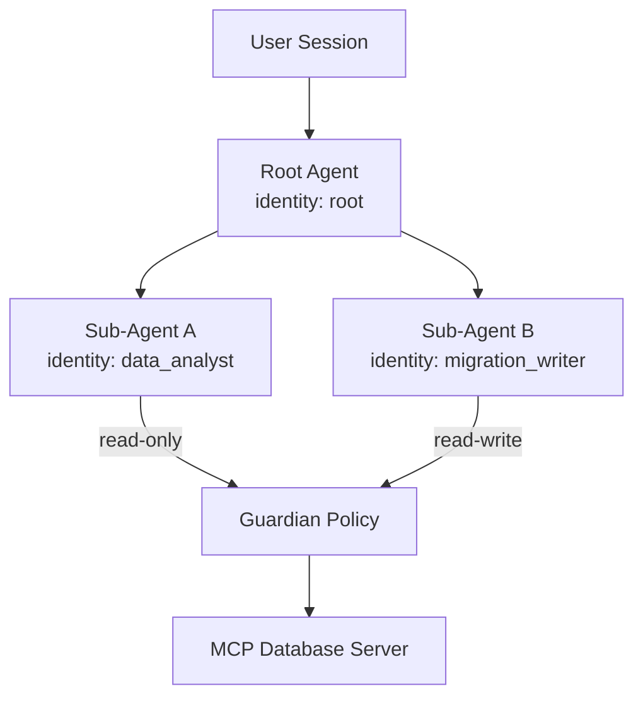

# Codex CLI v0.121: Marketplace CLI, Agent Identity, and the Road to Plugin Distribution


---

The v0.121.0-alpha.2 pre-release, tagged on 11 April 2026[^1], is the most plugin-and-marketplace-focused Codex CLI release to date. Whilst v0.119 and v0.120 laid the groundwork — multi-agent v2, background agent streaming, guardian review IDs — this alpha consolidates the distribution story. Here is what shipped, what it means for the ecosystem, and what is still missing.

## What Shipped in v0.121.0-alpha

### The `codex marketplace` CLI Subcommand

The headline feature is the new `codex marketplace add` command[^2], which brings plugin marketplace management into the terminal for the first time. Previously, marketplace configuration required manually editing `marketplace.json` files or using the Codex App's GUI. Now you can add a marketplace source from Git, GitHub shorthand, or a local directory:

```bash
# Add a marketplace from a GitHub repository
codex marketplace add github:your-org/codex-plugins

# Add from a local directory for development
codex marketplace add ./my-team-plugins

# Add from a full Git URL
codex marketplace add https://github.com/your-org/codex-plugins.git
```

The command resolves the marketplace source, validates the `marketplace.json` manifest, and registers it alongside the three existing marketplace tiers[^3]:

1. **Official Plugin Directory** — curated by OpenAI
2. **Repository marketplace** — at `$REPO_ROOT/.agents/plugins/marketplace.json`
3. **Personal marketplace** — at `~/.agents/plugins/marketplace.json`

The `codex marketplace add` command effectively creates a fourth channel: remote marketplaces pulled from Git repositories. This is the mechanism enterprise teams have been waiting for — distribute a curated plugin catalogue via your internal Git hosting, and developers pick it up with a single command.

```mermaid
flowchart LR
    A[Official Directory] --> D[Plugin Cache]
    B[Repo marketplace.json] --> D
    C[Personal marketplace.json] --> D
    E["codex marketplace add<br/>(Git / GitHub / local)"] --> D
    D --> F[~/.codex/plugins/cache/]
    F --> G[/plugins browser]
```

### Slash Command Local Recall

The TUI composer now supports local recall of previously-used slash commands. Where before you had to remember and retype `/review`, `/diff`, or custom commands, the composer now tracks your slash command history and surfaces recent commands as you type `/`. This pairs with the broader prompt history recall that landed in v0.119[^4], extending it specifically to the slash command namespace.

### The `use_agent_identity` Feature Flag

A new `use_agent_identity` feature flag appears in v0.121-alpha[^5]. When enabled, agent sessions carry a stable identity token that persists across turns and can be inspected by guardian policies and MCP servers. The practical implication: downstream tools can distinguish *which* agent is making a request in multi-agent workflows, enabling per-agent audit trails and access control.

```toml
# config.toml
[features]
use_agent_identity = true
```

This is particularly relevant for enterprises running hierarchical multi-agent setups with the v2 path-based addressing introduced in v0.119[^6]. A guardian policy can now gate tool access based on the agent's identity rather than the session-level user credentials alone.

### MCP Apps Tool Call Support

MCP Apps gained richer tool call support across v0.119–v0.121, culminating in full tool-call metadata propagation[^7]. MCP servers can now receive structured metadata about the calling context — including the originating agent path, the parent thread ID, and the tool invocation timestamp. This enables MCP server authors to build context-aware responses:

```json
{
  "method": "tools/call",
  "params": {
    "name": "query_database",
    "arguments": { "sql": "SELECT * FROM users LIMIT 10" },
    "_meta": {
      "agentPath": "/root/data_analyst",
      "threadId": "thread_abc123",
      "wallTimeMs": 1245
    }
  }
}
```

### MCP Tool Wall Time Tracking

Every MCP tool invocation now records wall-clock execution time[^8]. This metric feeds into the analytics schema introduced alongside guardian review IDs in v0.120[^9], enabling teams to identify slow tools, set latency budgets, and trigger alerts when MCP servers degrade. The wall time appears in:

- Guardian review payloads (for timeout decisions)
- OpenTelemetry spans (when wired to an OTLP collector)
- The `/status` slash command output

### Guardian Review Timeouts

Building on the guardian timeout infrastructure from v0.120[^10], the alpha refines the `TimedOut` status with configurable per-tool timeout thresholds. A guardian that does not respond within the configured window now triggers fail-closed semantics — the tool call is rejected rather than silently approved. This is a critical enterprise requirement: no silent pass-throughs when the governance layer is unreachable.

### AGENTS.md Source Exposure via App Server

The app server now exposes AGENTS.md content through its JSON-RPC API[^11]. Clients — including the Codex App, VS Code extension, and custom integrations — can query the resolved AGENTS.md for the current working directory without reading the filesystem directly. This matters for remote sessions where the client may not have filesystem access:

```bash
# The app server exposes skills and context files via JSON-RPC
# Clients can enumerate available context with:
# method: "context/list" → returns AGENTS.md, SKILL.md locations
```

The `skills/list` endpoint already returned skill metadata[^12]; the new addition extends this to the broader AGENTS.md context, meaning remote clients get full visibility into what instructions the agent is operating under.

### Bubblewrap in Docker Devcontainers

Sandbox reliability in containerised environments received significant attention across v0.119–v0.121. The vendored bubblewrap binary now handles Docker devcontainers more gracefully[^13], suppressing irrelevant warnings when Landlock or seccomp features are unavailable in the container's kernel configuration. Previously, running Codex in a standard devcontainer produced noisy bubblewrap warnings that confused users into thinking the sandbox was broken.

The recommended Docker configuration remains:

```dockerfile
# For devcontainers that support unprivileged user namespaces
FROM mcr.microsoft.com/devcontainers/base:ubuntu

# Ensure bubblewrap is available
RUN apt-get update && apt-get install -y bubblewrap

# If your container restricts user namespaces, fall back to:
# codex --sandbox danger-full-access
```

For Docker environments that cannot support the Landlock + seccomp sandbox (most restricted containers and CI runners), the official Docker sandbox template `docker/sandbox-templates:codex`[^14] provides a pre-configured image that handles isolation at the container level instead.

### Flattened Deferred MCP Tool Calls

MCP tool declarations are now flattened during deferred loading[^15], reducing the token overhead of large MCP server inventories. Previously, when a server exposed dozens of tools, the full schema for every tool was included in the system prompt even if the tool was unlikely to be called. The flattened deferred approach sends only tool names and brief descriptions upfront, fetching full schemas on demand when the model selects a tool.

This directly addresses the 47% MCP token reduction first measured with tool search in GPT-5.4[^16], extending that optimisation to all MCP servers — not just those using the explicit tool search mechanism.

## What This Means for the Ecosystem

### The Plugin Distribution Problem Is (Nearly) Solved

Before v0.121, distributing Codex plugins to a team required one of:

1. Manually copying plugin directories into each developer's `~/.codex/plugins/`
2. Committing a `marketplace.json` to each repository
3. Using the Codex App GUI to install from the official directory

The `codex marketplace add` command introduces a proper pull-based distribution model. An enterprise team can maintain a single Git repository of approved plugins, and onboarding becomes:

```bash
codex marketplace add github:acme-corp/codex-plugins
```

Combined with the three-tier installation policy (`INSTALLED_BY_DEFAULT`, `AVAILABLE`, `NOT_AVAILABLE`)[^3], this gives platform teams the governance lever they need: publish a marketplace, set policies, and let `codex marketplace add` handle the rest.

### Agent Identity Enables Zero-Trust Multi-Agent

The `use_agent_identity` flag is a stepping stone towards zero-trust multi-agent architectures. Today, all sub-agents in a multi-agent v2 session share the parent session's credentials. With agent identity, each agent carries a distinguishable token that guardian policies and MCP servers can inspect. The natural next step — not yet shipped — is per-agent permission scoping, where a `data_analyst` sub-agent gets read-only database access whilst a `migration_writer` gets schema modification rights.



### Wall Time + Guardian Timeouts = Observable Governance

The combination of MCP wall time tracking and guardian review timeouts creates an observable governance pipeline. Teams can now answer questions like:

- "Which MCP tools consistently exceed their latency budget?"
- "How often does the guardian time out, and on which tool categories?"
- "What is the p99 wall time for our custom Jira MCP server?"

Wiring these metrics to OpenTelemetry[^9] makes them queryable in existing observability stacks (Grafana, Datadog, Honeycomb) without custom instrumentation.

## What Is Still Missing

Despite the progress, several gaps remain:

| Gap | Status | Impact |
|-----|--------|--------|
| Self-serve plugin publishing to the official directory | Forthcoming[^3] | Community plugins require manual curation |
| Version conflict resolution across marketplaces | Not started | Two marketplaces shipping the same plugin at different versions produces undefined behaviour |
| Per-agent permission scoping | Not shipped | `use_agent_identity` provides the identity but not the policy enforcement |
| Interactive history search (Ctrl+R) | Open issue #10730[^17] | Fuzzy reverse-search in the TUI composer awaits prioritisation |
| `codex marketplace remove` and `update` subcommands | ⚠️ Not confirmed in alpha | Adding marketplaces is supported; lifecycle management commands may follow |

## Upgrading to the Alpha

The v0.121 alpha is available via the pre-release channel:

```bash
# Install the latest alpha
npm install -g @openai/codex@alpha

# Verify
codex --version
# 0.121.0-alpha.2
```

As with any alpha, expect rough edges. The marketplace subcommand and agent identity flag are feature-flagged and may change before the stable v0.121.0 release. Test in a non-critical environment first.

## Conclusion

v0.121-alpha marks the point where Codex CLI's plugin ecosystem becomes genuinely distributable. The `codex marketplace add` command, combined with three-tier installation policies and the emerging agent identity model, gives enterprise teams the primitives they need for governed, multi-agent plugin distribution. The MCP improvements — wall time tracking, flattened deferred tool calls, and richer tool call metadata — make the agent loop more observable and more token-efficient.

The road to a fully self-serve plugin marketplace is not yet complete, but with this release, the distribution mechanism is no longer the bottleneck. The bottleneck is now the plugins themselves — and the community building them.

---

## Citations

[^1]: [Codex CLI Releases — GitHub](https://github.com/openai/codex/releases), v0.121.0-alpha.2 tagged 11 April 2026.
[^2]: [Codex Marketplace Plugin Distribution — Daniel Vaughan](https://codex.danielvaughan.com/2026/04/11/codex-marketplace-plugin-distribution/), analysis of the `codex marketplace add` command from PR #17087.
[^3]: [Build Plugins — Codex Developer Documentation](https://developers.openai.com/codex/plugins/build), marketplace.json format and installation policies.
[^4]: [Codex CLI Changelog — v0.119.0](https://developers.openai.com/codex/changelog?type=codex-cli), prompt history recall in app-server TUI.
[^5]: [Codex CLI Features Documentation](https://developers.openai.com/codex/cli/features), feature flag management via `codex features` subcommand. ⚠️ `use_agent_identity` flag not yet in public documentation; inferred from alpha release notes.
[^6]: [Multi-Agent v2 in Codex CLI — Daniel Vaughan](https://codex.danielvaughan.com/2026/04/11/codex-cli-multi-agent-v2-path-addressing/), path-based addressing and structured messaging.
[^7]: [Codex CLI Changelog — v0.119.0](https://developers.openai.com/codex/changelog?type=codex-cli), MCP Apps resource reads and tool-call metadata.
[^8]: [Codex CLI Changelog — v0.120.0](https://developers.openai.com/codex/changelog?type=codex-cli), code-mode tool declarations with MCP outputSchema.
[^9]: [Guardian Review IDs, Timeouts and Delta Transcripts — Daniel Vaughan](https://codex.danielvaughan.com/2026/04/11/guardian-review-ids-timeouts-delta-transcripts/), analytics schema and OpenTelemetry integration.
[^10]: [Codex CLI Changelog — v0.120.0](https://developers.openai.com/codex/changelog?type=codex-cli), guardian TimedOut status with fail-closed semantics.
[^11]: [Codex App Server Documentation](https://developers.openai.com/codex/app-server), JSON-RPC protocol and skills/list endpoint.
[^12]: [Codex App Server Documentation](https://developers.openai.com/codex/app-server), skill metadata enumeration via `skills/list`.
[^13]: [Bubblewrap Sandbox in Containers — GitHub Issue #14976](https://github.com/openai/codex/issues/14976), bind-mounted path failures in containerised environments.
[^14]: [Codex — Docker Documentation](https://docs.docker.com/ai/sandboxes/agents/codex/), pre-configured sandbox template.
[^15]: [GPT-5.4 Computer Use and Tool Search — Daniel Vaughan](https://codex.danielvaughan.com/2026/03/31/gpt54-computer-use-tool-search-codex-cli/), 47% MCP token reduction via tool search deferred loading.
[^16]: [GPT-5.4 Computer Use and Tool Search — Daniel Vaughan](https://codex.danielvaughan.com/2026/03/31/gpt54-computer-use-tool-search-codex-cli/), tool search measurement methodology.
[^17]: [TUI Interactive History Search — GitHub Issue #10730](https://github.com/openai/codex/issues/10730), Atuin-style Ctrl+R reverse search proposal.
