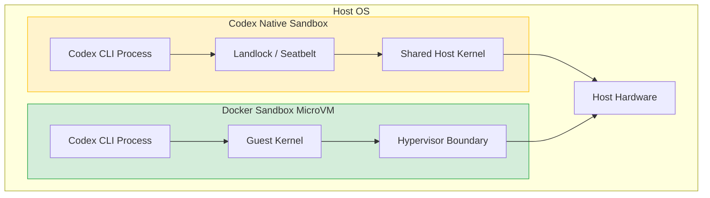
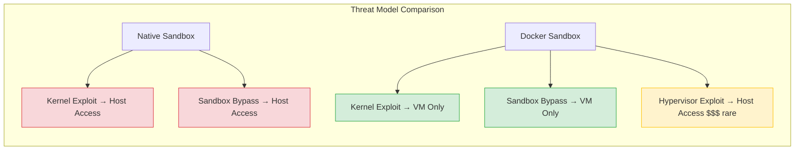

# Docker Sandboxes for Codex CLI: MicroVM Isolation, the sbx CLI, and When to Use External Sandboxing


Codex CLI ships with one of the strongest built-in sandboxes in the AI coding agent space — Landlock plus seccomp on Linux, Seatbelt on macOS, restricted tokens on Windows [^1]. It is the only major CLI agent that enables sandboxing by default [^2]. So why would you wrap it in *another* sandbox?

The answer is Docker Sandboxes: a microVM-based isolation product from Docker that launched in full production availability on 30 January 2026 [^3]. It wraps AI coding agents — including Codex CLI — inside lightweight virtual machines with their own kernel, their own Docker daemon, and a hard hypervisor boundary between the agent and the host operating system [^4]. This article explains the architecture, walks through setup, and provides a decision framework for when external sandboxing adds genuine value over Codex CLI's native protections.

## Why Containers Are Not Sandboxes

The security community reached consensus years ago: a Linux container is a process isolation mechanism, not a security boundary [^5]. Every container on a host shares the same kernel. A kernel vulnerability is a vulnerability in every container on that machine. Container escapes are a well-documented category of exploit — CVE-2024-21626 (Leaky Vessels) being a recent high-profile example [^6].

MicroVMs break this pattern entirely. Instead of sharing a kernel, each microVM boots its own dedicated Linux kernel inside a hardware-virtualised boundary enforced by the CPU itself (Intel VT-x / AMD-V) [^7]. The VMM attack surface is dramatically smaller: Firecracker's VMM is roughly 83,000 lines of Rust as of March 2026, compared to the Linux kernel's approximately 40 million lines of C [^7]. A VM escape requires a hypervisor CVE — a class of vulnerability so rare it commands $250K–$500K bounties on the exploit market [^7].



## Docker Sandboxes Architecture

Each Docker Sandbox is a microVM with four isolated components [^4]:

1. **Dedicated Linux kernel** — the agent's syscalls never reach the host kernel
2. **Independent Docker daemon** — agents can build and run containers *inside* the sandbox without touching the host Docker
3. **Isolated filesystem** — your workspace is mounted via filesystem passthrough for instant bidirectional sync, but the rest of the host is invisible [^8]
4. **Network proxy** — all outbound traffic routes through an HTTP/HTTPS proxy on the host that enforces network access policies and handles credential injection [^9]

The product ships as a standalone CLI called `sbx` and does not require Docker Desktop [^10]. Platform requirements are macOS (Apple Silicon), Windows 11 (x86_64), or Linux Ubuntu 22.04+ (x86_64 with KVM access) [^10].

## Setting Up Docker Sandboxes for Codex CLI

### Installation

```bash
# macOS
brew install docker/sbx/sbx

# Linux (Ubuntu/Debian)
curl -fsSL https://get.docker.com/sbx | sh

# Windows
winget install Docker.Sbx
```

Authenticate with Docker:

```bash
sbx login
```

On first login, the CLI prompts you to choose a default network policy [^9]:

- **Open** — all network traffic allowed
- **Balanced** — default deny with common development sites allowed
- **Locked Down** — all traffic blocked unless explicitly allowed

### Storing Your OpenAI API Key

Docker Sandboxes includes a built-in secrets manager that stores credentials in your OS keychain — never in plain text on disk or inside the VM [^9]. When the agent makes outbound API requests, the host-side proxy intercepts them and injects the credential automatically. The agent can make authenticated calls but can never read, log, or exfiltrate the raw credential [^9].

```bash
sbx secrets set OPENAI_API_KEY
# Prompts for value, stores in OS keychain
```

Alternatively, export the environment variable before launching:

```bash
export OPENAI_API_KEY="sk-..."
sbx run codex
```

### Running Codex in a Sandbox

```bash
# Basic launch
sbx run codex

# Named sandbox with Codex CLI flags
sbx run codex --name my-project -- --model gpt-5.4 --sandbox danger-full-access

# Launch with a specific workspace
sbx run codex --mount ./my-repo
```

The sandbox runs Codex without approval prompts by default [^11] — this is the expected behaviour since the microVM itself provides the isolation boundary. Pass additional Codex CLI options after `--`.

### The Interactive Dashboard

Running `sbx` with no arguments opens an interactive dashboard showing all sandboxes with live status. From here you can attach to running agents, open shells, and manage network rules from one interface [^10].

## Custom Environments

The base Codex sandbox image provides a standard development environment. For projects with specific toolchain requirements, extend it with a Dockerfile [^12]:

```dockerfile
FROM codex

# System packages (run as root)
USER root
RUN apt-get update && apt-get install -y \
    postgresql-client \
    redis-tools \
    protobuf-compiler

# User-level tools (must run as agent)
USER agent
RUN pip install --user poetry==2.1.1
RUN npm install -g @angular/cli@19
```

Build and run:

```bash
sbx run codex --template ./Dockerfile
```

⚠️ Tools that install into the home directory must run as the `agent` user — otherwise they install under `/root/` and are not available in the sandbox [^12].

## What Configuration Carries Over (and What Does Not)

A critical operational detail: sandboxes do not pick up user-level agent configuration from your host [^11]. Directories like `~/.codex/` — where hooks, skills, memory, and `config.toml` live — are not mounted into the sandbox. Only project-level configuration in the working directory is available inside the sandbox.

This means:

| Configuration | Available | Notes |
|---|---|---|
| Project `AGENTS.md` | ✅ | In the mounted workspace |
| Project `.codex/` directory | ✅ | Skills, agent TOML files |
| User `~/.codex/config.toml` | ❌ | Use project-level config |
| User `~/.codex/memory/` | ❌ | Memory does not persist |
| User hooks | ❌ | Must be project-scoped |
| User skills | ❌ | Must be in workspace |

For teams, this is arguably a feature: every sandbox starts from a clean, reproducible state defined entirely by the project's version-controlled configuration.

## Security Model Comparison

### Codex CLI Native Sandbox

Codex CLI's native sandbox provides OS-level process isolation [^1]:

- **macOS**: Seatbelt profiles via `sandbox-exec` restrict filesystem, network, and process capabilities
- **Linux**: Landlock LSM restricts filesystem access; seccomp-BPF filters syscalls; bubblewrap (`bwrap`) provides namespace isolation
- **Windows**: Restricted tokens, ACLs, and Windows Firewall rules

The security boundary is the host kernel. A sandbox escape — through a Seatbelt bypass, Landlock privilege escalation, or seccomp filter gap — gives the attacker host-level access [^2].

### Docker Sandboxes MicroVM

The security boundary is hardware virtualisation [^7]. Even with a full breakout from the guest kernel, the attacker remains inside a VM. Reaching the host requires escaping through the hypervisor — the same class of boundary that AWS and Azure rely on for multi-tenant isolation [^7].

Additional protections:

- **Credential injection at the proxy layer** — API keys never enter the VM [^9]
- **Network policy enforcement at the host** — the agent cannot bypass network restrictions from inside the VM
- **Docker-in-Docker isolation** — agents can build containers without touching the host Docker daemon [^4]



## When to Use Docker Sandboxes vs Native Sandboxing

### Use Docker Sandboxes When

- **Running agents unattended for extended periods** — overnight batch jobs, CI/CD pipelines, or fire-and-forget cloud-style workflows where no human reviews approvals in real time
- **The agent needs Docker** — building container images, running integration tests with Testcontainers, or spinning up service dependencies. Docker Sandboxes is the only sandboxing solution that allows agents to build and run Docker containers while remaining isolated from the host [^4]
- **Enterprise compliance requires hypervisor-level isolation** — regulated environments (HIPAA, SOC 2, FedRAMP) may require demonstrable hardware-level isolation boundaries
- **Credential protection is paramount** — the proxy-based credential injection model ensures API keys never enter the agent's address space
- **Multi-agent parallel execution** — running 5–10 Codex instances simultaneously, each in its own sandbox, with full environment isolation

### Use Native Sandboxing When

- **Interactive development** — the overhead of a microVM adds latency to startup and file operations; native sandboxing is instant
- **You want user-level configuration** — hooks, skills, memory, and custom `config.toml` are only available natively
- **Lightweight tasks** — code review, small refactors, and conversational exploration do not need hypervisor isolation
- **Platform constraints** — Docker Sandboxes requires KVM on Linux and Apple Silicon on macOS; native sandboxing works everywhere Codex CLI runs

### The Layered Approach

For maximum security, run both layers simultaneously. Inside a Docker Sandbox, Codex CLI's native sandbox defaults to `danger-full-access` because the microVM provides isolation [^11]. But you can explicitly re-enable Codex's native sandbox for defence-in-depth:

```bash
sbx run codex --name hardened -- --sandbox workspace-write --approval-mode suggest
```

This gives you hypervisor isolation (Docker Sandbox) *plus* Landlock/seccomp restrictions (native sandbox) — two independent security boundaries that an attacker would need to breach sequentially.

## Supported Agents and the Cross-Tool Angle

Docker Sandboxes supports seven agents out of the box: Claude Code, Codex CLI, GitHub Copilot CLI, Gemini CLI, OpenCode, Kiro, and Docker Agent [^3]. This makes it a natural fit for the three-CLI toolkit pattern — running Codex, Claude Code, and Gemini CLI in parallel sandboxes with unified network policy and credential management.

## Known Limitations

- **No user-level configuration passthrough** — `~/.codex/` is not available inside the sandbox [^11]. This is the most frequently reported friction point
- **Startup overhead** — microVM boot adds 2–5 seconds compared to native Codex CLI startup
- **Platform requirements** — Apple Silicon only on macOS, KVM required on Linux, Windows 11 only [^10]
- **Experimental status** — Docker Sandboxes is currently free and experimental; pricing may change [^13]
- **Memory isolation** — Codex CLI's `~/.codex/memory/` directory is not persisted between sandbox sessions, breaking cross-session memory workflows

## Conclusion

Codex CLI's native sandbox is strong enough for interactive development. Docker Sandboxes adds value when you need hypervisor-grade isolation for unattended execution, Docker-in-Docker capability, or credential protection that keeps API keys out of the agent's address space entirely. For enterprise teams running Codex CLI at scale — particularly in regulated environments or CI/CD pipelines — Docker Sandboxes provides a hard security boundary that OS-level sandboxing cannot match.

The product is currently free and experimental. If your workflow involves fire-and-forget Codex sessions or multi-agent parallel execution, it is worth evaluating now before it becomes a paid product.

## Citations

[^1]: OpenAI, "Agent approvals & security – Codex", [https://developers.openai.com/codex/agent-approvals-security](https://developers.openai.com/codex/agent-approvals-security)
[^2]: Shane de Coninck, "Your Coding Agent Needs a Sandbox: Docker Sandbox vs Native vs DevContainers", [https://shanedeconinck.be/posts/docker-sandbox-coding-agents/](https://shanedeconinck.be/posts/docker-sandbox-coding-agents/)
[^3]: Docker, "Docker Sandboxes | Sandboxes for Coding Agents", [https://www.docker.com/products/docker-sandboxes/](https://www.docker.com/products/docker-sandboxes/)
[^4]: Docker, "Docker Sandboxes: Run Claude Code and More Safely", [https://www.docker.com/blog/docker-sandboxes-run-claude-code-and-other-coding-agents-unsupervised-but-safely/](https://www.docker.com/blog/docker-sandboxes-run-claude-code-and-other-coding-agents-unsupervised-but-safely/)
[^5]: Emir B., "Your Container Is Not a Sandbox: The State of MicroVM Isolation in 2026", [https://emirb.github.io/blog/microvm-2026/](https://emirb.github.io/blog/microvm-2026/)
[^6]: Snyk, "Leaky Vessels: Docker and runc Container Breakout Vulnerabilities", [https://snyk.io/blog/leaky-vessels-docker-runc-container-breakout-vulnerabilities/](https://snyk.io/blog/leaky-vessels-docker-runc-container-breakout-vulnerabilities/)
[^7]: Emir B., "Your Container Is Not a Sandbox: The State of MicroVM Isolation in 2026", [https://emirb.github.io/blog/microvm-2026/](https://emirb.github.io/blog/microvm-2026/)
[^8]: Docker, "Architecture | Docker Docs", [https://docs.docker.com/ai/sandboxes/architecture/](https://docs.docker.com/ai/sandboxes/architecture/)
[^9]: Andrew Lock, "Running AI agents safely in a microVM using docker sandbox", [https://andrewlock.net/running-ai-agents-safely-in-a-microvm-using-docker-sandbox/](https://andrewlock.net/running-ai-agents-safely-in-a-microvm-using-docker-sandbox/)
[^10]: Docker, "Get started with Docker Sandboxes", [https://docs.docker.com/ai/sandboxes/get-started/](https://docs.docker.com/ai/sandboxes/get-started/)
[^11]: Docker, "Codex | Docker Docs", [https://docs.docker.com/ai/sandboxes/agents/codex/](https://docs.docker.com/ai/sandboxes/agents/codex/)
[^12]: Docker, "Custom environments | Docker Docs", [https://docs.docker.com/ai/sandboxes/agents/custom-environments/](https://docs.docker.com/ai/sandboxes/agents/custom-environments/)
[^13]: Docker, "Docker Sandboxes FAQ", [https://docs.docker.com/ai/sandboxes/faq/](https://docs.docker.com/ai/sandboxes/faq/)
