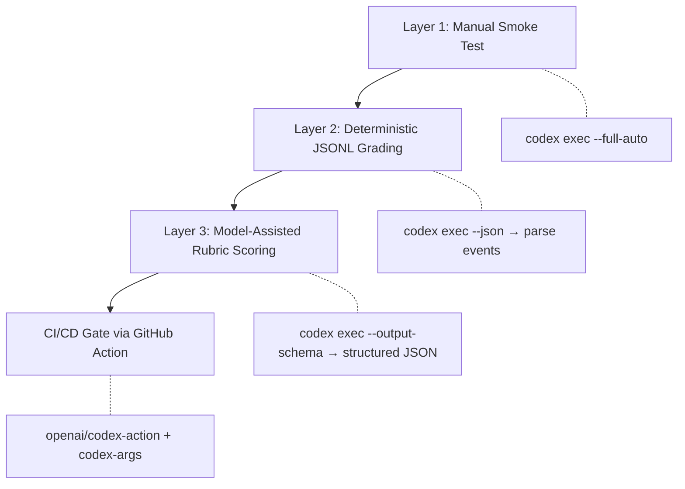
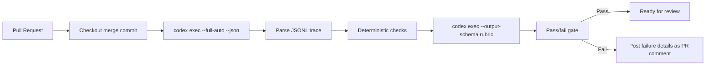

# Testing Codex CLI Skills: The Official Eval Pipeline with codex exec, JSONL Traces, and Skillgrade


---

Skills are becoming the primary unit of reusable workflow in Codex CLI. But a skill without evaluation is a guess — you have no idea whether a SKILL.md change improved routing accuracy, broke the scaffold structure, or introduced a regression in a downstream consumer. OpenAI's official eval methodology [^1], the `codex exec --json` event stream [^2], and the community Skillgrade CLI [^3] together form a three-layer testing pipeline that treats skills as testable software artefacts rather than disposable prompts.

This article walks through the complete pipeline: from manual smoke testing through deterministic JSONL trace grading to model-assisted rubric scoring and CI integration.

## Why Skills Need Evals

A Codex CLI skill is a directory containing a `SKILL.md` manifest with YAML front matter, optional scripts, references, and assets [^4]. The model loads only metadata (name, description, file path) upfront — the full instructions load only when Codex decides to invoke the skill [^4]. This progressive disclosure design means the description field doubles as routing logic: if it's wrong, the skill fires when it shouldn't, or doesn't fire when it should.

Without evals, you discover routing failures in production sessions. With evals, you catch them in a CSV prompt set before they reach a developer's terminal.

## The Three-Layer Eval Architecture

The official OpenAI approach [^1] builds evaluation progressively across three layers, each adding confidence without requiring the previous layer to be exhaustive.



### Layer 1: Manual Smoke Testing

Before automating anything, trigger the skill manually to expose hidden assumptions about invocation, environment state, and execution order [^1]:

```bash
# Explicit invocation via $ prefix
codex exec --full-auto \
  'Use the $setup-demo-app skill to create the project in this directory.'
```

The three invocation paths to verify:

| Method | Syntax | When to test |
|--------|--------|-------------|
| Explicit `/skills` | Select from TUI picker | Interactive sessions |
| Explicit `$` prefix | `$skill-name` in prompt | Scripted sessions |
| Implicit routing | Task matches description | Production realism |

Manual testing reveals whether the skill's "When to use" and "When not to use" guidance in the description is accurate — the single most important field in the entire SKILL.md [^1] [^4].

### Layer 2: Deterministic JSONL Grading

The `codex exec --json` flag transforms stdout into a JSONL event stream [^2]. Each line is a structured event with a `type` field:

- `thread.started` / `turn.started` / `turn.completed` / `turn.failed`
- `item.started` / `item.completed` (with item types: `command_execution`, `file_change`, `agent_message`, `mcp_tool_call`, `web_search`, `plan_update`)

This stream is the foundation of deterministic grading — you parse events and assert specific behaviours occurred.

#### The Prompt Set CSV

Start with 10–20 test cases in a CSV file [^1]:

```csv
id,should_trigger,prompt
test-01,true,"Create a demo app named devday-demo using the $setup-demo-app skill"
test-02,true,"Set up a minimal React demo app with Tailwind for quick UI experiments"
test-03,true,"Create a small demo app to showcase the Responses API"
test-04,false,"Add Tailwind styling to my existing React app"
```

The CSV includes both positive cases (should trigger the skill) and negative controls (should NOT trigger). Negative controls catch over-broad descriptions that fire on tangentially related prompts.

#### The JSONL Parser and Checker

A minimal Node.js eval runner captures the JSONL trace and runs deterministic checks against it [^1]:

```javascript
import { spawnSync } from "node:child_process";
import { readFileSync, writeFileSync, existsSync, mkdirSync } from "node:fs";
import path from "node:path";

function runCodex(prompt, outJsonlPath) {
  const res = spawnSync(
    "codex",
    ["exec", "--json", "--full-auto", prompt],
    { encoding: "utf8" }
  );
  mkdirSync(path.dirname(outJsonlPath), { recursive: true });
  writeFileSync(outJsonlPath, res.stdout, "utf8");
  return { exitCode: res.status ?? 1, stderr: res.stderr };
}

function parseJsonl(jsonlText) {
  return jsonlText.split("\n").filter(Boolean).map(l => JSON.parse(l));
}

// Deterministic check: did the agent run `npm install`?
function checkRanNpmInstall(events) {
  return events.some(
    e => (e.type === "item.started" || e.type === "item.completed")
      && e.item?.type === "command_execution"
      && typeof e.item?.command === "string"
      && e.item.command.includes("npm install")
  );
}

// Deterministic check: does package.json exist?
function checkPackageJsonExists(projectDir) {
  return existsSync(path.join(projectDir, "package.json"));
}
```

The pattern is: **prompt → captured run (trace + artefacts) → targeted checks → comparable scores over time** [^1].

#### What to Check Deterministically

| Check | What it catches |
|-------|----------------|
| Command presence (`npm install`, `npm run build`) | Missing setup steps |
| File existence (`package.json`, `src/components/Header.tsx`) | Incomplete scaffolding |
| Command ordering | Steps executed in wrong sequence |
| Command count | Infinite loops or excessive retries |
| Token usage from trace metadata | Cost regression |

### Layer 3: Model-Assisted Rubric Scoring

Deterministic checks verify *what happened*. Rubric scoring evaluates *how well it happened* — style conventions, code quality, and architectural compliance [^1].

The `--output-schema` flag enforces a JSON Schema on Codex's final response [^2], enabling structured rubric results:

```json
{
  "type": "object",
  "properties": {
    "overall_pass": { "type": "boolean" },
    "score": { "type": "integer", "minimum": 0, "maximum": 100 },
    "checks": {
      "type": "array",
      "items": {
        "type": "object",
        "properties": {
          "id": { "type": "string" },
          "pass": { "type": "boolean" },
          "notes": { "type": "string" }
        },
        "required": ["id", "pass", "notes"],
        "additionalProperties": false
      }
    }
  },
  "required": ["overall_pass", "score", "checks"],
  "additionalProperties": false
}
```

Run the rubric grader as a second pass after the skill has executed:

```bash
codex exec \
  "Evaluate the demo-app repository against these requirements:
   - Vite + React + TypeScript project exists
   - Tailwind configured via @tailwindcss/vite
   - src/components contains Header.tsx and Card.tsx
   - Functional components styled with Tailwind utility classes
   Return a rubric result as JSON." \
  --output-schema ./evals/style-rubric.schema.json \
  -o ./evals/artifacts/test-01.style.json
```

The `additionalProperties: false` constraint is mandatory — without it, the model may inject extra fields that break downstream parsing [^2].

## Skillgrade: Community Automation Layer

Skillgrade [^3], created by Minko Gechev, wraps the manual eval pipeline into a single CLI tool. It reads a SKILL.md, generates an `eval.yaml` configuration with AI-powered task and grader definitions, and executes the full eval suite.

```bash
npm i -g skillgrade
cd my-skill/
GEMINI_API_KEY=your-key skillgrade init
```

### The eval.yaml Format

Skillgrade's configuration centralises all eval settings [^3]:

- **Default agent and provider settings** — auto-detected from environment variables (`GEMINI_API_KEY`, `ANTHROPIC_API_KEY`, `OPENAI_API_KEY`)
- **Trial counts, timeouts, and pass thresholds** — how many times to run each test case, with configurable success criteria
- **Task definitions** — instructions plus workspace fixtures that set up the environment before each eval run
- **Grader configurations** — both deterministic (shell scripts) and LLM rubric graders with weighted scoring

### Execution Presets

| Preset | Flag | Use case |
|--------|------|----------|
| Smoke | `--smoke` | Rapid feedback during skill authoring |
| Reliable | `--reliable` | Balanced testing for PR review |
| Regression | `--regression` | Comprehensive pre-deployment validation |

For CI pipelines, the `--ci` flag controls exit codes and `--provider=local` avoids Docker overhead in ephemeral environments [^3].

```bash
# Quick check during development
skillgrade --smoke

# Full regression before merging
skillgrade --regression --ci
```

## CI/CD Integration via GitHub Action

The `openai/codex-action@v1` GitHub Action [^5] supports structured output via the `codex-args` parameter:

```yaml
- name: Eval skill - setup-demo-app
  uses: openai/codex-action@v1
  with:
    openai-api-key: ${{ secrets.OPENAI_API_KEY }}
    prompt-file: .github/codex/prompts/eval-setup-demo-app.md
    codex-args: '["--output-schema", ".github/codex/schemas/style-rubric.json"]'
    output-file: eval-result.json
    sandbox: workspace-write
    safety-strategy: drop-sudo

- name: Check eval result
  run: |
    jq -e '.overall_pass == true' eval-result.json || exit 1
```

The `drop-sudo` safety strategy removes `sudo` irreversibly before execution [^5], which is critical when the eval skill creates files and runs build commands.

### The Eval-Per-PR Pattern



This pattern runs the full three-layer eval on every PR that modifies a skill directory. The JSONL trace provides forensic evidence when a check fails — reviewers can inspect exactly which commands ran and what files were created.

## Progressive Eval Expansion

As skills mature, layer additional checks beyond the baseline [^1]:

| Phase | Checks added |
|-------|-------------|
| Initial | Command presence, file existence |
| Established | Build verification (`npm run build`), runtime smoke tests |
| Production | Token usage tracking, sandbox permission regression, command count analysis (detect loops) |
| Enterprise | Repository cleanliness validation, cross-skill interaction tests |

The Glean engineering team reported that adding negative examples to skill descriptions ("Don't use when...") recovered a ~20% accuracy drop they initially observed after deploying skills [^6]. Eval prompt sets with negative controls would have caught this before deployment.

## The Description-as-Routing Problem

The skill description is the single most consequential piece of text in the entire SKILL.md. It determines implicit invocation — whether Codex chooses to load the skill when the user's prompt matches [^4]. OpenAI's official best practices recommend explicit "use when" and "don't use when" guidance within descriptions [^7]:

```yaml
---
name: setup-demo-app
description: >
  Scaffold a Vite + React + Tailwind demo app with a small, consistent
  project structure. Use when you need a fresh demo app for quick UI
  experiments or reproductions. Don't use when adding Tailwind to an
  existing project or when the user already has a React app.
---
```

The negative controls in your prompt set CSV directly test whether the "don't use when" guidance works. If test-04 ("Add Tailwind styling to my existing React app") triggers the skill, the description needs tightening.

## When NOT to Build an Eval Pipeline

Not every skill warrants a full three-layer eval. The decision framework from the skill minimalism debate [^8] applies here:

- **One-line `/command` equivalent** — if the prompt works every time, save it and move on. No eval needed.
- **Structured SKILL.md with multi-step logic** — build at least Layer 2 (deterministic JSONL checks).
- **Unattended production skill** — invest in all three layers plus CI gating.

⚠️ The cost of running evals is non-trivial. Each `codex exec` invocation consumes tokens. A 20-prompt eval set with both deterministic and rubric passes runs roughly 40 Codex invocations. At current GPT-5.4-mini rates ($0.75/$4.50 per million tokens) [^9], a typical eval suite costs $2–5 per run. Skillgrade's `--smoke` preset (fewer trials, shorter timeouts) helps manage this during development.

## Practical Checklist

1. **Write the SKILL.md** with explicit "use when" / "don't use when" in the description
2. **Manually smoke test** all three invocation methods (TUI picker, `$` prefix, implicit)
3. **Create a CSV prompt set** with 10–20 cases including 3–5 negative controls
4. **Build a JSONL parser** that checks command presence, file existence, and ordering
5. **Add a rubric schema** for qualitative checks (style, conventions, architecture)
6. **Wire into CI** via `openai/codex-action@v1` with `--output-schema` in `codex-args`
7. **Expand progressively** — add build verification, token tracking, and regression presets as the skill matures

## Citations

[^1]: Kundel, D. & Chua, G. "Testing Agent Skills Systematically with Evals." OpenAI Developers Blog, 22 January 2026. [https://developers.openai.com/blog/eval-skills](https://developers.openai.com/blog/eval-skills)

[^2]: "Non-interactive mode." OpenAI Codex Developer Documentation, April 2026. [https://developers.openai.com/codex/noninteractive](https://developers.openai.com/codex/noninteractive)

[^3]: Gechev, M. "Skillgrade." Blog post, 14 March 2026. [https://blog.mgechev.com/2026/03/14/skillgrade/](https://blog.mgechev.com/2026/03/14/skillgrade/) — GitHub: [https://github.com/mgechev/skillgrade](https://github.com/mgechev/skillgrade)

[^4]: "Agent Skills." OpenAI Codex Developer Documentation, April 2026. [https://developers.openai.com/codex/skills](https://developers.openai.com/codex/skills)

[^5]: "GitHub Action." OpenAI Codex Developer Documentation, April 2026. [https://developers.openai.com/codex/github-action](https://developers.openai.com/codex/github-action)

[^6]: "Shell + Skills + Compaction: Tips for long-running agents that do real work." OpenAI Developers Blog, 11 February 2026. [https://developers.openai.com/blog/skills-shell-tips](https://developers.openai.com/blog/skills-shell-tips)

[^7]: "Best practices." OpenAI Codex Developer Documentation, April 2026. [https://developers.openai.com/codex/learn/best-practices](https://developers.openai.com/codex/learn/best-practices)

[^8]: "Using skills to accelerate OSS maintenance." OpenAI Developers Blog, 2026. [https://developers.openai.com/blog/skills-agents-sdk](https://developers.openai.com/blog/skills-agents-sdk)

[^9]: "Models." OpenAI Codex Developer Documentation, April 2026. [https://developers.openai.com/codex/models](https://developers.openai.com/codex/models)
