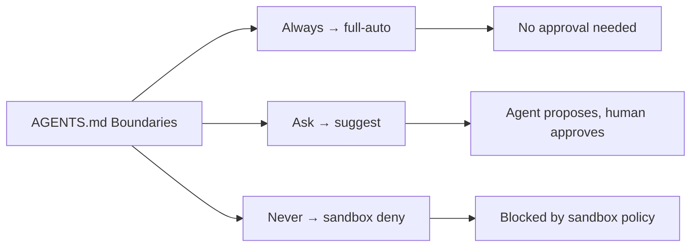
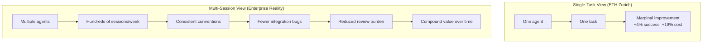

# What the ETH Zurich Paper Gets Wrong (and Right) About AGENTS.md


---

In February 2026, researchers at ETH Zurich published a paper that sent shockwaves through the AI-assisted development community: *"Evaluating AGENTS.md: Are Repository-Level Context Files Helpful for Coding Agents?"* [^1]. The headline finding — that LLM-generated AGENTS.md files **reduce** task success rates by 3% while inflating inference costs by over 20% — triggered a wave of "delete your AGENTS.md" hot takes. Meanwhile, GitHub's own analysis of 2,500+ repositories [^2] and a complementary study by Lulla et al. [^3] paint a far more nuanced picture.

This article dissects what the ETH Zurich paper actually tested, where its methodology breaks down, and how to apply its lessons to write AGENTS.md files that genuinely improve Codex CLI workflows.

## The Paper's Claims

Gloaguen, Mündler, Müller, Raychev, and Vechev tested coding agents across two complementary settings [^1]:

1. **SWE-bench tasks** from popular repositories, with LLM-generated context files
2. **AGENTbench** — a novel benchmark of 138 instances drawn from 12 Python repositories that already contained developer-committed context files, filtered from 5,694 real GitHub pull requests

The results, tested across Claude 3.5 Sonnet, GPT-5.2, GPT-5.1 mini, and Qwen Code [^1]:

| Scenario | Task Success Δ | Cost Δ |
|---|---|---|
| LLM-generated context file | −3% | +20–23% |
| Human-written context file | +4% | +19% |
| No context file (baseline) | — | — |

The paper's core recommendation: omit LLM-generated context files entirely, and restrict human-written instructions to "non-inferable details" such as custom build commands or niche tooling specifics [^1].

## What the Paper Gets Right

### LLM-Generated Context Files Are Mostly Noise

The finding that auto-generated AGENTS.md files hurt performance is both robust and actionable. When an LLM generates a context file by scanning a repository, it produces generic boilerplate — architecture overviews, coding standards, testing requirements — that the agent could infer from the codebase itself [^4]. The result is redundant context that consumes tokens and introduces rigid instruction-following behaviour, with agents performing unnecessary exploration steps rather than solving the task directly [^1].

This aligns with the Codex CLI team's own guidance: "one real snippet showing your style beats three paragraphs describing it" [^5]. If a context file merely restates what's already in `package.json`, `pyproject.toml`, and the test directory structure, it's dead weight.

### Cost Awareness Matters

The 19–23% cost increase is significant. Even when human-written files improved success rates by 4%, the agents took more steps to get there [^1]. For teams running Codex CLI at scale — particularly with `--full-auto` or in CI pipelines — this cost-quality trade-off deserves careful monitoring.

### Keep It Short

The paper's implicit lesson: brevity wins. Codex CLI enforces this structurally with its `project_doc_max_bytes` setting, which defaults to 32 KiB [^5]. If your combined AGENTS.md chain exceeds that, the furthest files are silently dropped. The ETH Zurich findings provide empirical backing for this design decision.

## What the Paper Gets Wrong

### The Benchmark Tests Generic Files on Niche Repositories

AGENTbench's 12 repositories — including ragas, smolagents, openai-agents-python, transformers, tinygrad, and wagtail [^1] — are all well-documented open-source Python projects. These codebases have extensive READMEs, inline docstrings, comprehensive test suites, and active communities producing searchable context. An AGENTS.md file that restates this already-available information is, predictably, redundant.

The enterprise reality is different. Corporate monorepos with proprietary build systems, custom linting rules, internal package registries, and domain-specific conventions lack this ambient documentation. The information gap that AGENTS.md fills is vastly wider.

### Single-Task Success ≠ Multi-Session Consistency

The paper measures single-task completion on isolated issues. It cannot capture the compound value of AGENTS.md in multi-session, multi-agent workflows where **consistency** matters more than any individual task's success rate.

Consider a team of five engineers, each running Codex CLI sessions throughout the day. Without shared AGENTS.md guidance, each session independently discovers (or fails to discover) that the project uses `pnpm` not `npm`, that tests require a running Docker Compose stack, or that database migrations must go through Atlas. With AGENTS.md, every session starts from the same baseline.

Over 60,000 repositories on GitHub have adopted AGENTS.md [^6], and teams report 35–55% fewer agent-generated bugs after implementation [^6] — a metric the paper's single-task benchmark cannot capture.

### It Conflates Poor-Quality Context with Context Itself

As the ClawSouls analysis argues [^4], the paper tested *flawed context*, not the concept of context files. Both the LLM-generated files and the existing developer-committed files in AGENTbench repositories contained excessive information: "architecture overviews, coding standards, testing requirements, style guides — all loaded into every task regardless of relevance" [^4].

The question is not whether context helps, but whether *targeted, minimal* context helps. The Lulla et al. study [^3] answers this directly: focused AGENTS.md files reduced median agent runtime by 28.64% and output token consumption by 16.58%, while maintaining comparable task completion behaviour. The key difference? Their context files contained only actionable instructions relevant to the task at hand.

## The Three-Tier Boundary Pattern

GitHub's analysis of 2,500+ repositories [^2] identifies a pattern that the ETH Zurich paper's methodology entirely misses: the **three-tier boundary model**. The most effective AGENTS.md files define:

1. **Always do** — invariant rules (`Run pnpm test before submitting changes`)
2. **Ask first** — operations requiring human judgement (`Before changing database schema`)
3. **Never do** — hard constraints (`Never commit .env files, API keys, or secrets`)

This maps directly to Codex CLI's approval modes [^7]:



The boundary pattern's value is not captured by task success metrics. Its purpose is **risk reduction** — preventing the catastrophic failures (committed secrets, dropped databases, force-pushed to main) that a 4% success rate improvement cannot offset. "Never commit secrets" was the single most common constraint across all 2,500+ analysed repositories [^2], and for good reason: an agent without this boundary will happily commit your `.env` if it thinks that helps solve the task.

## How to Write AGENTS.md That Actually Helps

Synthesising the ETH Zurich findings, the GitHub analysis, and the Lulla et al. study, here are evidence-backed guidelines:

### 1. Document Only the Non-Obvious

The paper is right that restating inferable information wastes tokens. Focus on:

- **Custom build commands** with exact flags (`make build-wasm GOARCH=wasm`)
- **Non-standard test runners** (`pytest --cov=src --cov-fail-under=80 -x`)
- **Internal conventions** that contradict community defaults
- **Domain-specific terminology** the agent cannot Google

### 2. Use the Hierarchy

Codex CLI walks from `~/.codex/AGENTS.md` → repo root → current directory [^5]. Use this:

```
~/.codex/AGENTS.md          # Personal defaults (editor prefs, global linting)
repo/AGENTS.md               # Repo-wide conventions (test framework, CI rules)
repo/services/payments/AGENTS.override.md  # Team-specific overrides
```

Start with a single file. Split only when it exceeds 150–200 lines [^5].

### 3. Commands First, Prose Second

The GitHub analysis found that top-performing AGENTS.md files front-load executable commands [^2]:

```markdown
## Commands
- Test: `pnpm test --run`
- Lint: `pnpm lint --fix`
- Build: `pnpm build`
- Type check: `pnpm tsc --noEmit`

## Boundaries
- Always: run tests before committing
- Never: modify migration files directly; use `atlas migrate diff`
```

### 4. Show, Don't Tell

One real code snippet demonstrating your style is worth more than a paragraph describing it [^5]:

```markdown
## Code Style
Prefer early returns:
```typescript
// ✅ Do this
function process(input: string | null): Result {
  if (!input) return Result.empty()
  return transform(input)
}

// ❌ Not this
function process(input: string | null): Result {
  if (input) {
    return transform(input)
  } else {
    return Result.empty()
  }
}
```

```

### 5. Set Boundaries, Not Aspirations

Avoid vague instructions like "write clean code" or "follow best practices". Instead, define concrete constraints the agent can mechanically verify [^2]:

```markdown
## Boundaries
### Never
- Commit files matching `*.env*`, `*credentials*`, `*secret*`
- Run `DROP TABLE` or `DELETE FROM` without a WHERE clause
- Push to `main` or `production` branches

### Ask First
- Add new npm dependencies
- Change database schema
- Modify CI/CD pipeline configuration
```

## The Compound Value Thesis

The ETH Zurich paper asks: "Does AGENTS.md help an agent solve this one task?" The answer, for well-documented open-source repositories, is "marginally." But that is the wrong question for most engineering teams.

The right question is: "Does AGENTS.md help five agents, across fifty sessions per day, maintain consistent behaviour in a proprietary codebase over six months?" The paper's methodology cannot answer this, but the enterprise adoption data suggests the answer is yes [^6].



## Practical Takeaways

| Recommendation | Evidence |
|---|---|
| Delete LLM-generated AGENTS.md files | ETH Zurich: −3% success, +20% cost [^1] |
| Keep human-written files short and actionable | Lulla et al.: −28% runtime, −16% tokens [^3] |
| Front-load commands, use code examples | GitHub: top pattern across 2,500 repos [^2] |
| Define three-tier boundaries | GitHub: most common pattern in effective files [^2] |
| Split files only when >150 lines | Codex CLI docs: 32 KiB combined limit [^5] |
| Test your AGENTS.md with `codex --ask-for-approval never "Summarise instructions"` | Codex CLI official verification method [^5] |

The ETH Zurich paper is a valuable contribution — it provides the first rigorous evidence that bloated, auto-generated context files are actively harmful. But its conclusion that AGENTS.md is generally unhelpful conflates a specific failure mode (information-redundant context on well-documented repositories) with the broader practice of providing structured guidance to coding agents. Write less, write better, and verify what your agent actually reads.

## Citations

[^1]: Gloaguen, T., Mündler, N., Müller, M., Raychev, V., & Vechev, M. (2026). "Evaluating AGENTS.md: Are Repository-Level Context Files Helpful for Coding Agents?" arXiv:2602.11988. [https://arxiv.org/abs/2602.11988](https://arxiv.org/abs/2602.11988)

[^2]: Nigh, M. (2025). "How to write a great agents.md: Lessons from over 2,500 repositories." GitHub Blog. [https://github.blog/ai-and-ml/github-copilot/how-to-write-a-great-agents-md-lessons-from-over-2500-repositories/](https://github.blog/ai-and-ml/github-copilot/how-to-write-a-great-agents-md-lessons-from-over-2500-repositories/)

[^3]: Lulla, K. et al. (2026). "On the Impact of AGENTS.md Files on the Efficiency of AI Coding Agents." arXiv:2601.20404. [https://arxiv.org/abs/2601.20404](https://arxiv.org/abs/2601.20404)

[^4]: ClawSouls Blog. (2026). "New Study Says AGENTS.md Makes AI Worse — But There's a Catch." [https://blog.clawsouls.ai/en/posts/agents-md-hurts-or-helps/](https://blog.clawsouls.ai/en/posts/agents-md-hurts-or-helps/)

[^5]: OpenAI. (2026). "Custom instructions with AGENTS.md – Codex." OpenAI Developer Docs. [https://developers.openai.com/codex/guides/agents-md](https://developers.openai.com/codex/guides/agents-md)

[^6]: AIMultiple Research. (2026). "Agents.md: A Machine-Readable Alternative to README." [https://research.aimultiple.com/agents-md/](https://research.aimultiple.com/agents-md/)

[^7]: OpenAI. (2026). "Agent approvals & security – Codex." OpenAI Developer Docs. [https://developers.openai.com/codex/agent-approvals-security](https://developers.openai.com/codex/agent-approvals-security)
