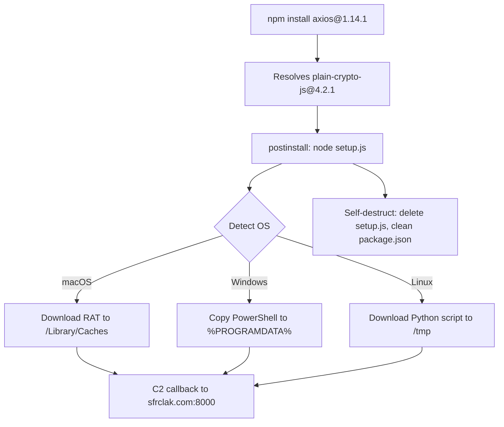
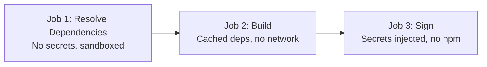

# The Axios Supply Chain Attack: How a North Korean Compromise Reached Codex CLI's macOS Signing Pipeline


---

On March 31, 2026, a North Korean threat actor compromised Axios — the JavaScript HTTP client with over 70 million weekly npm downloads — and injected a remote access trojan into versions 1.14.1 and 0.30.4 [^1]. Within hours, the malicious code executed inside an OpenAI GitHub Actions workflow that controlled macOS code-signing for ChatGPT Desktop, the Codex App, Codex CLI, and Atlas [^2]. OpenAI disclosed the incident on April 11 and began revoking the affected certificate [^3].

This article dissects the attack, explains what it means for Codex CLI users, and extracts defensive patterns that every team shipping agent plugins or running CI/CD pipelines should adopt immediately.

## The Attack Timeline

The compromise unfolded with surgical precision across an 18-hour window [^4]:

| Time (UTC) | Event |
|---|---|
| 2026-03-30 05:57 | `plain-crypto-js@4.2.0` published as a clean decoy package |
| 2026-03-30 23:59 | Malicious `plain-crypto-js@4.2.1` released with obfuscated dropper |
| 2026-03-31 00:21 | `axios@1.14.1` published via hijacked maintainer account |
| 2026-03-31 01:00 | `axios@0.30.4` published (targeting both release branches) |
| 2026-03-31 ~03:15 | npm unpublished both malicious Axios versions |
| 2026-03-31 03:25–04:26 | Security holder stub replaced `plain-crypto-js` |

The critical exposure window was approximately 2–3 hours per malicious version [^4].

## How the Attack Worked

The attack exploited a phantom dependency mechanism. Malicious Axios versions declared a dependency on `plain-crypto-js`, which mimicked the legitimate `crypto-js` library — all 56 cryptographic source files were byte-for-bit identical to the real package [^4]. The single weaponised element was a `postinstall` script:

```json
{
  "scripts": {
    "postinstall": "node setup.js"
  }
}
```

On execution, `setup.js` ran a two-layer obfuscated dropper that detected the operating system and downloaded platform-specific RAT payloads from `sfrclak.com:8000` [^4]:

- **macOS**: Binary at `/Library/Caches/com.apple.act.mond`, executed via AppleScript
- **Windows**: PowerShell copied to `%PROGRAMDATA%\wt.exe`, executed via VBScript
- **Linux**: Python script at `/tmp/ld.py`, launched via `nohup`

After execution, `setup.js` self-destructed and replaced `package.json` with a clean stub — meaning `npm audit` showed nothing post-infection [^4].



## Attribution

Google Threat Intelligence Group attributed the attack to UNC1069, a financially motivated North Korea-nexus threat actor active since at least 2018 [^5]. Microsoft Threat Intelligence independently attributed the same infrastructure to Sapphire Sleet, their designation for the same North Korean state actor [^1]. The attack formed part of a broader campaign targeting Node.js maintainers through social engineering.

## How OpenAI Was Affected

OpenAI's macOS app-signing pipeline used a GitHub Actions workflow that downloaded Axios as a dependency. During the 2–3 hour exposure window on March 31, this workflow executed the malicious `axios@1.14.1`, which had access to code-signing certificates and Apple notarisation material [^2].

### The Root Cause: Floating Tags

OpenAI identified the fundamental vulnerability as a CI/CD misconfiguration [^2][^6]:

> "The action in question used a floating tag, as opposed to a specific commit hash, and did not have a configured `minimumReleaseAge` for new packages."

This meant newly published npm packages were automatically resolved at build time without any cooling-off period — precisely the pattern the attackers exploited.

### What Was at Risk

The signing certificate could theoretically have been used to sign malicious macOS binaries that would pass Gatekeeper verification. OpenAI's analysis concluded the certificate was "likely not successfully exfiltrated" due to the timing of payload execution relative to certificate injection in the job [^2]. Nevertheless, OpenAI treated the certificate as compromised out of an abundance of caution.

### Affected Products and Minimum Safe Versions

OpenAI rotated its macOS code-signing certificate and rebuilt all affected applications [^3][^7]:

| Product | Minimum Safe Version |
|---|---|
| ChatGPT Desktop | 1.2026.051 |
| Codex App | 26.406.40811 |
| **Codex CLI** | **0.119.0** |
| Atlas | 1.2026.84.2 |

Older versions will no longer receive updates or support starting **May 8, 2026** [^7]. macOS users should verify their installed version immediately:

```bash
codex --version
# Must be >= 0.119.0
```

## Lessons for Codex CLI Users and Plugin Authors

This incident crystallises several defensive patterns that apply directly to anyone building or consuming Codex CLI plugins, skills, and CI/CD pipelines.

### 1. Pin Dependencies to Exact Versions and Commit SHAs

Only 3.9% of GitHub repositories pin 100% of their third-party Actions to immutable commit SHAs [^8]. The OpenAI incident proves this is not an academic concern:

```yaml
# BAD: floating tag — attacker can push malicious code under same tag
- uses: actions/checkout@v4

# GOOD: pinned to immutable commit SHA
- uses: actions/checkout@b4ffde65f46336ab88eb53be808477a3936bae11 # v4.1.1
```

For npm dependencies, use lockfiles with integrity hashes and configure `minimumReleaseAge` (available in npm v11.10+, pnpm, Yarn, and Bun) to enforce a cooling-off period before adopting newly published packages [^4]:

```bash
# npm v11.10+
npm config set minimumReleaseAge 7d
```

### 2. Audit What Ships in Your Plugin Packages

The article on source map incidents (backlog #208) already covered `.npmignore` hygiene. This incident reinforces the point with higher stakes. For Codex CLI plugin authors:

```bash
# Always verify what npm will publish BEFORE publishing
npm pack --dry-run

# Use the files field in package.json for allowlist (safer than .npmignore blocklist)
```

Prefer the `files` allowlist in `package.json` over `.npmignore` — an allowlist cannot accidentally include new sensitive files added later.

### 3. Isolate Signing and Secrets from Dependency Resolution

The core architectural lesson: never run `npm install` (or any dependency resolution) in the same job that has access to signing certificates, deployment keys, or production secrets. Separate dependency resolution into a prior job with no secret access:



### 4. Use Codex CLI's Built-In Security Features

Codex CLI's own sandbox and hook system provides layers that would have contained this class of attack if it had reached a developer workstation:

```toml
# config.toml — restrict network access
[permissions.network]
allowed_domains = ["api.openai.com", "registry.npmjs.org"]

# Sandbox mode prevents arbitrary binary execution
sandbox_mode = "workspace-write"
```

A `PreToolUse` hook can block execution of unfamiliar binaries:

```bash
#!/bin/bash
# hooks/pre-tool-use.sh — block execution outside known paths
COMMAND=$(echo "$STDIN_JSON" | jq -r '.tool_input.command // empty')
if echo "$COMMAND" | grep -qE '(/Library/Caches|/tmp/ld\.py|%PROGRAMDATA%)'; then
  echo '{"decision": "reject", "reason": "Suspicious binary path detected"}'
  exit 0
fi
echo '{"decision": "allow"}'
```

### 5. Configure Dependabot for SHA Pinning

GitHub's Dependabot can automatically update pinned SHAs when new versions are released, eliminating the maintenance burden of manual pinning [^8]:

```yaml
# .github/dependabot.yml
version: 2
updates:
  - package-ecosystem: "github-actions"
    directory: "/"
    schedule:
      interval: "weekly"
```

## Detection: How to Check if You Were Affected

If your CI/CD or development machines ran `npm install` between 00:21 and 03:15 UTC on March 31, 2026, check for these indicators of compromise [^4]:

**Definitive signals:**

- `node_modules/plain-crypto-js/` directory present (never a legitimate Axios dependency)
- Outbound connections to `sfrclak.com` (IP: `142.11.206.73`, port 8000)
- File artefacts: `/Library/Caches/com.apple.act.mond` (macOS), `%PROGRAMDATA%\wt.exe` (Windows), `/tmp/ld.py` (Linux)
- `package-lock.json` entries referencing `plain-crypto-js@4.2.1`

**Remediation if compromised:**

1. Isolate the machine from the network immediately
2. Inventory all local credentials before wiping
3. Rotate every secret, token, and SSH key that was accessible
4. Reformat and rebuild from a clean state
5. Review access logs for anomalous activity post-compromise

## The Broader Pattern: Why This Matters for Agentic Coding

AI coding agents amplify supply chain risk in two ways. First, they generate code that pulls in dependencies — an agent adding `axios` to a project during the 3-hour window would have silently introduced the RAT. Second, agent CI/CD pipelines (like `openai/codex-action`) run `npm install` in automated contexts where no human reviews the dependency resolution output.

The Codex CLI ecosystem's shift toward plugins, skills, and MCP servers distributed via npm creates an expanding attack surface. Every `npm install` in a Codex CLI plugin's `postinstall` hook is a potential vector. The compound plugin pattern — bundling skills, MCP servers, and hooks into a single distributable package — means a single compromised dependency can inject itself into the agent's tool surface, approval pipeline, and execution environment simultaneously.

OpenAI's response was textbook: detect, contain, rotate, disclose. But the root cause — a floating tag in a GitHub Actions workflow — is a pattern that exists in thousands of CI/CD pipelines today. The question is not whether your pipeline will be targeted, but whether your defences are in place when it is.

## Citations

[^1]: [Microsoft Security Blog — Mitigating the Axios npm supply chain compromise](https://www.microsoft.com/en-us/security/blog/2026/04/01/mitigating-the-axios-npm-supply-chain-compromise/) (April 1, 2026)

[^2]: [Socket.dev — Axios Supply Chain Attack Reaches OpenAI macOS Signing Pipeline](https://socket.dev/blog/axios-supply-chain-attack-reaches-openai-macos-signing-pipeline-forces-certificate-rotation) (April 2026)

[^3]: [CNBC — OpenAI identifies security issue involving third-party tool](https://www.cnbc.com/2026/04/11/openai-identifies-security-issue-involving-third-party-tool.html) (April 11, 2026)

[^4]: [StepSecurity — Axios Compromised on npm: Malicious Versions Drop Remote Access Trojan](https://www.stepsecurity.io/blog/axios-compromised-on-npm-malicious-versions-drop-remote-access-trojan) (April 2026)

[^5]: [The Hacker News — Google Attributes Axios npm Supply Chain Attack to North Korean Group UNC1069](https://thehackernews.com/2026/04/google-attributes-axios-npm-supply.html) (April 2026)

[^6]: [SC Media — OpenAI's macOS app-signing process hit by Axios supply chain attack](https://www.scworld.com/news/openais-macos-app-signing-process-hit-by-axios-supply-chain-attack) (April 2026)

[^7]: [CyberSecurity News — OpenAI Warns macOS Users to Update ChatGPT and Codex Immediately](https://cybersecuritynews.com/openai-macos-users/) (April 2026)

[^8]: [StepSecurity — Pinning GitHub Actions for Enhanced Security: A Complete Guide](https://www.stepsecurity.io/blog/pinning-github-actions-for-enhanced-security-a-complete-guide) (2026)
