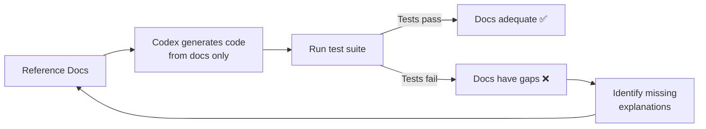
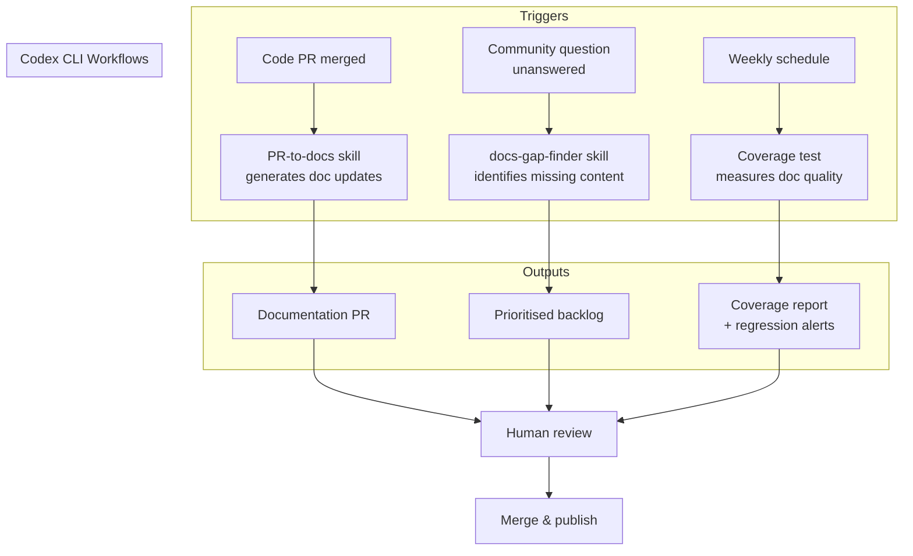

# Codex CLI for Documentation at Scale: How Dagster Labs Turned Docs into a Feedback Loop


Documentation is the perennial grind of open-source maintenance. It rots faster than code, scales worse than tests, and nobody volunteers to write it. Dagster Labs — the team behind the 14.3K-star data orchestration framework [^1] — found a way to turn Codex CLI into a documentation force multiplier without adding headcount. Their approach, documented in an official OpenAI case study [^2] and expanded in an All Things Open article [^3], offers patterns that any team maintaining technical documentation can steal.

This article dissects Dagster's methodology and maps it onto practical Codex CLI workflows you can adopt today.

## The Documentation Problem at Scale

Dagster produces technical educational content for data engineers, ML engineers, and analysts [^2]. Their monorepo contains framework code, documentation, and examples side by side — a deliberate architectural choice that pays dividends when agents enter the picture. After receiving community feedback about documentation gaps, the team ran a content audit, rebuilt their information architecture around the software development lifecycle, and migrated to Docusaurus [^3].

The result: layered content for different personas — reference docs, copy-pasteable examples, real-world pipeline implementations, blog posts, an e-book, and courses with tens of thousands of completions [^3]. But maintaining this breadth with a small team required a new approach.

Their custom "Ask AI" assistant, backed by Dagster docs, GitHub issues, and community discussions, now answers more than 16,000 community questions per month [^3] — and the queries that fail become a feedback signal for documentation gaps.

## The Scaffolding Principle

Dagster's core insight is deceptively simple: **Codex is only as good as the scaffolding you give it** [^2].

They revamped their `CONTRIBUTING.md` to establish clear hierarchies and best practices — link formatting standards, API documentation conventions, consistent naming patterns. This structured approach benefits human contributors and AI systems equally.

In Codex CLI terms, this maps directly to the AGENTS.md constitution pattern. A documentation-focused AGENTS.md might look like this:

```toml
# .codex/config.toml — documentation profile
[profiles.docs]
model = "gpt-5.4"
model_reasoning_effort = "high"
```

```markdown
<!-- AGENTS.md for a documentation-heavy repo -->
# Documentation Standards

## Writing Conventions
- British English spelling throughout
- Full paths over relative links in all documentation
- API names in backticks: `asset`, `op`, `schedule`
- Every code example must be runnable — no pseudocode in tutorials

## Verification Commands
- `make docs-build` — build documentation site
- `make docs-lint` — check for broken links and formatting
- `pytest examples/ -x` — verify all code examples execute

## File Organisation
- Reference docs: `docs/reference/`
- Tutorials: `docs/tutorials/`
- Examples: `examples/` (monorepo root)
- Blog source: `docs/blog/`

## Rules
- Never modify API signatures without updating corresponding reference docs
- Always verify cross-references with `make docs-lint` after changes
- When adding a new API, create both reference and tutorial entries
```

This AGENTS.md gives Codex CLI the structural awareness to make documentation contributions that follow project conventions — the same principle Dagster discovered through their `CONTRIBUTING.md` revamp [^2].

## Five Workflows That Scale Documentation

### 1. PR-to-Docs Automation

Dagster's most immediately transferable pattern: when a code PR lands, Codex reviews the diff and generates corresponding documentation updates [^2].

Their concrete example is instructive — Codex reviewed PR #32557, identified new gRPC environment variables, and automatically produced documentation update PR #32558 [^2]. The workflow uses GitHub CLI integration:

```bash
# Interactive session: PR-to-docs workflow
codex

# Then in the session:
# "Review the diff from PR #32557 using `gh pr diff 32557`.
#  Identify any new configuration options, environment variables,
#  or API changes. Generate documentation updates for each,
#  following the conventions in CONTRIBUTING.md."
```

For automation via `codex exec`:

```bash
codex exec --full-auto \
  --json \
  -c model=gpt-5.4 \
  "Review the diff from the last merged PR on main using \
   gh log -1 --format='%H' | xargs gh pr list --search. \
   Identify new public APIs or configuration options. \
   Update the corresponding documentation files. \
   Run make docs-lint to verify."
```

### 2. Content Translation Across Mediums

Dagster translates educational content between formats whilst maintaining technical accuracy [^2]:

- Blog posts → YouTube video transcripts
- Tutorials → abstract blog content
- Example projects → professional video scripts

Their example: generating a 335-line video transcript from the Modal Pipes example project, structured with sections and code snippets [^2].

A Codex CLI skill for this pattern:

```markdown
<!-- .agents/skills/content-translate/SKILL.md -->
---
name: content-translate
description: >
  Translate technical content between formats (blog→video script,
  tutorial→abstract, example→walkthrough). Use when converting
  existing documentation into a different medium.
---

# Content Translation Skill

## Process
1. Read the source content completely
2. Identify the core technical concepts and their dependencies
3. Restructure for the target medium's conventions:
   - **Video script**: Sections with timestamps, speaker cues, code display notes
   - **Blog post**: Introduction hook, progressive disclosure, conclusion
   - **Abstract**: Problem statement, approach, key findings, implications
4. Preserve all technical accuracy — verify API names, version numbers, config keys
5. Add medium-appropriate transitions and framing

## Output Format
Produce the translated content in a single markdown file with clear section headers.
```

### 3. Documentation Coverage Testing

This is Dagster's most innovative pattern — treating Codex as a **proxy for human understanding** [^2].

The methodology:

1. Use reference documentation as the sole source of truth
2. Prompt Codex to generate working code from the docs alone — no access to framework source
3. Execute the project's test suite against the generated code
4. If Codex can produce working code from the docs, humans likely can too



This creates a measurable, repeatable feedback loop. In `codex exec` terms:

```bash
# Documentation coverage test
codex exec --full-auto \
  --sandbox read-only \
  --output-schema '{"type":"object","properties":{"coverage_score":{"type":"number"},"gaps":{"type":"array","items":{"type":"string"}},"working_examples":{"type":"integer"},"failed_examples":{"type":"integer"}},"required":["coverage_score","gaps","working_examples","failed_examples"],"additionalProperties":false}' \
  "You are testing documentation completeness. Read ONLY the files \
   in docs/reference/ and docs/tutorials/. Do NOT read source code. \
   Based solely on the documentation, write implementations for \
   the 5 most common user workflows. Run the test suite against \
   each. Report which succeeded and which failed, with specific \
   documentation gaps that caused failures."
```

The structured output schema makes this automatable in CI/CD — run it weekly, track the `coverage_score` over time, and alert when it drops.

### 4. Monorepo Documentation Coherence

Dagster's monorepo architecture — code, documentation, and examples in a single repository — gives Codex complete contextual access [^2]. The `@` file reference syntax in Codex CLI enables targeted exploration across these boundaries:

```
# In an interactive Codex session
@examples/modal_pipes/main.py @docs/tutorials/modal-integration.md

"Compare the example implementation with the tutorial.
 Identify any API calls in the example that aren't explained
 in the tutorial. Flag any tutorial steps that reference
 deprecated methods."
```

This cross-referencing pattern catches documentation drift — the slow divergence between what the code does and what the docs say it does.

### 5. Community Feedback Loop

Dagster's 16,000 monthly AI-answered community questions [^3] generate a signal about where documentation falls short. Questions the AI cannot answer from existing docs become documentation tickets.

You can replicate this pattern with a Codex CLI skill that analyses support channels:

```markdown
<!-- .agents/skills/docs-gap-finder/SKILL.md -->
---
name: docs-gap-finder
description: >
  Analyse community questions from GitHub Discussions or issue
  trackers to identify documentation gaps. Use when planning
  documentation sprints or prioritising content.
---

# Documentation Gap Finder

## Process
1. Fetch recent GitHub Discussions tagged "question" using `gh`
2. Categorise questions by topic area
3. For each category, check whether existing docs address the question
4. Rank gaps by frequency and user impact
5. Output a prioritised list of documentation improvements

## Output
Markdown table with columns: Topic, Question Count, Current Coverage, Recommended Action
```

## The Documentation Workflow Architecture

Combining these patterns into an end-to-end documentation pipeline:



## Automating the Pipeline with codex exec

For teams running CI/CD, the documentation pipeline can be a GitHub Action:


```yaml
# .github/workflows/docs-coverage.yml
name: Documentation Coverage
on:
  schedule:
    - cron: '0 6 * * 1'  # Weekly Monday 6am
  pull_request:
    paths:
      - 'src/**'
      - 'docs/**'

jobs:
  docs-coverage:
    runs-on: ubuntu-latest
    steps:
      - uses: actions/checkout@v4
      - uses: openai/codex-action@v1
        with:
          openai-api-key: ${{ secrets.OPENAI_API_KEY }}
          prompt-file: .codex/prompts/docs-coverage-test.md
          sandbox: read-only
          model: gpt-5.4
          codex-args: >
            --output-schema '{"type":"object","properties":{
              "score":{"type":"number"},
              "gaps":{"type":"array","items":{"type":"string"}}
            },"required":["score","gaps"],"additionalProperties":false}'
```


## The Report-First Principle

A critical lesson from both the Dagster case study and OpenAI's own Agents SDK maintenance blog [^4]: documentation skills should **report first, edit second**.

The Agents SDK team's `docs-sync` skill inspects artefacts, prioritises findings, and requests approval before making edits [^4]. This prevents the agent from confidently rewriting documentation in ways that are technically correct but stylistically wrong or contextually inappropriate.

In Codex CLI, this maps to using `suggest` approval mode for documentation work:

```toml
# .codex/config.toml
[profiles.docs]
approval_policy = "suggest"
model_reasoning_effort = "high"
```

The agent proposes changes; the human reviews. For documentation, this is almost always the right trade-off — the cost of a wrong API example reaching users far exceeds the time saved by full automation.

## Measuring Documentation Quality Over Time

Dagster's coverage testing methodology produces a quantifiable metric. Combined with `codex exec` structured output, you can track documentation health as a time series:

| Week | Coverage Score | Gaps Found | Examples Working | Examples Failed |
|------|---------------|------------|------------------|-----------------|
| W14  | 78%           | 7          | 23               | 6               |
| W15  | 82%           | 5          | 25               | 5               |
| W16  | 85%           | 4          | 27               | 5               |
| W17  | 91%           | 2          | 29               | 3               |

This data makes documentation investment visible to engineering leadership — the same visibility that test coverage dashboards provide for code quality.

## When This Pattern Breaks Down

The coverage testing methodology has limits:

- **Implicit knowledge**: some APIs require understanding of domain concepts that documentation cannot practically convey in a reference page
- **Integration complexity**: multi-service workflows may pass single-doc coverage tests but fail when composed
- **Model capability ceiling**: if Codex cannot implement a workflow from perfect docs, the test produces false negatives
- ⚠️ **Version sensitivity**: documentation coverage scores may shift significantly between model versions without any documentation changes, as model capabilities affect the proxy measurement

## Comparison with Other Documentation Approaches

The docs-as-code movement has produced several AI-adjacent tools. Mintlify [^5] offers AI-native documentation with an Autopilot agent that updates docs from PR diffs — similar to Dagster's pattern but as a SaaS product rather than a Codex CLI workflow. Swimm [^6] pioneered code-coupled documentation where docs are linked to specific code snippets and automatically flag when those snippets change.

Codex CLI's advantage is flexibility: you own the workflow, the skills are version-controlled alongside your code, and you can compose documentation skills with your existing AGENTS.md, MCP servers, and subagent architecture. The trade-off is setup cost — Mintlify works out of the box, whilst a Codex CLI documentation pipeline requires the scaffolding investment Dagster describes.

## Key Takeaways

1. **Scaffolding matters more than prompting** — invest in AGENTS.md and CONTRIBUTING.md before writing documentation skills [^2]
2. **Monorepos win** — code and docs in one repository gives agents complete context for cross-referencing [^2]
3. **Test your docs like code** — use Codex as a proxy for human understanding to measure documentation completeness [^2]
4. **Report first, edit second** — documentation skills should propose changes for human review, not auto-commit [^4]
5. **Close the feedback loop** — community questions that AI cannot answer identify your next documentation priorities [^3]

Documentation at scale is not a writing problem — it is an information architecture problem. Get the structure right, give the agent clear conventions, and the content follows.

## Citations

[^1]: [Dagster GitHub repository — 14.3K stars](https://github.com/dagster-io/dagster)
[^2]: [Using Codex for education at Dagster Labs — OpenAI Developers Blog](https://developers.openai.com/blog/codex-for-documentation-dagster)
[^3]: [Scaling documentation without scaling your team: Dagster's AI-powered strategy — All Things Open](https://allthingsopen.org/articles/scaling-documentation-without-scaling-team-dagster)
[^4]: [Using skills to accelerate OSS maintenance — OpenAI Developers Blog](https://developers.openai.com/blog/skills-agents-sdk)
[^5]: [Mintlify — AI-native documentation platform](https://mintlify.com/)
[^6]: [Swimm — code-coupled documentation](https://swimm.io/)
