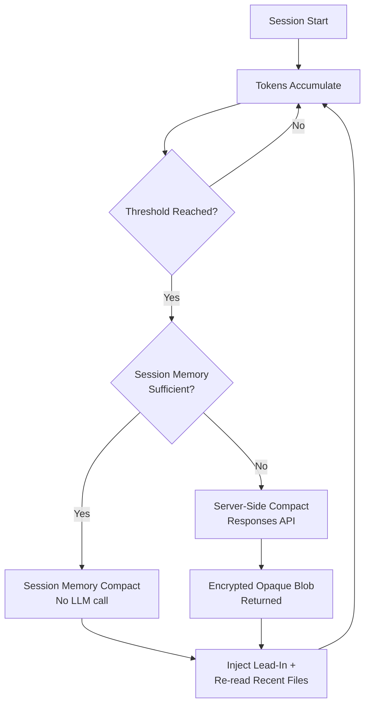
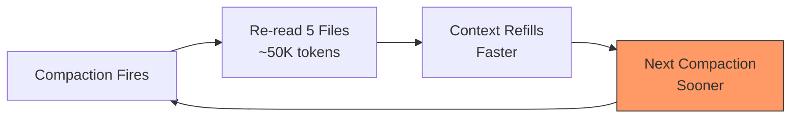
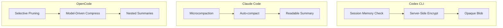

# Context Compaction Deep Dive: How Codex CLI, Claude Code, and OpenCode Manage Long Sessions


Long-running agentic coding sessions inevitably hit the context window ceiling. When a session's accumulated messages — prompts, tool calls, file reads, diffs, reasoning traces — exceed the model's context budget, performance degrades, costs spike, and the agent starts "forgetting" earlier work. Context compaction is the mechanism that prevents this collapse by summarising or compressing older conversation history while preserving enough state for the agent to continue coherently.

Every major agentic coding tool solves this problem differently. This article dissects the compaction architectures of Codex CLI, Claude Code, and OpenCode, compares their trade-offs, and provides practical configuration guidance for long-session workflows.

## The Core Problem: Context Window Saturation

A typical Codex CLI session working on a moderately complex feature — reading files, running tests, iterating on diffs — can consume 150,000–200,000 tokens within 20–30 minutes[^1]. With GPT-5.3-Codex's default 200,000-token context window, that leaves precious little headroom. The agent must either stop or compress.

The challenge is information loss. Every compaction discards detail. The question is *which* details to discard, *when* to trigger the compression, and *how* to preserve the model's understanding of prior work.



## Codex CLI: Server-Side Encryption and Session Memory

Codex CLI takes a distinctive approach: compaction is primarily a **server-side operation** that produces an opaque, AES-encrypted blob rather than a human-readable summary[^2].

### The Two-Tier Compaction Architecture

When the auto-compaction threshold is reached, Codex CLI follows a two-tier strategy[^3]:

1. **Session Memory Compact** — The system first checks whether structured information already stored in session memory (task state, file edit history, key decisions) can substitute for a full LLM summarisation call. Most auto-compactions take this path, avoiding an LLM call entirely.

2. **Server-Side Compact via Responses API** — If session memory is insufficient, Codex calls `POST /v1/responses/compact`, a proprietary endpoint that returns a `type=compaction` item containing an `encrypted_content` field[^4]. This opaque blob preserves the model's latent understanding of the conversation — tool call restoration data, internal state markers, and structured metadata — in a form that only OpenAI's servers can decrypt.

### The Encrypted Blob: Why Opacity Matters

The `encrypted_content` approach is architecturally unique among coding agents. When the blob is passed back to the Responses API in subsequent turns, the server decrypts it and assembles the model's context transparently[^2]. This design serves multiple purposes:

- **Tamper prevention** — users cannot modify the summary to manipulate the model's behaviour
- **Richer state preservation** — the blob likely contains more than a text summary: structured metadata, tool state, and reasoning traces that wouldn't survive a plain-text summary[^5]
- **Server-side optimisation** — OpenAI can iterate on their compression algorithm without client-side changes

### Auto-Compaction Threshold Calculation

The threshold is calculated as[^3]:

```
effective_window = model_context_window - min(max_output_tokens, 20000)
threshold = effective_window - 13000
```

For GPT-5.3-Codex with a 200,000-token context window, this yields approximately 167,000 tokens. You can override this in `config.toml`:

```toml
# Trigger compaction earlier to reduce quality degradation
model_auto_compact_token_limit = 150000
```

⚠️ **Known issue:** In v0.100.0+, Codex silently clamps user-defined thresholds to 90% of the context window, which can override explicit configuration[^6]. Check your effective threshold if you suspect compaction is triggering unexpectedly.

### The Post-Compaction Re-Read Cycle

After compaction, Codex injects a lead-in message ("This session continues from a previous conversation...") and automatically re-reads up to 5 recently edited files, with a total budget of 50,000 tokens (5,000 per file)[^3]. This ensures the agent has current code state, but it introduces a cost:



This re-read cycle became a serious regression in v0.118, where compaction began triggering approximately twice as frequently as in v0.116, creating a cascading loop that doubled or tripled token consumption for identical tasks[^7]. Projects with more than 100KB of essential context files (large API specs, architecture documents, analysis files) are disproportionately affected.

### Configuration Reference

| Key | Default | Purpose |
|-----|---------|---------|
| `model_auto_compact_token_limit` | Model-specific (e.g. 200K for GPT-5.3) | Token threshold for auto-compaction |
| `model_context_window` | Model-specific | Override detected context window size |

⚠️ Profile-scoped `model_auto_compact_token_limit` settings are currently ignored — only top-level config values apply[^8].

## Claude Code: Transparent Summaries with Custom Instructions

Claude Code takes a fundamentally different approach: compaction produces a **human-readable summary** that you can inspect and influence[^9].

### Three Compaction Mechanisms

Claude Code implements a three-tier system[^10]:

1. **Microcompaction** — offloads bulky tool results early, before the session approaches capacity. This is the cheapest intervention.
2. **Auto-compaction** — triggers when the session approaches the context limit. The API detects when input tokens exceed the configured threshold, generates a summary, and creates a `compaction` block.
3. **Manual compaction** — the `/compact` command lets you trigger compaction at a natural task boundary with optional focus instructions.

### Custom Instructions for Targeted Summaries

The killer feature is `/compact` with custom instructions[^11]:

```bash
/compact focus on the API changes and ignore the test refactoring
/compact summarise only the to-do items remaining
/compact preserve the database schema decisions
```

This matters because developers often know better than the system when the current point in the conversation is a safe place to summarise, and *what* to preserve. The recommendation from experienced Claude Code users is to compact at 60% context capacity — not 95% — to keep sessions sharp[^10].

### The CLAUDE.md Backstop

A critical insight from production use: never rely on compaction for rules the agent must always follow. Everything persistent belongs in `CLAUDE.md`[^12]. Compaction summaries are lossy by design; safety rules, coding standards, and project conventions should live in the persistent context file rather than hoping they survive compression.

## OpenCode: Surgical Pruning with Protected Outputs

OpenCode (formerly opencode-ai) takes a third approach: **selective pruning before summarisation**, with explicit protection rules[^13].

### The Compress Tool

Rather than a blunt threshold-based trigger, OpenCode exposes a `Compress` tool to the model itself, letting the agent decide when to activate based on task completion boundaries. The model can compress specific message ranges rather than the entire history.

### Stepped Governance Flow

OpenCode follows a principled escalation path[^13]:

1. **Pruning first** — remove tool outputs that are no longer relevant, but only when pruning can free more than 20,000 tokens (minor cleanups aren't worth the overhead)
2. **Protected zones** — the most recent 40,000 tokens are a "safety cushion" that cannot be touched; skill-type tool outputs are never pruned
3. **Nested compression** — when a new compression overlaps an earlier one, the earlier summary is nested inside the new one, preserving information through layers rather than diluting it away

### Compression Modes

| Mode | Behaviour |
|------|-----------|
| **Range** | Compresses a specific message range; overlapping ranges nest summaries |
| **Message** (experimental) | Compresses individual messages independently for surgical precision |

The Dynamic Context Pruning plugin extends this further with configurable thresholds (`minContextLimit`, `maxContextLimit`) that can be tuned for smaller context windows when using local models[^14].

## Cross-Tool Comparison



| Dimension | Codex CLI | Claude Code | OpenCode |
|-----------|-----------|-------------|----------|
| **Summary format** | Encrypted opaque blob | Human-readable text | Human-readable text |
| **Trigger** | Token threshold (auto) | Token threshold (auto) + manual | Model-driven + manual |
| **User control** | Limited (`/compact`) | Rich (`/compact [instructions]`) | Model decides timing |
| **Post-compact recovery** | Auto re-reads 5 files | No automatic re-read | Protected zones preserved |
| **LLM call required** | Often avoided (session memory) | Always for auto/manual | Only after pruning fails |
| **Custom focus** | Not supported | Supported | Not supported |
| **Inspectable** | No (encrypted) | Yes | Yes |

## Practical Strategies for Long Sessions

### 1. Compact at Task Boundaries, Not at Capacity

Don't wait for auto-compaction. Run `/compact` when you finish a logical unit of work — after merging a feature, after completing a refactoring pass, after debugging a test failure. The summary will be cleaner when the conversation has a natural stopping point[^10].

### 2. Front-Load Persistent Context in AGENTS.md

Move project conventions, architectural decisions, and safety rules into `AGENTS.md` (Codex CLI) or `CLAUDE.md` (Claude Code). These files are re-read on every turn and survive compaction intact. The more you put here, the less compaction needs to preserve[^12].

### 3. Tune the Threshold for Your Project

For projects with large essential context files (monorepos, API-heavy codebases), lower the auto-compaction threshold to 80–85% of context capacity:

```toml
# For a 200K context window, trigger at ~160K instead of ~167K
model_auto_compact_token_limit = 160000
```

This gives the post-compaction re-read cycle more headroom and reduces the cascading compaction problem[^7].

### 4. Use Sub-Agents for Isolated Work

Rather than accumulating everything in one session, delegate isolated tasks to sub-agents. Each sub-agent gets a fresh context window, and results are returned to the parent as concise summaries. This is architecturally superior to compaction for work that's naturally parallelisable[^15].

### 5. Monitor Your Token Burn Rate

Use `/status` in Codex CLI to check current token usage mid-session. If you see the context filling rapidly (especially after the v0.118 regression), consider:

- Running `/compact` proactively before the cascade starts
- Breaking the session with `/new` and resuming with `/resume`
- Reducing the number of large files the agent reads per turn

## What's Next for Compaction

The research community has identified 85–90% as the optimal auto-compaction threshold, noting that 95% (common in current implementations) is often too late[^1]. There's also growing interest in **selective compaction** — compressing only specific message ranges rather than the entire history — which OpenCode already supports and which is likely to influence future Codex CLI releases.

Issue #4106 on the Codex CLI repository tracks community requests for finer-grained control over auto-compaction parameters[^6], including per-profile thresholds and configurable re-read budgets. The v0.118 regression (issue #16812) has highlighted the fragility of the re-read cycle and may drive architectural changes to how post-compaction context is rebuilt[^7].

For now, the practical takeaway is clear: treat compaction as a tool, not a safety net. Compact early, compact with intent, and keep your persistent context files comprehensive.

## Citations

[^1]: [Context Compaction Research: Claude Code, Codex CLI, OpenCode, Amp](https://gist.github.com/badlogic/cd2ef65b0697c4dbe2d13fbecb0a0a5f) — Mario Zechner's cross-tool compaction research gist

[^2]: [How Codex Solves the Compaction Problem Differently](https://tonylee.im/en/blog/codex-compaction-encrypted-summary-session-handover/) — Tony Lee's investigation of Codex's encrypted compaction architecture

[^3]: [Shedding Heavy Memories: Context Compaction in Codex, Claude Code, and OpenCode](https://justin3go.com/en/posts/2026/04/09-context-compaction-in-codex-claude-code-and-opencode) — Justin3go's April 2026 cross-tool analysis

[^4]: [Unrolling the Codex agent loop](https://openai.com/index/unrolling-the-codex-agent-loop/) — Michael Bolin, OpenAI official blog on the Codex agent loop internals

[^5]: [Investigating how Codex context compaction works](https://simzhou.com/en/posts/2026/how-codex-compacts-context/) — Simon Zhou's reverse-engineering of Codex compaction internals

[^6]: [Control over auto-compaction parameters · Issue #4106](https://github.com/openai/codex/issues/4106) — Community feature request for configurable compaction parameters

[^7]: [Context compaction regression in CLI v0.118 · Issue #16812](https://github.com/openai/codex/issues/16812) — Bug report documenting 2× more frequent compactions causing token usage explosion

[^8]: [Support model_context_window/model_auto_compact_token_limit in profiles · Issue #14456](https://github.com/openai/codex/issues/14456) — Profile-scoped compaction settings currently ignored

[^9]: [Compaction — Claude API Docs](https://platform.claude.com/docs/en/build-with-claude/compaction) — Official Anthropic documentation on server-side compaction

[^10]: [Claude Code Compaction: How Context Compression Works](https://okhlopkov.com/claude-code-compaction-explained/) — Detailed analysis of Claude Code's three-tier compaction system

[^11]: [How to Use the /compact Command in Claude Code](https://www.mindstudio.ai/blog/claude-code-compact-command-context-management) — MindStudio guide on custom compaction instructions

[^12]: [How Claude Code works](https://code.claude.com/docs/en/how-claude-code-works) — Official Anthropic documentation on Claude Code architecture

[^13]: [Context Management and Compaction — OpenCode DeepWiki](https://deepwiki.com/sst/opencode/2.4-context-management-and-compaction) — DeepWiki analysis of OpenCode's compaction architecture

[^14]: [OpenCode Dynamic Context Pruning Plugin](https://github.com/Opencode-DCP/opencode-dynamic-context-pruning) — GitHub repository for OpenCode's configurable pruning plugin

[^15]: [Codex CLI Subagents: TOML Format, Parallelism and spawn_agents_on_csv](https://codex.danielvaughan.com/2026/03/26/codex-cli-subagents-toml-parallelism/) — Daniel Vaughan's guide to sub-agent delegation patterns
