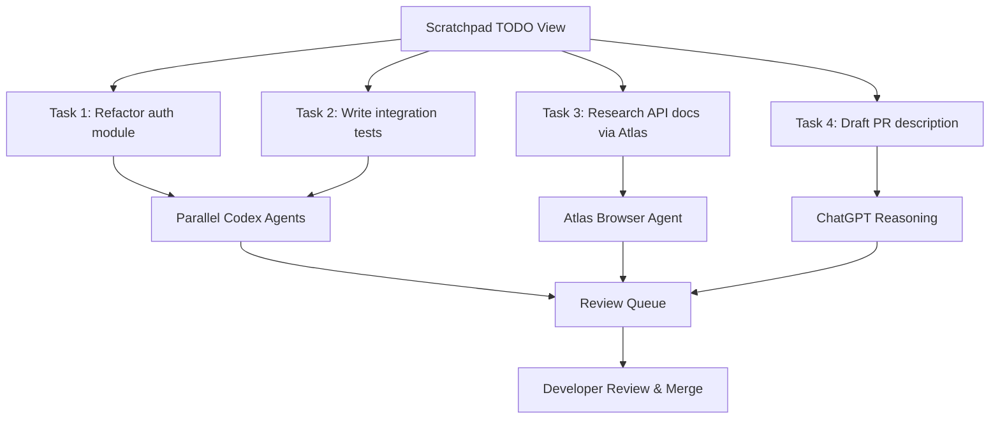
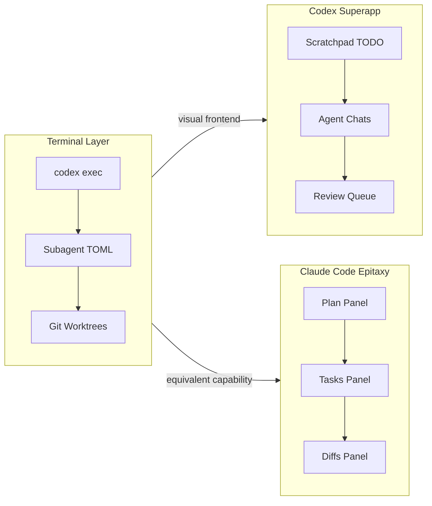

# The Desktop Superapp War: Codex Scratchpad vs Claude Code Epitaxy

The terminal is no longer enough. As of mid-April 2026, both OpenAI and Anthropic are racing to consolidate their fragmented tool ecosystems into unified desktop applications — and the design choices each company makes will reshape how developers interact with AI coding agents for the next twelve months.

## The Catalyst: Why Desktop Matters Now

Codex CLI crossed three million weekly active users on 8 April 2026[^1], with 70% month-over-month growth[^2]. Claude Code has become Anthropic's fastest-growing commercial product, contributing to an estimated \$2.5 billion in annualised revenue by early 2026[^3]. Both tools started in the terminal. Both are now expanding outward.

The reason is straightforward: terminal-based workflows hit a ceiling when developers run multiple agents in parallel. Monitoring six subagent threads via `/agent` in a single terminal session works, but it does not scale to the heterogeneous workflows that enterprise teams increasingly demand — code generation alongside web research alongside chat-based planning. The unit of competition has shifted from model benchmarks to developer workflow integration[^4].

## OpenAI's Strategy: The Codex Superapp

OpenAI's Head of Applications Fidji Simo and President Greg Brockman are leading the consolidation of three separate products — ChatGPT, the Codex coding platform, and the Atlas AI-powered web browser — into a single desktop application[^5]. In an internal memo, Simo wrote that spreading the company across too many apps had "slowed things down"[^6].

The implementation is staged. First, the Codex application gains agent-based features that extend beyond programming into broader productivity tasks. Only later will ChatGPT and Atlas integrate into the consolidated surface[^7].

### Scratchpad: The TODO-Driven Agent Launcher

The most significant new capability is **Scratchpad**, an experimental feature that lets users start multiple Codex chats from a TODO-style list view, executing them in parallel[^8]. This transforms the desktop app from a single-conversation interface into an orchestration surface.

Under the hood, a **heartbeat system** maintains persistent connections with long-running background tasks[^8] — infrastructure that mirrors what the open-source community built with OpenClaw. The heartbeat references suggest OpenAI is building support for managed agents: autonomous processes that run in the background, check in periodically, and execute multi-step workflows without constant user input[^8].

For CLI users, the Scratchpad is essentially a visual frontend for what `codex exec` and subagent TOML files already provide programmatically. The key difference is discoverability: a developer who would never write a custom `.codex/agents/researcher.toml` file might happily add items to a TODO list.

### Atlas Integration: Web Research as a First-Class Tool

The Atlas browser integration is arguably more consequential than the Scratchpad itself. Currently, Codex CLI's web research capability is limited to the `web_search` config option and MCP-based knowledge servers. Atlas would give the agent a full browser context — the ability to navigate documentation sites, read rendered pages, interact with web applications, and synthesise findings back into the coding workflow[^9].

This directly addresses a gap that the Codex CLI community has worked around using Playwright skills and browser-automation MCP servers, but never with the same fidelity as a purpose-built browsing agent.

## Anthropic's Response: Epitaxy

Anthropic's counter-move, internally codenamed **Epitaxy**, first surfaced in late March alongside the broader Claude Code source code leak[^4]. The overhaul brings sub-agent capabilities — already available in the CLI — into a structured, visual desktop interface.

### Coordinator Mode: Orchestration Without the Terminal

The centrepiece is **Coordinator Mode**, which lets Claude act as an orchestrator that delegates implementation work across parallel sub-agents whilst focusing on planning and synthesis[^4]. This is architecturally similar to Codex CLI's supervisor-mode sessions with multi-agent v2, but presented as a desktop-native experience rather than requiring TOML configuration files and terminal navigation.

### The Three-Panel Layout

Epitaxy adopts a **Cowork-style layout** with dedicated panels for:

- **Plan** — the agent's current strategy and task decomposition
- **Tasks** — sub-agent execution status, showing which workers are active
- **Diffs** — code changes ready for review[^4]

This layout solves the multi-agent visibility problem that CLI users currently address with tools like cmux (Ghostty-based notification rings) or OMX's HUD monitoring. Having plan, execution, and review surfaces side-by-side in a single window reduces the cognitive overhead of tracking parallel agents — the "toxic flow" problem where developers approve changes without reading them because the approval queue moves faster than comprehension[^10].

### Multi-Repository Support

Epitaxy introduces multi-repo support, addressing a longstanding limitation of single-session workflows[^4]. Codex CLI handles this through git worktrees and the `/agent` thread switcher, but neither approach provides a visual overview of which repositories are being modified by which agents.

## Architectural Comparison

The two approaches reveal fundamentally different product philosophies.

### Orchestration Model

OpenAI's Scratchpad treats orchestration as **user-initiated task dispatch** — you write the TODO list, the system executes in parallel. This maps to the existing `codex exec` paradigm where the developer defines discrete tasks.

Anthropic's Coordinator Mode treats orchestration as **agent-initiated delegation** — you describe a goal, and the coordinator decomposes it into sub-tasks autonomously. This is closer to Codex CLI's multi-agent v2 `assign_task` tool, where a supervisor agent decides how to split work[^11].

| Dimension | Codex Superapp | Claude Code Epitaxy |
|-----------|---------------|-------------------|
| Orchestration | User-driven TODO dispatch | Agent-driven Coordinator Mode |
| Layout | Chat-centric + Scratchpad sidebar | Three-panel (Plan/Tasks/Diffs) |
| Browser | Atlas integrated | Not announced |
| Multi-repo | Via worktrees (existing) | Native multi-repo support |
| Background tasks | Heartbeat-managed agents | ⚠️ Unclear |
| Desktop platform | macOS (Windows via Store) | macOS, Linux[^12] |
| Pricing tier | Pro \$100/mo (5× Codex), Plus \$20/mo | Max \$100/mo, Pro \$20/mo[^13] |

### The Model Layer

Beneath the desktop surface, the model competition continues. Codex users currently have access to GPT-5.4, GPT-5.4-mini, GPT-5.3-Codex, and GPT-5.3-Codex-Spark[^14]. The snowflake emoji campaign from OpenAI employees has fuelled speculation about a model codenamed "Glacier" — believed to be GPT-5.5 — potentially launching alongside the superapp[^8]. ⚠️ This remains unconfirmed.

Anthropic's Opus 4.6 continues to lead on SWE-bench Verified (80.9%)[^15], though Codex CLI's Terminal-Bench score of 77.3% narrows the gap when measured on real terminal workflows rather than isolated file edits[^16].

## What This Means for Codex CLI Users

### The CLI Is Not Going Away

Both companies are building desktop surfaces *on top of* their CLI foundations, not replacing them. OpenAI's official documentation explicitly states that the CLI, Desktop App, IDE Extension, and Cloud are four surfaces of one system[^17]. The Scratchpad is a GUI for capabilities that `codex exec`, subagent TOML definitions, and the Automations tab already provide.

For senior developers comfortable with terminal workflows, the CLI remains the most token-efficient and automatable surface. `codex exec --json` piping into `jq` pipelines, CI/CD integration via `openai/codex-action`, and profile-based configuration switching are not being replicated in desktop GUIs.

### Desktop as the Onboarding Ramp

What the desktop war *does* change is the audience. A three-panel Epitaxy layout or a Scratchpad TODO view makes multi-agent workflows accessible to developers who would never configure `.codex/agents/reviewer.toml` manually. This expands the user base — Codex's jump from 2M to 3M weekly users in under a month[^1] is partly driven by the Desktop App lowering the barrier to entry.

### Prepare for Surface-Spanning Workflows

The emerging pattern is **surface-spanning workflows**: start research on the desktop (or in Atlas), define implementation tasks in the Scratchpad, let agents execute via cloud sandboxes, and review diffs in the desktop review queue or IDE extension. CLI users should consider how their existing terminal workflows compose with these new surfaces.

Practically, this means:

1. **AGENTS.md remains the shared constitution** — it applies across all surfaces[^17]
2. **config.toml carries everywhere** — profile-scoped settings work identically in CLI, desktop, and IDE[^18]
3. **Session continuity matters more** — `codex resume` and `/fork` become essential as work moves between surfaces[^19]

### The Pricing Dimension

Both OpenAI and Anthropic have converged on a \$100/month power-user tier — OpenAI's new Pro plan (5× Codex usage, 10× promotional boost through May 31)[^13] and Anthropic's Claude Max[^20]. For teams evaluating which desktop to adopt, the pricing is effectively identical. The decision comes down to workflow preference: user-driven dispatch (Codex) vs agent-driven coordination (Claude).

## The Timeline

Both companies indicated desktop releases "as early as next week" as of 13 April 2026[^4]. By the time you read this, one or both may have shipped. The pace of iteration in agentic coding tools means the specific features described here will evolve within weeks — but the strategic direction is set: the terminal alone is no longer the primary battleground. The desktop is where the next phase of the agentic coding war will be won.

## Citations

[^1]: BusinessToday, "OpenAI Codex celebrates 3 million weekly users, CEO Sam Altman resets usage limits," 8 April 2026. [https://www.businesstoday.in/technology/story/openai-codex-celebrates-3-million-weekly-users-ceo-sam-altman-resets-usage-limits-524717-2026-04-08](https://www.businesstoday.in/technology/story/openai-codex-celebrates-3-million-weekly-users-ceo-sam-altman-resets-usage-limits-524717-2026-04-08)

[^2]: Fortune, "OpenAI sees Codex users spike to 1.6 million, positions..." March 2026. [https://fortune.com/2026/03/04/openai-codex-growth-enterprise-ai-agents/](https://fortune.com/2026/03/04/openai-codex-growth-enterprise-ai-agents/)

[^3]: TestingCatalog, "Anthropic tests Claude Code upgrade to rival Codex Superapp," 13 April 2026. [https://www.testingcatalog.com/anthropic-tests-claude-code-upgrade-to-rival-codex-superapp/](https://www.testingcatalog.com/anthropic-tests-claude-code-upgrade-to-rival-codex-superapp/)

[^4]: HandyAI, "Both Claude and ChatGPT prepping major interface updates," 13 April 2026. [https://handyai.substack.com/p/both-claude-and-chatgpt-prepping](https://handyai.substack.com/p/both-claude-and-chatgpt-prepping)

[^5]: MacRumors, "OpenAI 'Superapp' to Merge ChatGPT, Codex, and Atlas Browser," 20 March 2026. [https://www.macrumors.com/2026/03/20/openai-super-app-in-development-chatgpt/](https://www.macrumors.com/2026/03/20/openai-super-app-in-development-chatgpt/)

[^6]: The Decoder, "OpenAI plans to merge ChatGPT, Codex, and Atlas browser into a single desktop superapp," March 2026. [https://the-decoder.com/openai-plans-to-merge-chatgpt-codex-and-atlas-browser-into-a-single-desktop-superapp/](https://the-decoder.com/openai-plans-to-merge-chatgpt-codex-and-atlas-browser-into-a-single-desktop-superapp/)

[^7]: WinBuzzer, "OpenAI to Merge ChatGPT, Codex, Atlas Browser Into Superapp," 20 March 2026. [https://winbuzzer.com/2026/03/20/openai-merge-chatgpt-codex-atlas-desktop-superapp-xcxwbn/](https://winbuzzer.com/2026/03/20/openai-merge-chatgpt-codex-atlas-desktop-superapp-xcxwbn/)

[^8]: TestingCatalog, "OpenAI develops unified Codex app and new Scratchpad feature," 11 April 2026. [https://www.testingcatalog.com/openai-develops-unified-codex-app-and-new-scratchpad-feature/](https://www.testingcatalog.com/openai-develops-unified-codex-app-and-new-scratchpad-feature/)

[^9]: Quasa.io, "OpenAI Is Building a Desktop Super App," March 2026. [https://quasa.io/media/openai-is-building-a-desktop-super-app-merging-chatgpt-codex-and-atlas-into-one-unified-platform](https://quasa.io/media/openai-is-building-a-desktop-super-app-merging-chatgpt-codex-and-atlas-into-one-unified-platform)

[^10]: Article #222 in this series, "Toxic Flow: The Dark Side of Multi-Agent Developer Flow State."

[^11]: OpenAI Developers, "Subagents – Codex," April 2026. [https://developers.openai.com/codex/subagents](https://developers.openai.com/codex/subagents)

[^12]: Anthropic, "Claude Code," April 2026. [https://docs.anthropic.com/en/docs/claude-code](https://docs.anthropic.com/en/docs/claude-code)

[^13]: 9to5Mac, "OpenAI introduces \$100/month Pro plan aimed at Codex users," 9 April 2026. [https://9to5mac.com/2026/04/09/openai-introduces-100-month-pro-plan-aimed-at-codex-users-heres-what-it-includes/](https://9to5mac.com/2026/04/09/openai-introduces-100-month-pro-plan-aimed-at-codex-users-heres-what-it-includes/)

[^14]: OpenAI Developers, "Codex Changelog," April 2026. [https://developers.openai.com/codex/changelog](https://developers.openai.com/codex/changelog)

[^15]: TokenCalculator, "Best AI IDE & CLI Tools April 2026," April 2026. [https://tokencalculator.com/blog/best-ai-ide-cli-tools-april-2026-claude-code-wins](https://tokencalculator.com/blog/best-ai-ide-cli-tools-april-2026-claude-code-wins)

[^16]: Blake Crosley, "Codex CLI vs Claude Code in 2026: Architecture Deep Dive," April 2026. [https://blakecrosley.com/blog/codex-vs-claude-code-2026](https://blakecrosley.com/blog/codex-vs-claude-code-2026)

[^17]: OpenAI Developers, "Codex CLI Features," April 2026. [https://developers.openai.com/codex/cli/features](https://developers.openai.com/codex/cli/features)

[^18]: OpenAI Developers, "Advanced Configuration – Codex," April 2026. [https://developers.openai.com/codex/config-advanced](https://developers.openai.com/codex/config-advanced)

[^19]: OpenAI Developers, "Codex CLI Slash Commands," April 2026. [https://developers.openai.com/codex/cli/slash-commands](https://developers.openai.com/codex/cli/slash-commands)

[^20]: CNBC, "OpenAI looks to take on Anthropic with \$100 per month ChatGPT Pro subscriptions," 9 April 2026. [https://www.cnbc.com/2026/04/09/openai-chatgpt-pro-subscription-anthropic-claude-code.html](https://www.cnbc.com/2026/04/09/openai-chatgpt-pro-subscription-anthropic-claude-code.html)
