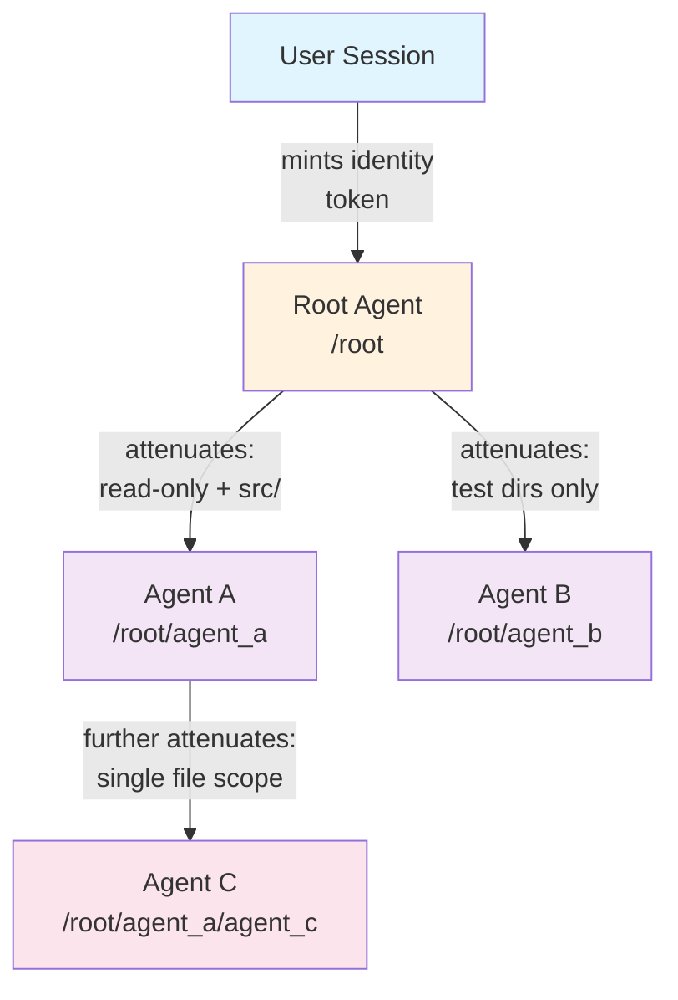
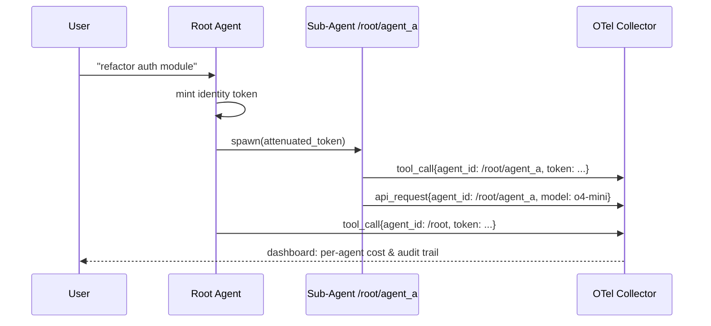

# Agent Identity Stack Complete: Cryptographic Attribution for Multi-Agent Audit Trails


---

Codex CLI v0.121.0, released today, ships two PRs that introduce a `use_agent_identity` feature flag and the ability to register agent identities behind it [^1][^2]. This is the beginning of cryptographic agent attribution in Codex — a capability that enterprises have been requesting since multi-agent workflows landed. When every sub-agent in a tree can prove who it is and what it was authorised to do, you unlock per-agent cost attribution, tamper-evident audit trails, and compliance-grade observability.

This article examines what the agent identity stack enables, the cryptographic primitives that make it possible, and how it integrates with Codex's existing OpenTelemetry and sub-agent infrastructure.

## Why Agent Identity Matters

In a single-agent Codex session, attribution is trivial: one user, one agent, one transcript. Multi-agent v2 changed this. Sub-agents now use readable path-based addresses like `/root/agent_a` [^3], with structured inter-agent messaging and configurable nesting depths [^4]. A typical parallel refactoring workflow might spawn six concurrent agents, each making tool calls, consuming tokens, and modifying files.

Without cryptographic identity, you face three problems:

1. **Cost attribution** — which sub-agent consumed 40k tokens on a failed approach?
2. **Audit compliance** — SOC 2 and GDPR require demonstrable provenance for automated actions on production data [^5]
3. **Trust boundaries** — a sub-agent spawned by a plugin should not inherit the parent's full permission set

The `use_agent_identity` feature flag addresses all three by associating each agent instance with a verifiable identity assertion that travels with its API calls and tool invocations.

## The Feature Flag: `use_agent_identity`

The identity stack is gated behind a feature flag, following Codex CLI's standard feature management pattern [^6]. Enable it with:

```bash
codex features enable use_agent_identity
```

Or per-session:

```bash
codex --enable use_agent_identity "refactor the auth module"
```

This is equivalent to setting `features.use_agent_identity = true` in your `config.toml` [^6]. When enabled, Codex registers an identity for each agent instance at spawn time, and that identity is attached to downstream API calls and tool invocations [^2].

```toml
# ~/.codex/config.toml
[features]
use_agent_identity = true

[agents]
max_threads = 6
max_depth = 2
```

⚠️ The precise wire format of the identity assertion (whether it uses Biscuit tokens, JWTs, or a custom scheme) is not yet documented in the public API reference. The discussion below on Biscuit-style tokens reflects the most likely approach based on the broader ecosystem trajectory, but should be treated as informed speculation until OpenAI publishes the specification.

## Biscuit Tokens: The Right Primitive for Agent Delegation

The agent identity problem maps naturally to Biscuit authorisation tokens [^7] — a format specifically designed for delegated, decentralised capabilities in distributed systems. Unlike JWTs, which were designed for single-hop identity transmission, Biscuit tokens support:

- **Offline attenuation** — a parent agent can mint a restricted token for a child without contacting any central service [^7]
- **Append-only chains** — each delegation step adds a block; permissions can only narrow, never widen [^8]
- **Ed25519 signatures** — each block is cryptographically signed, creating a tamper-evident chain of custody [^7]
- **Datalog policies** — authorisation rules are expressed in a compact logic language that can be evaluated locally [^7]



In this model, the root agent holds the broadest authority. When it spawns `/root/agent_a`, it appends a block restricting scope to read-only operations within `src/`. Agent A can further attenuate when spawning its own child — but can never grant permissions it does not itself hold. This is the principle of least privilege enforced cryptographically, not merely by convention.

The IETF Agent Identity Protocol (AIP) draft, published in March 2026, formalises exactly this pattern: Identity-Bound Capability Tokens (IBCTs) that fuse identity, attenuated authorisation, and provenance into a single append-only chain [^8]. AIP defines two wire formats — compact mode (JWT with Ed25519) for single-hop calls, and chained mode (Biscuit with Datalog policies) for multi-hop delegation [^8].

## Integration with OpenTelemetry

Codex CLI already supports opt-in OpenTelemetry export for compliance and observability [^9][^10]. The `[otel]` configuration section sends structured events covering API requests, tool approvals, and results:

```toml
# ~/.codex/config.toml
[otel]
log_user_prompt = true
exporter = "otlp-grpc"
endpoint = "https://ingest.us.signoz.cloud:443"

[otel.headers]
"signoz-ingestion-key" = "your-key-here"
```

Events are tagged with service name, CLI version, environment label, conversation ID, model, and sandbox/approval settings [^9]. Agent identity extends this naturally: when `use_agent_identity` is enabled, each OTel event can carry the agent's identity assertion, linking every API call and tool invocation to a specific agent in the spawn tree.

This means you can answer questions like:

- "Which agent in the refactoring job called `o4-mini` 47 times?" — filter by agent path
- "Did any agent exceed its authorised scope?" — verify attenuation chain integrity
- "What was the total token spend for the test-writing sub-agent?" — aggregate by identity



## Enterprise Audit Trail Patterns

For enterprises subject to SOC 2, GDPR, or HIPAA, the combination of agent identity and OTel export creates a complete audit pipeline [^5][^10]. Three patterns emerge:

### 1. Immutable Action Log

Every tool invocation carries the agent's signed identity. Export to an append-only store (e.g., a locked-down S3 bucket or a SIEM) and you have a tamper-evident record of what each agent did, when, and under what authority.

### 2. Per-Agent Cost Attribution

Token-based billing, introduced for Business and Enterprise accounts in early 2026 [^11], means each API call has a measurable cost. With agent identity on OTel events, you can break down spend per agent, per workflow, and per team — critical for chargeback models in large organisations.

### 3. Scope Violation Detection

If an agent's identity token restricts it to `src/tests/`, but OTel shows it invoked `Bash` with `rm -rf src/core/`, you have a verifiable scope violation. The attenuation chain proves the agent was not authorised for that action, regardless of what the sandbox permitted.

## Comparison with Claude Code's Agent Teams

Claude Code's Agent Teams feature takes a different approach to multi-agent coordination [^12]. An orchestrator agent breaks goals into subtasks and creates a shared task list; sub-agents claim tasks by marking them in-progress with their identifier. Coordination happens through real-time task list updates rather than cryptographic delegation.

| Capability | Codex CLI (with agent identity) | Claude Code Agent Teams |
|---|---|---|
| Agent identification | Cryptographic identity tokens | Task list ownership markers |
| Permission delegation | Attenuated capability chains | Inherited from orchestrator |
| Audit granularity | Per-agent signed OTel events | Task completion logs |
| Scope restriction | Cryptographic (cannot escalate) | Conventional (trust-based) |
| Offline verification | Yes (Ed25519 chain) | No |

Neither approach is universally superior. Claude Code's model is simpler to set up and sufficient for trusted single-user workflows. Codex's identity stack targets the enterprise governance case where cryptographic proof of agent behaviour is a compliance requirement.

## Practical Implications for Plugin Authors

Plugin authors who register MCP tools should be aware that, with agent identity enabled, tool calls will carry the calling agent's identity assertion. This means:

- **Tool-level authorisation** — an MCP server can inspect the identity token and reject calls from agents lacking sufficient scope
- **Provenance tracking** — tools can log which agent invoked them, enabling fine-grained usage analytics
- **Delegation chains** — if a plugin spawns its own sub-agents, it should further attenuate the token before passing it down

The sub-agent configuration in `~/.codex/agents/` already supports per-agent `sandbox_mode` and `mcp_servers` settings [^4]. Agent identity adds a cryptographic layer on top of this configuration-based isolation.

## What Comes Next

The `use_agent_identity` flag in v0.121.0 is explicitly a feature flag — gated, opt-in, and subject to iteration [^1]. Based on the current trajectory, expect:

1. **Public specification** of the identity assertion format (likely aligning with the IETF AIP draft [^8])
2. **Guardian integration** — the guardian review system (introduced in v0.120.0 [^13]) is a natural enforcement point for identity-based policies
3. **Analytics pipeline integration** — first-party dashboards for per-agent cost and compliance reporting
4. **Cross-session identity** — persistent agent identities that survive session boundaries, enabling long-running workflow attribution

For now, enabling `use_agent_identity` and configuring OTel export is the minimum viable setup for enterprise teams wanting to get ahead of the compliance curve.

## Getting Started

```bash
# Enable the feature flag
codex features enable use_agent_identity

# Configure OTel export
cat >> ~/.codex/config.toml << 'EOF'
[otel]
log_user_prompt = true
exporter = "otlp-grpc"
endpoint = "https://your-collector:4317"
EOF

# Run a multi-agent workflow with identity enabled
codex --enable use_agent_identity "refactor src/auth into separate modules, use 3 parallel agents"
```

Monitor the OTel collector for events tagged with agent identity paths. Each sub-agent's events will carry its position in the spawn tree and its attenuated capability set.

---

## Citations

[^1]: OpenAI Codex CLI Changelog — v0.121.0, PR #17385: "Add use_agent_identity feature flag." [https://developers.openai.com/codex/changelog](https://developers.openai.com/codex/changelog)

[^2]: OpenAI Codex CLI Changelog — v0.121.0, PR #17386: "Register agent identities behind use_agent_identity." [https://developers.openai.com/codex/changelog](https://developers.openai.com/codex/changelog)

[^3]: OpenAI Codex CLI Changelog — sub-agents now use readable path-based addresses like `/root/agent_a` with structured inter-agent messaging. [https://developers.openai.com/codex/changelog](https://developers.openai.com/codex/changelog)

[^4]: OpenAI Codex Subagents Documentation — configuration fields, nesting depth, custom agent files. [https://developers.openai.com/codex/subagents](https://developers.openai.com/codex/subagents)

[^5]: OpenAI Codex Agent Approvals & Security — OTel monitoring for compliance requirements. [https://developers.openai.com/codex/agent-approvals-security](https://developers.openai.com/codex/agent-approvals-security)

[^6]: OpenAI Codex CLI Reference — feature flag management via `--enable`/`--disable` and `codex features` subcommands. [https://developers.openai.com/codex/cli/reference](https://developers.openai.com/codex/cli/reference)

[^7]: Biscuit Authorization Tokens — delegated, decentralised, capabilities-based authorisation with Ed25519 signatures and Datalog policies. [https://www.biscuitsec.org/docs/help/faq/](https://www.biscuitsec.org/docs/help/faq/)

[^8]: IETF Agent Identity Protocol (AIP) Draft — verifiable delegation for AI agent systems using Identity-Bound Capability Tokens. [https://datatracker.ietf.org/doc/draft-prakash-aip/](https://datatracker.ietf.org/doc/draft-prakash-aip/)

[^9]: SigNoz Codex Monitoring Guide — OpenTelemetry configuration for Codex CLI. [https://signoz.io/docs/codex-monitoring/](https://signoz.io/docs/codex-monitoring/)

[^10]: OpenAI Codex Advanced Configuration — OTel exporter setup, event metadata fields. [https://developers.openai.com/codex/config-advanced](https://developers.openai.com/codex/config-advanced)

[^11]: Augment Code — Codex CLI v0.116.0 enterprise features overview. [https://www.augmentcode.com/learn/openai-codex-cli-enterprise](https://www.augmentcode.com/learn/openai-codex-cli-enterprise)

[^12]: MindStudio — Claude Code Agent Teams: parallel agents sharing a task list. [https://www.mindstudio.ai/blog/claude-code-agent-teams-parallel-agents](https://www.mindstudio.ai/blog/claude-code-agent-teams-parallel-agents)

[^13]: OpenAI Codex CLI Changelog — v0.120.0, PR #17298: "introduce guardian review ids." [https://developers.openai.com/codex/changelog](https://developers.openai.com/codex/changelog)
