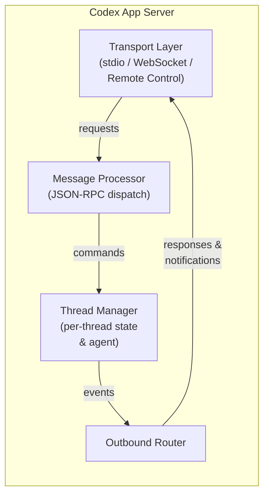
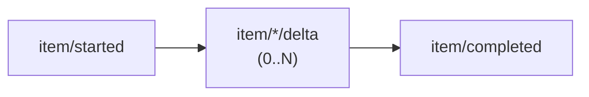
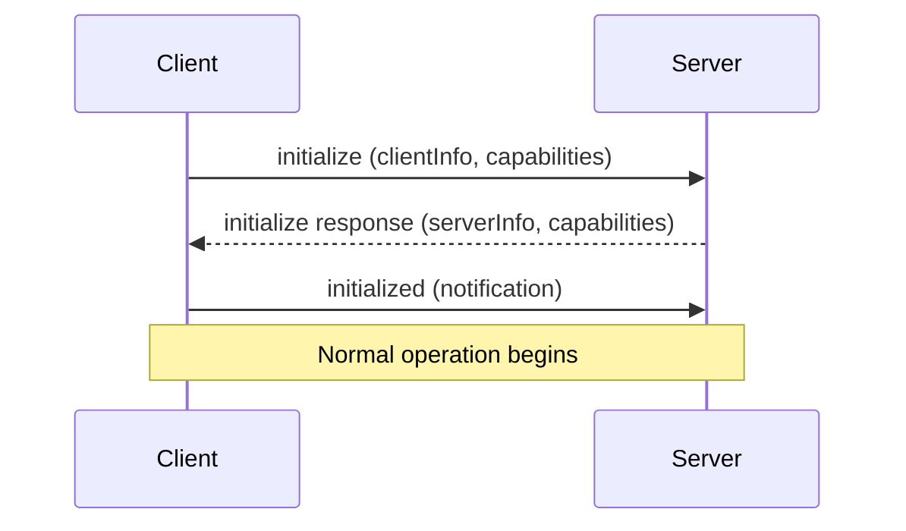
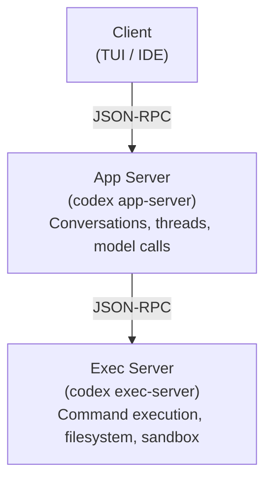
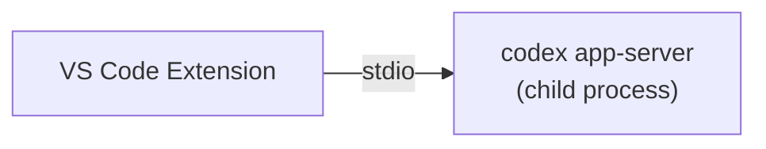

# The Codex App Server: A Complete Guide to the Protocol That Powers Every Surface


---

Every time you type a prompt in Codex — whether in the terminal, VS Code, the macOS desktop app, or the web interface at chatgpt.com/codex — the same Rust process handles your request. That process is the **Codex App Server**, and understanding it is key to understanding how Codex actually works.

This article is a single, comprehensive reference for the app server as of April 2026. It covers the architecture, the wire protocol, every transport option, authentication, sandboxing, the Python SDK, the exec-server companion, Remote Control, and production deployment patterns. If you have read earlier articles on specific app-server topics, this consolidates and updates all of them.[^1]

## Why the App Server Exists

The original Codex CLI (pre-v0.117.0) was a monolith: model interaction, tool execution, sandboxing, and the terminal UI all lived in a single process. That architecture was fast to iterate on but created three problems:

1. **Every new surface reimplemented the agent.** The web app, IDE extension, and desktop app each needed their own integration with the model loop and sandbox.
2. **Remote development was impossible.** The TUI was coupled to the agent process — you could not run the agent on a powerful remote machine while typing locally.
3. **Embedding was painful.** Third-party tools that wanted to use Codex as a library had to reverse-engineer internal APIs.

OpenAI's solution was to extract the agent core into a standalone server process with a documented protocol. The result is a **bidirectional JSON-RPC 2.0 service** that any client — official or third-party — can drive.[^2]

OpenAI initially experimented with exposing Codex as an MCP (Model Context Protocol) server, but found that MCP's tool-oriented request/response model could not accommodate streaming diffs, approval workflows, thread persistence, or server-initiated requests. MCP remains supported for connecting external tools *to* Codex, but the app server protocol is used for connecting clients *to* Codex.[^3]

## Architecture Overview

An app-server process consists of four cooperating async tasks:[^4]



1. **Transport Layer** — Accepts connections (stdio, WebSocket, or Remote Control), deserialises incoming messages into `JSONRPCMessage` structs, and forwards them on a bounded channel.
2. **Message Processor** — The dispatch hub. Routes each `ClientRequest` to the appropriate subsystem: thread management, turn control, configuration, command execution, auth, MCP tools, skills, or fuzzy file search.
3. **Thread Manager** — Maintains per-thread state (`ThreadState`) and per-connection subscriptions. Multiple clients can subscribe to the same thread simultaneously.
4. **Outbound Router** — Routes outgoing messages to the correct connection. Handles per-connection filtering (experimental API gating, notification opt-outs), backpressure, and broadcast to all initialised connections.

All four components communicate through bounded `mpsc` channels with a capacity of 128 messages. When ingress is saturated, requests are rejected with JSON-RPC error code `-32001` ("Server overloaded; retry later"). Clients should implement exponential backoff with jitter.[^5]

## The Three Primitives: Thread, Turn, Item

The entire protocol is organised around three nested primitives:[^6]

### Thread

A **Thread** is a durable conversation container. Threads survive process restarts and can be resumed by ID, forked into branches, or archived. The protocol provides:

- `thread/start` — create a new conversation
- `thread/resume` — reopen an existing thread
- `thread/fork` — branch from a specific turn
- `thread/list` — enumerate all stored threads
- `thread/read` — retrieve full event history
- `thread/archive` / `thread/unarchive` — lifecycle management
- `thread/rollback` — undo to a specific point

Threads unload from memory after 30 minutes with no subscribers and no activity. An unloaded thread emits `thread/closed` as a notification.[^7]

### Turn

A **Turn** is one complete exchange: user input followed by all the agent work that produces a response. Turns are the unit of interruption and rollback.

- `turn/start` — send user input and begin agent work
- `turn/steer` — inject guidance mid-turn without interrupting
- `turn/interrupt` — cancel the current turn

When a turn completes, the server emits `turn/completed` with token usage statistics.

### Item

An **Item** is the atomic unit of output within a turn. Each item has an explicit lifecycle:



Item types include:
- **User message** — the input that started the turn
- **Agent message** — streamed text response
- **Agent reasoning** — chain-of-thought (when visible)
- **Shell command** — a command to execute, with approval workflow
- **File change** — a diff or patch to apply
- **Tool call** — an MCP tool invocation
- **Context compaction** — a summary replacing older context

This hierarchy maps directly onto the UI. When Codex edits three files and runs `pytest`, you are watching a single turn emit multiple items, all streamed incrementally.

## Wire Protocol

The app server uses a "JSON-RPC lite" variant: standard JSON-RPC 2.0 structure, but with the `"jsonrpc": "2.0"` header **omitted** on the wire to reduce bandwidth.[^8]

Three message types:

```json
// Request (client → server)
{"id": 1, "method": "thread/start", "params": {...}}

// Response (server → client)
{"id": 1, "result": {...}}

// Notification (either direction, no id)
{"method": "item/agentMessage/delta", "params": {...}}
```

Notifications are the primary mechanism for streaming. A typical turn produces dozens of `delta` notifications before the final `item/completed`.

The server can also **initiate requests to the client** — this is the mechanism for approval workflows. When Codex wants to execute a shell command or apply a file change, it sends an approval request and waits for the client to respond with `accept`, `decline`, or `cancel`.[^9]

### Schema Generation

You can generate TypeScript or JSON Schema definitions matching the running version:

```bash
codex app-server generate-ts --out ./types
codex app-server generate-json-schema --out ./schemas
```

This is the recommended way to stay in sync with protocol changes.[^10]

## Transport Options

The app server supports multiple transports, selected via the `--listen` flag:[^11]

### stdio (Default)

```bash
codex app-server --listen stdio://
```

Communication uses **newline-delimited JSON (JSONL)** over stdin/stdout. This is single-client mode — the server exits when the connection closes.

No authentication is needed because the client and server share a process boundary. This is the transport used by the VS Code extension, the macOS desktop app, and the Python SDK when they launch Codex as a child process.

### WebSocket (Experimental)

```bash
codex app-server --listen ws://127.0.0.1:9090
```

One JSON-RPC message per WebSocket text frame. Multi-client: the server stays alive across connections.

The WebSocket transport also serves HTTP health endpoints:
- `GET /readyz` — returns 200 when the server can accept connections
- `GET /healthz` — returns 200 when the server is running

**CSRF protection:** Any request with an `Origin` header receives `403 Forbidden`.[^12]

**Slow client handling:** If a WebSocket client's outbound queue fills, the connection is forcibly closed. stdio connections block instead (they are never dropped, since there is only one).

### Off

```bash
codex app-server --listen off
```

No local transport is exposed. This is used when only Remote Control is active, meaning the server is reachable exclusively through OpenAI's cloud relay.

### In-Process

An internal transport (`in_process.rs`) provides bounded in-memory channels that replace socket/stdio communication. This is used when the CLI's TUI runs in the same process as the app server — no process boundary, but the same protocol semantics apply.[^13]

## Connection Lifecycle

Every client connection follows the same initialisation handshake:[^14]



1. The client sends an `initialize` request with `clientInfo` (name, version, title) and optional capabilities (e.g., `experimentalApi: true`, `optOutNotificationMethods: [...]`).
2. The server responds with its own capabilities.
3. The client sends an `initialized` notification to confirm.

Before initialisation completes, all requests are rejected. Repeated `initialize` calls return "Already initialized." Each connection gets a unique `ConnectionId` (a monotonically increasing counter).

## Authentication

Authentication applies only to the WebSocket transport — stdio is inherently trusted.[^15]

### Capability Token

```bash
codex app-server --listen ws://0.0.0.0:9090 \
  --ws-auth capability-token \
  --ws-token-file /run/secrets/codex-token
```

The client presents the token as `Authorization: Bearer <token>` during the WebSocket handshake. The server verifies via SHA-256 constant-time comparison. You can also supply `--ws-token-sha256` if the raw token is stored separately.

### Signed Bearer Token (JWT)

```bash
codex app-server --listen ws://0.0.0.0:9090 \
  --ws-auth signed-bearer-token \
  --ws-shared-secret-file /run/secrets/codex-hmac \
  --ws-issuer my-platform \
  --ws-audience codex-server
```

HMAC-SHA256 signed JWTs with configurable issuer, audience, and clock skew tolerance (default: 30 seconds). The shared secret must be at least 32 bytes. Tokens with `alg: none` are rejected.

### User-Level Auth

For upstream API calls to OpenAI, the server supports three modes:
- `apikey` — caller supplies OpenAI credentials stored locally
- `chatgpt` — Codex manages an OAuth flow with automatic token refresh
- `chatgptAuthTokens` — the host application supplies tokens directly

## Sandbox Policies

Every thread runs under a sandbox policy that determines what the agent can access:[^16]

| Policy | Behaviour |
|--------|-----------|
| `dangerFullAccess` | No restrictions — the agent can read, write, and execute anything |
| `readOnly` | Read-only access, optionally with platform defaults |
| `workspaceWrite` | Write access within configured `writableRoots`, with optional network access |
| `externalSandbox` | The host provides its own isolation; the server skips enforcement |

Sandbox enforcement is platform-specific:
- **macOS** — Apple Seatbelt framework
- **Linux/WSL2** — bubblewrap (`bwrap`)
- **Windows** — native restricted-token sandbox in PowerShell, or Linux sandbox in WSL2

## Approval Workflows

The app server supports human-in-the-loop approval through **server-initiated requests**:[^17]

When the agent wants to execute a shell command:

1. Server sends `item/commandExecution/requestApproval` with the command, working directory, reason, and optional `additionalPermissions` (filesystem read/write paths) and `proposedExecpolicyAmendment`.
2. The client displays the request to the user.
3. The client responds with one of: `accept`, `decline`, `cancel`, or `acceptWithExecpolicyAmendment`.

The same flow applies to file changes via `item/fileChange/requestApproval`.

Approval can also be delegated to a **Guardian subagent** — a risk-based automated reviewer that evaluates commands against policy rules before execution.

## The Full API Surface

The app server exposes a rich set of RPC methods, grouped by domain:[^18]

### Thread Management
`thread/start`, `thread/resume`, `thread/fork`, `thread/list`, `thread/loaded/list`, `thread/read`, `thread/metadata/update`, `thread/memoryMode/set`, `memory/reset`, `thread/archive`, `thread/unarchive`, `thread/unsubscribe`, `thread/name/set`, `thread/compact/start`, `thread/shellCommand`, `thread/backgroundTerminals/clean`, `thread/rollback`, `thread/inject_items`

### Turn Operations
`turn/start`, `turn/steer`, `turn/interrupt`

### Command Execution
`command/exec`, `command/exec/write`, `command/exec/resize`, `command/exec/terminate`

### Filesystem
`fs/readFile`, `fs/writeFile`, `fs/createDirectory`, `fs/getMetadata`, `fs/readDirectory`, `fs/remove`, `fs/copy`, `fs/watch`, `fs/unwatch`

### Configuration
`config/read`, `config/value/write`, `config/batchWrite`, `configRequirements/read`, `config/mcpServer/reload`

### Discovery
`model/list`, `experimentalFeature/list`, `skills/list`, `app/list`, `plugin/list`, `plugin/install`, `plugin/uninstall`, `marketplace/add`

### MCP Integration
`mcpServerStatus/list`, `mcpServer/resource/read`, `mcpServer/tool/call`, `mcpServer/oauth/login`

### Realtime (Experimental)
`thread/realtime/start`, `thread/realtime/appendAudio`, `thread/realtime/appendText`, `thread/realtime/stop`

### Review
`review/start` — supports `uncommittedChanges`, `baseBranch`, `commit`, and `custom` target types

## Command Execution Engine

The `command/exec` subsystem provides sandboxed command execution independent of the agent loop:[^19]

```json
{
  "id": 42,
  "method": "command/exec",
  "params": {
    "command": ["pytest", "-v"],
    "cwd": "/workspace/myproject",
    "tty": true,
    "stream_stdout_stderr": true,
    "timeout_ms": 30000
  }
}
```

Key capabilities:
- **PTY mode** (`tty: true`) — spawns with a pseudo-terminal; supports `command/exec/resize` for terminal dimensions
- **Streaming I/O** — base64-encoded `command/exec/outputDelta` notifications in real time
- **Output capping** — configurable per-stream byte limits with `capReached` notification
- **Timeout** — configurable per-request or server default; exit code 124 on timeout
- **stdin injection** — `command/exec/write` sends base64-encoded input
- **Termination** — `command/exec/terminate` kills the process

Output is chunked at a 64 KiB hint size, with individual raw PTY chunks capped at 8 KiB.

## The Exec-Server Companion

Alongside the app server, Codex ships a separate **exec-server** (`codex-exec-server`) that handles the lower-level concerns: running commands in sandboxes, reading and writing files, and watching filesystem changes.[^20]



This separation enables a key deployment pattern: the app server runs locally (close to the user for low-latency interaction), while the exec server runs on a remote machine with more resources. The developer types on a laptop, but code executes on a cloud VM.

## Remote Control: How chatgpt.com Reaches Your Machine

When you use Codex through the web interface at chatgpt.com/codex, the app server on your local machine connects **outward** to OpenAI's infrastructure through the Remote Control system:[^21]

### Enrolment

1. The app server calls `POST /wham/remote/control/server/enroll` to register with the ChatGPT backend.
2. It opens a persistent WebSocket to `wss://.../wham/remote/control/server`.
3. The web UI sends JSON-RPC messages through this relay to the local app server.

### Reliable Delivery

The Remote Control protocol includes acknowledgement-based reliable delivery:
- Each message gets a `seq_id` cursor
- A `BoundedOutboundBuffer` retains sent messages until the backend acknowledges them
- On reconnect, the server resends unacknowledged messages using an `x-codex-subscribe-cursor` header
- Protocol version: `"2"`

### Client Tracking

Remote clients are tracked with:
- **Idle timeout:** 10 minutes per client
- **Sweep interval:** 30 seconds
- **Ping interval:** 10 seconds, pong timeout: 60 seconds

Only `chatgpt.com`, `chatgpt-staging.com`, and `localhost` are accepted as relay hosts.

## The Python SDK

The `codex_app_server` Python package provides a typed client for the app server protocol:[^22]

### Basic Usage

```python
from codex_app_server import AppServerClient, AppServerConfig

config = AppServerConfig(
    client_name="my-tool",
    client_title="My Custom Tool",
    experimental_api=True,
)

with AppServerClient(config) as client:
    # Create a thread
    thread = client.thread_start(
        instructions="You are a helpful coding assistant.",
        sandbox={"type": "workspaceWrite"},
    )

    # Start a turn
    turn = client.turn_start(
        thread_id=thread.thread_id,
        message="Write a function that checks if a number is prime",
    )

    # Stream the response
    for event in client.stream_text(thread_id=thread.thread_id):
        print(event.delta, end="", flush=True)
```

### How It Works

The SDK spawns `codex app-server --listen stdio://` as a subprocess and communicates via stdin/stdout pipes. It handles:

- **Initialisation handshake** — automatic `initialize` + `initialized` exchange
- **Thread lifecycle** — `thread_start()`, `thread_resume()`, `thread_fork()`, `thread_list()`, `thread_read()`, `thread_archive()`
- **Turn control** — `turn_start()`, `turn_interrupt()`, `turn_steer()`
- **Streaming** — `stream_text()` yields deltas until `turn/completed`
- **Approval handling** — configurable `ApprovalHandler` callback; default auto-accepts
- **Backpressure** — `request_with_retry_on_overload()` implements exponential backoff with jitter

An async variant (`AsyncAppServerClient`) wraps the sync client using `asyncio.to_thread()`.

## Deployment Patterns

### Pattern 1: Local Child Process

The default pattern. VS Code, the desktop app, and the Python SDK all launch `codex app-server` as a child process and communicate over stdio.



**When to use:** Interactive development on your own machine. Zero configuration needed.

### Pattern 2: Remote via SSH Tunnel

Run the app server on a powerful remote machine; connect from a lightweight local client.

```bash
# On the remote machine:
codex app-server --listen ws://127.0.0.1:9090 \
  --ws-auth capability-token \
  --ws-token-file ~/.codex/ws-token

# On your laptop:
ssh -L 9090:127.0.0.1:9090 remote-host
codex --remote ws://127.0.0.1:9090 \
  --remote-auth-token-env CODEX_WS_TOKEN
```

**When to use:** Working with large codebases on a cloud VM. The agent has fast disk I/O and network access; you have low-latency typing.

### Pattern 3: Devcontainer

The app server runs inside a devcontainer (VS Code Remote Containers, GitHub Codespaces, Gitpod). The IDE connects via WebSocket or the in-process transport.

**When to use:** Reproducible development environments. The container defines the toolchain; Codex inherits it.

### Pattern 4: CI/CD Headless

Use `codex exec` for one-shot tasks or the Python SDK for programmatic control. No TUI needed.

```bash
# One-shot code review
codex exec "Review this PR and output structured JSON" \
  --output-schema review.json

# Or via the SDK
python -c "
from codex_app_server import AppServerClient, AppServerConfig
with AppServerClient(AppServerConfig()) as c:
    t = c.thread_start(sandbox={'type': 'readOnly'})
    c.turn_start(thread_id=t.thread_id, message='...')
    result = c.wait_for_turn_completed(t.thread_id)
    print(result)
"
```

**When to use:** Automated code review, test generation, or refactoring in CI pipelines.[^23]

### Pattern 5: Enterprise Central Server

A shared app server instance with WebSocket transport and signed JWT auth serves multiple developers or teams.

```bash
codex app-server --listen ws://0.0.0.0:9090 \
  --ws-auth signed-bearer-token \
  --ws-shared-secret-file /run/secrets/hmac-key \
  --ws-issuer corp-platform \
  --ws-audience codex-central
```

**When to use:** Organisations that want centralised audit logging, policy enforcement, and resource management.

## Backpressure and Reliability

The app server is designed for graceful degradation under load:[^5]

| Condition | Behaviour |
|-----------|-----------|
| Ingress queue full | Request rejected with `-32001` ("Server overloaded; retry later") |
| Response/notification delivery | Awaits capacity (never dropped) |
| Slow WebSocket client | Disconnected when outbound queue fills |
| Slow stdio client | Writer blocks (never disconnected) |
| First SIGTERM | Drains running turns, then shuts down |
| Second SIGTERM | Immediate exit |

## Observability

The app server supports structured logging and tracing:[^24]

- **W3C Trace Context** — requests can carry a `trace` field with `traceparent` and `tracestate` for distributed tracing
- **Structured logging** — configurable via `CODEX_LOG` environment variable
- **Session analytics** — JSONL session logs capture every item for post-hoc analysis

## What Is Not the App Server

A few clarifications for newcomers:

- **The app server is not an HTTP API for building web apps.** It is a process-local or LAN-local protocol for driving the Codex agent. If you want a web-facing API, wrap it with your own HTTP layer.
- **The app server is not MCP.** MCP connects external tools *to* Codex (e.g., a database MCP server). The app server connects clients *to* Codex. They coexist.
- **The app server is not the exec-server.** The app server manages conversations and model interaction. The exec-server handles sandboxed command execution and filesystem operations. They can run in the same process or be split across machines.

## The Source Code

The app server is fully open source under the `codex-rs/app-server` directory of the [Codex repository](https://github.com/openai/codex):[^25]

| File | Purpose |
|------|---------|
| `codex-rs/app-server/README.md` | Official protocol documentation |
| `codex-rs/app-server/src/lib.rs` | Main event loop and shutdown logic |
| `codex-rs/app-server/src/main.rs` | CLI argument parsing |
| `codex-rs/app-server/src/message_processor.rs` | JSON-RPC dispatch and routing |
| `codex-rs/app-server/src/transport/mod.rs` | Transport abstraction, backpressure |
| `codex-rs/app-server/src/transport/websocket.rs` | Axum-based WebSocket acceptor |
| `codex-rs/app-server/src/transport/auth.rs` | Authentication (752 lines) |
| `codex-rs/app-server/src/transport/remote_control/` | Remote Control (5 files) |
| `codex-rs/app-server/src/command_exec.rs` | Sandboxed command execution |
| `codex-rs/app-server/src/thread_state.rs` | Per-thread state management |
| `codex-rs/app-server/src/in_process.rs` | In-process transport |
| `codex-rs/app-server-protocol/src/lib.rs` | Protocol type definitions |
| `sdk/python/src/codex_app_server/client.py` | Python SDK client |

## Conclusion

The Codex App Server is the architectural decision that turned Codex from a terminal tool into a platform. By extracting the agent core behind a documented bidirectional protocol, OpenAI enabled a single agent implementation to power the CLI, desktop app, IDE extensions, and web interface — while also opening the door to third-party integrations, remote development, and CI/CD automation.

For most developers, the app server is invisible — it runs behind the scenes when you launch `codex` or open VS Code. But for those building custom integrations, deploying Codex in enterprise environments, or simply wanting to understand how the system works, the protocol is the foundation everything else stands on.

---

## Footnotes

[^1]: This article consolidates and updates material from earlier articles on the app server JSON-RPC protocol, TUI architecture shift, four-surface architecture, exec-server, Python SDK, and remote deployment. See the [article index](../articles/index.md) for the full list.

[^2]: OpenAI, "Unlocking the Codex Harness: How We Built the App Server," OpenAI Blog, February 2026. https://openai.com/index/unlocking-the-codex-harness/

[^3]: OpenAI initially experimented with MCP but found it inadequate for streaming diffs and approval workflows. See: "OpenAI Publishes Codex App Server Architecture," InfoQ, February 2026. https://www.infoq.com/news/2026/02/opanai-codex-app-server/

[^4]: Architecture derived from source: `codex-rs/app-server/src/lib.rs`, lines 337-905. https://github.com/openai/codex/blob/main/codex-rs/app-server/src/lib.rs

[^5]: Backpressure implementation: `codex-rs/app-server/src/transport/mod.rs`, channel capacity of 128, overload error code `-32001`. https://github.com/openai/codex/blob/main/codex-rs/app-server/src/transport/mod.rs

[^6]: OpenAI, "App Server — Codex Developer Documentation," April 2026. https://developers.openai.com/codex/app-server

[^7]: Thread lifecycle and idle unload (30-minute timeout): `codex-rs/app-server/src/thread_state.rs`. https://github.com/openai/codex/blob/main/codex-rs/app-server/src/thread_state.rs

[^8]: JSON-RPC lite variant: `codex-rs/app-server-protocol/src/jsonrpc_lite.rs`. https://github.com/openai/codex/blob/main/codex-rs/app-server-protocol/src/jsonrpc_lite.rs

[^9]: Server-initiated requests for approval workflows: `codex-rs/app-server/README.md`, approval flow section. https://github.com/openai/codex/blob/main/codex-rs/app-server/README.md

[^10]: Schema generation: `codex app-server generate-ts` and `codex app-server generate-json-schema`. https://github.com/openai/codex/blob/main/codex-rs/app-server/README.md

[^11]: Transport options: `codex-rs/app-server/src/transport/mod.rs`, `AppServerTransport` enum. https://github.com/openai/codex/blob/main/codex-rs/app-server/src/transport/mod.rs

[^12]: WebSocket CSRF protection: Origin header rejection returns 403 Forbidden. `codex-rs/app-server/src/transport/websocket.rs`. https://github.com/openai/codex/blob/main/codex-rs/app-server/src/transport/websocket.rs

[^13]: In-process transport: `codex-rs/app-server/src/in_process.rs`. https://github.com/openai/codex/blob/main/codex-rs/app-server/src/in_process.rs

[^14]: Initialisation handshake: `codex-rs/app-server/src/message_processor.rs`. https://github.com/openai/codex/blob/main/codex-rs/app-server/src/message_processor.rs

[^15]: Authentication: `codex-rs/app-server/src/transport/auth.rs` (752 lines). https://github.com/openai/codex/blob/main/codex-rs/app-server/src/transport/auth.rs

[^16]: Sandbox policies: OpenAI, "Sandboxing — Codex Developer Documentation." https://developers.openai.com/codex/concepts/sandboxing

[^17]: Approval workflows: `codex-rs/app-server/README.md`, "Approval Flow" section. https://github.com/openai/codex/blob/main/codex-rs/app-server/README.md

[^18]: Full API surface: `codex-rs/app-server/README.md`, RPC method listing. https://github.com/openai/codex/blob/main/codex-rs/app-server/README.md

[^19]: Command execution: `codex-rs/app-server/src/command_exec.rs`. https://github.com/openai/codex/blob/main/codex-rs/app-server/src/command_exec.rs

[^20]: Exec-server architecture: `codex-rs/exec-server/`. https://github.com/openai/codex/tree/main/codex-rs/exec-server

[^21]: Remote Control: `codex-rs/app-server/src/transport/remote_control/`. https://github.com/openai/codex/tree/main/codex-rs/app-server/src/transport/remote_control

[^22]: Python SDK: `sdk/python/src/codex_app_server/client.py`. https://github.com/openai/codex/blob/main/sdk/python/src/codex_app_server/client.py

[^23]: Codex SDK code review in CI/CD: OpenAI Cookbook, "Build Code Review with the Codex SDK." https://cookbook.openai.com/examples/partner_build_code_review_with_codex_sdk

[^24]: W3C Trace Context support: `JSONRPCRequest.trace` field in the protocol definition. https://github.com/openai/codex/blob/main/codex-rs/app-server-protocol/src/lib.rs

[^25]: OpenAI Codex repository. https://github.com/openai/codex
