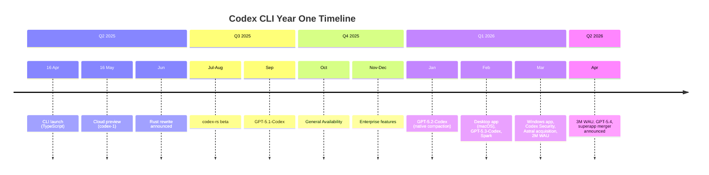
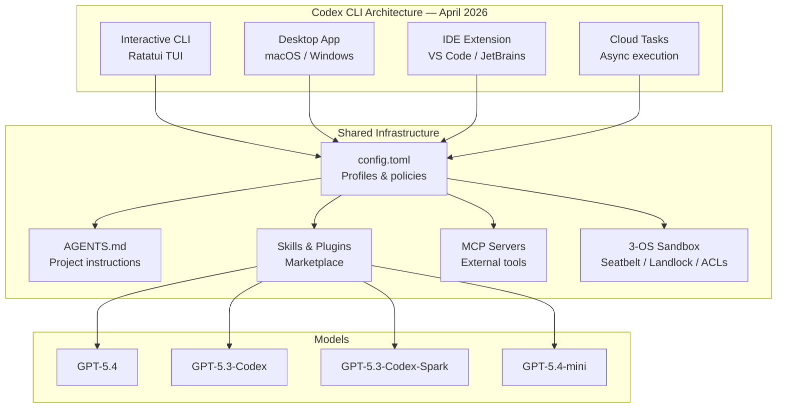

# Codex CLI at One Year: From Research Preview to 3 Million Weekly Active Users

On 16 April 2025, OpenAI quietly released an open-source terminal coding agent called Codex CLI[^1]. Built by Fouad Matin and Michael Bolin, it was a lightweight Node.js tool that let developers write and edit code using conversational commands from their terminal[^2]. One year later, Codex has grown to over 3 million weekly active users[^3], been rewritten from TypeScript to Rust[^4], spawned a desktop app and cloud execution platform, and triggered an acquisition that reshaped the Python tooling ecosystem. This article traces the twelve months that turned a research preview into one of the most consequential developer tools of 2026.

## The Launch: 16 April 2025

Codex CLI launched alongside OpenAI's o3 and o4-mini reasoning models[^1]. The original pitch was straightforward: a chat-driven coding agent that runs locally, reads your codebase, executes shell commands, and edits files — all under human oversight via an approval system. The initial implementation was TypeScript and React (using the Ink terminal UI framework), required Node.js v22+, and shipped as an npm package[^4].

The open-source licensing (Apache 2.0) was a deliberate signal. While competitors like Cursor and GitHub Copilot were closed-source, OpenAI bet that transparency would build trust with the developer community[^1]. That bet paid off: the repository accumulated thousands of stars within weeks.

## The First Six Months: Foundation Building

### May–June 2025: Cloud Preview and the Rust Decision

On 16 May 2025, OpenAI launched the cloud-based Codex research preview, powered by codex-1 (a version of o3 optimised for software engineering)[^5]. This gave Codex two surfaces: the local CLI for interactive terminal work and the cloud for asynchronous fire-and-forget tasks.

The most consequential decision of this period happened internally. In late May, Discussion #1174 announced that Codex CLI was "going native" — a full rewrite from TypeScript to Rust[^4]. The motivations were concrete:

- **Zero-dependency install** — eliminating the Node.js v22+ requirement that blocked adoption on many systems
- **Native sandbox bindings** — direct access to macOS Seatbelt, Linux Landlock, and Windows restricted tokens
- **Lower memory consumption** — no garbage collection pauses during long agent sessions
- **MCP server capability** — the existing Rust MCP implementation enabled Codex CLI to function as both client and server[^4]

### July–September 2025: The Rust Beta and GA

The first Rust beta landed in early July. By September, the TypeScript CLI was formally retired[^4]. The `codex-rs` workspace grew to encompass approximately 70 Rust crates covering the core agent loop, TUI (built on Ratatui), execution engine, app-server, protocol layer, MCP server, and platform-specific sandboxes[^6].

September also brought GPT-5.1-Codex, the first model specifically optimised for Codex's agentic loop. It introduced native context compaction and improved tool-calling reliability[^7].

### October 2025: General Availability

On 6 October 2025, Codex graduated from research preview to general availability[^5]. ChatGPT Plus, Pro, Business, Edu, and Enterprise subscribers gained full access. The GA release consolidated the four-surface architecture that defines Codex today: interactive CLI, desktop app, IDE extension (VS Code and JetBrains), and cloud tasks[^8].

## The Growth Inflection: Q1 2026

The first quarter of 2026 saw Codex's usage explode. Three factors drove the inflection.

### GPT-5.2-Codex and Native Compaction (January 2026)

GPT-5.2-Codex, arriving on 14 January 2026, introduced server-side context compaction — an encrypted fast path that let the model compress its own conversation history without external summarisation[^7]. This was a breakthrough for long-horizon tasks, enabling sessions that could run for hours without the quality degradation that plagued earlier models.

### The Desktop App (February 2026)

On 2 February 2026, OpenAI launched the Codex desktop app for macOS[^9]. This was not a thin wrapper around the CLI. It introduced:

- **Parallel thread management** — run multiple agents simultaneously on different tasks
- **Git worktree isolation** — each agent gets its own working copy, preventing conflicts
- **Skills and automations** — a dedicated interface for creating, managing, and scheduling agent workflows
- **Review queue** — human approval of automation results before they merge[^9]

The desktop app transformed Codex from a single-session tool into a multi-agent command centre. A month later, on 4 March, the Windows app launched via the Microsoft Store[^10].

### GPT-5.3-Codex and Spark (February 2026)

GPT-5.3-Codex arrived on 5 February 2026, and days later, GPT-5.3-Codex-Spark followed — a Cerebras WSE-3-accelerated variant delivering over 1,000 tokens per second[^11]. Spark's near-instant inference changed how developers interacted with the tool: rapid multi-implementation comparison, interactive refinement loops, and sub-second prompt-response cycles became practical for the first time.

### The Numbers

The growth was dramatic. By early March, Codex had reached 1.6 million weekly active users, with enterprise deployments at Cisco, Nvidia, Ramp, Rakuten, and Harvey[^12]. By mid-March, it crossed 2 million — a fivefold increase since January[^3]. Usage in tokens was growing 70%+ month over month[^3].

## March 2026: The Strategic Pivot Month

March 2026 packed more consequential events into 31 days than most products see in a year.

### Codex Security (6 March)

OpenAI launched Codex Security (formerly codenamed Aardvark), a vulnerability scanning agent that had already identified 14 CVEs in projects including GnuTLS, GOGS, and Thorium[^13]. It combined threat modelling, commit scanning, sandboxed validation, and automated patch generation in a single pipeline.

### The Astral Acquisition (19 March)

OpenAI announced the acquisition of Astral, the company behind uv (Python package manager), Ruff (linter), and ty (type checker)[^14]. These Rust-built tools are downloaded hundreds of millions of times monthly. The strategic logic was clear: when a developer prompts Codex, the model produces code and then Ruff formats and lints it, uv manages dependencies, and ty verifies types — all before the user sees the result[^14]. OpenAI committed to maintaining all three tools as open source[^14].

### The Superapp Announcement (19 March)

On the same day as the Astral announcement, the Wall Street Journal reported that OpenAI would merge ChatGPT, Codex, and its Atlas browser into a single desktop "superapp"[^15]. Fidji Simo, OpenAI's CEO of Applications, would oversee the transition. The vision: ChatGPT as the orchestration layer that dispatches to Codex for coding and Atlas for web research[^15].

### The Plugin Ecosystem (26 March)

Over 20 first-party plugins shipped on 26 March, including integrations with Slack, Figma, Google Drive, Gmail, Notion, and Cloudflare[^8]. The plugin system — bundling skills, MCP servers, and app connectors into distributable packages — gave Codex CLI an extensibility model that rivalled established IDE ecosystems.

## April 2026: 3 Million Users and the Current State

On 8 April 2026, Codex crossed 3 million weekly active users[^3]. Sam Altman celebrated by resetting usage limits — a gesture he promised to repeat at each million-user milestone up to 10 million[^3].

### The Model Landscape Today

The current model lineup reflects a year of rapid iteration:

| Model | Released | Sweet Spot | Key Trait |
|---|---|---|---|
| GPT-5.4 | Mar 2026 | General-purpose default | Computer use, 1M context |
| GPT-5.4-mini | Mar 2026 | Subagent delegation | 30% credit cost of flagship |
| GPT-5.3-Codex | Feb 2026 | Deep coding tasks | Native compaction, high tool reliability |
| GPT-5.3-Codex-Spark | Feb 2026 | Rapid iteration | 1,000+ tok/s on Cerebras WSE-3 |

On 14 April, OpenAI deprecated the older models (GPT-5.2-Codex, GPT-5.1-Codex-Mini, GPT-5.1-Codex-Max) for ChatGPT sign-in users[^16], consolidating the lineup around the GPT-5.3/5.4 generation.

### Benchmark Position

Codex CLI scores 77.3% on Terminal-Bench 2.0 (published at ICLR 2026), placing it second behind Claude Mythos Preview (82%) and ahead of GPT-5.4 standalone (75.1%)[^17]. The gap between harness+model pairs confirms a finding the community has internalised over the past year: harness quality matters as much as model quality.

### The Ecosystem by Numbers

The community ecosystem has grown to remarkable scale:

- **67,000+ GitHub stars** and 400+ contributors on the main repository[^18]
- **245+ community tools** catalogued in awesome-codex-cli[^19]
- **136+ community subagent definitions** in awesome-codex-subagents[^19]
- **1,370+ cross-platform skills** on agentskills.io[^19]
- **150+ members** in the Agentic AI Foundation (Linux Foundation), which governs AGENTS.md as an open standard[^20]

## What Changed — and What Didn't

Looking back over twelve months, several themes stand out.

### What Changed

**Architecture**: From a TypeScript npm package requiring Node.js to a ~90-crate Rust workspace with zero external dependencies, kernel-level sandboxing on three operating systems, and a JSON-RPC protocol that enables embedding in any language[^6].

**Surface area**: From a single terminal interface to four coordinated surfaces (CLI, desktop, IDE, cloud) with session continuity across all of them[^8].

**Ecosystem**: From a standalone tool to a platform with plugins, skills, MCP servers, subagent orchestration, and an open-standard instruction format backed by the Linux Foundation[^20].

**Models**: From o3/o4-mini through five generations of Codex-optimised models, culminating in the GPT-5.4 family with native computer use and million-token context windows[^16].

**Scale**: From zero users to 3 million weekly active users, with 70%+ month-over-month token growth[^3].

### What Didn't Change

**The core loop**: Codex CLI still works the same way it did on day one — you describe what you want, the agent proposes changes, you approve or reject them. The approval-mode philosophy (suggest → auto-edit → full-auto) remains unchanged[^1].

**Open source**: The Apache 2.0 licence remains. The codebase is public. Anyone can fork it, embed it, or contribute to it[^1].

**Terminal-first**: Despite the desktop app and IDE extension, the terminal remains the primary interface for power users. The CLI is where new features land first[^8].

## What the Next Year Holds

Three trajectories seem clear:

1. **The superapp merger** will reshape how non-CLI users interact with Codex. ChatGPT as the orchestration layer, with Codex and Atlas as specialised backends, is a fundamentally different product model than a standalone coding agent[^15].

2. **The Astral integration** will make Codex the default environment for Python development — not just AI-assisted coding, but the entire toolchain from package management to type checking[^14].

3. **Multi-agent orchestration** will mature. The current subagent system (max 6 threads, path-based addressing, TOML-defined agents) works for most tasks, but the community is already building external orchestrators (Oh-My-Codex, Gas Town, Parallel Code) that push well beyond these limits[^19].

Whether Codex CLI reaches 10 million weekly active users before its second birthday is an open question. But the trajectory from the past twelve months suggests it is not an unreasonable one.

---

*Happy birthday, Codex CLI. It has been quite a year.*

## Citations

[^1]: [OpenAI debuts Codex CLI, an open source coding tool for terminals — TechCrunch, April 16, 2025](https://techcrunch.com/2025/04/16/openai-debuts-codex-cli-an-open-source-coding-tool-for-terminals/)
[^2]: [OpenAI Engineers Reveal the Inner Workings of Their AI Coding Agent Codex CLI — Technology.org, January 27, 2026](https://www.technology.org/2026/01/27/openai-engineers-reveal-the-inner-workings-of-their-ai-coding-agent-codex-cli/)
[^3]: [OpenAI Codex celebrates 3 million weekly users, CEO Sam Altman resets usage limits — BusinessToday, April 8, 2026](https://www.businesstoday.in/technology/story/openai-codex-celebrates-3-million-weekly-users-ceo-sam-altman-resets-usage-limits-524717-2026-04-08)
[^4]: [Codex CLI is Going Native — GitHub Discussion #1174](https://github.com/openai/codex/discussions/1174)
[^5]: [Introducing the Codex app — OpenAI](https://openai.com/index/introducing-the-codex-app/)
[^6]: [Another Rust Rewrite: OpenAI's Codex CLI Goes Native — InfoQ, June 2025](https://www.infoq.com/news/2025/06/codex-cli-rust-native-rewrite/)
[^7]: [Introducing GPT-5.2-Codex — OpenAI](https://openai.com/index/introducing-gpt-5-2-codex/)
[^8]: [CLI — Codex, OpenAI Developers](https://developers.openai.com/codex/cli)
[^9]: [OpenAI launches Codex app for macOS — 9to5Mac, February 2, 2026](https://9to5mac.com/2026/02/02/openai-launches-codex-app-for-macos-here-are-the-details/)
[^10]: [OpenAI Codex Statistics 2026 — Quantumrun](https://www.quantumrun.com/consulting/openai-codex-statistics/)
[^11]: [OpenAI Codex in 2026: 2M Users, Astral Acquisition, and How It Actually Works — Abhishek Gautam](https://www.abhs.in/blog/openai-codex-2026-what-it-is-how-it-works-astral-acquisition)
[^12]: [OpenAI sees Codex users spike to 1.6 million — Fortune, March 4, 2026](https://fortune.com/2026/03/04/openai-codex-growth-enterprise-ai-agents/)
[^13]: [Introducing upgrades to Codex — OpenAI](https://openai.com/index/introducing-upgrades-to-codex/)
[^14]: [OpenAI to acquire Astral — OpenAI, March 19, 2026](https://openai.com/index/openai-to-acquire-astral/)
[^15]: [OpenAI to create desktop super app, combining ChatGPT app, browser and Codex app — CNBC, March 19, 2026](https://www.cnbc.com/2026/03/19/openai-desktop-super-app-chatgpt-browser-codex.html)
[^16]: [Changelog — Codex, OpenAI Developers](https://developers.openai.com/codex/changelog)
[^17]: [Terminal-Bench 2.0 Leaderboard](https://www.tbench.ai/leaderboard/terminal-bench/2.0)
[^18]: [openai/codex — GitHub](https://github.com/openai/codex)
[^19]: [The Codex CLI Ecosystem Map — codex.danielvaughan.com, April 11, 2026](https://codex.danielvaughan.com/2026/04/11/codex-cli-ecosystem-map-245-tools/)
[^20]: [AGENTS.md as an Open Standard — codex.danielvaughan.com, April 7, 2026](https://codex.danielvaughan.com/2026/04/07/agents-md-open-standard-cross-tool-portability/)
