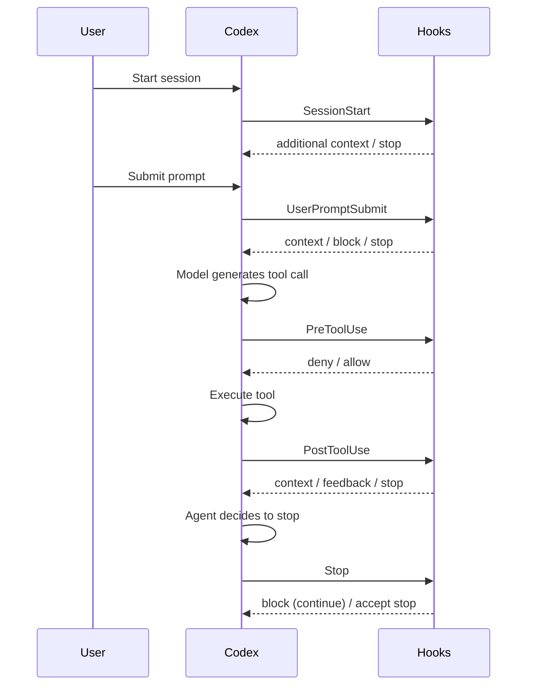
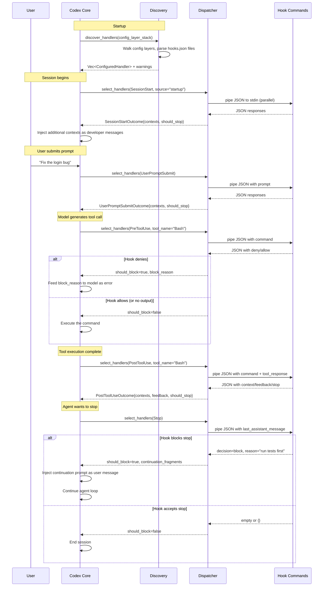

# Codex CLI Hooks: Complete Guide

> This article consolidates and supersedes the earlier individual articles on
> hooks deep-dive, the hooks engine, PreToolUse/PostToolUse hooks, and
> PermissionRequest policy-engine hooks.  It is the single authoritative
> reference for the Codex CLI hooks system.

---

## Table of Contents

1. [Architecture Overview](#architecture-overview)
2. [Hook Event Types](#hook-event-types)
   - [SessionStart](#sessionstart)
   - [UserPromptSubmit](#userpromptsubmit)
   - [PreToolUse](#pretooluse)
   - [PostToolUse](#posttooluse)
   - [Stop](#stop)
3. [JSON Wire Protocol](#json-wire-protocol)
4. [Configuration Reference](#configuration-reference)
5. [Matcher Patterns](#matcher-patterns)
6. [Exit-Code Protocol](#exit-code-protocol)
7. [Policy Engine Patterns](#policy-engine-patterns)
8. [Production Examples](#production-examples)
9. [Lifecycle Sequence Diagram](#lifecycle-sequence-diagram)
10. [Quick-Reference Tables](#quick-reference-tables)

---

## Architecture Overview

Codex CLI hooks let you intercept and react to events in the agent loop
**without modifying Codex itself**.  Every hook is a shell command that Codex
invokes synchronously, passing a JSON payload on stdin and reading a JSON
response from stdout.

```
┌────────────────────┐
│   Codex CLI Core   │
│  (codex-rs/core)   │
└────────┬───────────┘
         │ EventMsg::HookStarted / HookCompleted
         ▼
┌────────────────────┐         ┌──────────────────────────────┐
│   Hook Runtime     │────────▶│  ClaudeHooksEngine           │
│ (hook_runtime.rs)  │         │  (codex-rs/hooks/src/engine) │
└────────────────────┘         └──────────┬───────────────────┘
                                          │
                               ┌──────────▼───────────────────┐
                               │  Discovery → Dispatcher      │
                               │  reads hooks.json             │
                               │  selects matching handlers    │
                               │  runs commands in parallel    │
                               │  parses JSON output           │
                               └──────────────────────────────┘
```

### Key Design Principles

| Principle | Implementation |
|-----------|---------------|
| **Fail-open** | If a hook process crashes, times out, or returns invalid JSON, the operation proceeds. The hook is marked `Failed` but never silently blocks. |
| **Declarative configuration** | Hooks are declared in `hooks.json` files discovered through the config layer stack. No code changes to Codex required. |
| **Parallel execution** | All matched handlers for a given event run concurrently via `join_all`. Results are aggregated after all complete. |
| **Composable layers** | Multiple `hooks.json` files can exist at different config levels (user, project, workspace). Lower-precedence layers run first; all matched handlers contribute. |
| **Deterministic ordering** | Handlers maintain a `display_order` counter across all config layers, preserving declaration order. |

### Config Layer Stack

Hooks are discovered by walking the Codex config layer stack (lowest precedence
first). Each layer can have a `hooks.json` file in its config folder:

```
~/.codex/hooks.json              ← user-level (lowest precedence)
/project/.codex/hooks.json       ← project-level
/project/.codex/hooks.json       ← workspace-level (highest precedence)
```

All matching handlers from all layers execute for each event. The layer
precedence affects discovery order and `display_order` numbering.

---

## Hook Event Types

Codex CLI supports **five** hook event types, each firing at a different point
in the agent loop:



### Hook Scope

Each event type has a **scope** that determines its lifecycle boundary:

| Event | Scope | Description |
|-------|-------|-------------|
| `SessionStart` | `Thread` | Once per session (startup, resume, or clear) |
| `UserPromptSubmit` | `Turn` | Each time the user submits a prompt |
| `PreToolUse` | `Turn` | Before each tool call execution |
| `PostToolUse` | `Turn` | After each tool call execution |
| `Stop` | `Turn` | When the agent decides to stop |

---

### SessionStart

Fires when a Codex session begins, resumes, or is cleared.

**When it fires:** Once per session lifecycle event.

**Matcher:** Matches against the `source` field: `"startup"`, `"resume"`, or `"clear"`.

**Input JSON (stdin):**

```json
{
  "session_id": "uuid-string",
  "transcript_path": "/path/to/transcript.jsonl",
  "cwd": "/working/directory",
  "hook_event_name": "SessionStart",
  "model": "o4-mini",
  "permission_mode": "default",
  "source": "startup"
}
```

| Field | Type | Description |
|-------|------|-------------|
| `session_id` | `string` | UUID identifying the session |
| `transcript_path` | `string \| null` | Path to the session transcript file |
| `cwd` | `string` | Working directory |
| `hook_event_name` | `"SessionStart"` | Constant discriminator |
| `model` | `string` | Model slug (e.g. `o4-mini`) |
| `permission_mode` | `enum` | One of: `default`, `acceptEdits`, `plan`, `dontAsk`, `bypassPermissions` |
| `source` | `enum` | One of: `startup`, `resume`, `clear` |

**Output JSON (stdout):**

```json
{
  "continue": true,
  "stopReason": null,
  "suppressOutput": false,
  "systemMessage": null,
  "hookSpecificOutput": {
    "hookEventName": "SessionStart",
    "additionalContext": "Inject this text as a developer message"
  }
}
```

**Capabilities:**
- **Inject context:** Write `additionalContext` to inject a developer message into the conversation. Plain-text stdout (non-JSON) is also accepted as additional context.
- **Stop the session:** Set `"continue": false` with an optional `"stopReason"`.
- **Warn the user:** Set `"systemMessage"` to display a warning in the TUI.

---

### UserPromptSubmit

Fires each time the user submits a prompt, before the model processes it.

**When it fires:** Every user message submission.

**Matcher:** Matchers are ignored for this event type. All registered handlers fire.

**Input JSON (stdin):**

```json
{
  "session_id": "uuid-string",
  "turn_id": "turn-uuid",
  "transcript_path": "/path/to/transcript.jsonl",
  "cwd": "/working/directory",
  "hook_event_name": "UserPromptSubmit",
  "model": "o4-mini",
  "permission_mode": "default",
  "prompt": "Fix the login bug"
}
```

| Field | Type | Description |
|-------|------|-------------|
| `prompt` | `string` | The user's submitted prompt text |
| `turn_id` | `string` | UUID identifying this turn |
| *(common fields)* | | Same as SessionStart |

**Output JSON (stdout):**

```json
{
  "continue": true,
  "decision": null,
  "reason": null,
  "hookSpecificOutput": {
    "hookEventName": "UserPromptSubmit",
    "additionalContext": "Note: the user is working on auth module"
  }
}
```

**Capabilities:**
- **Inject context:** `additionalContext` or plain-text stdout.
- **Block the prompt:** Set `"decision": "block"` with a `"reason"`. The prompt is rejected and the reason is shown to the user.
- **Stop processing:** Set `"continue": false` with optional `"stopReason"`.
- **Exit code 2:** Write a blocking reason to stderr. The prompt is blocked.

---

### PreToolUse

Fires **before** a tool call is executed. This is the primary gate for policy
enforcement.

**When it fires:** Before each Bash command execution.

**Matcher:** Matches against the `tool_name` field using regex. Currently, the
tool name is always `"Bash"` in Codex CLI.

**Input JSON (stdin):**

```json
{
  "session_id": "uuid-string",
  "turn_id": "turn-uuid",
  "transcript_path": "/path/to/transcript.jsonl",
  "cwd": "/working/directory",
  "hook_event_name": "PreToolUse",
  "model": "o4-mini",
  "permission_mode": "default",
  "tool_name": "Bash",
  "tool_input": {
    "command": "rm -rf /tmp/build"
  },
  "tool_use_id": "call-uuid"
}
```

| Field | Type | Description |
|-------|------|-------------|
| `tool_name` | `"Bash"` | The tool being called |
| `tool_input` | `object` | Contains `command` (the shell command string) |
| `tool_use_id` | `string` | Unique identifier for this tool call |
| `turn_id` | `string` | Active turn identifier |

**Output JSON (stdout) -- Permission Decision style (preferred):**

```json
{
  "hookSpecificOutput": {
    "hookEventName": "PreToolUse",
    "permissionDecision": "deny",
    "permissionDecisionReason": "rm -rf is not allowed in production"
  }
}
```

**Output JSON (stdout) -- Legacy Decision style (deprecated but supported):**

```json
{
  "decision": "block",
  "reason": "rm -rf is not allowed in production"
}
```

**Permission decisions:**

| Decision | Effect |
|----------|--------|
| `"deny"` | Block the tool call. The `permissionDecisionReason` is fed back to the model. |
| `"allow"` | **Not supported** in Codex CLI. Returns a `Failed` status. Hooks can only deny, never grant permissions. |
| `"ask"` | **Not supported** in Codex CLI. Returns a `Failed` status. |

**Exit code 2 shortcut:** Exit with code 2 and write the blocking reason to
stderr. This is equivalent to returning `"decision": "block"`.

**Important:** PreToolUse hooks do NOT support `additionalContext`. If a hook
returns `additionalContext`, it is treated as an error and the hook fails open.

---

### PostToolUse

Fires **after** a tool call completes. Provides access to both the command and
its output.

**When it fires:** After each Bash command execution completes.

**Matcher:** Matches against `tool_name` using regex (same as PreToolUse).

**Input JSON (stdin):**

```json
{
  "session_id": "uuid-string",
  "turn_id": "turn-uuid",
  "transcript_path": "/path/to/transcript.jsonl",
  "cwd": "/working/directory",
  "hook_event_name": "PostToolUse",
  "model": "o4-mini",
  "permission_mode": "default",
  "tool_name": "Bash",
  "tool_input": {
    "command": "npm test"
  },
  "tool_response": {
    "output": "3 tests passed, 1 failed",
    "exit_code": 1
  },
  "tool_use_id": "call-uuid"
}
```

| Field | Type | Description |
|-------|------|-------------|
| `tool_response` | `any` | The JSON response from the tool execution |
| *(other fields)* | | Same as PreToolUse |

**Output JSON (stdout):**

```json
{
  "continue": true,
  "hookSpecificOutput": {
    "hookEventName": "PostToolUse",
    "additionalContext": "Test failure in auth module -- check fixtures"
  }
}
```

**Capabilities:**
- **Inject context:** `additionalContext` injects a developer message that the model sees on subsequent turns.
- **Provide feedback:** Set `"decision": "block"` with `"reason"` to surface feedback to the model without stopping execution.
- **Stop the session:** Set `"continue": false` with optional `"stopReason"` and `"reason"` (fed to model).
- **Exit code 2:** Write feedback text to stderr. This is surfaced to the model as a feedback message.

**Not supported:** `updatedMCPToolOutput` is defined in the schema but not supported in Codex CLI. Returning it causes a `Failed` status.

---

### Stop

Fires when the agent decides it has completed its work and wants to stop.
This hook can **prevent** the agent from stopping, forcing it to continue
with a new prompt.

**When it fires:** When the model signals completion.

**Matcher:** Matchers are ignored. All registered handlers fire.

**Input JSON (stdin):**

```json
{
  "session_id": "uuid-string",
  "turn_id": "turn-uuid",
  "transcript_path": "/path/to/transcript.jsonl",
  "cwd": "/working/directory",
  "hook_event_name": "Stop",
  "model": "o4-mini",
  "permission_mode": "default",
  "stop_hook_active": false,
  "last_assistant_message": "I've completed the refactoring."
}
```

| Field | Type | Description |
|-------|------|-------------|
| `stop_hook_active` | `boolean` | `true` if the Stop hook has already fired and forced a continuation (prevents infinite loops) |
| `last_assistant_message` | `string \| null` | The agent's final message text |

**Output JSON (stdout):**

```json
{
  "decision": "block",
  "reason": "Please also run the test suite before finishing."
}
```

**Capabilities:**
- **Block stopping (force continuation):** Set `"decision": "block"` with a `"reason"`. The reason becomes a continuation prompt injected as the next user message. The `stop_hook_active` flag is set to `true` on the next stop attempt.
- **Accept the stop:** Return empty stdout or `{}`.
- **Force stop:** Set `"continue": false` to force an immediate stop regardless of other hooks.
- **Exit code 2:** Write a continuation prompt to stderr. Equivalent to `"decision": "block"`.

**Important:** `"decision": "block"` requires a non-empty `"reason"`. Without it, the hook fails.

---

## JSON Wire Protocol

All hooks communicate using a **JSON-over-stdio** protocol:

1. Codex serializes the input payload as a single-line JSON string.
2. The JSON is piped to the hook command's **stdin**.
3. The hook writes its response JSON to **stdout**.
4. Codex parses the stdout and applies the result.

### Universal Output Fields

Every hook event type supports these common output fields:

```json
{
  "continue": true,
  "stopReason": null,
  "suppressOutput": false,
  "systemMessage": null
}
```

| Field | Type | Default | Description |
|-------|------|---------|-------------|
| `continue` | `boolean` | `true` | Set to `false` to halt the agent loop |
| `stopReason` | `string?` | `null` | Reason displayed when `continue` is `false` |
| `suppressOutput` | `boolean` | `false` | Reserved for future use |
| `systemMessage` | `string?` | `null` | Warning message displayed in the TUI |

### Empty or Non-JSON Output

- **Empty stdout:** The hook is treated as a no-op success.
- **Plain text stdout (non-JSON):** Behavior depends on event type:
  - `SessionStart` and `UserPromptSubmit`: treated as `additionalContext`
  - `PreToolUse` and `PostToolUse`: ignored (no-op)
  - `Stop`: treated as a **failure** (Stop requires valid JSON)
- **Malformed JSON-like stdout** (starts with `{` or `[` but fails to parse): treated as a failure.

---

## Configuration Reference

Hooks are configured in `hooks.json` files, which are discovered through the
config layer stack.

### File Location

```
~/.codex/hooks.json
<project>/.codex/hooks.json
```

### Schema

```json
{
  "hooks": {
    "SessionStart": [
      {
        "matcher": "startup",
        "hooks": [
          {
            "type": "command",
            "command": "python3 ~/hooks/session_init.py",
            "timeout": 30,
            "statusMessage": "Initializing session..."
          }
        ]
      }
    ],
    "PreToolUse": [
      {
        "matcher": "^Bash$",
        "hooks": [
          {
            "type": "command",
            "command": "python3 ~/hooks/policy_gate.py",
            "timeout": 10,
            "statusMessage": "Checking policy..."
          }
        ]
      }
    ],
    "PostToolUse": [
      {
        "matcher": "^Bash$",
        "hooks": [
          {
            "type": "command",
            "command": "python3 ~/hooks/audit_log.py",
            "timeout": 5
          }
        ]
      }
    ],
    "UserPromptSubmit": [
      {
        "hooks": [
          {
            "type": "command",
            "command": "python3 ~/hooks/prompt_guard.py"
          }
        ]
      }
    ],
    "Stop": [
      {
        "hooks": [
          {
            "type": "command",
            "command": "python3 ~/hooks/quality_gate.py",
            "timeout": 60
          }
        ]
      }
    ]
  }
}
```

### Handler Configuration Fields

| Field | Type | Default | Description |
|-------|------|---------|-------------|
| `type` | `"command"` | required | Handler type. Only `"command"` is supported. (`"prompt"` and `"agent"` are defined but not yet implemented.) |
| `command` | `string` | required | Shell command to execute. Receives JSON on stdin. |
| `timeout` | `integer` | `600` | Timeout in seconds (minimum: 1) |
| `timeoutSec` | `integer` | `600` | Alias for `timeout` |
| `statusMessage` | `string?` | `null` | Status text shown in the TUI while the hook runs |
| `async` | `boolean` | `false` | Reserved; async hooks are not yet supported |

### Matcher Group Fields

| Field | Type | Description |
|-------|------|-------------|
| `matcher` | `string?` | Regex pattern to match against the relevant input. Meaning depends on event type. |
| `hooks` | `array` | List of handler configurations |

---

## Matcher Patterns

Matchers are **regex patterns** that filter which handlers run for a given
event. The semantics differ by event type:

| Event Type | Matcher Input | Behavior |
|------------|---------------|----------|
| `PreToolUse` | `tool_name` (e.g. `"Bash"`) | Regex matched against the tool name |
| `PostToolUse` | `tool_name` | Same as PreToolUse |
| `SessionStart` | `source` (e.g. `"startup"`) | Regex matched against the source string |
| `UserPromptSubmit` | *(ignored)* | All handlers fire regardless of matcher |
| `Stop` | *(ignored)* | All handlers fire regardless of matcher |

### Special Matcher Values

- **`null` / omitted:** Matches everything (catch-all).
- **`"*"`:** Treated as match-all (not a regex star).
- **`"^Bash$"`:** Exact match for tool name "Bash".
- **`"Edit|Write"`:** Matches either "Edit" or "Write".
- **Invalid regex for UserPromptSubmit/Stop:** Silently ignored (matcher is dropped).
- **Invalid regex for PreToolUse/PostToolUse/SessionStart:** Warning emitted, handler skipped.

---

## Exit-Code Protocol

For hooks that do not need the full JSON output, a simpler exit-code protocol
is available:

| Exit Code | Effect |
|-----------|--------|
| **0** | Success. Parse stdout for JSON output (or treat as no-op if empty). |
| **2** | **Block/feedback.** The content of **stderr** is used as the reason. Behavior depends on event type: |
| | - `PreToolUse`: blocks the tool call (stderr = blocking reason) |
| | - `PostToolUse`: surfaces feedback to model (stderr = feedback message) |
| | - `UserPromptSubmit`: blocks the prompt (stderr = blocking reason) |
| | - `Stop`: blocks the stop, forces continuation (stderr = continuation prompt) |
| **Other** | Hook failure. The hook is marked `Failed` and the operation proceeds. |

This enables minimal hooks written as simple shell scripts:

```bash
#!/bin/bash
# PreToolUse: block any rm -rf commands
INPUT=$(cat)
COMMAND=$(echo "$INPUT" | jq -r '.tool_input.command')

if echo "$COMMAND" | grep -q 'rm -rf'; then
  echo "Destructive rm -rf commands are not allowed" >&2
  exit 2
fi

exit 0
```

---

## Policy Engine Patterns

### Pattern 1: Command Allowlist/Blocklist

The most common pattern. A PreToolUse hook inspects the command and blocks
dangerous operations.

```python
#!/usr/bin/env python3
"""PreToolUse policy gate: block dangerous shell commands."""
import json
import sys
import re

BLOCKED_PATTERNS = [
    r'\brm\s+(-[a-zA-Z]*f|-[a-zA-Z]*r|--force|--recursive)',
    r'\bchmod\s+777\b',
    r'\bcurl\b.*\|\s*(sh|bash)\b',
    r'\bsudo\b',
    r'\b(mkfs|fdisk|dd)\b',
    r'\bgit\s+push\s+.*--force\b',
]

def main():
    payload = json.load(sys.stdin)
    command = payload["tool_input"]["command"]

    for pattern in BLOCKED_PATTERNS:
        if re.search(pattern, command):
            # JSON output approach
            result = {
                "hookSpecificOutput": {
                    "hookEventName": "PreToolUse",
                    "permissionDecision": "deny",
                    "permissionDecisionReason": f"Blocked: command matches policy rule '{pattern}'"
                }
            }
            json.dump(result, sys.stdout)
            return

    # Allow by producing no output (no-op)

if __name__ == "__main__":
    main()
```

### Pattern 2: Audit Logging

A PostToolUse hook that logs every command execution for compliance.

```python
#!/usr/bin/env python3
"""PostToolUse audit hook: log all command executions."""
import json
import sys
import datetime

def main():
    payload = json.load(sys.stdin)

    log_entry = {
        "timestamp": datetime.datetime.utcnow().isoformat(),
        "session_id": payload["session_id"],
        "turn_id": payload["turn_id"],
        "command": payload["tool_input"]["command"],
        "model": payload["model"],
        "permission_mode": payload["permission_mode"],
    }

    # Append to audit log
    with open("/var/log/codex-audit.jsonl", "a") as f:
        f.write(json.dumps(log_entry) + "\n")

    # No output = no-op, command proceeds normally

if __name__ == "__main__":
    main()
```

### Pattern 3: Quality Gate on Stop

A Stop hook that ensures tests pass before the agent can finish.

```python
#!/usr/bin/env python3
"""Stop hook: require tests to pass before the agent finishes."""
import json
import sys
import subprocess

def main():
    payload = json.load(sys.stdin)

    # Avoid infinite loops -- if we already forced a continuation, let it stop
    if payload.get("stop_hook_active", False):
        return

    # Run the test suite
    result = subprocess.run(
        ["npm", "test", "--", "--reporter=json"],
        capture_output=True, text=True, cwd=payload["cwd"],
        timeout=120,
    )

    if result.returncode != 0:
        output = {
            "decision": "block",
            "reason": f"Tests failed. Please fix them before finishing.\n\nTest output:\n{result.stdout[-500:]}"
        }
        json.dump(output, sys.stdout)

if __name__ == "__main__":
    main()
```

### Pattern 4: Session Initialization with Context Injection

A SessionStart hook that injects project-specific context.

```python
#!/usr/bin/env python3
"""SessionStart hook: inject project context."""
import json
import sys
import os

def main():
    payload = json.load(sys.stdin)

    # Only run on fresh startup
    if payload["source"] != "startup":
        return

    # Read project notes
    notes_path = os.path.join(payload["cwd"], ".codex", "project-notes.md")
    if os.path.exists(notes_path):
        with open(notes_path) as f:
            notes = f.read()

        output = {
            "hookSpecificOutput": {
                "hookEventName": "SessionStart",
                "additionalContext": f"Project notes:\n{notes}"
            }
        }
        json.dump(output, sys.stdout)

if __name__ == "__main__":
    main()
```

### Pattern 5: Prompt Guardrail

A UserPromptSubmit hook that blocks prompts matching unsafe patterns.

```python
#!/usr/bin/env python3
"""UserPromptSubmit hook: block prompts with sensitive content."""
import json
import sys
import re

BLOCKED_PROMPT_PATTERNS = [
    r'(?i)delete\s+(all|every|the\s+entire)\s+(database|production)',
    r'(?i)push\s+to\s+main\s+without',
    r'(?i)disable\s+(all\s+)?security',
]

def main():
    payload = json.load(sys.stdin)
    prompt = payload["prompt"]

    for pattern in BLOCKED_PROMPT_PATTERNS:
        if re.search(pattern, prompt):
            output = {
                "decision": "block",
                "reason": f"Prompt blocked by guardrail policy: matches pattern '{pattern}'"
            }
            json.dump(output, sys.stdout)
            return

if __name__ == "__main__":
    main()
```

### Pattern 6: PostToolUse Context Injection

A PostToolUse hook that injects guidance when specific tool outputs are observed.

```python
#!/usr/bin/env python3
"""PostToolUse hook: inject context based on tool output."""
import json
import sys

def main():
    payload = json.load(sys.stdin)
    response = json.dumps(payload.get("tool_response", {}))

    # If tests failed, remind the model about the test fixtures
    if "FAIL" in response and "test" in payload["tool_input"]["command"]:
        output = {
            "hookSpecificOutput": {
                "hookEventName": "PostToolUse",
                "additionalContext": "Test failures detected. Check if test fixtures need updating in __fixtures__/ before modifying source code."
            }
        }
        json.dump(output, sys.stdout)

if __name__ == "__main__":
    main()
```

---

## Lifecycle Sequence Diagram

The full hook lifecycle in a typical Codex session:



---

## Quick-Reference Tables

### Event Type Summary

| Event | Scope | Matcher Target | Can Block? | Can Inject Context? | Can Stop? |
|-------|-------|---------------|------------|--------------------:|----------:|
| `SessionStart` | Thread | `source` | No | Yes | Yes |
| `UserPromptSubmit` | Turn | *(ignored)* | Yes | Yes | Yes |
| `PreToolUse` | Turn | `tool_name` | Yes (deny) | **No** | No |
| `PostToolUse` | Turn | `tool_name` | Yes (feedback) | Yes | Yes |
| `Stop` | Turn | *(ignored)* | Yes (continue) | No | Yes |

### Hook Output Decision Matrix

| Output | PreToolUse | PostToolUse | UserPromptSubmit | Stop | SessionStart |
|--------|-----------|-------------|------------------|------|-------------|
| Empty stdout | No-op | No-op | No-op | No-op | No-op |
| Plain text | Ignored | Ignored | Context | **Fail** | Context |
| `{"continue":false}` | N/A | Stop session | Stop processing | Force stop | Stop session |
| `{"decision":"block","reason":"..."}` | Block tool | Feedback to model | Block prompt | Force continuation | N/A |
| `permissionDecision: "deny"` | Block tool | N/A | N/A | N/A | N/A |
| `additionalContext: "..."` | **Fail** | Inject context | Inject context | N/A | Inject context |
| Exit code 2 + stderr | Block tool | Feedback | Block prompt | Force continuation | N/A |
| Exit code != 0,2 | Fail (open) | Fail (open) | Fail (open) | Fail (open) | Fail (open) |
| Invalid JSON-like | Fail (open) | Fail (open) | Fail (open) | Fail (open) | Fail (open) |

### Legacy vs Preferred API

The hooks system supports two output styles for PreToolUse:

| Style | Field | Values | Status |
|-------|-------|--------|--------|
| **Preferred** | `hookSpecificOutput.permissionDecision` | `"deny"` | Current |
| **Deprecated** | `decision` | `"approve"`, `"block"` | Legacy; `"approve"` fails open |

### Common Hook Run Statuses

| Status | Meaning |
|--------|---------|
| `Running` | Hook is currently executing |
| `Completed` | Hook finished successfully (no-op or valid output) |
| `Blocked` | Hook actively blocked an operation |
| `Stopped` | Hook stopped the agent loop (`continue: false`) |
| `Failed` | Hook errored, timed out, or returned invalid output. Operation proceeds (fail-open). |

---

## Appendix: Generated JSON Schemas

The canonical JSON schemas for all hook inputs and outputs are auto-generated
from the Rust type definitions and stored in `codex-rs/hooks/schema/generated/`.

Available schemas:
- `session-start.command.input.schema.json`
- `session-start.command.output.schema.json`
- `pre-tool-use.command.input.schema.json`
- `pre-tool-use.command.output.schema.json`
- `post-tool-use.command.input.schema.json`
- `post-tool-use.command.output.schema.json`
- `user-prompt-submit.command.input.schema.json`
- `user-prompt-submit.command.output.schema.json`
- `stop.command.input.schema.json`
- `stop.command.output.schema.json`

These schemas follow JSON Schema draft-07 and are the source of truth for the
wire format. See the
[hooks schema directory](https://github.com/openai/codex/tree/main/codex-rs/hooks/schema/generated)
for the full definitions.

---

## Appendix: Legacy Notification Hooks

Codex CLI also supports a legacy notification hook system (`--notify` CLI flag
or `notify` config field) that fires `AfterAgent` and `AfterToolUse` events
using a different payload format. This system predates the `hooks.json`
configuration and is maintained for backward compatibility.

The legacy payload uses a top-level `hook_event` field with `event_type`
discriminator:

```json
{
  "session_id": "uuid",
  "cwd": "/working/dir",
  "triggered_at": "2025-01-01T00:00:00Z",
  "hook_event": {
    "event_type": "after_agent",
    "thread_id": "uuid",
    "turn_id": "turn-1",
    "input_messages": ["hello"],
    "last_assistant_message": "hi"
  }
}
```

New integrations should use the `hooks.json` system instead.

---

*Source code references:*
- *Hook engine: [`codex-rs/hooks/src/`](https://github.com/openai/codex/tree/main/codex-rs/hooks/src)*
- *Runtime integration: [`codex-rs/core/src/hook_runtime.rs`](https://github.com/openai/codex/blob/main/codex-rs/core/src/hook_runtime.rs)*
- *Config format: [`codex-rs/hooks/src/engine/config.rs`](https://github.com/openai/codex/blob/main/codex-rs/hooks/src/engine/config.rs)*
- *Schema definitions: [`codex-rs/hooks/src/schema.rs`](https://github.com/openai/codex/blob/main/codex-rs/hooks/src/schema.rs)*
