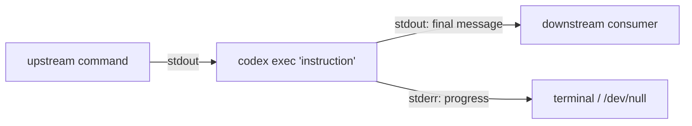

# Codex CLI as a Unix Citizen: Prompt-Plus-Stdin, Shell Pipelines, and Composable Agent Workflows


---

The Unix philosophy — small tools, text streams, composable pipelines — has survived every paradigm shift in computing for half a century. With the prompt-plus-stdin feature (PR #15917[^1]), `codex exec` now participates fully in that tradition. This article covers how Codex CLI handles standard input, how it separates human-readable progress from machine-parseable output, and how to compose it with the rest of your shell toolkit to build workflows that would have been science fiction two years ago.

## The Three I/O Modes of `codex exec`

`codex exec` supports three distinct input patterns, each mapping to a different Unix use case[^2]:

### 1. Prompt Argument Only

The simplest form — pass the instruction as a positional argument:

```bash
codex exec "list all TODO comments in this repo"
```

### 2. Stdin as Full Prompt (`codex exec -`)

When another tool generates the entire instruction dynamically, use `-` to read the prompt from stdin[^2]:

```bash
cat prompt.txt | codex exec -
```

This is useful when prompts are templated, version-controlled, or generated by upstream processes.

### 3. Prompt-Plus-Stdin (Combined Mode)

The newest and most powerful pattern: provide an explicit prompt argument *and* pipe data via stdin. Codex appends the piped content as a `<stdin>` block after the prompt[^1]:

```bash
npm test 2>&1 | codex exec "summarise the failing tests and propose the smallest likely fix"
```

The instruction (`"summarise the failing tests..."`) is yours; the context (test output) comes from the pipe. This separation of *intent* from *data* is what makes the pattern composable.



## Stream Separation: stdout vs stderr

`codex exec` follows the Unix convention rigorously[^2][^3]:

| Stream | Content | Machine-parseable |
|--------|---------|-------------------|
| **stdout** | Final agent message (or JSONL events with `--json`) | Yes |
| **stderr** | Progress indicators, spinner, status updates | No |

This means you can pipe Codex output directly into another tool without progress noise contaminating the stream:

```bash
git diff HEAD~3 | codex exec "write release notes for these changes" > RELEASE_NOTES.md
```

Progress still appears on your terminal (stderr), but `RELEASE_NOTES.md` contains only the agent's final response.

## The Pipeline Cookbook

### Log Triage

Pipe application logs into Codex for root-cause analysis:

```bash
tail -n 500 /var/log/app/error.log \
  | codex exec "identify the root cause, cite the most important errors, and suggest the next three debugging steps" \
  | tee triage-report.md
```

The `tee` preserves a copy for audit while passing the output onwards[^4].

### TLS and HTTP Debugging

```bash
curl -vv https://api.example.com/health 2>&1 \
  | codex exec "explain the TLS or HTTP failure and suggest the most likely fix"
```

The `2>&1` redirect is critical here — `curl -vv` writes verbose output to stderr, which must be redirected to stdout before piping to Codex[^4].

### Diff Review in a Pre-Push Hook

```bash
#!/usr/bin/env bash
# .git/hooks/pre-push
git diff origin/main...HEAD \
  | codex exec --ephemeral "review this diff for security issues, credential leaks, and obvious bugs. Output PASS or FAIL on the first line, then details." \
  | { read verdict; if [ "$verdict" = "FAIL" ]; then cat; exit 1; fi; }
```

The `--ephemeral` flag prevents session files from persisting, keeping hook execution clean[^2].

### Data Transformation

```bash
curl -s https://api.github.com/repos/openai/codex/releases \
  | codex exec "format the 10 most recent releases as a markdown table with columns: tag, date, highlights"
```

### Batch Processing with xargs

Process multiple files through Codex in parallel:

```bash
find src/ -name "*.ts" -newer .last-review \
  | xargs -P4 -I{} sh -c \
    'cat "{}" | codex exec --ephemeral "review this TypeScript file for type-safety issues" -o "reviews/$(basename {}).md"'
```

The `-P4` flag runs four Codex instances concurrently. Each writes its review to a separate file via `-o`[^2].

## Structured Output with `--output-schema`

For pipelines that need machine-parseable responses (not just human-readable text), `--output-schema` constrains the agent's final output to a JSON Schema[^2][^5]:

```json
{
  "type": "object",
  "properties": {
    "verdict": { "type": "string", "enum": ["pass", "fail", "warning"] },
    "issues": {
      "type": "array",
      "items": {
        "type": "object",
        "properties": {
          "file": { "type": "string" },
          "line": { "type": "integer" },
          "severity": { "type": "string" },
          "description": { "type": "string" }
        },
        "required": ["file", "severity", "description"]
      }
    },
    "summary": { "type": "string" }
  },
  "required": ["verdict", "issues", "summary"]
}
```

Save this as `review-schema.json`, then:

```bash
git diff --staged \
  | codex exec "review this diff for bugs and security issues" \
    --output-schema review-schema.json \
    -o review.json

# Downstream: fail CI if verdict is not pass
jq -e '.verdict == "pass"' review.json || exit 1
```

The schema acts as a contract between Codex and your pipeline. Combined with `jq`, you get type-safe agent output that integrates cleanly with existing shell scripts and CI systems[^5].

## The JSONL Event Stream

For full observability, `--json` emits newline-delimited JSON events covering the entire execution lifecycle[^3][^6]:

```bash
codex exec --json "refactor the auth module" 2>/dev/null \
  | jq -c 'select(.type == "item.completed" and .item.type == "command")'
```

This filters the JSONL stream to show only completed command executions — useful for auditing exactly which shell commands the agent ran. Key event types include `thread.started`, `turn.started`, `item.started`, `item.completed`, `turn.completed`, and `turn.failed`[^6].

## Model and Profile Selection in Pipelines

Different pipeline stages may warrant different models. Use `--model` and `--profile` to switch per-invocation[^2][^7]:

```bash
# Fast triage with mini model
cat error.log \
  | codex exec -m gpt-5.4-mini "classify this error as critical/warning/info" \
    --output-schema severity-schema.json \
    -o severity.json

# Deep analysis with flagship only for critical errors
if jq -e '.severity == "critical"' severity.json > /dev/null; then
  cat error.log \
    | codex exec -m gpt-5.4 "perform root-cause analysis and suggest a fix" \
      -o analysis.md
fi
```

This tiered approach routes cheap classification to `gpt-5.4-mini` (~30% the cost of `gpt-5.4`[^8]) and reserves the flagship model for cases that need deeper reasoning.

## Chaining Multiple Codex Calls

The prompt-plus-stdin pattern composes naturally into multi-stage pipelines:

```bash
# Stage 1: Extract failing test names
npm test 2>&1 \
  | codex exec --ephemeral "list only the failing test names, one per line" \
  | while read test_name; do
      # Stage 2: Generate fix for each failing test
      codex exec --ephemeral "fix the failing test: $test_name" -o "fixes/${test_name}.md"
    done
```

Each stage is stateless (`--ephemeral`) and produces clean text output suitable for the next stage. This is the Unix pipeline pattern applied to agent reasoning.

## Environment Variables

`codex exec` respects several environment variables for CI/CD integration[^2]:

| Variable | Purpose |
|----------|---------|
| `CODEX_API_KEY` | API key (avoids stored auth) |
| `CODEX_QUIET_MODE` | Suppresses stderr progress output |
| `CODEX_HOME` | Overrides default config directory |

In CI environments where no interactive auth is available, inline the key:

```bash
CODEX_API_KEY=$OPENAI_KEY codex exec --json "generate changelog" -o changelog.md
```

## Design Principles

The prompt-plus-stdin pattern succeeds because it respects constraints that Unix veterans expect[^1][^2]:

1. **Separation of concerns**: instruction (argument) vs data (stdin) vs progress (stderr) vs result (stdout)
2. **Statelessness**: `--ephemeral` ensures no side effects between pipeline stages
3. **Composability**: text in, text out — or structured JSON with `--output-schema`
4. **Fail-fast**: non-zero exit codes on failures; required MCP servers that fail to initialise cause immediate exit
5. **Idempotency**: the same prompt with the same stdin produces deterministic-enough output for scripting (within the bounds of LLM stochasticity)

## Known Limitations

- **Token limits on stdin**: piping very large files (>100K tokens) may exceed the model's context window. Pre-filter with `head`, `grep`, or `awk` before piping to Codex[^2].
- **Binary content**: stdin must be valid UTF-8. Binary data will cause a read error (issue #8733[^9]).
- **No streaming stdin**: Codex reads stdin to completion before starting inference. It cannot process an ongoing stream incrementally.
- **Rate limits**: parallel `xargs` patterns can hit API rate limits quickly. Use the backoff strategies documented in the rate-limiting guide[^10], or route through an AI gateway such as Bifrost or Portkey[^11].

## Citations

[^1]: [Support Codex CLI stdin piping for `codex exec` — PR #15917](https://github.com/openai/codex/pull/15917/files)
[^2]: [Non-interactive mode — Codex | OpenAI Developers](https://developers.openai.com/codex/noninteractive)
[^3]: [Command line options — Codex CLI | OpenAI Developers](https://developers.openai.com/codex/cli/reference)
[^4]: [Codex CLI Features — OpenAI Developers](https://developers.openai.com/codex/cli/features)
[^5]: [Build Code Review with the Codex SDK — OpenAI Cookbook](https://developers.openai.com/cookbook/examples/codex/build_code_review_with_codex_sdk)
[^6]: [codex exec JSONL Reference — danielvaughan.com](https://codex.danielvaughan.com/2026/04/08/codex-exec-jsonl-reference/)
[^7]: [Configuration Reference — Codex | OpenAI Developers](https://developers.openai.com/codex/config-reference)
[^8]: [GPT-5.4 vs GPT-5.3-Codex: Benchmark and Pricing Comparison — AI Free API](https://www.aifreeapi.com/en/posts/gpt-5-4-vs-gpt-5-3-codex)
[^9]: [Failed to read prompt from stdin: stream did not contain valid UTF-8 — Issue #8733](https://github.com/openai/codex/issues/8733)
[^10]: [Codex CLI Rate Limiting, Backoff, and Retry — danielvaughan.com](https://codex.danielvaughan.com/2026/04/12/codex-cli-rate-limiting-backoff-retry-quota/)
[^11]: [CliGate and Bifrost: The Multi-Harness AI Gateway — danielvaughan.com](https://codex.danielvaughan.com/2026/04/10/cligate-bifrost-multi-harness-gateway/)
