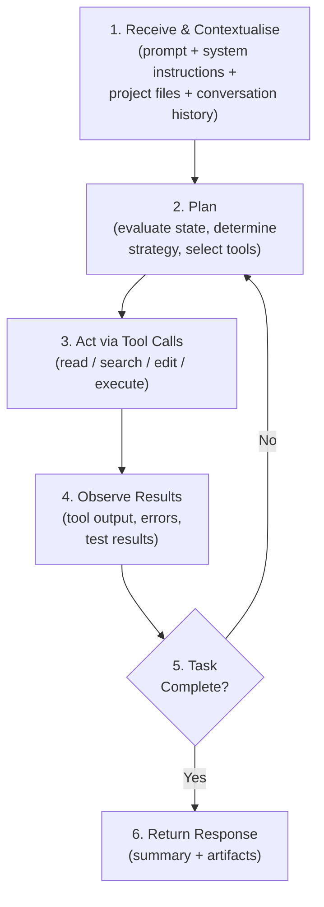
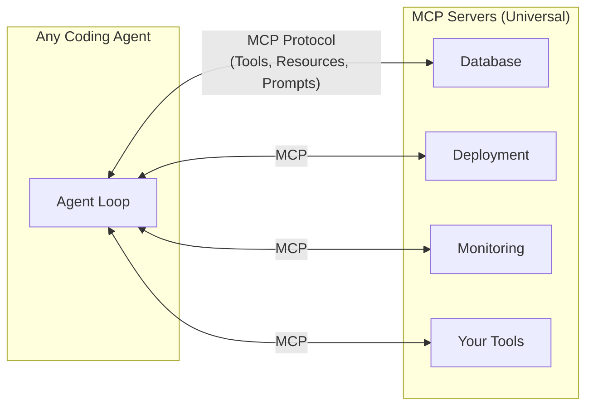
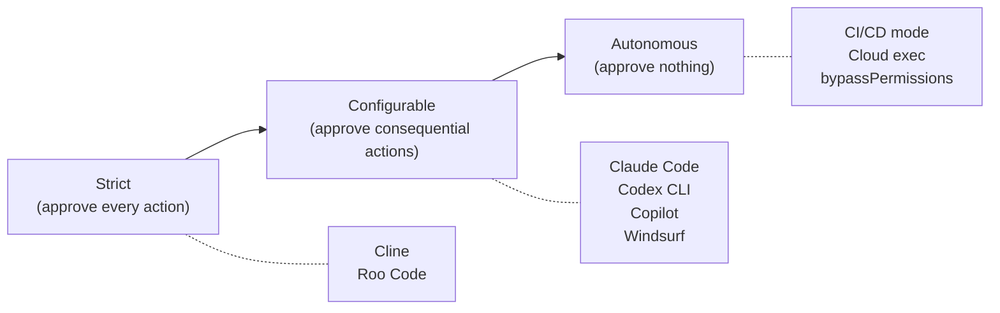

# The Great Convergence: Why Every AI Coding Agent Now Runs the Same Pipeline

---

I have been tracking over a dozen AI coding agents for months now — OpenAI Codex CLI, Anthropic Claude Code, Google Jules, Cursor, GitHub Copilot Agent, Windsurf, Amazon Q Developer, JetBrains Junie, Goose, Aider, OpenCode, Cline, Roo Code — and a pattern has become impossible to ignore. Despite different companies, different models, different interfaces, and different business models, they have all converged on the same fundamental execution pipeline.

This is not a coincidence. It is the natural result of a shared problem space with hard constraints. This article maps out exactly what that shared pipeline looks like, why it emerged, what still differentiates agents, and what it means for the future.

## The Universal Pipeline

An academic taxonomy paper analysing 13 coding agent source codes confirmed what practitioners have been feeling: seven of thirteen agents use sequential ReAct as their core control primitive, and the remaining six use variations that still follow the same observe-act-reflect cycle.[^1]

Here is the pipeline that every major coding agent now implements:

Claude Code's Agent SDK documentation describes it plainly: "Claude evaluates your prompt, calls tools to take action, receives the results, and repeats until the task is complete."[^2] Codex CLI's app-server protocol encodes the same cycle through its Thread → Turn → Item hierarchy, where each Turn is one complete iteration of the loop and each Item is an atomic action within it.[^3] Cursor, Copilot, Jules, Windsurf — the same loop, different wrappers.

This is the **agentic coding loop**, and it is now the industry standard.

## The Seven Convergence Points

The pipeline convergence goes far deeper than "they all have a loop." There are seven specific architectural primitives where agents have landed on nearly identical designs.

### 1. The Four Core Tool Categories

Despite ranging from zero to thirty-seven registered tools, every LLM-driven coding agent implements four core capabilities:[^1]

| Category | What It Does | Example Tools |
|----------|-------------|---------------|
| **Read** | Inspect code and project state | `Read`, `cat`, `View` |
| **Search** | Find files and content | `Glob`, `Grep`, `ripgrep`, `tree-sitter AST` |
| **Edit** | Modify source files | `Edit` (str_replace), `Write`, `patch` |
| **Execute** | Run commands | `Bash`, `shell`, `terminal` |

The edit format has standardised around string replacement with `old_str`/`new_str`, used by five of thirteen agents studied. This proved more reliable than line-number-based editing because LLMs can reason about textual patterns more accurately than numerical offsets.[^1]

### 2. MCP as the Universal Extension Protocol

The Model Context Protocol has crossed 97 million monthly SDK downloads and has been adopted by every major AI provider.[^4] In December 2025, Anthropic donated MCP to the Agentic AI Foundation under the Linux Foundation, co-founded with Block and OpenAI.[^5]

The practical impact: if you build an MCP server for your database, your internal API, or your deployment pipeline, it works with Codex, Claude Code, Cursor, Copilot, Windsurf, Cline, Gemini Code Assist, and a dozen more. The extension model has converged completely.

### 3. Project Instruction Files

AGENTS.md has become the open standard for project-level agent instructions, now maintained by the Agentic AI Foundation and supported by Codex CLI, Copilot, Cursor, Gemini CLI, Windsurf, Aider, Amp, Roo Code, Zed, and Warp. Over 60,000 GitHub repositories include one.[^6] Claude Code has its own five-layer CLAUDE.md system but also reads AGENTS.md as a fallback. Teams commonly symlink one to the other.

The convergence here is striking: every agent now expects to find machine-readable project context — coding standards, test commands, architectural constraints — in a markdown file at the repository root. The filename differs, but the concept is identical.

### 4. Sandboxed Execution

Every agent that runs shell commands must decide how to isolate them. The implementations vary, but the design space has collapsed to a handful of approaches:

| Strategy | Agents |
|----------|--------|
| **OS kernel-level** (Seatbelt, Landlock, seccomp, bubblewrap) | Codex CLI |
| **Application-layer hooks** (lifecycle event interception) | Claude Code (17 hook events) |
| **Container/VM isolation** | Jules (Google Cloud VM), Codex cloud, SWE-agent, OpenHands |
| **Git-based checkpoints** (revert on failure) | Cline, Kilo Code |
| **No sandboxing** (user trust model) | Gemini CLI, Aider, OpenCode |

The spectrum runs from "kernel enforced" to "trust the user," but every serious agent has had to make an explicit architectural decision about this — and most have moved toward some form of isolation.[^7]

### 5. Approval Workflows

The human-in-the-loop spectrum has converged on three tiers:

Cline requires explicit approval for every file change and terminal command. Claude Code and Codex CLI offer configurable modes (suggest/auto-accept/full-auto). In CI/CD pipelines, every agent that supports headless execution has a "just run it" mode. The approval primitives — accept, decline, cancel, accept-with-amendment — are remarkably similar across implementations.[^8]

### 6. Context Compaction

Every agent faces the same constraint: context windows are finite, coding sessions are not. The solutions have converged on a shared toolkit:

- **Automatic summarisation**: When context approaches the limit, compress older history while preserving recent exchanges (Claude Code, Codex CLI, OpenDev)
- **Subagent delegation**: Spawn child agents with fresh context for subtasks; only the summary returns to the parent (Claude Code Task tool, Codex cloud exec)
- **Repository maps**: AST-aware project summaries fitted to the token budget (pioneered by Aider with tree-sitter + PageRank)
- **Just-in-time loading**: The industry has shifted from pre-embedding entire codebases to "agentic search" — using grep and file reads on demand[^9]

The specific algorithms differ (Codex uses a two-phase extraction-consolidation pipeline backed by SQLite; Claude Code uses PreCompact hooks and rolling summaries), but the strategic response is the same everywhere.

### 7. Multi-Agent Orchestration

Mike Mason documented in January 2026 how Claude Code, Cursor, Devin, OpenHands, and Aider all independently converged on **hierarchical orchestration** with Planners, Workers, and Judges — after initial approaches using peer agents with locking or optimistic concurrency proved inefficient.[^10]

The pattern is now standard:
- A **planner** decomposes the task
- **Workers** execute subtasks (often in parallel, often in isolated git worktrees)
- A **reviewer/judge** validates the output

Codex does this with cloud exec dispatching up to six parallel workers. Claude Code does it with the Task tool spawning subagents. Roo Code does it with mode-based routing (Architect → Code → Debug). Different mechanisms, same architecture.

## What Still Differentiates Agents

If the pipeline has converged, what is left to compete on? Quite a lot, as it turns out. The differentiators have shifted from *what* agents do to *how* they do it:

| Dimension | Range |
|-----------|-------|
| **Model ecosystem** | Single-vendor (Claude Code: Anthropic only) vs. multi-model (Cursor: GPT-5.3, Sonnet 4.5, Gemini 3 Pro; OpenCode: 75+ models) |
| **Context window** | 1M tokens (Codex/GPT-5.4) vs. 200K tokens (Claude Code/Opus 4.6) |
| **Interface** | Terminal-native (Claude Code, Aider) vs. IDE-embedded (Cursor, Copilot) vs. async cloud (Jules, Codex cloud) vs. desktop app (Codex Scratchpad) |
| **Safety philosophy** | Kernel sandbox vs. hooks vs. per-action approval vs. none |
| **Pricing** | Subscription ($15-20/mo) vs. usage-based (per-token) vs. free/OSS |
| **Deployment** | Local-only vs. hybrid local+cloud vs. cloud-first |
| **Enterprise governance** | Amazon Bedrock Guardrails, Qodo review agents, Claude Code hooks vs. minimal governance |

The competition has moved up the stack. The pipeline is settled; the policy layer on top of it is where the action is.

## Why Convergence Was Inevitable

Three forces drove every agent to the same design:

**1. The LLM constraint.** Tool-calling is how modern LLMs interact with the world. Every model provider (OpenAI, Anthropic, Google) converged on the same function-calling interface. Once your model speaks "tools," your agent loop writes itself: call the model, execute the tools it requests, feed back results, repeat.

**2. The developer workflow constraint.** Software development has a fixed set of primitive operations — read files, search code, edit files, run commands, run tests. There is no fifth operation. Any agent that wants to be useful for coding must implement these four, which means the tool surface converges.

**3. The safety constraint.** The moment you let an LLM run shell commands, you need sandboxing and approval workflows. The design space for "how do you let an AI execute code safely" is surprisingly small, and every team explored it independently and landed on the same options.

Convergence is not a failure of imagination. It is evidence that the problem is well-defined.

## What Comes Next

If the pipeline is converged, the next wave of innovation will be in:

- **Context engineering** — the discipline of optimising what goes into the context window, which has already displaced prompt engineering as the critical skill[^11]
- **Verification and trust** — automated proof that agent-generated code is correct, moving beyond "run the tests" to formal verification, property-based testing, and mutation testing
- **Governance at scale** — enterprise policy engines that constrain agent behaviour across teams, projects, and regulatory regimes
- **Inter-agent communication** — standards like A2A (Google's Agent-to-Agent protocol) and cross-agent config sync tools (ruler, cc-switch) enabling agents from different vendors to collaborate on the same task[^12]
- **Specialisation within the loop** — agents that share the pipeline but excel at specific domains (security review, database migration, legacy modernisation, mobile development)

The pipeline is the floor, not the ceiling. Now that everyone has it, the question becomes: what do you build on top?

## Related Articles

Several earlier articles in this series explore individual convergence points in depth:

- [Agentic Primitives: Codex, Claude, and Gemini](../articles/2026-03-26-agentic-primitives-codex-claude-gemini.md) — the shared building blocks
- [The Codex Agent Loop Deep Dive](../articles/2026-03-28-codex-agent-loop-deep-dive.md) — how Codex implements the pipeline
- [Claude Code Open Source Architecture](../articles/2026-04-01-claude-code-open-source-architecture.md) — Claude's take on the same loop
- [Codex CLI vs Claude Code Architecture](../articles/2026-04-09-codex-cli-vs-claude-code-architecture.md) — head-to-head comparison
- [Cross-Platform Agent Portability](../articles/2026-04-08-cross-platform-agent-portability-skill-md.md) — AGENTS.md and CLAUDE.md
- [Codex CLI Competitive Position, April 2026](../articles/2026-04-07-codex-cli-competitive-position-april-2026.md) — market landscape
- [The Codex App Server: A Complete Guide](../articles/2026-04-15-codex-app-server-complete-guide.md) — the protocol beneath the pipeline
- [Cross-Platform Agent Friction](../articles/2026-04-09-cross-platform-agent-friction.md) — what still does not port

---

## Footnotes

[^1]: Nadeem et al., "Inside the Scaffold: A Source-Code Taxonomy of Coding Agent Architectures," arXiv, April 2026. https://arxiv.org/html/2604.03515

[^2]: Anthropic, "How the Agent Loop Works — Claude Code Agent SDK," April 2026. https://code.claude.com/docs/en/agent-sdk/agent-loop

[^3]: OpenAI, "App Server Protocol — Thread, Turn, Item Primitives," Codex Developer Documentation. https://github.com/openai/codex/blob/main/codex-rs/app-server/README.md

[^4]: MCP adoption statistics: 97 million monthly SDK downloads as of April 2026. https://mcpmanager.ai/blog/mcp-adoption-statistics/

[^5]: Anthropic donated MCP to the Agentic AI Foundation (AAIF) under the Linux Foundation, December 2025. https://dev.to/pockit_tools/mcp-vs-a2a-the-complete-guide-to-ai-agent-protocols-in-2026-30li

[^6]: Tessl, "The Rise of AGENTS.md: An Open Standard and Single Source of Truth for AI Coding Agents," March 2026. https://tessl.io/blog/the-rise-of-agents-md-an-open-standard-and-single-source-of-truth-for-ai-coding-agents/

[^7]: Crosley, "Codex CLI vs Claude Code in 2026: Architecture Deep Dive," April 2026. https://blakecrosley.com/blog/codex-vs-claude-code-2026

[^8]: OpenAI, "Codex CLI Approval Modes — suggest, auto-edit, full-auto," Codex Documentation. https://developers.openai.com/codex/concepts/sandboxing

[^9]: Tompkins et al., "Building AI Coding Agents for the Terminal," arXiv, March 2026. https://arxiv.org/html/2603.05344v1

[^10]: Mason, "AI Coding Agents in 2026: Coherence Through Orchestration, Not Autonomy," January 2026. https://mikemason.ca/writing/ai-coding-agents-jan-2026/

[^11]: The New Stack, "5 Key Trends Shaping Agentic Development in 2026." https://thenewstack.io/5-key-trends-shaping-agentic-development-in-2026/

[^12]: Cross-agent interoperability tools: ruler (2.6K stars), cc-switch (35.3K stars) for config sync; mimir and CASS for session sharing across agents.
