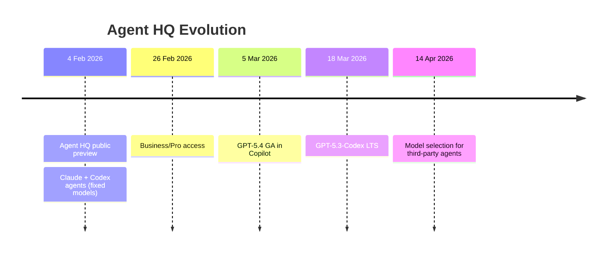
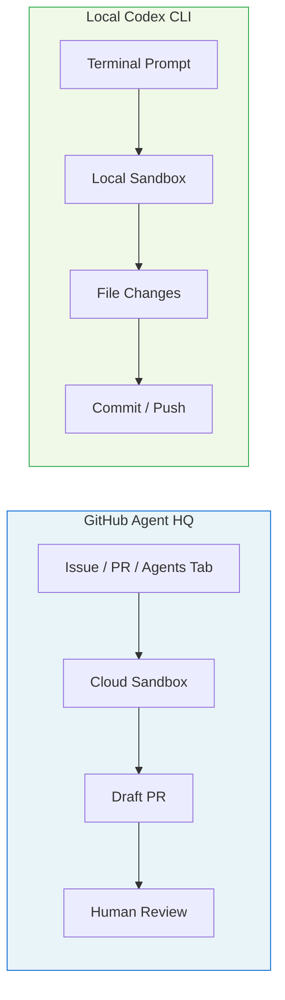
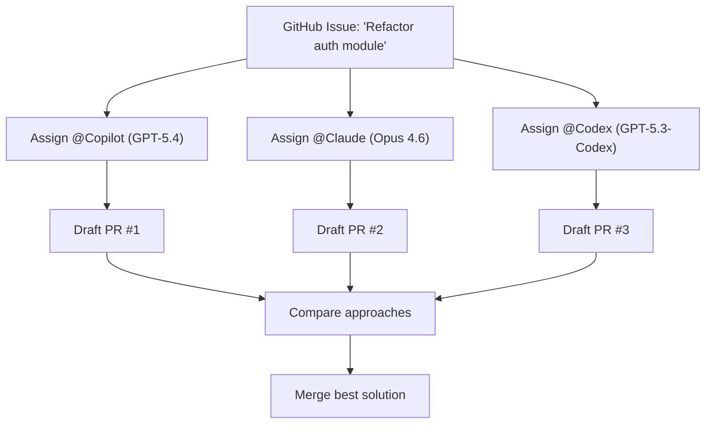
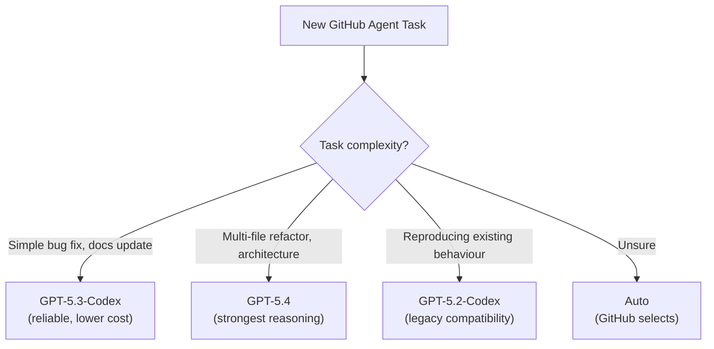

# GitHub Agent HQ Model Selection: Choosing GPT-5.4 vs GPT-5.3-Codex, Custom Agents, and the Multi-Agent GitHub Workflow


---

GitHub's Agent HQ — the platform that lets developers assign coding tasks to Copilot, Claude, and Codex directly from issues, pull requests, and the Agents tab — gained model selection for third-party agents on 14 April 2026[^1]. Previously, the Codex agent on GitHub ran with a fixed model. Now you can choose between GPT-5.2-Codex, GPT-5.3-Codex, and GPT-5.4 when kicking off a task[^1]. This article covers how model selection works, when to pick each model, how custom `.agent.md` files extend the system, and how all of this relates to your local Codex CLI workflows.

## The Agent HQ Timeline

Agent HQ launched in public preview on 4 February 2026, bringing Claude and Codex alongside GitHub's own Copilot cloud agent[^2]. At launch, each third-party agent ran on a single default model — there was no model picker. Over the following weeks, GitHub expanded the surface:

- **February 2026**: Copilot Business and Pro users gained access to Claude and Codex agents[^3].
- **March 2026**: GPT-5.3-Codex received long-term support status for GitHub Copilot, guaranteed available through February 2027[^4]. GPT-5.4 became generally available for Copilot on 5 March[^5].
- **14 April 2026**: Model selection shipped for Claude and Codex third-party agents, matching the existing Copilot model picker[^1].



## How Model Selection Works

When you open the Agents tab on an enabled repository, or assign a Codex task from an issue or PR, you now see a model picker dropdown. The available models for the Codex agent are[^1]:

| Model | Strengths | Best For |
|---|---|---|
| **GPT-5.4** | Latest flagship, highest benchmark scores, strongest reasoning | Complex refactoring, architecture decisions, multi-file changes |
| **GPT-5.3-Codex** | Purpose-built for coding, 25% faster than GPT-5.2, LTS until Feb 2027 | Bread-and-butter feature work, reliable daily driver |
| **GPT-5.2-Codex** | Legacy, being deprecated for ChatGPT sign-in | Only if you need reproducibility with existing workflows |

There is also an **Auto** option that lets GitHub select the model based on task characteristics[^6].

For the Claude agent, the picker offers Claude Opus 4.6, Claude Sonnet 4.6, Claude Opus 4.5, and Claude Sonnet 4.5[^1].

### The Premium Request Cost Model

Every agent session on GitHub consumes premium requests from your Copilot subscription allowance[^7]. The cost varies by model:

- A standard chat interaction with the default model costs 1 premium request[^7].
- More capable models like GPT-5.4 or Claude Opus 4.6 consume more premium requests per interaction[^7].
- Complex multi-step agent tasks may consume several premium requests in a single session[^7].

This creates a direct cost-quality trade-off. Running every issue through GPT-5.4 burns through your monthly allowance faster than routing routine tasks to GPT-5.3-Codex.

## GitHub Agent HQ vs Local Codex CLI

Understanding the architectural differences between GitHub's hosted Codex agent and your local Codex CLI is essential for choosing the right surface for each task.



| Dimension | GitHub Agent HQ | Local Codex CLI |
|---|---|---|
| **Execution** | Asynchronous, cloud sandbox | Interactive or `codex exec`, local sandbox |
| **Internet** | Disabled during execution[^8] | Configurable (sandbox network policy) |
| **Model choice** | GPT-5.2/5.3/5.4 via picker | Any model via `config.toml` + custom providers |
| **Context** | Repository clone + setup script | Full filesystem, MCP servers, skills, subagents |
| **Output** | Draft PR for review | Direct file modifications |
| **Multi-agent** | Assign same issue to Copilot + Claude + Codex | TOML subagents, path-based addressing, up to 6 threads |
| **Cost** | Premium requests (Copilot subscription) | ChatGPT subscription or API key billing |
| **Customisation** | `.agent.md` files, AGENTS.md | config.toml, AGENTS.md, skills, hooks, plugins |

### When to Use Each

**Use GitHub Agent HQ when:**

- You want fire-and-forget task execution on an existing issue
- The task is self-contained within the repository (no external services needed)
- You want to compare how Copilot, Claude, and Codex each approach the same problem
- You are on mobile or away from your development machine

**Use local Codex CLI when:**

- You need MCP server access (Jira, databases, monitoring tools)
- The task requires interactive steering or mid-turn correction
- You need subagent orchestration with more than one parallel thread
- You want full control over sandbox policy, hooks, and approval modes

## Custom Agents: The `.agent.md` Format

Alongside the third-party agent model picker, GitHub's custom agent system lets you define specialised agents as `.agent.md` files in your repository[^9]. These are not Codex CLI skills or plugins — they are GitHub Copilot cloud agents with their own instructions, tool access, and MCP server configurations.

### File Structure

Custom agents live in `.github/agents/` at the repository level, or in `.github-private/agents/` for organisation-wide availability[^9]:

```
.github/
  agents/
    security-reviewer.agent.md
    migration-helper.agent.md
    test-writer.agent.md
```

### YAML Front Matter

Each `.agent.md` file combines YAML front matter with Markdown instructions[^9]:

```yaml
---
name: "security-reviewer"
description: "Reviews code changes for security vulnerabilities, OWASP Top 10, and dependency risks"
tools:
  - "github_api"
  - "code_search"
model: "gpt-5.4"
target: "github-copilot"
mcp-servers:
  snyk:
    command: "npx"
    args: ["-y", "@snyk/mcp-server"]
---

# Security Reviewer

You are a security-focused code reviewer. For every PR assigned to you:

1. Check for OWASP Top 10 vulnerabilities
2. Verify dependency versions against known CVEs
3. Flag any secrets or credentials in the diff
4. Provide a risk assessment (Low/Medium/High/Critical)
```

Key constraints: the prompt body has a maximum of 30,000 characters, and filenames may only contain periods, hyphens, underscores, and alphanumerics[^9].

### How Custom Agents Relate to Codex CLI Skills

Custom `.agent.md` files and Codex CLI `SKILL.md` files solve similar problems — specialised agent behaviour for specific tasks — but they operate on different surfaces:

| Aspect | `.agent.md` (GitHub) | `SKILL.md` (Codex CLI) |
|---|---|---|
| **Runtime** | GitHub Copilot cloud agent | Local Codex CLI session |
| **Discovery** | Agents tab picker | Automatic via directory walk |
| **MCP** | Configured per-agent in YAML | Configured in `config.toml` |
| **Model** | Set in front matter (`model:` key) | Inherited from session or profile |
| **Invocation** | Manual selection or `@mention` | Implicit (description match) or explicit |
| **Max size** | 30,000 characters | No hard limit (32 KiB AGENTS.md ceiling applies separately) |

For teams running both GitHub Agent HQ and local Codex CLI, the practical pattern is to maintain `.agent.md` files for cloud-executed workflows (CI review, issue triage) and `SKILL.md` files for interactive development tasks.

## The Multi-Agent Bake-Off Pattern

One of Agent HQ's most distinctive capabilities is assigning the same issue to multiple agents simultaneously[^2]. You can assign an issue to Copilot, Claude, and Codex, then compare the three draft PRs they produce.

This is architecturally different from Codex CLI's multi-agent model. On GitHub, each agent runs independently with no inter-agent communication — they are parallel, isolated attempts at the same problem. In Codex CLI, subagents communicate via structured messaging, share context through the parent agent, and can be orchestrated as a coordinated team.

### Practical Workflow



This pattern works well for:

- **Architecture decisions** — see how different models approach the same structural problem
- **Evaluating model upgrades** — compare GPT-5.3-Codex vs GPT-5.4 on your actual codebase
- **Critical changes** — get independent verification from different AI providers

The cost is three sessions' worth of premium requests per issue, so reserve this for high-value decisions rather than routine work.

## Model Selection Strategy for GitHub Agent Tasks

With three Codex models now available on GitHub, a deliberate selection strategy prevents both wasted premium requests and suboptimal results.

### Decision Framework



**GPT-5.4** is the right choice when the task requires reasoning across multiple files, understanding architectural constraints, or making non-obvious design decisions. It consumes more premium requests but produces better results on complex tasks[^5].

**GPT-5.3-Codex** remains the workhorse for standard feature implementation. Its LTS status until February 2027 means your team can standardise on it without worrying about imminent deprecation[^4]. It is 25% faster than GPT-5.2-Codex and purpose-built for coding tasks.

**GPT-5.2-Codex** is deprecated for ChatGPT sign-in users as of 14 April 2026[^10], but remains available on GitHub. Use it only if you have existing workflows that depend on its specific behaviour and you need time to migrate.

## Connecting GitHub Agent Work to Local Codex CLI

The most effective teams use both surfaces. A common pattern:

1. **Triage on GitHub**: assign routine issues to the Codex agent with GPT-5.3-Codex
2. **Complex work locally**: pull down the branch for architectural changes, use Codex CLI with MCP servers and subagents
3. **Review on GitHub**: use custom `.agent.md` reviewers or assign review to Claude for cross-model verification
4. **CI validation**: run `codex exec` in GitHub Actions via `openai/codex-action` for automated checks

The AGENTS.md file in your repository root serves both surfaces — GitHub's Codex agent reads it when cloning the repo, and your local Codex CLI reads it during interactive sessions. This shared context file is the bridge between cloud and local workflows.

## Enterprise Considerations

For Copilot Business and Enterprise subscribers, administrators must explicitly enable the Claude and Codex agent policies before team members can use them[^1]. This provides organisational control over which AI providers are permitted.

Enterprise teams should consider:

- **Model governance**: standardise on GPT-5.3-Codex LTS for predictability, allow GPT-5.4 for senior engineers working on complex tasks
- **Premium request budgets**: monitor consumption via the Copilot billing dashboard, set alerts at budget thresholds[^7]
- **Custom agent libraries**: build a shared `.github-private/agents/` directory with organisation-specific review agents, security checkers, and compliance validators[^9]
- **Audit trails**: agent sessions produce PR comments and draft PRs, creating a natural audit log of AI-assisted work

## What Is Still Missing

Despite the model selection addition, several gaps remain:

- **No subagent orchestration on GitHub**: unlike Codex CLI's TOML-defined subagents with path-based addressing, GitHub agents run as isolated sessions with no inter-agent coordination
- **No MCP server persistence**: custom agents can define MCP servers, but the cloud sandbox's internet restrictions limit what external services can be reached during execution[^8]
- **No mid-session model switching**: once a task starts with a selected model, you cannot change models mid-session (unlike Codex CLI's `/model` command)
- **No Spark model**: GPT-5.3-Codex-Spark (1,000+ tokens/second on Cerebras WSE-3) is not available on GitHub — it requires a ChatGPT Pro subscription and runs only through the local CLI or Codex App ⚠️

## Looking Ahead

GitHub is actively working with Google, Cognition (Devin), and xAI to bring more agents into Agent HQ[^2]. The custom agent `.agent.md` format is evolving toward a richer configuration surface. The model picker is likely to expand as new models launch — when GPT-5.4-mini or future Codex-specific models arrive, they should appear in the picker automatically.

For Codex CLI practitioners, the key insight is that GitHub Agent HQ is not a replacement for local CLI workflows — it is a complementary surface optimised for asynchronous, issue-driven work within the GitHub ecosystem. The model selection feature closes a significant gap, giving you the same model routing flexibility on GitHub that you already have locally via `config.toml` profiles.

## Citations

[^1]: GitHub Blog, "Model selection for Claude and Codex agents on github.com," GitHub Changelog, 14 April 2026. [https://github.blog/changelog/2026-04-14-model-selection-for-claude-and-codex-agents-on-github-com/](https://github.blog/changelog/2026-04-14-model-selection-for-claude-and-codex-agents-on-github-com/)

[^2]: GitHub Blog, "Pick your agent: Use Claude and Codex on Agent HQ," 4 February 2026. [https://github.blog/news-insights/company-news/pick-your-agent-use-claude-and-codex-on-agent-hq/](https://github.blog/news-insights/company-news/pick-your-agent-use-claude-and-codex-on-agent-hq/)

[^3]: GitHub Blog, "Claude and Codex now available for Copilot Business & Pro users," GitHub Changelog, 26 February 2026. [https://github.blog/changelog/2026-02-26-claude-and-codex-now-available-for-copilot-business-pro-users/](https://github.blog/changelog/2026-02-26-claude-and-codex-now-available-for-copilot-business-pro-users/)

[^4]: GitHub Blog, "GPT-5.3-Codex long-term support in GitHub Copilot," GitHub Changelog, 18 March 2026. [https://github.blog/changelog/2026-03-18-gpt-5-3-codex-long-term-support-in-github-copilot/](https://github.blog/changelog/2026-03-18-gpt-5-3-codex-long-term-support-in-github-copilot/)

[^5]: GitHub Blog, "GPT-5.4 is generally available in GitHub Copilot," GitHub Changelog, 5 March 2026. [https://github.blog/changelog/2026-03-05-gpt-5-4-is-generally-available-in-github-copilot/](https://github.blog/changelog/2026-03-05-gpt-5-4-is-generally-available-in-github-copilot/)

[^6]: GitHub Docs, "About third-party agents," 2026. [https://docs.github.com/en/copilot/concepts/agents/about-third-party-agents](https://docs.github.com/en/copilot/concepts/agents/about-third-party-agents)

[^7]: GitHub Docs, "Requests in GitHub Copilot," 2026. [https://docs.github.com/en/copilot/concepts/billing/copilot-requests](https://docs.github.com/en/copilot/concepts/billing/copilot-requests)

[^8]: OpenAI, "Introducing Codex," 2026. [https://openai.com/index/introducing-codex/](https://openai.com/index/introducing-codex/)

[^9]: GitHub Docs, "Creating custom agents for Copilot cloud agent," 2026. [https://docs.github.com/en/copilot/how-tos/use-copilot-agents/cloud-agent/create-custom-agents](https://docs.github.com/en/copilot/how-tos/use-copilot-agents/cloud-agent/create-custom-agents)

[^10]: OpenAI Developers, "Changelog — Codex," April 2026. [https://developers.openai.com/codex/changelog](https://developers.openai.com/codex/changelog)
